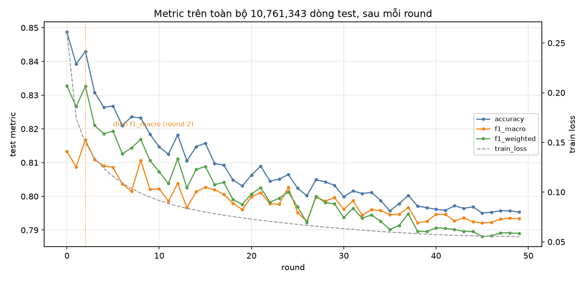
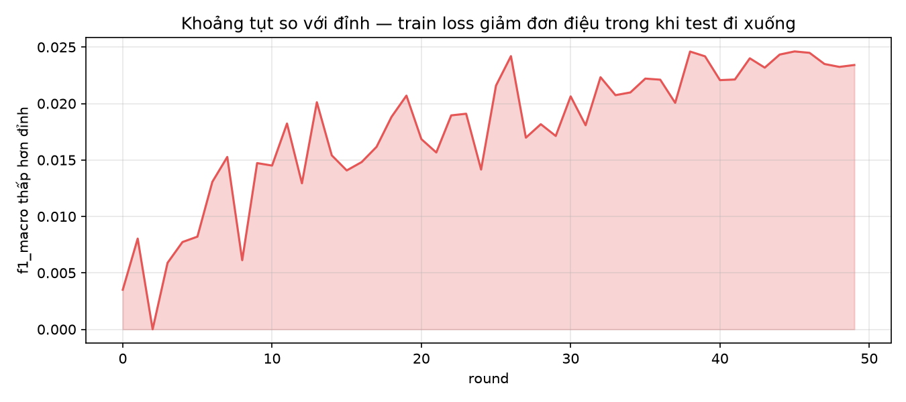
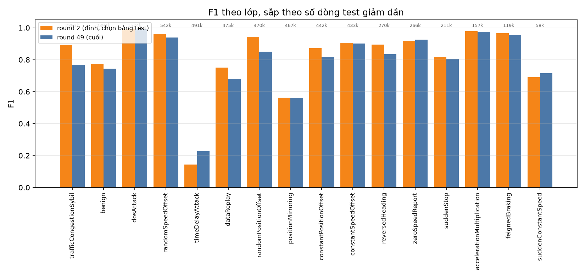
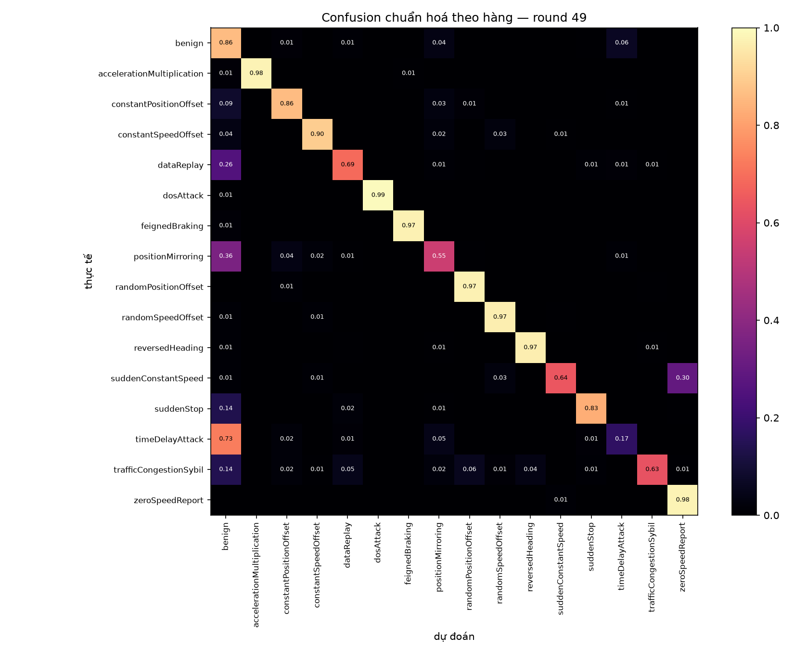
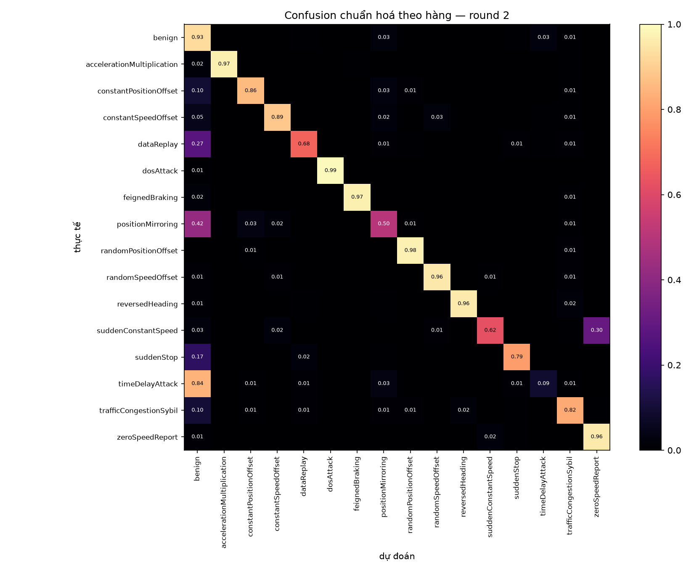

# Báo cáo — EDL-CMSO trên VeReMi NextGen (16 lớp, centralized)

**Bài báo gốc** · Khan, Tejani, Alsulami et al. (2025), *A Secure and Efficient Deep
Learning-Based Intrusion Detection Framework for the Internet of Vehicles*,
**Scientific Reports**, DOI [`10.1038/s41598-025-94445-9`](https://doi.org/10.1038/s41598-025-94445-9)
· phương pháp gốc chép lại đầy đủ trong [paper.md](paper.md)

**Dữ liệu** · `odixe0502/veremi-nextgen2026-centralized` (Zenodo `10.5281/zenodo.19665762`)
**Kernel** · [`odixe0502/edl-cmso-veremi`](https://www.kaggle.com/code/odixe0502/edl-cmso-veremi) v3
· **Run** · `edl_cmso_r50_b4096` · **Ngày** · 2026-08-31
**Phần cứng** · Kaggle 2× Tesla T4 (sm_75, 14,6 GB mỗi card), 4 vCPU, 31 GB RAM, DDP + fp16 AMP

> **Kết quả một dòng.** 50/50 round hoàn tất trong
> **9.74 giờ** (701 s/round,
> 61,362 mẫu/s). Round cuối (**49**, mô hình bàn giao):
> `f1_macro` **0.79335**. Round có điểm cao nhất (**2**,
> *chọn bằng tập test*): `f1_macro` **0.81676**.

Ba tài liệu, ba vai trò khác nhau — đọc kèm nhau:

| File | Vai trò |
|---|---|
| [`notebook/edl_cmso_veremi.executed.ipynb`](notebook/edl_cmso_veremi.executed.ipynb) | **bằng chứng** — code, công thức và output đã render nằm chung một file |
| [`rebuild.md`](rebuild.md) | **sổ ghi** — 30 deviation so với bài báo, lịch sử từng lần chạy |
| `report.md` (file này) | **tổng hợp** — kết quả và diễn giải |

---

## 1 · Dựng lại cái gì

Bài báo gồm 6 stage. Bản dựng lại này làm **stage 3–5**:

**DWT** (Eq. 19) → **ViT** (Eq. 20–25) → **GAT** (Eq. 26–27) → **fusion** (Eq. 28) →
**CMSO feature selection** (Eq. 29–37) → **DAGSNet** = DenseNet + GoogleNet + AlexNet +
SqueezeNet (Eq. 38–48).

Bỏ hẳn, theo yêu cầu đã chốt:

- **Stage 1** — IoVCipherGuard (HE / SMPC / AES-256, §4.3–4.6). Bảng 2 của chính bài báo chỉ
  báo cáo nó như một cột thời gian; không metric nào phụ thuộc vào nó.
- **Stage 2** — tiền xử lý (§4.7). Dataset đã imputed và standardised sẵn.
- **Stage 6** — AFPHA federated aggregation. Bản này chạy **centralized, một model duy nhất**.

Bài báo để trống **12 chỗ** không nêu giá trị (họ wavelet, cách biến một dòng bảng thành đối
tượng 2-D patch được, kích thước ViT, định nghĩa lân cận GAT, mọi tham số CMSO…). Mỗi chỗ được
lấp bằng một lựa chọn ghi rõ trong `rebuild.md`, phân loại là *bắt buộc*, *do phần cứng*,
*do người dùng* hay *do phán đoán*.

## 2 · Dữ liệu, và các cảnh báo phải đi kèm mọi con số

| split | dòng | đặc trưng | trạng thái |
|---|---:|---:|---|
| train | 43,045,415 | 66 (`f_*`) | đã imputed **và** standardised |
| test | 10,761,343 | 66 (`f_*`) | đã imputed, `scaler.json` (fit trên train) áp lúc load |

16 lớp, mất cân bằng **41,4 : 1**, không lớp rỗng, **0 ô NaN/Inf** ở cả hai split, tỉ lệ
train:test = 0,8000 : 0,2000. 21 cột không phải `f_*` (định danh, nhãn, ngữ cảnh thô, khoá phân
mảnh) **không bao giờ** được đưa vào model.

**Bảy cảnh báo dưới đây lấy từ chính tài liệu của dataset. Mọi con số trong báo cáo này chỉ đọc
được khi đặt cạnh chúng:**

1. Split cắt theo **thời gian mô phỏng**, không theo xe — 64 điểm cắt, mỗi (lớp × kịch bản) một
   điểm. Train và test **không cùng phân phối**. Đây là nguyên nhân trực tiếp của hiện tượng
   ở mục 5.
2. Lớp `benign` lấy từ luồng **không có tấn công**, khiến nhóm đặc trưng `rate` mạnh bất thường.
3. **3.338.358 dòng nhập nhằng** (bị thao túng nhưng không gắn cờ) đã bị loại từ nguồn.
4. **Rò rỉ Sybil.** 100,00% dòng `trafficCongestionSybil` nằm trong flow mà *mọi* dòng đều là
   first-in-session (lớp kế tiếp `feignedBraking` chỉ 0,20%). Nhóm 16 đặc trưng `session` gần
   như là nhãn cho lớp này. **Build này không chạy ablation**, nên không tách được phần đóng góp
   đó — xem mục 6.
5. `timeDelayAttack` là lớp khó nhất. Kết quả xác nhận: xem mục 6.
6. Mất cân bằng 41:1 → **`f1_macro` là con số đáng đọc**, `accuracy` gần như vô nghĩa.
7. **88% flow trong test dài đúng 1 message**, phần lớn là Sybil. Giữ nguyên: DAGSNet phân loại
   theo từng dòng, không bao giờ ghép flow.

CMSO fit trên subsample **chỉ lấy từ train**, holdout cũng từ train. Tập test **không hề** được
dùng để chọn đặc trưng hay tinh chỉnh.

## 3 · Cấu hình thực tế đã chạy

Đọc từ [`runs/edl_cmso_r50_b4096/config.json`](runs/edl_cmso_r50_b4096/config.json) — bản ghi của
chính lần chạy, không phải source notebook.

| | | | |
|---|---|---|---|
| rounds | 50 | epochs/round | 1 |
| batch mỗi GPU | 2048 | **batch toàn cục** | **4096** |
| optimizer | AdamW | learning rate | 0.001 (Table 1), cosine decay, 1 round warmup |
| weight decay | 0.0001 | grad clip | 1.0 |
| loss | cross-entropy | AMP | fp16 (T4 không có bf16/TF32) |
| d_model | 128 | patch_len | 6 |
| ViT | 2 layer, 4 head | GAT | 4 head, fully connected |
| DenseNet | 3 layer, growth 32 | GoogleNet | 2 inception |
| SqueezeNet | 3 fire | seed | 42 |
| tham số model | 827.123 | step/round/rank | 10,509 |

**CMSO** — 41/66 đặc trưng được giữ, fitness
0.75488, 20 cá thể × 50 vòng lặp
(991 lần đánh giá không trùng, 845 s). Phân bố theo nhóm:

| nhóm | giữ / tổng |
|---|---|
| `session` | **13 / 16** |
| `geometry` | 11 / 20 |
| `raw` | 10 / 15 |
| `position` | 3 / 4 |
| `profile` | 3 / 6 |
| `rate` | **1 / 5** |

Hai nhóm mà tài liệu dataset cảnh báo lại đi ngược nhau: CMSO **giữ gần hết nhóm `session`**
(gồm cả `f_first_in_session` — chính đặc trưng bị nêu đích danh ở cảnh báo 4) và **loại gần hết
nhóm `rate`**. Nghĩa là cảnh báo rò rỉ Sybil không những còn nguyên hiệu lực mà còn mạnh hơn:
bộ chọn đặc trưng đã chủ động ưu tiên đúng nhóm bị nghi ngờ.

## 4 · Kết quả — 10 metric sau mỗi round

Đo trên **toàn bộ 10,761,343 dòng test**, sau mỗi round, quét tuần tự trên rank 0 —
không `DistributedSampler`, nên không có phần đuôi bị pad hay bị bỏ.

> **Năm cột trùng nhau là đúng, không phải lỗi.** Trong phân loại đơn nhãn đa lớp, mỗi dự đoán
> thuộc đúng một lớp, nên $\sum_c FP_c = \sum_c FN_c$ và do đó
> `precision_micro` = `recall_micro` = `f1_micro` = `recall_weighted` = `accuracy`.
> Ở round 49 cả năm đều bằng **0.795341**.

| round | accuracy | P_macro | P_micro | P_wtd | R_macro | R_micro | R_wtd | F1_macro | F1_micro | F1_wtd | train_loss | lr | giây |
|---|---|---|---|---|---|---|---|---|---|---|---|---|---|
| 0 | 0.848701 | 0.858288 | 0.848701 | 0.851017 | 0.802342 | 0.848701 | 0.848701 | 0.813253 | 0.848701 | 0.832808 | 0.2610 | 1.00e-03 | 704 |
| 1 | 0.839222 | 0.833657 | 0.839222 | 0.840261 | 0.807806 | 0.839222 | 0.839222 | 0.808722 | 0.839222 | 0.826584 | 0.1744 | 9.99e-04 | 701 |
| 2 **←đỉnh** | 0.842970 | 0.842282 | 0.842970 | 0.844544 | 0.809816 | 0.842970 | 0.842970 | 0.816758 | 0.842970 | 0.832646 | 0.1495 | 9.96e-04 | 701 |
| 3 | 0.830819 | 0.833102 | 0.830819 | 0.835779 | 0.806882 | 0.830819 | 0.830819 | 0.810869 | 0.830819 | 0.821022 | 0.1343 | 9.91e-04 | 701 |
| 4 | 0.826378 | 0.831705 | 0.826378 | 0.834879 | 0.804437 | 0.826378 | 0.826378 | 0.809026 | 0.826378 | 0.818570 | 0.1238 | 9.84e-04 | 700 |
| 5 | 0.826790 | 0.826323 | 0.826790 | 0.832979 | 0.807963 | 0.826790 | 0.826790 | 0.808549 | 0.826790 | 0.819333 | 0.1158 | 9.75e-04 | 700 |
| 6 | 0.820991 | 0.818555 | 0.820991 | 0.828935 | 0.805891 | 0.820991 | 0.820991 | 0.803693 | 0.820991 | 0.812600 | 0.1091 | 9.63e-04 | 700 |
| 7 | 0.823554 | 0.815427 | 0.823554 | 0.829690 | 0.804071 | 0.823554 | 0.823554 | 0.801491 | 0.823554 | 0.814355 | 0.1036 | 9.50e-04 | 700 |
| 8 | 0.823243 | 0.824272 | 0.823243 | 0.830470 | 0.810193 | 0.823243 | 0.823243 | 0.810637 | 0.823243 | 0.816912 | 0.0990 | 9.36e-04 | 701 |
| 9 | 0.818419 | 0.814013 | 0.818419 | 0.825723 | 0.804936 | 0.818419 | 0.818419 | 0.802035 | 0.818419 | 0.810622 | 0.0950 | 9.19e-04 | 702 |
| 10 | 0.814646 | 0.816997 | 0.814646 | 0.824873 | 0.804606 | 0.814646 | 0.814646 | 0.802252 | 0.814646 | 0.807276 | 0.0915 | 9.01e-04 | 701 |
| 11 | 0.812476 | 0.808945 | 0.812476 | 0.821970 | 0.805957 | 0.812476 | 0.812476 | 0.798529 | 0.812476 | 0.803766 | 0.0885 | 8.81e-04 | 701 |
| 12 | 0.818199 | 0.812089 | 0.818199 | 0.824874 | 0.808955 | 0.818199 | 0.818199 | 0.803824 | 0.818199 | 0.811118 | 0.0860 | 8.59e-04 | 701 |
| 13 | 0.810560 | 0.801991 | 0.810560 | 0.820213 | 0.806510 | 0.810560 | 0.810560 | 0.796645 | 0.810560 | 0.802526 | 0.0837 | 8.36e-04 | 702 |
| 14 | 0.814680 | 0.807230 | 0.814680 | 0.823458 | 0.808974 | 0.814680 | 0.814680 | 0.801349 | 0.814680 | 0.807969 | 0.0818 | 8.12e-04 | 702 |
| 15 | 0.815776 | 0.809503 | 0.815776 | 0.823034 | 0.809971 | 0.815776 | 0.815776 | 0.802685 | 0.815776 | 0.808846 | 0.0800 | 7.86e-04 | 702 |
| 16 | 0.809738 | 0.808502 | 0.809738 | 0.820457 | 0.809483 | 0.809738 | 0.809738 | 0.801944 | 0.809738 | 0.803474 | 0.0783 | 7.59e-04 | 702 |
| 17 | 0.809240 | 0.803707 | 0.809240 | 0.819543 | 0.810299 | 0.809240 | 0.809240 | 0.800592 | 0.809240 | 0.804126 | 0.0768 | 7.31e-04 | 701 |
| 18 | 0.804847 | 0.799570 | 0.804847 | 0.816345 | 0.810243 | 0.804847 | 0.804847 | 0.797942 | 0.804847 | 0.799025 | 0.0754 | 7.02e-04 | 701 |
| 19 | 0.803066 | 0.794248 | 0.803066 | 0.815346 | 0.811735 | 0.803066 | 0.803066 | 0.796057 | 0.803066 | 0.797626 | 0.0740 | 6.73e-04 | 702 |
| 20 | 0.806298 | 0.801653 | 0.806298 | 0.817961 | 0.810932 | 0.806298 | 0.806298 | 0.799910 | 0.806298 | 0.800678 | 0.0728 | 6.42e-04 | 701 |
| 21 | 0.808957 | 0.807345 | 0.808957 | 0.820278 | 0.808778 | 0.808957 | 0.808957 | 0.801095 | 0.808957 | 0.802543 | 0.0716 | 6.11e-04 | 701 |
| 22 | 0.804479 | 0.799150 | 0.804479 | 0.816210 | 0.810542 | 0.804479 | 0.804479 | 0.797808 | 0.804479 | 0.798238 | 0.0706 | 5.80e-04 | 701 |
| 23 | 0.805125 | 0.800365 | 0.805125 | 0.816020 | 0.807898 | 0.805125 | 0.805125 | 0.797662 | 0.805125 | 0.799455 | 0.0696 | 5.48e-04 | 702 |
| 24 | 0.806465 | 0.807461 | 0.806465 | 0.819228 | 0.810119 | 0.806465 | 0.806465 | 0.802608 | 0.806465 | 0.801284 | 0.0685 | 5.16e-04 | 701 |
| 25 | 0.802392 | 0.792997 | 0.802392 | 0.814944 | 0.811076 | 0.802392 | 0.802392 | 0.795168 | 0.802392 | 0.796818 | 0.0675 | 4.84e-04 | 702 |
| 26 | 0.800195 | 0.795122 | 0.800195 | 0.812878 | 0.806996 | 0.800195 | 0.800195 | 0.792560 | 0.800195 | 0.792245 | 0.0666 | 4.52e-04 | 701 |
| 27 | 0.804918 | 0.800511 | 0.804918 | 0.817772 | 0.812056 | 0.804918 | 0.804918 | 0.799783 | 0.804918 | 0.800038 | 0.0657 | 4.20e-04 | 701 |
| 28 | 0.804251 | 0.798718 | 0.804251 | 0.816123 | 0.811977 | 0.804251 | 0.804251 | 0.798588 | 0.804251 | 0.798153 | 0.0648 | 3.89e-04 | 702 |
| 29 | 0.803243 | 0.801153 | 0.803243 | 0.816305 | 0.811879 | 0.803243 | 0.803243 | 0.799632 | 0.803243 | 0.797771 | 0.0641 | 3.58e-04 | 702 |
| 30 | 0.799879 | 0.797823 | 0.799879 | 0.813442 | 0.809083 | 0.799879 | 0.799879 | 0.796123 | 0.799879 | 0.793700 | 0.0632 | 3.27e-04 | 702 |
| 31 | 0.801585 | 0.799270 | 0.801585 | 0.815500 | 0.811380 | 0.801585 | 0.801585 | 0.798682 | 0.801585 | 0.796443 | 0.0626 | 2.98e-04 | 702 |
| 32 | 0.800825 | 0.796532 | 0.800825 | 0.812798 | 0.808187 | 0.800825 | 0.800825 | 0.794425 | 0.800825 | 0.793503 | 0.0617 | 2.69e-04 | 702 |
| 33 | 0.801166 | 0.797401 | 0.801166 | 0.814219 | 0.809744 | 0.801166 | 0.801166 | 0.796017 | 0.801166 | 0.794469 | 0.0610 | 2.41e-04 | 701 |
| 34 | 0.798745 | 0.795284 | 0.798745 | 0.812594 | 0.810381 | 0.798745 | 0.798745 | 0.795775 | 0.798745 | 0.792559 | 0.0604 | 2.14e-04 | 702 |
| 35 | 0.795691 | 0.792119 | 0.795691 | 0.811532 | 0.811175 | 0.795691 | 0.795691 | 0.794550 | 0.795691 | 0.790178 | 0.0598 | 1.88e-04 | 703 |
| 36 | 0.797838 | 0.793696 | 0.797838 | 0.812036 | 0.810436 | 0.797838 | 0.797838 | 0.794645 | 0.797838 | 0.791359 | 0.0593 | 1.64e-04 | 702 |
| 37 | 0.800282 | 0.796027 | 0.800282 | 0.814043 | 0.810949 | 0.800282 | 0.800282 | 0.796697 | 0.800282 | 0.794779 | 0.0587 | 1.41e-04 | 702 |
| 38 | 0.797106 | 0.791090 | 0.797106 | 0.810632 | 0.809392 | 0.797106 | 0.797106 | 0.792154 | 0.797106 | 0.789636 | 0.0582 | 1.19e-04 | 702 |
| 39 | 0.796638 | 0.790793 | 0.796638 | 0.810244 | 0.809730 | 0.796638 | 0.796638 | 0.792576 | 0.796638 | 0.789530 | 0.0577 | 9.93e-05 | 702 |
| 40 | 0.796152 | 0.792728 | 0.796152 | 0.811806 | 0.811001 | 0.796152 | 0.796152 | 0.794687 | 0.796152 | 0.790670 | 0.0573 | 8.10e-05 | 702 |
| 41 | 0.795844 | 0.791146 | 0.795844 | 0.811675 | 0.812632 | 0.795844 | 0.795844 | 0.794628 | 0.795844 | 0.790486 | 0.0569 | 6.43e-05 | 701 |
| 42 | 0.797187 | 0.791459 | 0.797187 | 0.811034 | 0.809425 | 0.797187 | 0.797187 | 0.792751 | 0.797187 | 0.790168 | 0.0565 | 4.95e-05 | 702 |
| 43 | 0.796436 | 0.792724 | 0.796436 | 0.811083 | 0.810010 | 0.796436 | 0.796436 | 0.793581 | 0.796436 | 0.789580 | 0.0563 | 3.65e-05 | 701 |
| 44 | 0.796877 | 0.790798 | 0.796877 | 0.810507 | 0.809971 | 0.796877 | 0.796877 | 0.792419 | 0.796877 | 0.789572 | 0.0560 | 2.55e-05 | 701 |
| 45 | 0.795017 | 0.790533 | 0.795017 | 0.809951 | 0.809605 | 0.795017 | 0.795017 | 0.792143 | 0.795017 | 0.788072 | 0.0558 | 1.64e-05 | 701 |
| 46 | 0.795306 | 0.790340 | 0.795306 | 0.810183 | 0.810089 | 0.795306 | 0.795306 | 0.792266 | 0.795306 | 0.788292 | 0.0556 | 9.22e-06 | 702 |
| 47 | 0.795706 | 0.791106 | 0.795706 | 0.810630 | 0.810705 | 0.795706 | 0.795706 | 0.793256 | 0.795706 | 0.789149 | 0.0556 | 4.10e-06 | 701 |
| 48 | 0.795702 | 0.791815 | 0.795702 | 0.810933 | 0.810706 | 0.795702 | 0.795702 | 0.793513 | 0.795702 | 0.789163 | 0.0554 | 1.03e-06 | 702 |
| 49 **←cuối** | 0.795341 | 0.791254 | 0.795341 | 0.810798 | 0.810740 | 0.795341 | 0.795341 | 0.793345 | 0.795341 | 0.788977 | 0.0553 | 0.00e+00 | 702 |

Nguồn: [`runs/edl_cmso_r50_b4096/metrics/history.csv`](runs/edl_cmso_r50_b4096/metrics/history.csv)

### Hai con số headline

| | round 49 — **cuối, mô hình bàn giao** | round 2 — đỉnh, **chọn bằng tập test** |
|---|---:|---:|
| `accuracy` | 0.795341 | 0.842970 |
| `f1_macro` | **0.793345** | **0.816758** |
| `f1_weighted` | 0.788977 | 0.832646 |
| `precision_macro` | 0.791254 | 0.842282 |
| `recall_macro` | 0.810740 | 0.809816 |
| train loss | 0.0553 | 0.1495 |

**Cột bên phải được chọn bằng chính tập test dùng để chấm điểm nó.** Đó là một dạng chọn mô hình
trên test, nên nó là **ước lượng lạc quan**, không phải hiệu năng có thể kỳ vọng trên dữ liệu
chưa thấy. Cột bên trái không dính vấn đề đó. Nhãn này lặp lại ở mọi chỗ con số round 2 xuất hiện
trong báo cáo, và đó là chủ ý.

## 5 · Hình



*Ba metric test (trục trái) và train loss (trục phải, nét đứt). Điểm cần nhìn: hai đường đi
**ngược nhau** gần như từ đầu. Train loss giảm đơn điệu 0,2610 → 0,0553 (−79%) trong suốt 50
round, còn mọi metric test đạt đỉnh ở round 2 rồi trôi xuống.*



*Khoảng cách `f1_macro` so với đỉnh. Tụt nhanh trong 20 round đầu rồi đi ngang quanh −2,3 điểm.
Learning rate cosine giảm về 0 ở round 49 **không** kéo lại được — giả thuyết "sẽ hồi khi LR nhỏ"
đã bị dữ liệu bác bỏ.*



*F1 từng lớp ở round 49 (xanh) và round 2 (cam), **sắp theo số dòng test giảm dần**, nhãn phía
trên là support. Sắp theo support chứ không theo điểm: sắp theo điểm sẽ đẩy các lớp đẹp lên
trước và giấu mất chuyện chúng là lớp hiếm.*



*Confusion chuẩn hoá theo hàng ở round 49 — mô hình bàn giao.*



*Cùng ma trận ở round 2 (đỉnh, chọn bằng test), để so sánh trực tiếp.*

## 6 · Phân tích theo lớp

| lớp | dòng test | % test | P @49 | R @49 | **F1 @49** | F1 @2 | Δ |
|---|---:|---:|---:|---:|---:|---:|---:|
| `trafficCongestionSybil` | 2,393,335 | 22.24 | 0.9856 | 0.6313 | **0.7696** | 0.8931 | -0.1234 |
| `benign` | 2,391,136 | 22.22 | 0.6542 | 0.8603 | **0.7432** | 0.7760 | -0.0328 |
| `dosAttack` | 1,574,090 | 14.63 | 0.9930 | 0.9925 | **0.9927** | 0.9956 | -0.0029 |
| `randomSpeedOffset` | 542,163 | 5.04 | 0.9122 | 0.9682 | **0.9393** | 0.9582 | -0.0188 |
| `timeDelayAttack` | 490,574 | 4.56 | 0.3265 | 0.1741 | **0.2271** | 0.1443 | +0.0828 |
| `dataReplay` | 475,410 | 4.42 | 0.6724 | 0.6895 | **0.6809** | 0.7511 | -0.0702 |
| `randomPositionOffset` | 470,279 | 4.37 | 0.7542 | 0.9743 | **0.8502** | 0.9430 | -0.0928 |
| `positionMirroring` | 467,049 | 4.34 | 0.5682 | 0.5525 | **0.5602** | 0.5631 | -0.0029 |
| `constantPositionOffset` | 442,475 | 4.11 | 0.7775 | 0.8620 | **0.8176** | 0.8736 | -0.0561 |
| `constantSpeedOffset` | 433,177 | 4.03 | 0.9058 | 0.8979 | **0.9019** | 0.9053 | -0.0034 |
| `reversedHeading` | 269,999 | 2.51 | 0.7371 | 0.9660 | **0.8362** | 0.8956 | -0.0595 |
| `zeroSpeedReport` | 266,359 | 2.48 | 0.8771 | 0.9798 | **0.9256** | 0.9202 | +0.0054 |
| `suddenStop` | 211,445 | 1.96 | 0.7806 | 0.8306 | **0.8048** | 0.8154 | -0.0105 |
| `accelerationMultiplication` | 157,490 | 1.46 | 0.9703 | 0.9771 | **0.9737** | 0.9783 | -0.0046 |
| `feignedBraking` | 118,605 | 1.10 | 0.9362 | 0.9746 | **0.9550** | 0.9648 | -0.0098 |
| `suddenConstantSpeed` | 57,757 | 0.54 | 0.8092 | 0.6413 | **0.7155** | 0.6906 | +0.0249 |

Nguồn: [`runs/edl_cmso_r50_b4096/confusion/round_049.npy`](runs/edl_cmso_r50_b4096/confusion/) và
[`reports/round_049.txt`](runs/edl_cmso_r50_b4096/reports/round_049.txt)

**`timeDelayAttack` — F1 0.2271, đúng như dataset card dự báo là lớp khó nhất.**
Không phải "kém", mà là gần như không phát hiện được: chỉ **17,4%** số dòng được nhận đúng, còn
**72.7% → `benign`**. Điều này hợp lý về mặt bản chất tấn công — một message bị
trễ vẫn mang nội dung hoàn toàn hợp lệ; cái bất thường nằm ở *thời điểm*, mà quan hệ thời gian
giữa các message thì một bộ phân loại **theo từng dòng** không nhìn thấy được. Đây là giới hạn
của thiết kế bài toán, không phải của DAGSNet.

**`positionMirroring` — F1 0.5602**, cũng chảy về benign
().

**`benign` — F1 0.7432** dù là lớp lớn nhất. Precision chỉ
0.6542: cột dự đoán `benign` có **34,6% là hàng giả** — 11,3%
đến từ `timeDelayAttack`, 10,7% từ `trafficCongestionSybil`, 5,3% từ `positionMirroring`. Nói cách
khác, `benign` là nơi mọi thứ mô hình không nhận ra bị dồn vào.

**`trafficCongestionSybil` — F1 0.7696, và đây là con số
phải đọc cẩn thận nhất.** Precision **0.9856** với recall chỉ
0.6313: khi model nói "Sybil" thì gần như luôn đúng, nhưng nó bỏ sót
hơn một phần ba. Precision gần tuyệt đối trên một lớp chiếm 22% tập test là **đúng dạng dấu hiệu
của rò rỉ đặc trưng** đã cảnh báo ở mục 2.4 — model có vẻ đã tìm được một chữ ký gần như xác
định, chứ không phải học được hành vi Sybil. **Run này không tách được phần đóng góp đó.** Phép
đo cần thiết là một run 50 round thứ hai với toàn bộ nhóm `session` bị zero; nó chưa được chạy.

**`dosAttack` F1 0.9927** trên 1,57 triệu dòng là kết quả sạch và đáng
tin nhất trong bảng — lớp lớn, chữ ký hành vi rõ, không nằm trong nhóm bị cảnh báo rò rỉ.

**Overfitting không đều — và đây là quan sát thú vị nhất.** Từ round 2 sang 49, phần lớn lớp
tụt điểm, nhưng ba lớp lại **tăng**: `timeDelayAttack` 0.1443 →
0.2271, `suddenConstantSpeed`
0.6906 → 0.7155,
`zeroSpeedReport` 0.9202 → 0.9256.
Nghĩa là 47 round sau không đơn thuần là "học thuộc": model đánh đổi các lớp dễ và các lớp có
chữ ký rò rỉ để lấy một chút tiến bộ ở lớp khó nhất. Đó chính là lý do `recall_macro` ở round 49
(0.8107) **cao hơn** round 2 (0.8098), dù mọi metric khác đều thấp hơn.

## 7 · Bài báo gốc và bản dựng lại

**Hai bảng dưới đây cố ý tách rời. Không được đặt chung một bảng** — bảng chung là một tuyên bố
so sánh, và trong trường hợp này tuyên bố đó không hợp lệ.

**Bài báo báo cáo (Table 3, có feature selection):**

| Metric | Không FS | Có FS |
|---|---|---|
| Accuracy | 0,980981 | **0,99125** |
| Precision | 0,973654 | **0,985433** |
| Recall | 0,97218 | **0,98452** |
| F-measure | 0,979421 | **0,98455** |
| Specificity | 0,98321 | **0,990158** |
| MCC | 0,972166 | **0,984523** |

**Bản dựng lại này đo được:**

| Metric | round 49 (bàn giao) | round 2 (chọn bằng test) |
|---|---|---|
| accuracy | 0.795341 | 0.842970 |
| precision_macro | 0.791254 | 0.842282 |
| recall_macro | 0.810740 | 0.809816 |
| f1_macro | 0.793345 | 0.816758 |

**Bốn lý do khiến hai bảng không so sánh được:**

1. **Khác hình dạng bài toán.** Bài báo làm **nhị phân** (normal / anomaly). Đây là **16 lớp**.
   Với 16 lớp, một bộ phân loại đoán bừa theo tỉ lệ có baseline thấp hơn nhiều so với nhị phân;
   0,99 trên nhị phân và 0,79 trên 16 lớp không nằm trên cùng một thang.
2. **Khác dataset.** CIC-IDS 2017 / CAN / CICIoV2024 là lưu lượng mạng và bus. Đây là **message
   V2X** từ mô phỏng VeReMi NextGen.
3. **Khác quy ước metric.** 5 trong 10 metric của bài báo (specificity, NPV, MCC, FPR, FNR) đều
   cần **TN**, mà 16 lớp không định nghĩa TN nếu chưa chốt cách trung bình. Chúng đơn giản là
   không tồn tại ở dạng đó tại đây.
4. **Khác chính sách split.** Bài báo ghi split là `unstated`. Ở đây split cắt **theo thời gian**
   — cố tình khó hơn split ngẫu nhiên, vì nó cấm mọi rò rỉ từ tương lai của một phiên về quá khứ.
   Một split ngẫu nhiên trên cùng dữ liệu này gần như chắc chắn cho điểm cao hơn nhiều.

**Cái được kế thừa từ bài báo là phương pháp, không phải con số.** Câu hỏi bản dựng lại này trả
lời được là *"pipeline DWT→ViT→GAT→CMSO→DAGSNet có chạy và đo được trên dữ liệu V2X thật không"* —
có. Câu hỏi nó **không** trả lời là *"phương pháp này có tốt bằng con số bài báo công bố không"* —
để trả lời cần chạy lại chính trên CIC-IDS 2017 ở chế độ nhị phân, việc chưa làm.

## 8 · Số liệu này chứng minh và không chứng minh điều gì

**Chứng minh được:**

- Toàn bộ pipeline stage 3–5 dựng lại được từ bài báo và **chạy ổn định**: 50 round × 43 triệu
  dòng, 9.74 h, nhịp round lệch nhau dưới 2 giây suốt cả run, không NaN, không phân kỳ.
- Trên dữ liệu này, phương pháp đạt `f1_macro` **0.7933** ở round cuối trên
  **toàn bộ** 10,761,343 dòng test — không lấy mẫu, không bỏ đuôi.
- Một số lớp học được thật và sạch: `dosAttack` 0.9927,
  `accelerationMultiplication` 0.9737,
  `feignedBraking` 0.9550.
- **Khả năng tổng quát hoá tốt nhất đạt được sau 3 epoch**, sau đó suy giảm đơn điệu. Với split
  theo thời gian, huấn luyện lâu hơn *làm hại* điểm test.

**Không chứng minh được:**

- **F1 của `trafficCongestionSybil` không quy cho DAGSNet được.** Nhóm `session` được CMSO giữ
  gần hết, gồm cả đặc trưng bị cảnh báo đích danh. Cần một run thứ hai với nhóm `session` bị zero
  mới tách được.
- **Không có ablation nào.** Không có nhánh "không feature selection", nên **không tái lập được
  tuyên bố trung tâm của Table 3** ("feature selection nâng mọi metric") trên dữ liệu này.
- **Một seed, một lần chạy.** Không có khoảng tin cậy, không đo được độ nhạy theo seed.
- Kiến trúc dùng ở đây là **một** cách lấp 12 chỗ trống của bài báo. Cách lấp khác cho con số khác;
  bài báo không đủ thông tin để loại trừ.

**Ba việc tiếp theo, xếp theo giá trị khoa học:**

1. **Run 50 round với nhóm `session` bị zero** — phép đo duy nhất tách được đóng góp thật của
   model khỏi rò rỉ Sybil. Chi phí ~10 h GPU.
2. **Run không có CMSO** (đủ 66 đặc trưng) — tái lập tuyên bố Table 3 trên dữ liệu này. ~10 h.
3. **Mô hình theo chuỗi cho `timeDelayAttack`** — lớp này thất bại vì bộ phân loại theo dòng
   không nhìn thấy quan hệ thời gian, chứ không phải vì thiếu dung lượng model.

## 9 · Tái lập

```bash
# dataset : odixe0502/veremi-nextgen2026-centralized
# kernel  : odixe0502/edl-cmso-veremi   (machine_shape "NvidiaTeslaT4" -> 2x T4 sm_75)
kaggle kernels push -p papers/build1-cmso-before-extractor/notebook-cmso-first/
```

`kernel-metadata.json` nằm cạnh notebook, đã điền sẵn accelerator, dataset source và slug.
Notebook tự resume: mỗi round ghi một checkpoint nguyên tử, chạy lại sẽ tiếp ở round dang dở.

| Nội dung | Đường dẫn |
|---|---|
| Checkpoint từng round (51 file, 492 MB) | [`runs/edl_cmso_r50_b4096/checkpoints/`](runs/edl_cmso_r50_b4096/checkpoints/) |
| Metric từng round + `history.csv` | [`runs/edl_cmso_r50_b4096/metrics/`](runs/edl_cmso_r50_b4096/metrics/) |
| `y_pred` mọi round, `y_prob` round 0/2/49, `y_true` | [`runs/edl_cmso_r50_b4096/preds/`](runs/edl_cmso_r50_b4096/preds/) |
| Confusion + báo cáo per-class từng round | [`runs/edl_cmso_r50_b4096/confusion/`](runs/edl_cmso_r50_b4096/confusion/), [`reports/`](runs/edl_cmso_r50_b4096/reports/) |
| Mask đặc trưng CMSO | [`runs/edl_cmso_r50_b4096/feature_mask.json`](runs/edl_cmso_r50_b4096/feature_mask.json) |
| Log kernel đầy đủ | [`runs/edl_cmso_r50_b4096/logs/kernel.log`](runs/edl_cmso_r50_b4096/logs/kernel.log) |
| Notebook đã thực thi kèm output | [`notebook/edl_cmso_veremi.executed.ipynb`](notebook/edl_cmso_veremi.executed.ipynb) |

`y_pred` được lưu ở **mọi** round, nên bất kỳ metric nào khác — kể cả 10 metric nhị phân của bài
báo, nếu chốt một cách trung bình — đều tính lại được từ `preds/` mà **không cần train lại**.

---

*Sinh tự động bởi [`make_report.py`](make_report.py) từ artifact trong `runs/edl_cmso_r50_b4096/`.
Mọi con số trong file này đọc trực tiếp từ đó; không con số nào gõ tay.*
