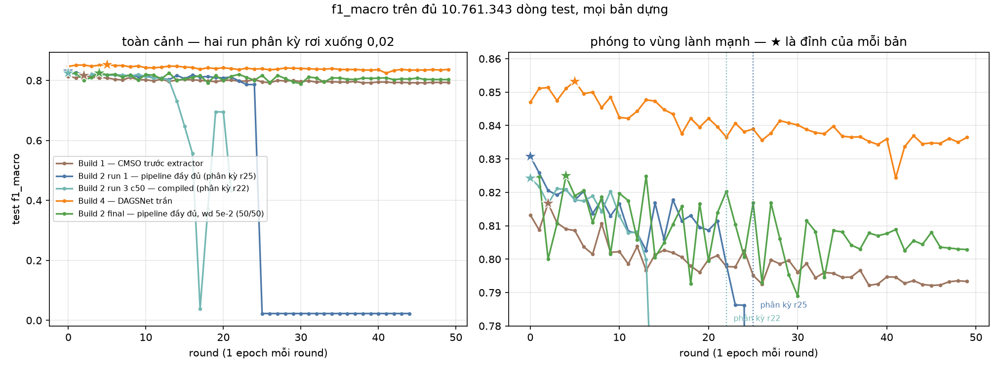
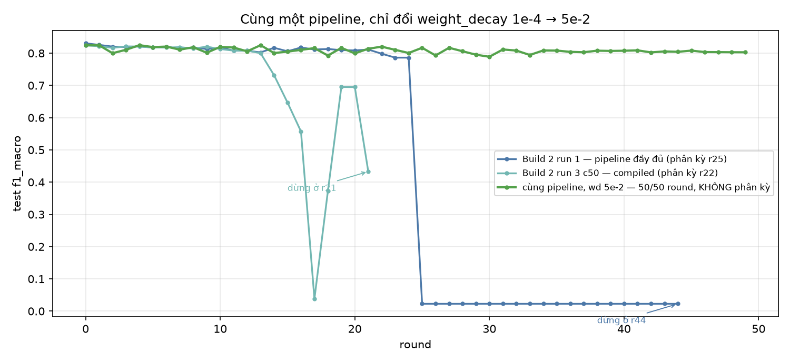
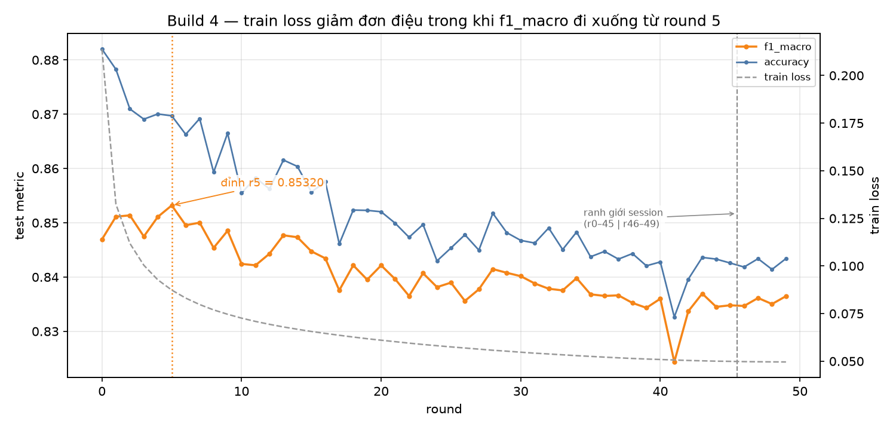
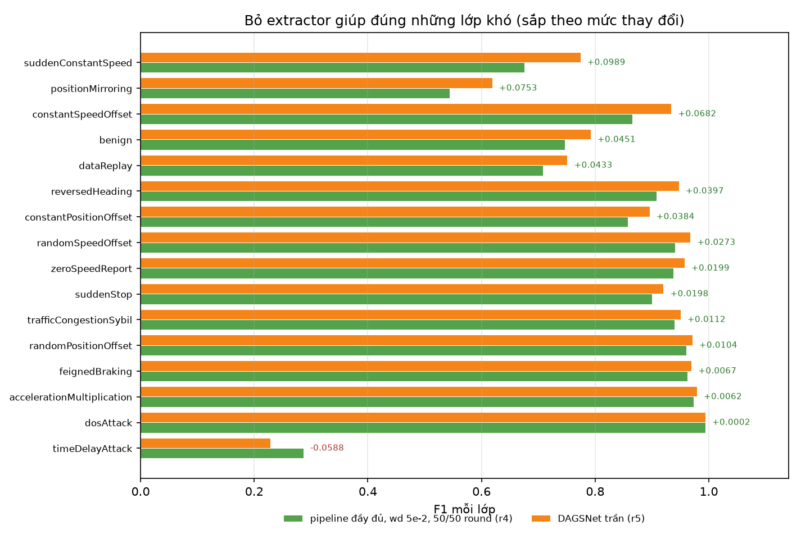
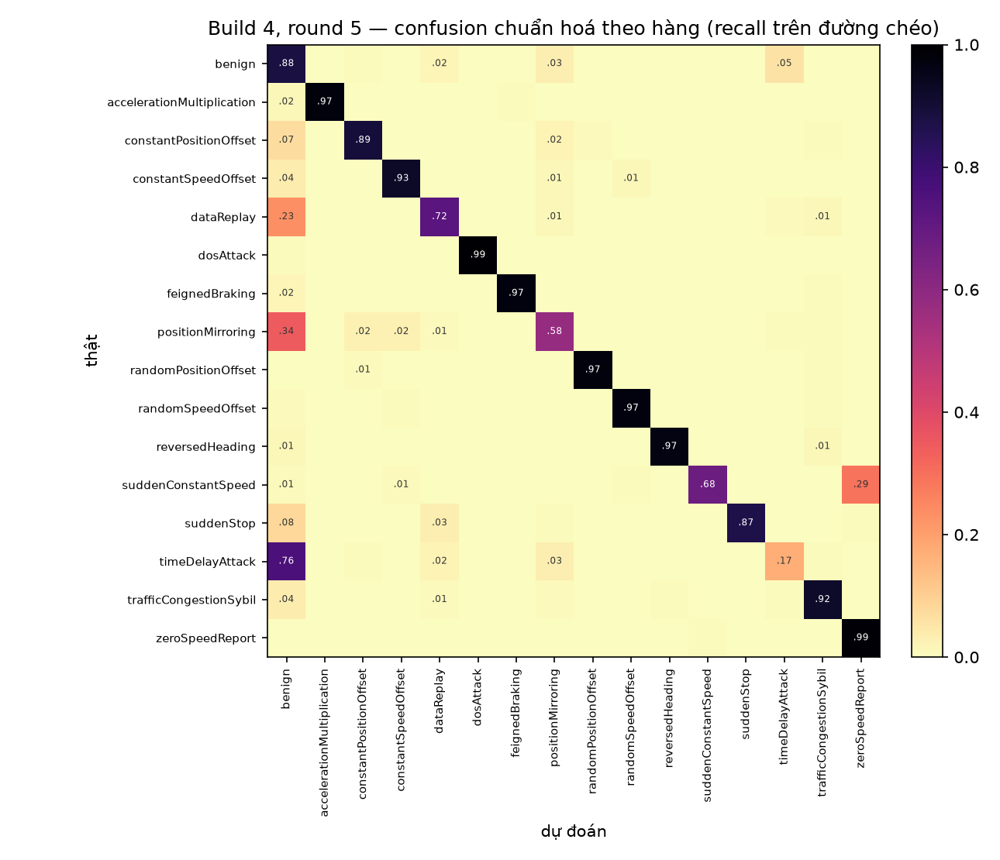

# EDL-CMSO trên VeReMi NextGen — báo cáo tổng hợp các bản dựng lại

**Bài báo gốc:** Khan et al. 2025, *Scientific Reports*, DOI `10.1038/s41598-025-94445-9` —
"A Secure and Efficient Deep Learning-Based Intrusion Detection Framework for the Internet
of Vehicles".

**Dữ liệu:** VeReMi NextGen 16 lớp, 43.045.415 dòng train / 10.761.343 dòng test, 66 đặc
trưng `f_*`, mất cân bằng 41:1.

**Cập nhật:** 2026-09-04. Ba bản dựng còn giữ artifact: build 1, build 2, build 4. Các
run TPU (build 3) đã bị loại vĩnh viễn và artifact đã xoá — kết luận giữ lại ở mục 4.6.

**Quy ước trích dẫn, đọc kỹ để khỏi nhầm:** `§4.8`, `§4.9`, `§4.10` (không có chữ "mục") là
các mục của **bài báo gốc** — lần lượt là khối trích xuất DWT→ViT→GAT, thuật toán CMSO, và
DAGSNet. `mục 2.1`, `mục 4.6`… là các mục của **chính báo cáo này**. Hai hệ đánh số trùng
nhau về con số nên chữ "mục" là thứ duy nhất phân biệt chúng.

> **Không đặt các con số dưới đây cạnh số của bài báo trong cùng một bảng.** Bài báo phân
> loại **nhị phân** trên CIC-IDS 2017 / CAN, dùng bộ metric khác (specificity, NPV, MCC,
> FPR, FNR — đều cần TN, mà bài toán 16 lớp không định nghĩa được nếu chưa chốt cách trung
> bình). Cái được kế thừa từ bài báo là **phương pháp**, không phải con số.

---

## 1. Ba bản dựng khác nhau ở chỗ nào

Cả ba đều dựng lại stage 3–5 của bài báo: DWT (Eq. 19) → ViT (Eq. 20–25) → GAT (Eq. 26–27)
→ fusion (Eq. 28) → CMSO (Eq. 29–37) → DAGSNet (Eq. 38–48). Stage 1 (IoVCipherGuard),
stage 2 (tiền xử lý) và stage 6 (AFPHA federated) đã bỏ theo yêu cầu; chạy **centralized**,
một model duy nhất.

| | Build 1 | Build 2 | Build 3 |
|---|---|---|---|
| CMSO chạy ở đâu | trên **66 cột đầu vào thô** | trên **262 kênh đã trích xuất** | như build 2 |
| Có đúng thứ tự bài báo không | **không** — chọn đặc trưng trước khi trích xuất | **có** | có |
| Eq. (28) đọc thế nào | patch **đã chiếu** (384 kênh) | patch **Haar thô** (262 kênh) | như build 2 |
| Vào DAGSNet | 384 kênh | 133/262 kênh | 133/262 kênh |
| Phần cứng | 2×T4 fp16 | 2×T4 fp16 | TPU v5e-8 SPMD; bf16 và mixed fp32/bf16 |

Build 2 tồn tại vì build 1 chạy CMSO **trước** khối trích xuất, ngược thứ tự §4.8 → §4.9
của bài báo. Build 3 chuyển cùng pipeline đó sang TPU.

**Hợp đồng giữ cho ba bản so sánh được:** CMSO chạy trên khối §4.8 **ở trạng thái khởi tạo**,
và bộ trọng số đó bị đóng băng vào `extractor_init.pt`. Mọi run sau nạp lại đúng file này
cùng `channel_mask.json`, nên khác biệt giữa chúng chỉ còn: độ chính xác số, batch, phần
cứng. Đã kiểm chứng `fuse()` bit-identical sau khi nạp.

---

## 1b. ⚠ Phần lớn kiến trúc dưới đây là TÔI TỰ SINH, không phải của bài báo

Đây là điều phải đọc trước mọi con số trong báo cáo này.

Bài báo mô tả EDL-CMSO ở mức công thức (Eq. 19–48) nhưng **không cho siêu tham số kiến
trúc**. Nó không nói ViT sâu bao nhiêu, `d_model` bằng bao nhiêu, GAT định nghĩa hàng xóm
`N(i)` thế nào, DWT dùng họ wavelet nào, bốn nhánh DAGSNet sâu bao nhiêu, CMSO có bao nhiêu
cá thể, hay nhị phân hoá vị trí liên tục ra sao. Mỗi chỗ trống đó **tôi phải tự điền để có
code chạy được**. Bản dựng này vì vậy là **một trong rất nhiều hiện thực hoá có thể** của
bài báo, không phải "bài báo được dựng lại".

### Bài báo thực sự quy định gì

| Bài báo có nói | Giá trị |
|---|---|
| Optimizer | Adam |
| Learning rate | 0,001 "with adaptive decay" (**không nói lịch giảm**) |
| Loss | categorical cross-entropy |
| Activation | ReLU / softmax |
| Batch size | 64 |
| Epochs | 100 |
| Phần cứng | 1× RTX 3090 |
| Trình tự pipeline | §4.8 trích xuất → §4.9 CMSO → DAGSNet |
| Công thức | Eq. 19–48 |

Hết. Mọi con số kiến trúc khác trong báo cáo này là của tôi.

### Những chỗ tôi tự sinh (deviation kiểu "judgement")

| Thành phần | Bài báo | Tôi chọn | Vì sao phải chọn |
|---|---|---|---|
| DWT | không nói họ/bậc | **Haar (db1), bậc 1**, conv stride-2 cố định | nhỏ nhất thoả Eq. (19) |
| Chia patch | `p × p` trên ảnh 2-D | **11 patch × 6**, không đệm | đầu vào là dòng bảng phẳng, không có cấu trúc 2-D |
| ViT | không nói depth/heads/`d` | **d=128, 2 lớp, 4 head, FFN ×2, dropout 0,1, pre-norm** | phải nhỏ: 10.509 bước × 50 round |
| GAT | không định nghĩa `N(i)` | **fully connected trên 11 node, 1 lớp, 4 head, slope 0,2** | tử số Eq. (26) là all-pairs |
| Eq. (28) | nối các tensor **khác rank** | **patch Haar thô ‖ z_final ‖ z_new** → 11×262 | Eq. (28) *không type-check như in ra*; đây là cách đọc chữ nghĩa |
| DAGSNet | không nói độ sâu, không nói 1-D hay 2-D | **bốn nhánh 1-D**, stem 1×1 → 96 ch; DenseNet 3 lớp growth 32, GoogleNet 2 inception, AlexNet 3 conv+pool, SqueezeNet 3 fire | dòng bảng không có cấu trúc 2-D |
| CMSO | không cho `N,T,C₁,μ,σ`, mutation, fitness | **N=20, T=50, C₁=0,2, μ=25, σ=3, mutation 0,05**; fitness = macro-F1 của CNN 1-D thay thế trừ `0,01·\|S\|/262` | không có giá trị nào được cho |
| Nhị phân hoá CMSO | Eq. (31)–(35) liên tục, chọn lựa thì nhị phân | **sigmoid + ngưỡng 0,5**, sàn 16 kênh và 2 kênh mỗi số hạng Eq. (28) | không có quy tắc nào được cho |
| Lịch LR | "adaptive decay" | **1 round warmup rồi cosine về 0** | lịch không được nêu |
| Adam vs CMSO | §4.9.2 gọi CMSO là "Optimizer" nhưng Table 1 ghi Adam | **Adam huấn luyện trọng số, CMSO chọn đặc trưng** | bài báo không bao giờ hoà giải hai câu này |
| **Weight decay** | **không nhắc tới** | **1e-4** (các run cũ) → **5e-2** (build 3 run 3–4) | xem mục 3.5 — kiểm soát attention collapse muộn, nhưng không sửa lỗi autocast XLA ở mục 4.6 |

### Những chỗ bị ép, không phải tôi chọn

Dataset (VeReMi NextGen thay CIC-IDS 2017), 16 lớp thay nhị phân, batch **4.096 thay 64**
(64 là 672.584 bước/epoch ≈ 187 h T4 với quota 30 h/tuần), **50 round thay 100 epoch**,
2×T4 fp16 thay 1× RTX 3090, và bỏ stage 1/2/6 theo yêu cầu.

### Hệ quả bắt buộc phải nêu

**Hai cơ chế lỗi ở mục 3 đều thuộc BẢN DỰNG NÀY, không chứng minh được là tính chất của
phương pháp trong bài báo.** Attention collapse muộn trên GPU phụ thuộc ít nhất ba lựa chọn
mà bài báo không quy định đầy đủ:

1. **Weight decay** — bài báo không nhắc tới. Nếu bản gốc dùng giá trị lớn, họ sẽ không bao
   giờ gặp attention collapse. Mục 3.5 cho thấy đúng chỗ này quyết định.
2. **Batch 4.096 thay vì 64.** Batch nhỏ hơn 64 lần cho gradient nhiễu hơn nhiều, và nhiễu
   là một dạng chính quy hoá. Cơ chế `‖W_q‖·‖W_k‖` leo đơn điệu có thể là hệ quả của batch
   lớn cộng Adam, không phải của kiến trúc.
3. **Cấu hình ViT là của tôi.** d=128 / 2 lớp / 4 head trên 11 token — bài báo không cho
   con số nào. Một cấu hình khác có thể không bão hoà.

Điều **có thể** kết luận: với các lựa chọn đã ghi rõ ở trên, kiến trúc không huấn luyện ổn
định được 50 epoch trên bộ dữ liệu này. Điều **không thể** kết luận: rằng phương pháp của
Khan et al. có khiếm khuyết. Bài báo không công bố đường cong hội tụ dài nào để đối chiếu.

Danh sách deviation đầy đủ (34 mục, kèm phân loại forced / user / judgement):
[`papers/build2-paper-order/rebuild.md`](papers/build2-paper-order/rebuild.md).

---

## 2. Kết quả

### 2.1 Tổng hợp các run

| Run | Kernel | Round hoàn tất | Round **dùng được** | Đỉnh `f1_macro` | Round cuối | Giờ |
|---|---|---:|---:|---|---:|---:|
| Build 1 — CMSO trước extractor | `edl-cmso-veremi` | 50 | **50** | 0,81676 (r2) | 0,79335 | 9,74 |
| Build 2 run 1 — wd 1e-4 | `edl-cmso-veremi-v2` | 45 | **25** (r0–24) | 0,83081 (r0) | 0,02273 ✗ | 9,50 |
| Build 2 run 2 — fp32 | `edl-cmso-veremi-fp32` | 0 | 0 | — huỷ tay | — | — |
| Build 2 run 3 — c50, compiled | `edl-cmso-veremi-c50` | 22 | **14** (r0–13) | 0,82422 (r0) | 0,43294 ✗ | 3,42 |
| **Build 2 final — wd 5e-2** | `edl-cmso-v2-final` | **50** | **50** | 0,82495 (r4) | 0,80288 | 8,26 |
| **Build 4 — DAGSNet trần** | `edl-cmso-v4-dagsnet` (+ `…-r46`) | **50** | **50** | **0,85320 (r5)** ⟵ cao nhất | **0,83648** | **4,61** |

Ba điều bảng này nói, theo thứ tự quan trọng:

**1. Bài toán ổn định đã giải xong.** Build 2 final chạy trọn 50 round không phân kỳ, cùng
pipeline và cùng `channel_mask.json` / `extractor_init.pt` với run 1 — biến duy nhất đổi là
`weight_decay` 1e-4 → 5e-2. Đây là bản dựng đúng thứ tự bài báo đầu tiên đi hết 50 epoch.
Bằng chứng cơ chế ở mục 3.5.

**2. Ổn định có giá của nó.** Đỉnh của bản final là 0,82495, **thấp hơn** đỉnh 0,83081 của
run 1. Nhưng phải đọc cho đúng: 0,83081 là số của **round 0** ở một run về sau tự huỷ, tức
một lần đọc sau đúng một epoch chứ không phải một kết quả huấn luyện đứng vững. Con số đứng
vững nhất của pipeline đầy đủ là **0,82495**.

**3. Bỏ hẳn pipeline vẫn thắng, và thắng rõ hơn khi so bằng số đứng vững.** Build 4 đạt
0,85320 với 395.024 tham số trong 4,61 h, so với 0,82495 với 727.952 tham số trong 8,26 h.
Mạnh hơn nữa: **round cuối cùng của build 4 (0,83648) vẫn cao hơn đỉnh của bản final
(0,82495) 0,0115** — sau 50 epoch overfit.

Build 4 chạy trên **hai session** (r0–45 rồi r46–49) nhưng artifact đã ghép thành **một thư
mục run duy nhất**; round 0–45 của bản pull sau trùng khít từng chữ số với bản pull trước, nên
đây là chạy tiếp chứ không phải tính lại. Provenance ở
`runs/edl_cmso_v4_dagsnet/logs/sessions.json`.

Ba probe TPU và năm run TPU đã bị **loại vĩnh viễn**; lý do là số học chứ không phải thiếu tối
ưu, tóm tắt ở mục 4.6.



Bảng trái cho thấy hai run wd 1e-4 rơi xuống 0,02; bảng phải phóng to vùng 0,78–0,86 là nơi
mọi so sánh có nghĩa thực sự diễn ra. Đọc được ngay: **build 4 (cam) nằm trên mọi bản khác ở
mọi round**, và bản final (xanh lá) đi hết 50 round trong dải 0,79–0,82.



Đây là hình quan trọng nhất về tính ổn định: **ba run cùng một pipeline**, chỉ khác
`weight_decay`. Hai run wd 1e-4 chết ở round 22 và 25 theo cùng một cơ chế; run wd 5e-2 đi hết
50 round. Run c50 còn chao đảo rồi hồi phục một phần ở round 17–20 trước khi hỏng hẳn — dấu
hiệu đây là mất ổn định tiệm tiến, không phải một sự kiện tràn số đơn lẻ.

### 2.2 Mười metric — build 2 final, round 4 (pipeline đầy đủ, run 50/50 đứng vững)

Đây là con số đại diện của **pipeline đúng thứ tự bài báo**: run duy nhất chạy trọn 50 round
mà không phân kỳ, đánh giá trên đủ 10.761.343 dòng test.

| metric | giá trị | | metric | giá trị |
|---|---:|---|---|---:|
| accuracy | 0,841301 | | **f1_macro** | **0,824952** |
| precision_macro | 0,830825 | | f1_micro | 0,841301 |
| precision_micro | 0,841301 | | f1_weighted | 0,839787 |
| precision_weighted | 0,841595 | | recall_macro | 0,823419 |
| recall_micro | 0,841301 | | recall_weighted | 0,841301 |

`precision_micro = recall_micro = f1_micro = recall_weighted = accuracy` là **đẳng thức**
của phân loại đơn nhãn đa lớp, không phải lỗi.

Để đối chiếu, build 2 run 3 (`c50`) ở round 0 — run có `torch.compile` nhưng wd 1e-4 và về
sau phân kỳ — cho accuracy 0,853857 / `f1_macro` 0,824218 / `f1_weighted` 0,846815. Chú ý
`f1_macro` của hai bản gần như bằng nhau (0,8242 và 0,8250) trong khi accuracy chênh 0,0126:
với mất cân bằng 41:1, `f1_macro` mới là con số đáng đọc (mục 5, ý 6).

### 2.3 Per-class, build 2 run 3 round 0

| lớp | precision | recall | F1 | support |
|---|---:|---:|---:|---:|
| benign | 0,7102 | 0,8371 | 0,7684 | 2.391.136 |
| accelerationMultiplication | 0,9871 | 0,9647 | 0,9758 | 157.490 |
| constantPositionOffset | 0,9210 | 0,8645 | 0,8919 | 442.475 |
| constantSpeedOffset | 0,7553 | 0,8901 | 0,8172 | 433.177 |
| dataReplay | 0,7290 | 0,7102 | 0,7195 | 475.410 |
| dosAttack | 0,9979 | 0,9922 | **0,9951** | 1.574.090 |
| feignedBraking | 0,9572 | 0,9308 | 0,9438 | 118.605 |
| positionMirroring | 0,5477 | 0,5305 | 0,5390 | 467.049 |
| randomPositionOffset | 0,9631 | 0,9744 | 0,9687 | 470.279 |
| randomSpeedOffset | 0,9615 | 0,9501 | 0,9558 | 542.163 |
| reversedHeading | 0,9599 | 0,9479 | 0,9539 | 269.999 |
| suddenConstantSpeed | 0,7935 | 0,5813 | 0,6710 | 57.757 |
| suddenStop | 0,9830 | 0,8166 | 0,8921 | 211.445 |
| **timeDelayAttack** | 0,3639 | 0,1413 | **0,2036** | 490.574 |
| trafficCongestionSybil | 0,9780 | 0,9398 | 0,9585 | 2.393.335 |
| zeroSpeedReport | 0,9094 | 0,9586 | 0,9334 | 266.359 |

### 2.4 CMSO chọn được gì

133/262 kênh: **wavelet 3/6, ViT 69/128, GAT 61/128**. Fitness chỉ nhích 0,55859 → 0,56789
qua 50 iteration — gần như phẳng.

Đây là hệ quả đã lường trước của quyết định chạy CMSO trên khối trích xuất **chưa huấn
luyện**: nó đang chọn giữa các chiều của một phép chiếu ngẫu nhiên, nên khó có tín hiệu
mạnh. **Không được diễn giải mask này như "CMSO tìm ra các đặc trưng quan trọng".**

### 2.5 Số lượng tham số của mô hình

Đếm bằng cách dựng lại model từ chính `config.json` của mỗi run. Tổng khớp **chính xác** với
dòng `params:` mà notebook in ra khi chạy trên Kaggle (727.952 và 823.824), nên đây là số đo
chứ không phải ước lượng.

| Thành phần | Phương trình | Build 2 / Build 3 | | Build 1 | |
|---|---|---:|---:|---:|---:|
| DWT Haar (buffer cố định, **không học**) | Eq. 19 | 0 | 0,0% | 0 | 0,0% |
| PatchEmbed + positional | Eq. 20–21 | 2.304 | 0,3% | 1.792 | 0,2% |
| ViT encoder × 2 | Eq. 22–25 | **265.216** | 36,4% | **265.216** | 32,2% |
| GAT | Eq. 26–27 | 16.640 | 2,3% | 16.640 | 2,0% |
| stem conv × 4 (một cho mỗi nhánh) | Eq. 28 → §4.10 | 51.840 | 7,1% | 148.224 | 18,0% |
| DenseNet | Eq. 38–40 | 37.056 | 5,1% | 37.056 | 4,5% |
| GoogleNet (Inception) | Eq. 41–43 | 45.824 | 6,3% | 45.824 | 5,6% |
| AlexNet | Eq. 44–45 | 135.936 | 18,7% | 135.936 | 16,5% |
| SqueezeNet (Fire) | Eq. 46–47 | 28.416 | 3,9% | 28.416 | 3,4% |
| Head phân loại 16 lớp | Eq. 48 | 144.720 | 19,9% | 144.720 | 17,6% |
| **Tổng tham số học được** | | **727.952** | | **823.824** | |
| Buffer không học (bộ lọc Haar, BN stats) | | 3.432 | | 3.299 | |

Tách theo hai nửa của bài báo:

| | §4.8 bộ trích xuất (DWT+ViT+GAT) | §4.10 DAGSNet |
|---|---:|---:|
| Build 2 / 3 | 284.160 — **39,0%** | 443.792 — 61,0% |
| Build 1 | 283.648 — 34,4% | 540.176 — 65,6% |

Bốn điều đáng chú ý:

1. **ViT encoder một mình chiếm 36,4% tham số** (265.216) — nhiều hơn cả bốn nhánh DAGSNet
   cộng lại (247.232). Đặt cạnh mục 3.4 (`max prob = 1,0000` ngay từ round 0, entropy 0,686),
   đây là **hơn một phần ba tham số của mô hình dành cho một khối gần như không làm gì**.
2. **Build 1 nhiều hơn build 2 đúng 95.872 tham số, và toàn bộ nằm ở `stems`** (148.224 vs
   51.840). Vì build 1 đưa 384 kênh fused vào DAGSNet còn build 2 chỉ đưa 133 kênh CMSO chọn.
   Đây là hệ quả trực tiếp của việc đổi vị trí CMSO, không phải một thay đổi kiến trúc khác.
3. **CMSO tiết kiệm được 11,6% tham số** khi đặt sau bộ trích xuất — và cho `f1_macro` cao hơn
   (0,83081 vs 0,81676). Đây là lập luận thực nghiệm mạnh nhất cho thứ tự §4.9-sau-§4.8 của
   bài báo mà bản dựng này thu được.
4. **DWT không có tham số học được.** Eq. 19 được hiện thực bằng conv1d stride-2 với bộ lọc
   Haar cố định trong buffer, đúng nghĩa một phép biến đổi chứ không phải một lớp.

**Bài báo không công bố số tham số**, nên không có gì để đối chiếu. Mọi siêu tham số quyết định
kích thước (`d_model=128`, `vit_layers=2`, `vit_heads=4`, `stem_ch=96`, `dense_growth=32`…) đều
**do tôi tự chọn** — xem mục 1b.

### 2.6 Build 4 — ablation: DAGSNet trần vượt cả pipeline đầy đủ

**Run đã xong sạch, đủ 50/50 round.** Chạy làm hai chặng: 46 round đầu dừng đúng theo
`max_hours` (`outcome: budget`), 4 round cuối (46–49) chạy tiếp trên tài khoản thứ hai từ
checkpoint round 45. Round 0–45 trong bản pull sau **trùng khít từng chữ số** với bản pull
trước, nên đây là chạy tiếp thật chứ không phải tính lại. Tổng 4,61 h huấn luyện, 5,5
phút/round, 129.764 mẫu/s. Artifact đã kéo về và khớp chính xác với W&B.

Bỏ hẳn §4.8 (DWT→ViT→GAT→Eq.28) và §4.9 (CMSO), đưa 66 đặc trưng thô thành `(B, 6, 11)` vào
thẳng DAGSNet. Mọi thứ khác **y hệt**: batch 4.096, 1 epoch/round, Adam lr 1e-3, cosine sau 1
round warmup, fp16 AMP + `torch.compile`, cùng split, eval trên **đủ 10.761.343 dòng**.

| run | `f1_macro` tốt nhất | round đỉnh | round cuối | round chạy trọn | tham số | giờ |
|---|---:|---:|---:|---:|---:|---:|
| **Build 4 — DAGSNet trần** | **0,85320** | **5** | **0,83648** | **50/50** | **395.024** | **4,61** |
| Build 2 final — pipeline đầy đủ, wd 5e-2 | 0,82495 | 4 | 0,80288 | **50/50** | 727.952 | 8,26 |
| Build 2 run 1 — pipeline đầy đủ, wd 1e-4 | 0,83081 | 0 | 0,02273 ✗ | 25/50 | 727.952 | 9,50 |
| Build 2 run 3 (c50) — pipeline đầy đủ | 0,82422 | 0 | 0,43294 ✗ | 14/50 | 727.952 | 3,42 |
| Build 1 — CMSO trước extractor | 0,81676 | 2 | 0,79335 | 50/50 | 823.824 | 9,74 |

So sánh đúng nhất là **hai dòng đầu**: cả hai đều chạy trọn 50 round, cùng dữ liệu, cùng
batch, cùng lr, cùng seed. **Bỏ 332.928 tham số (45,7%) thì `f1_macro` tăng 0,02825, và thời
gian huấn luyện giảm gần một nửa** (4,61 h so với 8,26 h).

Và điểm mạnh hơn nữa: **round cuối cùng của build 4 (r49, 0,83648) — sau đủ 50 epoch overfit
— vẫn cao hơn đỉnh của pipeline đầy đủ (0,82495) tới 0,0115**, thậm chí vẫn cao hơn con số
0,83081 mà run 1 đọc được ở round 0 trước khi tự huỷ.

**Đủ 10 metric, hai run 50/50, mỗi run ở round đỉnh của chính nó**, trên đủ 10.761.343 dòng test:

| metric | pipeline đầy đủ (r4) | DAGSNet trần (r5) | Δ |
|---|---:|---:|---:|
| accuracy | 0,841301 | 0,869709 | +0,028408 |
| precision_macro | 0,830825 | 0,873081 | **+0,042257** |
| precision_micro | 0,841301 | 0,869709 | +0,028408 |
| precision_weighted | 0,841595 | 0,865171 | +0,023576 |
| recall_macro | 0,823419 | 0,841692 | +0,018273 |
| recall_micro | 0,841301 | 0,869709 | +0,028408 |
| recall_weighted | 0,841301 | 0,869709 | +0,028408 |
| **f1_macro** | 0,824952 | 0,853199 | **+0,028247** |
| f1_micro | 0,841301 | 0,869709 | +0,028408 |
| f1_weighted | 0,839787 | 0,863558 | +0,023772 |

**Cả 10 metric đều tăng, không có metric nào đánh đổi.** Bốn cột `precision_micro`,
`recall_micro`, `f1_micro`, `recall_weighted` bằng đúng `accuracy` ở cả hai cột — đẳng thức
của phân loại đơn nhãn đa lớp, giữ lại để người đọc kiểm được chứ không phải trùng lặp thừa.

Mức tăng lớn nhất nằm ở **`precision_macro` (+0,0423)**, gấp rưỡi mức tăng của `recall_macro`
(+0,0183). Nghĩa là DAGSNet trần thắng chủ yếu nhờ **báo động giả ít hơn trên các lớp nhỏ**,
chứ không phải nhờ bắt được nhiều tấn công hơn. Đọc kèm mục 2.7: nó vẫn bỏ sót
`timeDelayAttack` nhiều hơn, nhưng những gì nó có gán nhãn thì chính xác hơn hẳn.

Mười metric ở round đỉnh (r5), trên đủ 10.761.343 dòng test:

| metric | giá trị | | metric | giá trị |
|---|---:|---|---|---:|
| accuracy | 0,869709 | | f1_macro | **0,853199** |
| precision_macro | 0,873081 | | f1_micro | 0,869709 |
| precision_micro | 0,869709 | | f1_weighted | 0,863558 |
| precision_weighted | 0,865171 | | recall_macro | 0,841692 |
| recall_micro | 0,869709 | | recall_weighted | 0,869709 |

**Đường cong: đỉnh ở round 5, rồi overfit đều.**

| round | 0 | 2 | **5** | 10 | 20 | 30 | 40 | 45 | 49 |
|---|---:|---:|---:|---:|---:|---:|---:|---:|---:|
| `f1_macro` | 0,84694 | 0,85137 | **0,85320** | 0,84242 | 0,84215 | 0,84016 | 0,83601 | 0,83479 | 0,83648 |
| train loss | 0,2139 | 0,1119 | **0,0873** | 0,0726 | 0,0610 | 0,0547 | 0,0509 | 0,0499 | 0,0496 |

Train loss giảm đơn điệu suốt 50 round trong khi `f1_macro` đi xuống từ round 5 — overfitting
đúng sách vở. Kết luận "đỉnh sớm rồi overfit" ở mục 6 **vẫn đúng**, chỉ là đỉnh dời từ
round 0–2 sang round 5 khi bỏ extractor. ⚠ Nhận định sớm của tôi (lúc mới có 4 round) rằng
đường cong này buộc phải viết lại mục 6 là **quá mạnh**; số liệu đủ 50 round không ủng hộ.



Hình trên là bằng chứng trực tiếp của overfitting: **train loss (nét đứt xám) giảm đơn điệu
suốt 50 round trong khi f1_macro đi xuống từ round 5**. Đường đứt dọc ở 45/46 là ranh giới
hai session — không có bậc nhảy nào ở đó, đúng như mong đợi khi resume nạp lại trạng thái
optimizer và scheduler chứ không chỉ trọng số.

Bốn round cuối đi ngang chứ không xuống tiếp: r46–r49 nằm trong dải 0,83467–0,83648, tức là
biên độ 0,0018 — nhỏ hơn khoảng cách giữa hai round liền kề ở giai đoạn đầu. LR cosine đã về
gần 0 (1,03e-06 ở r48, 0,0 ở r49), nên phần suy giảm đã dừng lại chứ không phải bị cắt ngang
lúc còn đang xuống. Nói cách khác, 0,83648 là **giá trị hội tụ**, không phải một điểm bất kỳ
trên đà rơi.

Điều này **nhất quán với mục 3.4**: ViT đã bão hoà từ round 0 (`max prob = 1,0000`,
entropy 0,686) — 36,4% tham số của model nằm trong một khối gần như không làm gì, và nó còn là
khối gây ra cả hai cơ chế phân kỳ ở mục 3. Ablation này nói thêm một bước: khối đó không chỉ
vô ích mà còn **làm giảm điểm**.

**Sức khoẻ số học — không có dấu vết nào của hai cơ chế ở mục 3.** `GradScaler` bỏ **198 trên
483.368 step (0,041%)**, mức bình thường khi scaler dò ngưỡng; grad norm ổn định quanh 0,2–0,8;
`scaler_scale` còn tăng 65.536 → 262.144 (ít overflow đi). Đúng như dự đoán, vì cả hai cơ chế
phân kỳ đều nằm trong attention. Tốc độ 330,1 s/round, tổng 4,22 h.

**Chưa được kết luận gì quá số đo.** Đây là **một** run, **một** seed. Ba việc cần trước khi
phát biểu mạnh: (a) lặp lại với seed khác, (b) chạy 4 round còn lại cho đủ 50, (c) tách phần
đóng góp của nhóm `session` bị rò rỉ (mục 5, ý 4) — vốn ảnh hưởng **cả hai** kiến trúc như nhau
nên không giải thích được chênh lệch, nhưng vẫn làm mọi con số tuyệt đối bị thổi lên.

### 2.7 Per-class: bỏ extractor thắng 15/16 lớp, thua đúng lớp khó nhất

So F1 từng lớp ở **round đỉnh của mỗi bản**, và chuẩn so sánh là **bản final wd 5e-2 round 4**
— run pipeline đầy đủ duy nhất đứng vững 50 round. (So với run 1 round 0 thì bức tranh khác,
xem cuối mục.)

| lớp | pipeline đầy đủ (r4) | DAGSNet trần (r5) | Δ F1 | support |
|---|---:|---:|---:|---:|
| suddenConstantSpeed | 0,6751 | 0,7740 | **+0,0989** | 57.757 |
| positionMirroring | 0,5436 | 0,6189 | **+0,0753** | 467.049 |
| constantSpeedOffset | 0,8659 | 0,9341 | **+0,0682** | 433.177 |
| benign | 0,7471 | 0,7922 | **+0,0451** | 2.391.136 |
| dataReplay | 0,7079 | 0,7512 | **+0,0433** | 475.410 |
| reversedHeading | 0,9077 | 0,9474 | +0,0397 | 269.999 |
| constantPositionOffset | 0,8573 | 0,8957 | +0,0384 | 442.475 |
| randomSpeedOffset | 0,9404 | 0,9677 | +0,0273 | 542.163 |
| zeroSpeedReport | 0,9374 | 0,9574 | +0,0199 | 266.359 |
| suddenStop | 0,9005 | 0,9204 | +0,0198 | 211.445 |
| trafficCongestionSybil | 0,9392 | 0,9504 | +0,0112 | 2.393.335 |
| randomPositionOffset | 0,9607 | 0,9711 | +0,0104 | 470.279 |
| feignedBraking | 0,9629 | 0,9696 | +0,0067 | 118.605 |
| accelerationMultiplication | 0,9729 | 0,9791 | +0,0062 | 157.490 |
| dosAttack | 0,9937 | 0,9939 | +0,0002 | 1.574.090 |
| **timeDelayAttack** | **0,2868** | **0,2281** | **−0,0588** | 490.574 |

**15/16 lớp tăng, trung bình +0,0282. Lớp duy nhất giảm là lớp khó nhất của cả bộ dữ liệu.**

Đây là một đánh đổi thật, không phải nhiễu. `timeDelayAttack` là lớp mà mọi bản dựng đều vật
lộn (F1 chưa bao giờ vượt 0,29), và nó là lớp **duy nhất** mà khối trích xuất §4.8 tỏ ra có
ích. Cách đọc cơ chế: §4.8 nén 66 đặc trưng qua DWT → ViT → GAT → Eq. 28 rồi CMSO cắt còn
133/262 kênh. Với 15 lớp còn lại, chuỗi nén đó **làm mất thông tin** — bỏ nó đi thì điểm tăng
ở mọi mức khó, kể cả các lớp đã gần trần. Với riêng `timeDelayAttack`, nơi tín hiệu phân biệt
nằm ở quan hệ thời gian giữa các message, phép biến đổi wavelet + attention **có** bắt được
thứ mà một CNN 1-D trên đặc trưng thô không bắt được.

Đó là kết luận có ích nhất rút ra được về §4.8: nó không vô dụng, nhưng cái nó mua được rất
hẹp, và cái giá là 332.928 tham số cộng với điểm thấp hơn ở 15 lớp khác.



⚠ Hai dòng phải đọc kèm caveat. `trafficCongestionSybil` (+0,0112) bị nhóm `session` rò rỉ
(mục 5, ý 4) nên F1 của nó phần lớn không đến từ kiến trúc. Và `benign` (+0,0451) lấy từ luồng
**không có tấn công** (mục 5, ý 2), nên mức tăng ở đó cũng không thuần tuý là năng lực mô hình.

**So với run 1 round 0 thì khác — và khác biệt đó tự nó có ý nghĩa.** Nếu lấy chuẩn là run 1
(0,83081, round 0, run về sau tự huỷ) thì chỉ 11/16 lớp tăng, và `timeDelayAttack` lại **tăng**
+0,0333 thay vì giảm. Nghĩa là phần lớn năng lực của run 1 trên lớp khó này đến từ **trạng thái
chưa hội tụ, chưa bị weight decay ràng buộc** — đúng cái trạng thái mà 24 round sau đó đã tự
phá huỷ. Không nên xây kết luận trên một con số mà run tạo ra nó không giữ nổi.



Confusion chuẩn hoá theo hàng ở round 5 chỉ ra chỗ lỗi thật sự còn lại, và nó **không** rải
đều: `timeDelayAttack` bị đoán thành `benign` **76%** số lần (recall của chính nó chỉ 0,17),
`positionMirroring` mất 34% vào `benign`, `dataReplay` mất 23%, `suddenConstantSpeed` mất 29%
vào `zeroSpeedReport`. Nói cách khác phần lớn sai sót của mô hình là **không phát hiện được
tấn công** chứ không phải nhầm giữa các loại tấn công — đúng kiểu lỗi tốn kém nhất trong một
IDS, và phải nêu kèm mọi con số macro ở trên.

### 2.8 Bảng theo từng round của từng bản dựng

Mọi con số dưới đây đọc thẳng từ `metrics/history.csv` của run tương ứng, đánh giá trên **đủ
10.761.343 dòng test** ở cuối mỗi round. Bảng giữ đủ **10 metrics** cho từng round;
`s/round` là thời gian một round (train + eval trên toàn bộ test). Sinh lại bằng
`conda run -n nckh python make_tables.py --apply`.

Lưu ý khi đọc: `precision_micro = recall_micro = f1_micro = recall_weighted = accuracy` với
bài toán single-label đa lớp. Các cột này vẫn được trình bày đầy đủ; giá trị trùng nhau là
đúng theo định nghĩa, không phải lỗi — xem mục 2.2. Các round sau ngưỡng dùng được đã ghi
ở từng run chỉ được giữ để mô tả sự cố, không dùng để kết luận về chất lượng mô hình.

<!-- BEGIN per-round tables (make_tables.py) -->

#### Build 1 — CMSO trước extractor

50/50 round, `edl-cmso-veremi`. CMSO chạy **trước** khối trích xuất — ngược thứ tự bài báo. Đỉnh `f1_macro` **0,81676** ở round 2; tổng 9,74 h.

Đã kiểm theo `references/metrics.md` trước khi công bố: mọi round có đủ 10 metric, hữu hạn, nằm trong [0, 1]; đẳng thức `accuracy = P_mic = R_mic = F1_mic = R_wgt` đúng tới 1e-9; confusion của round cuối cộng đúng 10.761.343 dòng test.

| round | accuracy | precision_macro | precision_micro | precision_weighted | recall_macro | recall_micro | recall_weighted | **f1_macro** | f1_micro | f1_weighted | train loss | s/round |
|---:|---:|---:|---:|---:|---:|---:|---:|---:|---:|---:|---:|---:|
| 0 | 0,84870 | 0,85829 | 0,84870 | 0,85102 | 0,80234 | 0,84870 | 0,84870 | 0,81325 | 0,84870 | 0,83281 | 0,2610 | 704,1 |
| 1 | 0,83922 | 0,83366 | 0,83922 | 0,84026 | 0,80781 | 0,83922 | 0,83922 | 0,80872 | 0,83922 | 0,82658 | 0,1744 | 701,2 |
| 2 | 0,84297 | 0,84228 | 0,84297 | 0,84454 | 0,80982 | 0,84297 | 0,84297 | **0,81676** | 0,84297 | 0,83265 | 0,1495 | 701,4 |
| 3 | 0,83082 | 0,83310 | 0,83082 | 0,83578 | 0,80688 | 0,83082 | 0,83082 | 0,81087 | 0,83082 | 0,82102 | 0,1343 | 701,3 |
| 4 | 0,82638 | 0,83171 | 0,82638 | 0,83488 | 0,80444 | 0,82638 | 0,82638 | 0,80903 | 0,82638 | 0,81857 | 0,1238 | 700,1 |
| 5 | 0,82679 | 0,82632 | 0,82679 | 0,83298 | 0,80796 | 0,82679 | 0,82679 | 0,80855 | 0,82679 | 0,81933 | 0,1158 | 700,0 |
| 6 | 0,82099 | 0,81856 | 0,82099 | 0,82893 | 0,80589 | 0,82099 | 0,82099 | 0,80369 | 0,82099 | 0,81260 | 0,1091 | 699,9 |
| 7 | 0,82355 | 0,81543 | 0,82355 | 0,82969 | 0,80407 | 0,82355 | 0,82355 | 0,80149 | 0,82355 | 0,81435 | 0,1036 | 700,2 |
| 8 | 0,82324 | 0,82427 | 0,82324 | 0,83047 | 0,81019 | 0,82324 | 0,82324 | 0,81064 | 0,82324 | 0,81691 | 0,0990 | 701,2 |
| 9 | 0,81842 | 0,81401 | 0,81842 | 0,82572 | 0,80494 | 0,81842 | 0,81842 | 0,80203 | 0,81842 | 0,81062 | 0,0950 | 701,6 |
| 10 | 0,81465 | 0,81700 | 0,81465 | 0,82487 | 0,80461 | 0,81465 | 0,81465 | 0,80225 | 0,81465 | 0,80728 | 0,0915 | 701,0 |
| 11 | 0,81248 | 0,80895 | 0,81248 | 0,82197 | 0,80596 | 0,81248 | 0,81248 | 0,79853 | 0,81248 | 0,80377 | 0,0885 | 701,2 |
| 12 | 0,81820 | 0,81209 | 0,81820 | 0,82487 | 0,80895 | 0,81820 | 0,81820 | 0,80382 | 0,81820 | 0,81112 | 0,0860 | 700,8 |
| 13 | 0,81056 | 0,80199 | 0,81056 | 0,82021 | 0,80651 | 0,81056 | 0,81056 | 0,79664 | 0,81056 | 0,80253 | 0,0837 | 701,8 |
| 14 | 0,81468 | 0,80723 | 0,81468 | 0,82346 | 0,80897 | 0,81468 | 0,81468 | 0,80135 | 0,81468 | 0,80797 | 0,0818 | 701,9 |
| 15 | 0,81578 | 0,80950 | 0,81578 | 0,82303 | 0,80997 | 0,81578 | 0,81578 | 0,80268 | 0,81578 | 0,80885 | 0,0800 | 702,4 |
| 16 | 0,80974 | 0,80850 | 0,80974 | 0,82046 | 0,80948 | 0,80974 | 0,80974 | 0,80194 | 0,80974 | 0,80347 | 0,0783 | 701,7 |
| 17 | 0,80924 | 0,80371 | 0,80924 | 0,81954 | 0,81030 | 0,80924 | 0,80924 | 0,80059 | 0,80924 | 0,80413 | 0,0768 | 701,4 |
| 18 | 0,80485 | 0,79957 | 0,80485 | 0,81635 | 0,81024 | 0,80485 | 0,80485 | 0,79794 | 0,80485 | 0,79902 | 0,0754 | 700,6 |
| 19 | 0,80307 | 0,79425 | 0,80307 | 0,81535 | 0,81174 | 0,80307 | 0,80307 | 0,79606 | 0,80307 | 0,79763 | 0,0740 | 701,9 |
| 20 | 0,80630 | 0,80165 | 0,80630 | 0,81796 | 0,81093 | 0,80630 | 0,80630 | 0,79991 | 0,80630 | 0,80068 | 0,0728 | 701,4 |
| 21 | 0,80896 | 0,80735 | 0,80896 | 0,82028 | 0,80878 | 0,80896 | 0,80896 | 0,80109 | 0,80896 | 0,80254 | 0,0716 | 700,9 |
| 22 | 0,80448 | 0,79915 | 0,80448 | 0,81621 | 0,81054 | 0,80448 | 0,80448 | 0,79781 | 0,80448 | 0,79824 | 0,0706 | 701,4 |
| 23 | 0,80512 | 0,80037 | 0,80512 | 0,81602 | 0,80790 | 0,80512 | 0,80512 | 0,79766 | 0,80512 | 0,79946 | 0,0696 | 701,6 |
| 24 | 0,80647 | 0,80746 | 0,80647 | 0,81923 | 0,81012 | 0,80647 | 0,80647 | 0,80261 | 0,80647 | 0,80128 | 0,0685 | 701,4 |
| 25 | 0,80239 | 0,79300 | 0,80239 | 0,81494 | 0,81108 | 0,80239 | 0,80239 | 0,79517 | 0,80239 | 0,79682 | 0,0675 | 702,0 |
| 26 | 0,80019 | 0,79512 | 0,80019 | 0,81288 | 0,80700 | 0,80019 | 0,80019 | 0,79256 | 0,80019 | 0,79225 | 0,0666 | 701,3 |
| 27 | 0,80492 | 0,80051 | 0,80492 | 0,81777 | 0,81206 | 0,80492 | 0,80492 | 0,79978 | 0,80492 | 0,80004 | 0,0657 | 701,4 |
| 28 | 0,80425 | 0,79872 | 0,80425 | 0,81612 | 0,81198 | 0,80425 | 0,80425 | 0,79859 | 0,80425 | 0,79815 | 0,0648 | 702,2 |
| 29 | 0,80324 | 0,80115 | 0,80324 | 0,81631 | 0,81188 | 0,80324 | 0,80324 | 0,79963 | 0,80324 | 0,79777 | 0,0641 | 701,5 |
| 30 | 0,79988 | 0,79782 | 0,79988 | 0,81344 | 0,80908 | 0,79988 | 0,79988 | 0,79612 | 0,79988 | 0,79370 | 0,0632 | 701,9 |
| 31 | 0,80159 | 0,79927 | 0,80159 | 0,81550 | 0,81138 | 0,80159 | 0,80159 | 0,79868 | 0,80159 | 0,79644 | 0,0626 | 701,8 |
| 32 | 0,80082 | 0,79653 | 0,80082 | 0,81280 | 0,80819 | 0,80082 | 0,80082 | 0,79442 | 0,80082 | 0,79350 | 0,0617 | 701,8 |
| 33 | 0,80117 | 0,79740 | 0,80117 | 0,81422 | 0,80974 | 0,80117 | 0,80117 | 0,79602 | 0,80117 | 0,79447 | 0,0610 | 701,4 |
| 34 | 0,79875 | 0,79528 | 0,79875 | 0,81259 | 0,81038 | 0,79875 | 0,79875 | 0,79578 | 0,79875 | 0,79256 | 0,0604 | 702,5 |
| 35 | 0,79569 | 0,79212 | 0,79569 | 0,81153 | 0,81117 | 0,79569 | 0,79569 | 0,79455 | 0,79569 | 0,79018 | 0,0598 | 702,6 |
| 36 | 0,79784 | 0,79370 | 0,79784 | 0,81204 | 0,81044 | 0,79784 | 0,79784 | 0,79465 | 0,79784 | 0,79136 | 0,0593 | 702,4 |
| 37 | 0,80028 | 0,79603 | 0,80028 | 0,81404 | 0,81095 | 0,80028 | 0,80028 | 0,79670 | 0,80028 | 0,79478 | 0,0587 | 701,9 |
| 38 | 0,79711 | 0,79109 | 0,79711 | 0,81063 | 0,80939 | 0,79711 | 0,79711 | 0,79215 | 0,79711 | 0,78964 | 0,0582 | 701,6 |
| 39 | 0,79664 | 0,79079 | 0,79664 | 0,81024 | 0,80973 | 0,79664 | 0,79664 | 0,79258 | 0,79664 | 0,78953 | 0,0577 | 701,5 |
| 40 | 0,79615 | 0,79273 | 0,79615 | 0,81181 | 0,81100 | 0,79615 | 0,79615 | 0,79469 | 0,79615 | 0,79067 | 0,0573 | 701,7 |
| 41 | 0,79584 | 0,79115 | 0,79584 | 0,81168 | 0,81263 | 0,79584 | 0,79584 | 0,79463 | 0,79584 | 0,79049 | 0,0569 | 701,2 |
| 42 | 0,79719 | 0,79146 | 0,79719 | 0,81103 | 0,80942 | 0,79719 | 0,79719 | 0,79275 | 0,79719 | 0,79017 | 0,0565 | 701,9 |
| 43 | 0,79644 | 0,79272 | 0,79644 | 0,81108 | 0,81001 | 0,79644 | 0,79644 | 0,79358 | 0,79644 | 0,78958 | 0,0563 | 700,9 |
| 44 | 0,79688 | 0,79080 | 0,79688 | 0,81051 | 0,80997 | 0,79688 | 0,79688 | 0,79242 | 0,79688 | 0,78957 | 0,0560 | 701,4 |
| 45 | 0,79502 | 0,79053 | 0,79502 | 0,80995 | 0,80960 | 0,79502 | 0,79502 | 0,79214 | 0,79502 | 0,78807 | 0,0558 | 701,0 |
| 46 | 0,79531 | 0,79034 | 0,79531 | 0,81018 | 0,81009 | 0,79531 | 0,79531 | 0,79227 | 0,79531 | 0,78829 | 0,0556 | 702,2 |
| 47 | 0,79571 | 0,79111 | 0,79571 | 0,81063 | 0,81070 | 0,79571 | 0,79571 | 0,79326 | 0,79571 | 0,78915 | 0,0556 | 700,9 |
| 48 | 0,79570 | 0,79182 | 0,79570 | 0,81093 | 0,81071 | 0,79570 | 0,79570 | 0,79351 | 0,79570 | 0,78916 | 0,0554 | 701,8 |
| 49 | 0,79534 | 0,79125 | 0,79534 | 0,81080 | 0,81074 | 0,79534 | 0,79534 | 0,79335 | 0,79534 | 0,78898 | 0,0553 | 701,7 |


#### Build 2 run 1 — pipeline đầy đủ, wd 1e-4

Phân kỳ ở round 25. **Chỉ round 0–24 dùng được**; các round sau là hậu quả của sụp attention. Đỉnh `f1_macro` **0,83081** ở round 0; tổng 9,50 h.

Đã kiểm theo `references/metrics.md` trước khi công bố: mọi round có đủ 10 metric, hữu hạn, nằm trong [0, 1]; đẳng thức `accuracy = P_mic = R_mic = F1_mic = R_wgt` đúng tới 1e-9; confusion của round cuối cộng đúng 10.761.343 dòng test.

| round | accuracy | precision_macro | precision_micro | precision_weighted | recall_macro | recall_micro | recall_weighted | **f1_macro** | f1_micro | f1_weighted | train loss | s/round |
|---:|---:|---:|---:|---:|---:|---:|---:|---:|---:|---:|---:|---:|
| 0 | 0,86545 | 0,85753 | 0,86545 | 0,85887 | 0,81582 | 0,86545 | 0,86545 | **0,83081** | 0,86545 | 0,85652 | 0,2218 | 791,0 |
| 1 | 0,85516 | 0,84694 | 0,85516 | 0,84851 | 0,81543 | 0,85516 | 0,85516 | 0,82582 | 0,85516 | 0,84745 | 0,1176 | 780,4 |
| 2 | 0,84320 | 0,82787 | 0,84320 | 0,84016 | 0,81950 | 0,84320 | 0,84320 | 0,82054 | 0,84320 | 0,83915 | 0,0956 | 779,0 |
| 3 | 0,84521 | 0,83298 | 0,84521 | 0,84031 | 0,81554 | 0,84521 | 0,84521 | 0,81920 | 0,84521 | 0,83874 | 0,0846 | 778,6 |
| 4 | 0,83937 | 0,82999 | 0,83937 | 0,83780 | 0,81796 | 0,83937 | 0,83937 | 0,82086 | 0,83937 | 0,83580 | 0,0776 | 778,5 |
| 5 | 0,83532 | 0,82689 | 0,83532 | 0,83524 | 0,81721 | 0,83532 | 0,83532 | 0,81769 | 0,83532 | 0,83112 | 0,0727 | 778,1 |
| 6 | 0,83819 | 0,82561 | 0,83819 | 0,83713 | 0,82190 | 0,83819 | 0,83819 | 0,82033 | 0,83819 | 0,83477 | 0,0691 | 777,9 |
| 7 | 0,83845 | 0,81356 | 0,83845 | 0,83403 | 0,82053 | 0,83845 | 0,83845 | 0,81367 | 0,83845 | 0,83332 | 0,0662 | 778,0 |
| 8 | 0,83799 | 0,82219 | 0,83799 | 0,83675 | 0,82127 | 0,83799 | 0,83799 | 0,81778 | 0,83799 | 0,83388 | 0,0639 | 779,4 |
| 9 | 0,83732 | 0,81744 | 0,83732 | 0,83345 | 0,81670 | 0,83732 | 0,83732 | 0,81295 | 0,83732 | 0,83220 | 0,0619 | 779,9 |
| 10 | 0,83209 | 0,82238 | 0,83209 | 0,83363 | 0,81934 | 0,83209 | 0,83209 | 0,81665 | 0,83209 | 0,82944 | 0,0602 | 779,9 |
| 11 | 0,82870 | 0,81683 | 0,82870 | 0,82795 | 0,81172 | 0,82870 | 0,82870 | 0,80834 | 0,82870 | 0,82365 | 0,0588 | 780,6 |
| 12 | 0,82719 | 0,80917 | 0,82719 | 0,82639 | 0,81530 | 0,82719 | 0,82719 | 0,80778 | 0,82719 | 0,82328 | 0,0575 | 781,0 |
| 13 | 0,82059 | 0,79804 | 0,82059 | 0,82127 | 0,81503 | 0,82059 | 0,82059 | 0,80261 | 0,82059 | 0,81692 | 0,0563 | 780,8 |
| 14 | 0,83439 | 0,82203 | 0,83439 | 0,83416 | 0,81905 | 0,83439 | 0,83439 | 0,81682 | 0,83439 | 0,83110 | 0,0552 | 782,9 |
| 15 | 0,82211 | 0,80720 | 0,82211 | 0,82456 | 0,81500 | 0,82211 | 0,82211 | 0,80599 | 0,82211 | 0,81905 | 0,0543 | 785,1 |
| 16 | 0,83264 | 0,82329 | 0,83264 | 0,83414 | 0,82130 | 0,83264 | 0,83264 | 0,81777 | 0,83264 | 0,82956 | 0,0534 | 781,2 |
| 17 | 0,82890 | 0,81717 | 0,82890 | 0,83191 | 0,81541 | 0,82890 | 0,82890 | 0,81147 | 0,82890 | 0,82643 | 0,0525 | 781,8 |
| 18 | 0,83049 | 0,81844 | 0,83049 | 0,83162 | 0,81738 | 0,83049 | 0,83049 | 0,81307 | 0,83049 | 0,82710 | 0,0517 | 780,9 |
| 19 | 0,82530 | 0,81585 | 0,82530 | 0,82885 | 0,81562 | 0,82530 | 0,82530 | 0,80955 | 0,82530 | 0,82296 | 0,0511 | 779,3 |
| 20 | 0,82690 | 0,81209 | 0,82690 | 0,82901 | 0,81581 | 0,82690 | 0,82690 | 0,80868 | 0,82690 | 0,82331 | 0,0507 | 777,6 |
| 21 | 0,82423 | 0,81426 | 0,82423 | 0,82888 | 0,81920 | 0,82423 | 0,82423 | 0,81142 | 0,82423 | 0,82186 | 0,0506 | 782,2 |
| 22 | 0,82223 | 0,80367 | 0,82223 | 0,82535 | 0,80407 | 0,82223 | 0,82223 | 0,79839 | 0,82223 | 0,81826 | 0,0514 | 779,8 |
| 23 | 0,81125 | 0,78106 | 0,81125 | 0,81380 | 0,80083 | 0,81125 | 0,81125 | 0,78629 | 0,81125 | 0,80816 | 0,0559 | 779,7 |
| 24 | 0,82282 | 0,79345 | 0,82282 | 0,81938 | 0,78590 | 0,82282 | 0,82282 | 0,78623 | 0,82282 | 0,81801 | 0,0771 | 777,6 |
| 25 | 0,22220 | 0,01389 | 0,22220 | 0,04937 | 0,06250 | 0,22220 | 0,22220 | 0,02273 | 0,22220 | 0,08079 | nan | 739,7 |
| 26 | 0,22220 | 0,01389 | 0,22220 | 0,04937 | 0,06250 | 0,22220 | 0,22220 | 0,02273 | 0,22220 | 0,08079 | nan | 735,2 |
| 27 | 0,22220 | 0,01389 | 0,22220 | 0,04937 | 0,06250 | 0,22220 | 0,22220 | 0,02273 | 0,22220 | 0,08079 | nan | 731,4 |
| 28 | 0,22220 | 0,01389 | 0,22220 | 0,04937 | 0,06250 | 0,22220 | 0,22220 | 0,02273 | 0,22220 | 0,08079 | nan | 733,3 |
| 29 | 0,22220 | 0,01389 | 0,22220 | 0,04937 | 0,06250 | 0,22220 | 0,22220 | 0,02273 | 0,22220 | 0,08079 | nan | 734,0 |
| 30 | 0,22220 | 0,01389 | 0,22220 | 0,04937 | 0,06250 | 0,22220 | 0,22220 | 0,02273 | 0,22220 | 0,08079 | nan | 733,9 |
| 31 | 0,22220 | 0,01389 | 0,22220 | 0,04937 | 0,06250 | 0,22220 | 0,22220 | 0,02273 | 0,22220 | 0,08079 | nan | 735,3 |
| 32 | 0,22220 | 0,01389 | 0,22220 | 0,04937 | 0,06250 | 0,22220 | 0,22220 | 0,02273 | 0,22220 | 0,08079 | nan | 734,9 |
| 33 | 0,22220 | 0,01389 | 0,22220 | 0,04937 | 0,06250 | 0,22220 | 0,22220 | 0,02273 | 0,22220 | 0,08079 | nan | 733,5 |
| 34 | 0,22220 | 0,01389 | 0,22220 | 0,04937 | 0,06250 | 0,22220 | 0,22220 | 0,02273 | 0,22220 | 0,08079 | nan | 731,9 |
| 35 | 0,22220 | 0,01389 | 0,22220 | 0,04937 | 0,06250 | 0,22220 | 0,22220 | 0,02273 | 0,22220 | 0,08079 | nan | 733,9 |
| 36 | 0,22220 | 0,01389 | 0,22220 | 0,04937 | 0,06250 | 0,22220 | 0,22220 | 0,02273 | 0,22220 | 0,08079 | nan | 734,8 |
| 37 | 0,22220 | 0,01389 | 0,22220 | 0,04937 | 0,06250 | 0,22220 | 0,22220 | 0,02273 | 0,22220 | 0,08079 | nan | 734,7 |
| 38 | 0,22220 | 0,01389 | 0,22220 | 0,04937 | 0,06250 | 0,22220 | 0,22220 | 0,02273 | 0,22220 | 0,08079 | nan | 735,0 |
| 39 | 0,22220 | 0,01389 | 0,22220 | 0,04937 | 0,06250 | 0,22220 | 0,22220 | 0,02273 | 0,22220 | 0,08079 | nan | 734,1 |
| 40 | 0,22220 | 0,01389 | 0,22220 | 0,04937 | 0,06250 | 0,22220 | 0,22220 | 0,02273 | 0,22220 | 0,08079 | nan | 734,7 |
| 41 | 0,22220 | 0,01389 | 0,22220 | 0,04937 | 0,06250 | 0,22220 | 0,22220 | 0,02273 | 0,22220 | 0,08079 | nan | 731,8 |
| 42 | 0,22220 | 0,01389 | 0,22220 | 0,04937 | 0,06250 | 0,22220 | 0,22220 | 0,02273 | 0,22220 | 0,08079 | nan | 729,4 |
| 43 | 0,22220 | 0,01389 | 0,22220 | 0,04937 | 0,06250 | 0,22220 | 0,22220 | 0,02273 | 0,22220 | 0,08079 | nan | 732,2 |
| 44 | 0,22220 | 0,01389 | 0,22220 | 0,04937 | 0,06250 | 0,22220 | 0,22220 | 0,02273 | 0,22220 | 0,08079 | nan | 731,7 |


#### Build 2 run 3 c50 — thêm `torch.compile`, wd 1e-4

Phân kỳ ở round 22. **Chỉ round 0–13 dùng được.** Đỉnh `f1_macro` **0,82422** ở round 0; tổng 3,42 h.

Đã kiểm theo `references/metrics.md` trước khi công bố: mọi round có đủ 10 metric, hữu hạn, nằm trong [0, 1]; đẳng thức `accuracy = P_mic = R_mic = F1_mic = R_wgt` đúng tới 1e-9; confusion của round cuối cộng đúng 10.761.343 dòng test.

| round | accuracy | precision_macro | precision_micro | precision_weighted | recall_macro | recall_micro | recall_weighted | **f1_macro** | f1_micro | f1_weighted | train loss | s/round |
|---:|---:|---:|---:|---:|---:|---:|---:|---:|---:|---:|---:|---:|
| 0 | 0,85386 | 0,84486 | 0,85386 | 0,84780 | 0,81438 | 0,85386 | 0,85386 | **0,82422** | 0,85386 | 0,84682 | 0,2241 | 565,7 |
| 1 | 0,85425 | 0,83892 | 0,85425 | 0,84669 | 0,81450 | 0,85425 | 0,85425 | 0,82173 | 0,85425 | 0,84606 | 0,1179 | 565,1 |
| 2 | 0,83447 | 0,82258 | 0,83447 | 0,83458 | 0,81717 | 0,83447 | 0,83447 | 0,81651 | 0,83447 | 0,83150 | 0,0952 | 563,9 |
| 3 | 0,84707 | 0,83252 | 0,84707 | 0,84272 | 0,81802 | 0,84707 | 0,84707 | 0,82116 | 0,84707 | 0,84065 | 0,0842 | 564,5 |
| 4 | 0,84064 | 0,82959 | 0,84064 | 0,83886 | 0,81866 | 0,84064 | 0,84064 | 0,82082 | 0,84064 | 0,83631 | 0,0774 | 564,4 |
| 5 | 0,83533 | 0,82867 | 0,83533 | 0,83629 | 0,81562 | 0,83533 | 0,83533 | 0,81776 | 0,83533 | 0,83023 | 0,0726 | 563,9 |
| 6 | 0,83509 | 0,82331 | 0,83509 | 0,83597 | 0,81883 | 0,83509 | 0,83509 | 0,81743 | 0,83509 | 0,83184 | 0,0690 | 563,8 |
| 7 | 0,84245 | 0,82660 | 0,84245 | 0,83842 | 0,81900 | 0,84245 | 0,84245 | 0,81889 | 0,84245 | 0,83680 | 0,0662 | 563,7 |
| 8 | 0,83465 | 0,81893 | 0,83465 | 0,83442 | 0,81723 | 0,83465 | 0,83465 | 0,81429 | 0,83465 | 0,83094 | 0,0639 | 563,7 |
| 9 | 0,83800 | 0,82883 | 0,83800 | 0,83755 | 0,81989 | 0,83800 | 0,83800 | 0,82034 | 0,83800 | 0,83448 | 0,0620 | 563,2 |
| 10 | 0,83074 | 0,81831 | 0,83074 | 0,83140 | 0,81625 | 0,83074 | 0,83074 | 0,81299 | 0,83074 | 0,82765 | 0,0604 | 563,9 |
| 11 | 0,82274 | 0,81012 | 0,82274 | 0,82515 | 0,81501 | 0,82274 | 0,82274 | 0,80787 | 0,82274 | 0,81861 | 0,0591 | 563,7 |
| 12 | 0,82151 | 0,81481 | 0,82151 | 0,82567 | 0,81082 | 0,82151 | 0,82151 | 0,80814 | 0,82151 | 0,81916 | 0,0582 | 563,4 |
| 13 | 0,81426 | 0,79942 | 0,81426 | 0,81832 | 0,80936 | 0,81426 | 0,81426 | 0,79993 | 0,81426 | 0,81163 | 0,0584 | 563,7 |
| 14 | 0,79661 | 0,73024 | 0,79661 | 0,79232 | 0,74358 | 0,79661 | 0,79661 | 0,73184 | 0,79661 | 0,79049 | 0,0769 | 562,2 |
| 15 | 0,75646 | 0,66411 | 0,75646 | 0,74820 | 0,65934 | 0,75646 | 0,75646 | 0,64698 | 0,75646 | 0,74129 | 0,4470 | 554,1 |
| 16 | 0,65762 | 0,55749 | 0,65762 | 0,68437 | 0,62139 | 0,65762 | 0,65762 | 0,55733 | 0,65762 | 0,65515 | 0,2656 | 554,1 |
| 17 | 0,05615 | 0,24873 | 0,05615 | 0,26058 | 0,06986 | 0,05615 | 0,05615 | 0,03812 | 0,05615 | 0,03415 | 0,2428 | 552,3 |
| 18 | 0,55507 | 0,50952 | 0,55507 | 0,61679 | 0,42011 | 0,55507 | 0,55507 | 0,37232 | 0,55507 | 0,53838 | 0,2293 | 552,4 |
| 19 | 0,78132 | 0,71048 | 0,78132 | 0,77461 | 0,71310 | 0,78132 | 0,78132 | 0,69525 | 0,78132 | 0,76994 | 0,2096 | 552,2 |
| 20 | 0,77891 | 0,73354 | 0,77891 | 0,76787 | 0,69013 | 0,77891 | 0,77891 | 0,69501 | 0,77891 | 0,76531 | 0,2055 | 551,6 |
| 21 | 0,63226 | 0,59799 | 0,63226 | 0,64812 | 0,43602 | 0,63226 | 0,63226 | 0,43294 | 0,63226 | 0,60008 | 0,2556 | 551,7 |


#### Build 2 final — pipeline đầy đủ, wd 5e-2

**50/50 round, không phân kỳ.** Cùng pipeline và cùng `channel_mask.json` / `extractor_init.pt` với run 1; biến duy nhất đổi là `weight_decay` 1e-4 → 5e-2. Mọi round đều dùng được. Đỉnh `f1_macro` **0,82495** ở round 4; tổng 8,26 h.

Đã kiểm theo `references/metrics.md` trước khi công bố: mọi round có đủ 10 metric, hữu hạn, nằm trong [0, 1]; đẳng thức `accuracy = P_mic = R_mic = F1_mic = R_wgt` đúng tới 1e-9; confusion của round cuối cộng đúng 10.761.343 dòng test.

| round | accuracy | precision_macro | precision_micro | precision_weighted | recall_macro | recall_micro | recall_weighted | **f1_macro** | f1_micro | f1_weighted | train loss | s/round |
|---:|---:|---:|---:|---:|---:|---:|---:|---:|---:|---:|---:|---:|
| 0 | 0,85692 | 0,85752 | 0,85692 | 0,85207 | 0,80943 | 0,85692 | 0,85692 | 0,82451 | 0,85692 | 0,84640 | 0,2234 | 608,3 |
| 1 | 0,85309 | 0,83825 | 0,85309 | 0,84665 | 0,81850 | 0,85309 | 0,85309 | 0,82472 | 0,85309 | 0,84663 | 0,1186 | 609,0 |
| 2 | 0,82357 | 0,80120 | 0,82357 | 0,82185 | 0,80918 | 0,82357 | 0,82357 | 0,80006 | 0,82357 | 0,81962 | 0,1006 | 609,6 |
| 3 | 0,83901 | 0,82966 | 0,83901 | 0,83539 | 0,80744 | 0,83901 | 0,83901 | 0,81062 | 0,83901 | 0,82960 | 0,0928 | 606,5 |
| 4 | 0,84130 | 0,83082 | 0,84130 | 0,84160 | 0,82342 | 0,84130 | 0,84130 | **0,82495** | 0,84130 | 0,83979 | 0,0881 | 608,5 |
| 5 | 0,83675 | 0,82937 | 0,83675 | 0,83762 | 0,81637 | 0,83675 | 0,83675 | 0,81898 | 0,83675 | 0,83339 | 0,0848 | 598,1 |
| 6 | 0,84494 | 0,82856 | 0,84494 | 0,84192 | 0,81731 | 0,84494 | 0,84494 | 0,82056 | 0,84494 | 0,84083 | 0,0824 | 595,8 |
| 7 | 0,83873 | 0,82614 | 0,83873 | 0,83526 | 0,80751 | 0,83873 | 0,83873 | 0,81097 | 0,83873 | 0,83228 | 0,0803 | 598,2 |
| 8 | 0,83280 | 0,82947 | 0,83280 | 0,83551 | 0,81344 | 0,83280 | 0,83280 | 0,81859 | 0,83280 | 0,83069 | 0,0785 | 597,4 |
| 9 | 0,82248 | 0,80321 | 0,82248 | 0,82225 | 0,80786 | 0,82248 | 0,82248 | 0,80154 | 0,82248 | 0,81860 | 0,0768 | 594,9 |
| 10 | 0,84035 | 0,83348 | 0,84035 | 0,83964 | 0,81407 | 0,84035 | 0,84035 | 0,81967 | 0,84035 | 0,83562 | 0,0754 | 588,4 |
| 11 | 0,83881 | 0,82004 | 0,83881 | 0,83758 | 0,81946 | 0,83881 | 0,83881 | 0,81753 | 0,83881 | 0,83578 | 0,0740 | 587,0 |
| 12 | 0,82734 | 0,80238 | 0,82734 | 0,82704 | 0,81537 | 0,82734 | 0,82734 | 0,80584 | 0,82734 | 0,82444 | 0,0729 | 587,5 |
| 13 | 0,84661 | 0,83675 | 0,84661 | 0,84310 | 0,82185 | 0,84661 | 0,84661 | 0,82486 | 0,84661 | 0,84026 | 0,0716 | 588,7 |
| 14 | 0,82183 | 0,79608 | 0,82183 | 0,82209 | 0,81349 | 0,82183 | 0,82183 | 0,80056 | 0,82183 | 0,81906 | 0,0705 | 589,4 |
| 15 | 0,83216 | 0,80970 | 0,83216 | 0,83077 | 0,80922 | 0,83216 | 0,83216 | 0,80488 | 0,83216 | 0,82728 | 0,0695 | 596,8 |
| 16 | 0,83109 | 0,81857 | 0,83109 | 0,82958 | 0,81359 | 0,83109 | 0,83109 | 0,81040 | 0,83109 | 0,82512 | 0,0685 | 589,2 |
| 17 | 0,83669 | 0,82298 | 0,83669 | 0,83683 | 0,81705 | 0,83669 | 0,83669 | 0,81581 | 0,83669 | 0,83270 | 0,0674 | 589,0 |
| 18 | 0,81055 | 0,78615 | 0,81055 | 0,81358 | 0,81031 | 0,81055 | 0,81055 | 0,79264 | 0,81055 | 0,80803 | 0,0665 | 589,5 |
| 19 | 0,83454 | 0,81736 | 0,83454 | 0,83415 | 0,82143 | 0,83454 | 0,83454 | 0,81663 | 0,83454 | 0,83144 | 0,0654 | 591,1 |
| 20 | 0,81819 | 0,79192 | 0,81819 | 0,81913 | 0,81475 | 0,81819 | 0,81819 | 0,79950 | 0,81819 | 0,81527 | 0,0645 | 593,2 |
| 21 | 0,83545 | 0,81997 | 0,83545 | 0,83545 | 0,81592 | 0,83545 | 0,83545 | 0,81389 | 0,83545 | 0,83091 | 0,0634 | 590,9 |
| 22 | 0,83949 | 0,83161 | 0,83949 | 0,84060 | 0,81891 | 0,83949 | 0,83949 | 0,82032 | 0,83949 | 0,83499 | 0,0625 | 588,7 |
| 23 | 0,82663 | 0,81222 | 0,82663 | 0,82848 | 0,81777 | 0,82663 | 0,82663 | 0,81038 | 0,82663 | 0,82362 | 0,0613 | 590,7 |
| 24 | 0,82357 | 0,80247 | 0,82357 | 0,82593 | 0,80764 | 0,82357 | 0,82357 | 0,80070 | 0,82357 | 0,82043 | 0,0602 | 590,7 |
| 25 | 0,83673 | 0,82475 | 0,83673 | 0,83805 | 0,81827 | 0,83673 | 0,83673 | 0,81685 | 0,83673 | 0,83343 | 0,0592 | 588,4 |
| 26 | 0,82114 | 0,78737 | 0,82114 | 0,82048 | 0,81077 | 0,82114 | 0,82114 | 0,79295 | 0,82114 | 0,81538 | 0,0581 | 590,9 |
| 27 | 0,83118 | 0,81662 | 0,83118 | 0,83569 | 0,82271 | 0,83118 | 0,83118 | 0,81685 | 0,83118 | 0,83046 | 0,0570 | 586,5 |
| 28 | 0,82887 | 0,80168 | 0,82887 | 0,82896 | 0,81822 | 0,82887 | 0,82887 | 0,80610 | 0,82887 | 0,82533 | 0,0559 | 587,6 |
| 29 | 0,81967 | 0,78731 | 0,81967 | 0,82337 | 0,81337 | 0,81967 | 0,81967 | 0,79538 | 0,81967 | 0,81670 | 0,0547 | 588,4 |
| 30 | 0,81321 | 0,78318 | 0,81321 | 0,81810 | 0,80751 | 0,81321 | 0,81321 | 0,78898 | 0,81321 | 0,80959 | 0,0536 | 590,9 |
| 31 | 0,82314 | 0,81517 | 0,82314 | 0,82893 | 0,81562 | 0,82314 | 0,82314 | 0,81156 | 0,82314 | 0,82179 | 0,0524 | 591,8 |
| 32 | 0,82966 | 0,80820 | 0,82966 | 0,82884 | 0,81809 | 0,82966 | 0,82966 | 0,80824 | 0,82966 | 0,82456 | 0,0512 | 587,5 |
| 33 | 0,82122 | 0,78973 | 0,82122 | 0,82386 | 0,81255 | 0,82122 | 0,82122 | 0,79451 | 0,82122 | 0,81703 | 0,0500 | 588,5 |
| 34 | 0,82225 | 0,80670 | 0,82225 | 0,82844 | 0,82054 | 0,82225 | 0,82225 | 0,80855 | 0,82225 | 0,81955 | 0,0489 | 589,8 |
| 35 | 0,82614 | 0,80958 | 0,82614 | 0,83040 | 0,81559 | 0,82614 | 0,82614 | 0,80814 | 0,82614 | 0,82310 | 0,0477 | 589,6 |
| 36 | 0,81753 | 0,80280 | 0,81753 | 0,82365 | 0,81601 | 0,81753 | 0,81753 | 0,80423 | 0,81753 | 0,81510 | 0,0464 | 595,6 |
| 37 | 0,82172 | 0,79863 | 0,82172 | 0,82406 | 0,81593 | 0,82172 | 0,82172 | 0,80301 | 0,82172 | 0,81822 | 0,0452 | 607,6 |
| 38 | 0,82393 | 0,81062 | 0,82393 | 0,82626 | 0,81618 | 0,82393 | 0,82393 | 0,80782 | 0,82393 | 0,81993 | 0,0440 | 608,4 |
| 39 | 0,81930 | 0,80631 | 0,81930 | 0,82597 | 0,81838 | 0,81930 | 0,81930 | 0,80703 | 0,81930 | 0,81677 | 0,0428 | 607,2 |
| 40 | 0,82062 | 0,80248 | 0,82062 | 0,82675 | 0,82155 | 0,82062 | 0,82062 | 0,80766 | 0,82062 | 0,81881 | 0,0416 | 605,2 |
| 41 | 0,82213 | 0,80391 | 0,82213 | 0,82849 | 0,82312 | 0,82213 | 0,82213 | 0,80887 | 0,82213 | 0,82040 | 0,0405 | 596,6 |
| 42 | 0,81798 | 0,79767 | 0,81798 | 0,82346 | 0,81890 | 0,81798 | 0,81798 | 0,80258 | 0,81798 | 0,81481 | 0,0394 | 592,0 |
| 43 | 0,81915 | 0,80244 | 0,81915 | 0,82647 | 0,81958 | 0,81915 | 0,81915 | 0,80554 | 0,81915 | 0,81718 | 0,0384 | 593,2 |
| 44 | 0,81994 | 0,80416 | 0,81994 | 0,82625 | 0,81812 | 0,81994 | 0,81994 | 0,80443 | 0,81994 | 0,81625 | 0,0375 | 593,2 |
| 45 | 0,82157 | 0,80714 | 0,82157 | 0,82755 | 0,82130 | 0,82157 | 0,82157 | 0,80801 | 0,82157 | 0,81809 | 0,0367 | 591,1 |
| 46 | 0,81672 | 0,80004 | 0,81672 | 0,82455 | 0,82007 | 0,81672 | 0,81672 | 0,80359 | 0,81672 | 0,81390 | 0,0361 | 594,4 |
| 47 | 0,81495 | 0,79945 | 0,81495 | 0,82399 | 0,81976 | 0,81495 | 0,81495 | 0,80333 | 0,81495 | 0,81280 | 0,0355 | 595,8 |
| 48 | 0,81374 | 0,79819 | 0,81374 | 0,82325 | 0,82006 | 0,81374 | 0,81374 | 0,80303 | 0,81374 | 0,81203 | 0,0352 | 592,5 |
| 49 | 0,81370 | 0,79764 | 0,81370 | 0,82326 | 0,82011 | 0,81370 | 0,81370 | 0,80288 | 0,81370 | 0,81214 | 0,0350 | 590,0 |


#### Build 4 — DAGSNet trần

50/50 round, hai session ghép thành một run (r0–45 rồi r46–49). Mọi round đều dùng được. Đỉnh `f1_macro` **0,85320** ở round 5; tổng 4,61 h.

Đã kiểm theo `references/metrics.md` trước khi công bố: mọi round có đủ 10 metric, hữu hạn, nằm trong [0, 1]; đẳng thức `accuracy = P_mic = R_mic = F1_mic = R_wgt` đúng tới 1e-9; confusion của round cuối cộng đúng 10.761.343 dòng test.

| round | accuracy | precision_macro | precision_micro | precision_weighted | recall_macro | recall_micro | recall_weighted | **f1_macro** | f1_micro | f1_weighted | train loss | s/round |
|---:|---:|---:|---:|---:|---:|---:|---:|---:|---:|---:|---:|---:|
| 0 | 0,88200 | 0,88416 | 0,88200 | 0,87369 | 0,82885 | 0,88200 | 0,88200 | 0,84694 | 0,88200 | 0,86968 | 0,2139 | 331,1 |
| 1 | 0,87827 | 0,88026 | 0,87827 | 0,87250 | 0,83506 | 0,87827 | 0,87827 | 0,85113 | 0,87827 | 0,86905 | 0,1325 | 330,6 |
| 2 | 0,87097 | 0,87059 | 0,87097 | 0,86645 | 0,84124 | 0,87097 | 0,87097 | 0,85137 | 0,87097 | 0,86425 | 0,1119 | 330,6 |
| 3 | 0,86909 | 0,86968 | 0,86909 | 0,86431 | 0,83577 | 0,86909 | 0,86909 | 0,84748 | 0,86909 | 0,86154 | 0,1004 | 330,2 |
| 4 | 0,87004 | 0,86969 | 0,87004 | 0,86622 | 0,84060 | 0,87004 | 0,87004 | 0,85109 | 0,87004 | 0,86367 | 0,0927 | 330,4 |
| 5 | 0,86971 | 0,87308 | 0,86971 | 0,86517 | 0,84169 | 0,86971 | 0,86971 | **0,85320** | 0,86971 | 0,86356 | 0,0873 | 330,1 |
| 6 | 0,86629 | 0,86783 | 0,86629 | 0,86287 | 0,84113 | 0,86629 | 0,86629 | 0,84955 | 0,86629 | 0,86004 | 0,0831 | 330,3 |
| 7 | 0,86919 | 0,86900 | 0,86919 | 0,86305 | 0,84102 | 0,86919 | 0,86919 | 0,85002 | 0,86919 | 0,86146 | 0,0797 | 329,4 |
| 8 | 0,85932 | 0,85799 | 0,85932 | 0,85630 | 0,83992 | 0,85932 | 0,85932 | 0,84538 | 0,85932 | 0,85428 | 0,0769 | 329,8 |
| 9 | 0,86650 | 0,86737 | 0,86650 | 0,86293 | 0,83909 | 0,86650 | 0,86650 | 0,84852 | 0,86650 | 0,85998 | 0,0747 | 331,1 |
| 10 | 0,85547 | 0,85392 | 0,85547 | 0,85286 | 0,83800 | 0,85547 | 0,85547 | 0,84242 | 0,85547 | 0,85055 | 0,0726 | 331,0 |
| 11 | 0,85829 | 0,85327 | 0,85829 | 0,85432 | 0,83946 | 0,85829 | 0,85829 | 0,84217 | 0,85829 | 0,85179 | 0,0709 | 329,2 |
| 12 | 0,85624 | 0,85553 | 0,85624 | 0,85445 | 0,84030 | 0,85624 | 0,85624 | 0,84430 | 0,85624 | 0,85151 | 0,0694 | 329,4 |
| 13 | 0,86156 | 0,86258 | 0,86156 | 0,85902 | 0,84066 | 0,86156 | 0,86156 | 0,84769 | 0,86156 | 0,85610 | 0,0680 | 329,6 |
| 14 | 0,86038 | 0,85924 | 0,86038 | 0,85829 | 0,84223 | 0,86038 | 0,86038 | 0,84734 | 0,86038 | 0,85573 | 0,0668 | 330,1 |
| 15 | 0,85566 | 0,85530 | 0,85566 | 0,85392 | 0,84068 | 0,85566 | 0,85566 | 0,84474 | 0,85566 | 0,85131 | 0,0656 | 330,1 |
| 16 | 0,85758 | 0,85366 | 0,85758 | 0,85434 | 0,84038 | 0,85758 | 0,85758 | 0,84345 | 0,85758 | 0,85225 | 0,0646 | 329,5 |
| 17 | 0,84612 | 0,84280 | 0,84612 | 0,84730 | 0,83890 | 0,84612 | 0,84612 | 0,83756 | 0,84612 | 0,84322 | 0,0636 | 330,2 |
| 18 | 0,85234 | 0,85119 | 0,85234 | 0,85163 | 0,84027 | 0,85234 | 0,85234 | 0,84216 | 0,85234 | 0,84820 | 0,0627 | 330,0 |
| 19 | 0,85229 | 0,84759 | 0,85229 | 0,85111 | 0,84013 | 0,85229 | 0,85229 | 0,83952 | 0,85229 | 0,84739 | 0,0618 | 330,1 |
| 20 | 0,85203 | 0,85094 | 0,85203 | 0,85142 | 0,83989 | 0,85203 | 0,85203 | 0,84215 | 0,85203 | 0,84832 | 0,0610 | 330,2 |
| 21 | 0,84993 | 0,84820 | 0,84993 | 0,84982 | 0,83831 | 0,84993 | 0,84993 | 0,83962 | 0,84993 | 0,84617 | 0,0603 | 330,6 |
| 22 | 0,84733 | 0,84266 | 0,84733 | 0,84728 | 0,83810 | 0,84733 | 0,84733 | 0,83651 | 0,84733 | 0,84299 | 0,0595 | 330,6 |
| 23 | 0,84968 | 0,84744 | 0,84968 | 0,84949 | 0,84074 | 0,84968 | 0,84968 | 0,84071 | 0,84968 | 0,84612 | 0,0588 | 330,0 |
| 24 | 0,84297 | 0,84096 | 0,84297 | 0,84583 | 0,83999 | 0,84297 | 0,84297 | 0,83814 | 0,84297 | 0,84153 | 0,0581 | 329,8 |
| 25 | 0,84535 | 0,84377 | 0,84535 | 0,84677 | 0,84004 | 0,84535 | 0,84535 | 0,83897 | 0,84535 | 0,84301 | 0,0575 | 328,8 |
| 26 | 0,84779 | 0,84365 | 0,84779 | 0,84700 | 0,83620 | 0,84779 | 0,84779 | 0,83560 | 0,84779 | 0,84256 | 0,0569 | 330,5 |
| 27 | 0,84495 | 0,84113 | 0,84495 | 0,84694 | 0,84055 | 0,84495 | 0,84495 | 0,83774 | 0,84495 | 0,84256 | 0,0563 | 330,4 |
| 28 | 0,85174 | 0,84999 | 0,85174 | 0,85103 | 0,83964 | 0,85174 | 0,85174 | 0,84147 | 0,85174 | 0,84771 | 0,0558 | 329,8 |
| 29 | 0,84818 | 0,84682 | 0,84818 | 0,84902 | 0,84051 | 0,84818 | 0,84818 | 0,84078 | 0,84818 | 0,84536 | 0,0553 | 330,3 |
| 30 | 0,84675 | 0,84568 | 0,84675 | 0,84800 | 0,84052 | 0,84675 | 0,84675 | 0,84016 | 0,84675 | 0,84404 | 0,0547 | 330,0 |
| 31 | 0,84627 | 0,84306 | 0,84627 | 0,84731 | 0,84038 | 0,84627 | 0,84627 | 0,83882 | 0,84627 | 0,84344 | 0,0542 | 330,2 |
| 32 | 0,84904 | 0,84196 | 0,84904 | 0,84693 | 0,84095 | 0,84904 | 0,84904 | 0,83785 | 0,84904 | 0,84457 | 0,0538 | 330,3 |
| 33 | 0,84507 | 0,84269 | 0,84507 | 0,84571 | 0,83980 | 0,84507 | 0,84507 | 0,83754 | 0,84507 | 0,84124 | 0,0534 | 330,7 |
| 34 | 0,84829 | 0,84265 | 0,84829 | 0,84838 | 0,84255 | 0,84829 | 0,84829 | 0,83980 | 0,84829 | 0,84545 | 0,0529 | 331,1 |
| 35 | 0,84373 | 0,84051 | 0,84373 | 0,84554 | 0,83982 | 0,84373 | 0,84373 | 0,83682 | 0,84373 | 0,84092 | 0,0525 | 329,6 |
| 36 | 0,84472 | 0,83953 | 0,84472 | 0,84479 | 0,84001 | 0,84472 | 0,84472 | 0,83652 | 0,84472 | 0,84122 | 0,0521 | 329,7 |
| 37 | 0,84330 | 0,83977 | 0,84330 | 0,84488 | 0,83957 | 0,84330 | 0,84330 | 0,83663 | 0,84330 | 0,84080 | 0,0518 | 330,9 |
| 38 | 0,84432 | 0,84003 | 0,84432 | 0,84439 | 0,83805 | 0,84432 | 0,84432 | 0,83523 | 0,84432 | 0,84029 | 0,0514 | 330,1 |
| 39 | 0,84207 | 0,83750 | 0,84207 | 0,84291 | 0,83840 | 0,84207 | 0,84207 | 0,83432 | 0,84207 | 0,83822 | 0,0511 | 330,1 |
| 40 | 0,84278 | 0,83867 | 0,84278 | 0,84445 | 0,83989 | 0,84278 | 0,84278 | 0,83601 | 0,84278 | 0,83987 | 0,0509 | 330,0 |
| 41 | 0,83264 | 0,82890 | 0,83264 | 0,83816 | 0,82997 | 0,83264 | 0,83264 | 0,82436 | 0,83264 | 0,83060 | 0,0506 | 331,3 |
| 42 | 0,83960 | 0,83574 | 0,83960 | 0,84175 | 0,83833 | 0,83960 | 0,83960 | 0,83368 | 0,83960 | 0,83677 | 0,0504 | 329,1 |
| 43 | 0,84362 | 0,83939 | 0,84362 | 0,84557 | 0,84075 | 0,84362 | 0,84362 | 0,83696 | 0,84362 | 0,84108 | 0,0502 | 329,4 |
| 44 | 0,84331 | 0,83785 | 0,84331 | 0,84334 | 0,83848 | 0,84331 | 0,84331 | 0,83451 | 0,84331 | 0,83948 | 0,0500 | 328,8 |
| 45 | 0,84259 | 0,83749 | 0,84259 | 0,84351 | 0,83921 | 0,84259 | 0,84259 | 0,83479 | 0,84259 | 0,83912 | 0,0499 | 329,8 |
| 46 | 0,84184 | 0,83668 | 0,84184 | 0,84308 | 0,83966 | 0,84184 | 0,84184 | 0,83467 | 0,84184 | 0,83868 | 0,0498 | 365,0 |
| 47 | 0,84338 | 0,83848 | 0,84338 | 0,84436 | 0,84041 | 0,84338 | 0,84338 | 0,83614 | 0,84338 | 0,84023 | 0,0497 | 351,6 |
| 48 | 0,84141 | 0,83763 | 0,84141 | 0,84360 | 0,83938 | 0,84141 | 0,84141 | 0,83503 | 0,84141 | 0,83860 | 0,0496 | 343,8 |
| 49 | 0,84340 | 0,83906 | 0,84340 | 0,84490 | 0,84044 | 0,84340 | 0,84340 | 0,83648 | 0,84340 | 0,84053 | 0,0496 | 346,2 |

<!-- END per-round tables -->

Bốn điều đọc được khi đặt năm bảng cạnh nhau:

1. **Mọi bản đều đạt đỉnh rất sớm** — round 2, 0, 0, 4 và 5. Không bản nào cần tới 50 epoch;
   phần lớn thời gian huấn luyện là overfit. Đây là kết luận nhất quán nhất của cả dự án, và
   nó đúng cho cả bản ổn định lẫn bản phân kỳ.
2. **Train loss của mọi bản đều giảm đơn điệu**, kể cả ở những round mà `f1_macro` đang tụt.
   Không thể dùng train loss để chọn checkpoint ở đây.
3. **Hai run wd 1e-4 phân kỳ khi loss vẫn đang giảm** — cột `train loss` không hề báo trước
   round 22 và round 25. Thứ báo trước là `‖W_qkv‖` và entropy softmax (mục 3.3), và cả hai
   đều không nằm trong `history.csv`. Đó là lý do bản final đưa chúng vào heartbeat.
4. **Bản final (wd 5e-2) chạy trọn 50 round nhưng đỉnh thấp hơn run 1 một chút** — 0,82495 so
   với 0,83081. Ổn định không miễn phí; xem mục 3.5.


## 3. Hai cơ chế phân kỳ khác nhau

### 3.1 Hiện tượng

| Run | Sụp đổ từ | NaN ở |
|---|---|---|
| Build 2 run 1 | ~round 21 | round 25 |
| Build 2 run 3 | **round 14** | round 22 |
| Build 3 run 1 (batch 16.384) | lỗi XLA xuất hiện sau >3.469 step cộng dồn | round 1 |
| Build 3 run 2 (batch 4.096) | step ~3.000 | dừng r0, 72,06% step hỏng |
| Build 3 run 3 (`weight_decay=5e-2`) | step ~3.000 | dừng r0, 66,10% step hỏng |

Build 2 run 3 cho thấy rõ nhất:

```
round  0-13   f1 0,824 → 0,800    loss 0,224 → 0,058     ổn định
round 14      f1 0,732            loss 0,077   ← điểm gãy
round 15      f1 0,647            loss 0,447
round 17      f1 0,038
round 18-20   f1 0,372 → 0,695 → 0,695     (gượng dậy)
round 21      f1 0,433
round 22      NaN
```

### 3.2 Ba chẩn đoán sai, và cách bác bỏ chúng

Ghi lại đầy đủ vì đây là phần tốn thời gian nhất.

**Sai 1 — "attention collapse là do fp16".** Bác bỏ: khi nạp lại checkpoint GPU round 24
và chạy backward ở **fp32 thuần**, gradient vẫn là 1,6e9. Việc TPU bf16 cũng chết không phải
bằng chứng cùng cơ chế; run chẩn đoán về sau xác định đó là lỗi policy autocast riêng của XLA.

**Sai 2 — "Eq. (28) nối patch Haar thô chưa chuẩn hoá, gây lệch scale 208×".** Bác bỏ bằng
dữ liệu thật: con số 208× đến từ một probe tổng hợp trong đó tôi tự cắm một dòng ở mức cực
đại vào **cả 66 đặc trưng cùng lúc** — dữ liệu thật không có dòng nào như vậy. Đo lại trên
mẫu trải đều 15 shard: lệch **6,7×**, và lệch gradient ở stem chỉ **1,5×** vì BatchNorm ngay
sau conv hấp thụ phần lớn. Chỗ nổ thật ra nằm **trước** Eq. (28).

**Sai 3 — "GPU chưa dùng hết vì mới 6,21/14,6 GB VRAM".** Bác bỏ bằng batch sweep: step time
**tuyến tính** theo batch từ 1.024 đến 8.192, throughput chạm trần. GPU **compute-bound**.
Dư VRAM không phải dư compute.

### 3.3 Nguyên nhân thật của hai run GPU: attention entropy collapse

Nạp checkpoint round 24 (bản forensics gọi là "sạch tuyệt đối") rồi chạy dữ liệu thật:

```
round   loss   max|w|  max|logit|      grad fp32       fp16 hỏng
   21  0,480   17,618       226,5              4,1        0/12
   23  0,550   17,872       218,0              6,5        0/12
   24  0,539   17,814       209,5  1.608.282.820       12/12
```

Gradient nhảy **250 triệu lần trong một round, ở fp32**, trong khi loss, `max|w|` và logit
gần như không đổi — forward bình thường, backward nổ.

Xếp hạng gradient theo tham số chỉ thẳng vào khối attention đầu của ViT
(`vit.0.att.in_proj_weight`, tăng 4.168×) và mọi thứ phía trên nó. Mở ra xem:

```
round   ||Wqkv||     |logit|max   softmax entropy   max prob
    0      21,3            268           0,686       1,0000
   15     112,4          2.393           0,528       1,0000
   21     171,9        374.029           0,249       1,0000
   24     526,5    150.130.144           0,001       1,0000
```

(entropy nếu attention trải đều trên 11 token = 2,398)

Không có gì chặn logit của attention: `q·k` lớn theo `‖W_q‖·‖W_k‖`, Adam đẩy cùng một hướng
suốt ~250.000 bước, logit leo tới 1,5e8, softmax bão hoà tuyệt đối, và backward qua softmax
ở thang đó sinh gradient 1e9. ViT ở đây là **pre-norm** nên *đầu vào* attention đã được
chuẩn hoá — thứ không bị chặn là **trọng số chiếu**.

### 3.4 Một quan sát riêng, phải nêu trong mọi kết luận về ViT

**`max prob = 1,0000 ngay từ round 0.`** Attention bão hoà từ đầu: khối ViT chưa bao giờ
thực hiện attention có ý nghĩa trên 11 token, nó chỉ làm argmax cứng. Mọi phát biểu về đóng
góp của ViT trong pipeline này đều phải kèm quan sát đó.

### 3.5 Cách sửa attention collapse, và bằng chứng

Khởi từ checkpoint round 21 (đã ở giữa quá trình sụp đổ), 4.000 bước dữ liệu thật mỗi nhánh:

| `weight_decay` | `‖Wqkv‖` | `\|logit\|max` | softmax entropy | loss |
|---|---|---|---|---|
| 1e-4 (đã dùng) | 171,9 → 175,1 | 3,74e5 → 4,48e5 | 0,225 | 0,0291 |
| 1e-2 | 171,9 → 168,0 | 3,74e5 → 3,57e5 | 0,258 | 0,0201 |
| **5e-2** | 171,9 → **155,8** | 3,74e5 → **2,47e5** | **0,329** | 0,0299 |

Chỉ 5e-2 **đảo ngược** xu hướng, và không mất gì về loss. Đây là siêu tham số **bài báo
không quy định** (1e-4 vốn là lựa chọn tự do của bản dựng này), nên sửa nó **không** đụng
tới Eq. (22)–(24).

#### Xác nhận ở quy mô đầy đủ: 50/50 round, không phân kỳ

Bảng trên là một phép thử 4.000 bước. Bản `edl-cmso-v2-final` đã chạy đúng phép sửa đó trên
cả 50 round, giữ nguyên mọi thứ khác — cùng `channel_mask.json`, cùng `extractor_init.pt`,
cùng batch 4.096, cùng lr, cùng seed 42, cùng `torch.compile`. Đọc từ 2.100 heartbeat:

| đại lượng | run 1 (chết ở r25) | **final, wd 5e-2, 50/50 round** |
|---|---|---|
| `‖W_qkv‖` | 21,3 → **526,5** | 14,2 → đỉnh **41,1** → kết **30,8** |
| `\|logit\|max` | 268 → **1,5e8** | 14,9 → đỉnh **92,9** → kết 73,0 |
| softmax entropy | 0,686 → **0,001** | 1,073 → **0,530** |
| grad norm | **1,6e9** (ở fp32) | đỉnh **2,88**, kết 0,797 |
| `max\|w\|` | — | đỉnh 2,418 |
| bước bị `GradScaler` bỏ | — | đỉnh **1,2%** một cửa sổ, kết 0% |

Điểm quyết định không phải là `‖W_qkv‖` nhỏ, mà là **nó lên đỉnh rồi đi xuống** — 41,1 rồi
về 30,8. Đó đúng là hành vi mà phép thử 4.000 bước dự đoán, giờ được xác nhận ở quy mô 50
epoch. Cơ chế đã đóng.

**Cái giá phải trả, nêu cho sòng phẳng:** đỉnh `f1_macro` của bản final là 0,82495, thấp hơn
0,83081 mà run 1 đọc được ở round 0. Weight decay mạnh hơn vừa chặn được `‖W_qkv‖` vừa ràng
buộc mô hình. Nhưng 0,83081 là số của một epoch duy nhất ở một run về sau tự huỷ; **0,82495
là con số đứng vững duy nhất mà pipeline đầy đủ đạt được**.

Phép sửa này nhắm đúng attention collapse muộn trên GPU. Nó **không** nhắm lỗi LayerNorm/XLA
ở mục 4.6 — build 3 run 3 dùng wd 5e-2 vẫn hỏng ngay trong round 0, vì đó là cơ chế khác.

## 4. Vấn đề kỹ thuật khác đã gặp

### 4.1 Batch lớn không phải throughput miễn phí

TPU có step time **phẳng** từ batch 4.096 tới 65.536, nên batch lớn trông như tăng tốc miễn
phí. Không phải:

| global batch | bước/epoch | `f1_macro` round 0 |
|---:|---:|---:|
| 4.096 | 10.509 | **0,83081** |
| 16.384 | 2.627 | **0,47856** |

Cả hai round 0 đều hoàn tất sạch, nên khoảng cách này **không** do phân kỳ và phù hợp mạnh
với tác động của việc số bước tối ưu giảm 4 lần. Tuy nhiên đây chưa phải A/B chỉ đổi batch:
GPU/TPU và fp16/bf16 cũng khác nhau, vì run TPU batch 4.096 chưa hoàn tất được round 0.

### 4.2 `torch.compile` — tăng tốc 1,34×, đo trước rồi mới tiêu quota

| | s/round |
|---|---:|
| eager (build 2 run 1) | 759,7 |
| compiled (build 2 run 3) | **565,7** |

Đo trước ở GPU local (RTX 3050, sm_86) được 1,33×; chạy thật trên T4 (sm_75) được 1,34×.
**Tỷ lệ chuyển được giữa hai thế hệ GPU** dù con số tuyệt đối thì không. Compile không đổi
kết quả: max|Δlogit| 2,5e-05, argmax khớp 100%.

Lý do nó ăn: `fuse` (DWT+ViT+GAT) chiếm 47% forward và là ~200 kernel tí hon bị chặn bởi
băng thông trên tensor (B,128,11) — đúng thứ Inductor gộp được.

### 4.3 Hai lỗ hổng của cơ chế "bỏ step", chỉ test mới thấy

1. **BN buffer do FORWARD ghi**, trước khi gradient cho biết step hỏng. Khớp đúng forensics:
   62/62 BN buffer NaN ở round 25. Rollback về sau bị bỏ vì các probe GPU không thấy
   activation hỏng; diagnostic XLA cuối cùng có thấy activation hỏng tại LayerNorm, nhưng
   rollback BN vẫn chỉ chữa hậu quả chứ không sửa dtype gây tràn.
2. **AdamW vẫn co trọng số khi gradient bằng 0** — weight decay tách rời áp dụng vô điều
   kiện, đo được đúng cận `lr×wd`.

### 4.4 Sai lầm phương pháp phải ghi nhớ

- **Đừng dựng probe tổng hợp khi dữ liệu thật nằm sẵn trên đĩa.** Con số 208× giả tạo đã
  kịp đi vào ba file trước khi bị dữ liệu thật bác bỏ.
- **Đừng suy ra "chưa dùng hết phần cứng" từ VRAM còn dư.** Batch sweep mới là phép thử.
- **Đừng A/B một cách sửa ổn định từ điểm khởi tạo.** 2.000 bước từ init cho `‖Wqkv‖`
  14,2 → 15,0 và 0% gradient hỏng ở mọi precision; lỗi thật cần ~150.000 bước. Phải khởi
  từ checkpoint **đang hỏng**.

### 4.5 Một tripwire kiểm tra `isfinite` không phải tripwire sức khỏe

`fast50` chạy 5.750 step với `skip_pct = 0` trong khi grad norm leo lên 3,9×10¹³ và loss tăng
từ 0,55 lên 1,68. Guard co gradient về norm 1, mà Adam bất biến với phép co đồng nhất, nên
hướng đã hỏng được áp dụng nguyên vẹn. Không tripwire nào trong dự án bắt được kiểu này.

Đã thử bác bỏ giả thuyết "bf16 gỡ mất tripwire tình cờ của fp16" bằng
[`bench/bf16repro.py`](papers/build2-paper-order/bench/bf16repro.py) — 900 step, dữ liệu
thật, batch 1.024, bốn nhánh: bf16+clip, fp16+GradScaler, bf16+clip+ngưỡng, fp32+clip.
**Cả bốn đều khỏe**: loss 2,84 → 0,26, grad ~0,8, `|logit|max` chỉ 2,5 → 33, 0 step bị bỏ.
Giả thuyết bị bác bỏ, và kết quả trùng với `bench/onset2.py` (9.000 step bf16 trên CUDA,
0 gradient hỏng). Kiểu hỏng này **không tái hiện được ngoài XLA**.

Bài học cho notebook về sau: cảnh báo theo **quỹ đạo** của đại lượng gây hỏng (`‖W_qkv‖`,
`|logit|max`, grad norm so với vài heartbeat đầu), không chỉ theo `isfinite`.

### 4.6 TPU đã bị loại vĩnh viễn — vì số học, không phải vì thiếu tối ưu

Năm run và bốn probe TPU đã bị bỏ. Artifact của chúng đã xoá; ba con số dưới đây là toàn bộ
những gì cần giữ, vì mỗi con số đóng lại một hướng riêng.

**1 — Model bị chi phí dispatch chi phối, nên batch không mua thêm được gì.** Quét batch dưới
SPMD 8 chip: 4.096 → 148,3 ms/step; 32.768 → 150,9 ms/step. Batch gấp 8 lần, step time gần như
không đổi. Hệ quả trực tiếp: **TPU cho một số bước tối ưu cố định mỗi giờ bất kể batch** (~11.600
bước/h ở 305 ms/step), nên tổng số bước bị ngân sách thời gian ấn định còn batch chỉ quyết định
phân bổ chúng lên 50 epoch. Một *lịch batch theo round* vì thế không thể mua thêm tối ưu.

| batch | bước/round | 50 round | |
|---:|---:|---:|---|
| 4.096 | 10.509 | 45,3 h | vượt 5,8× |
| 16.384 | 2.627 | 11,3 h | vượt |
| **32.768** | 1.313 | **5,7 h** + ~0,8 h eval | vừa |

Batch nhỏ nhất vừa quota là **26.389**. Nhưng batch 16.384 đã đo được `f1_macro` round 0 là
**0,479 so với 0,831** ở batch 4.096. **Batch chính là thứ đang bị đánh đổi**, nên không có
lịch nào thoát ra được. Cùng 7,86 h mua được 65.650 bước trên TPU hoặc **525.450 bước trên
2×T4** — gấp 8 lần lượng tối ưu với cùng thời gian tường.

**2 — bf16 trên XLA làm LayerNorm tràn, và đó là một khác biệt XLA/CUDA chứ không phải lỗi model.**
Run chẩn đoán bắt được step hỏng đầu tiên: `first_bad_step 3469`, `max_abs_logit inf`, activation
non-finite đầu tiên ở `vit.0.n2`, `max_abs_weight` chỉ 1,197 và `Wqkv_norm` 29,06 — tức **forward
overflow tại LayerNorm**, không phải attention collapse (ở đó `‖W_qkv‖` lên 526). CUDA autocast
giữ LayerNorm/softmax ở fp32; XLA autocast thì không, và LayerNorm bình phương đầu vào để tính
phương sai.

**3 — Thu hẹp phạm vi fp32 nhanh hơn trên GPU local nhưng CHẬM hơn trên TPU.** Probe RTX 3050 dự
đoán ép riêng LayerNorm/softmax về fp32 sẽ nhanh hơn **1,182×** so với để cả §4.8 ở fp32. Đo trên
chính TPU: 310,1 vs 303,0 ms/step — **chậm hơn 2,3%**, và mất luôn tính ổn định mà bản fp32 toàn
phần đã có. Chi phí không tỉ lệ với *khối lượng* tính ở fp32 (LayerNorm chỉ chạm ~5,8 triệu phần
tử) mà nằm ở **ranh giới precision phá vỡ fusion**; một ranh giới hay nhiều ranh giới đều cùng
mức phạt ~2×.

Điều số 3 là bài học vận hành đắt nhất của cả nhóm này: quy tắc "đo ở local trước khi tiêu quota"
(mục 4.2) **đúng cho GPU→GPU nhưng không chuyển được sang GPU→TPU**. Một dự đoán rút từ CUDA
không phải bằng chứng về XLA, ở cả trục số học lẫn trục tốc độ.

### 4.7 Các phép đo trên GPU local — bảng tra cứu

**18 script đo trên GPU local** + `realdata.py` dùng chung, **0 quota Kaggle**. Mỗi dòng là một
phép đo đã thực hiện, kèm kết luận nó tạo ra. Số đo của bốn probe TPU và run chẩn đoán TPU đã
gộp vào mục 4.6 và không lặp lại ở đây.

#### A. Script đo trên GPU local — RTX 3050 4 GB (sm_86)

| script | câu hỏi | kết quả |
|---|---|---|
| `bench.py` | nút thắt ở host gather / sync / data residency / compile? | A–F: sync và data loading **không** phải nút thắt |
| `split.py` | thời gian nằm ở `fuse` hay ở 4 nhánh DAGSNet? | phân bổ theo submodule |
| `verify.py` | `torch.compile` có đổi kết quả không? padding kênh? | logits không đổi; **C=136 (0,887 ms) CHẬM HƠN C=133 (0,835 ms)** → giả thuyết "chia hết 8 để có tensor core" **bị bác bỏ** |
| batch sweep | GPU còn dư compute không? | step time **tuyến tính** theo batch → **compute-bound, đã ở trần**; dư VRAM ≠ dư compute |
| `prec.py` | fp32 vs fp16, có/không compile | fp32 **chậm 1,52×** (146,2 vs 96,5 ms/step) |
| `fp32scope.py` | thu hẹp phạm vi fp32 có nhanh hơn? | toàn §4.8 66,21 ms/step vs chỉ LayerNorm/softmax 55,99 → dự đoán **1,182×**… **TPU bác bỏ, xem mục 4.6** |
| `scale.py` | Eq. (28) lệch scale bao nhiêu? | **208× là artifact tổng hợp**; dữ liệu thật: 6,7× activation, 1,5× gradient — BatchNorm sau stem hấp thụ |
| `guard.py` | cơ chế "bỏ step" có kín không? | **hai lỗ hổng**: BN buffer do *forward* ghi (dịch 1,47e-01); AdamW decay vẫn co trọng số ở gradient 0 (1,19e-07 = đúng cận `lr×wd`) |
| `gradsplit.py` | gradient lệch giữa hai nhánh? | đo trên dữ liệu thật |
| `precnan.py` | precision nào sinh non-finite lúc init? | 53 batch thật, **0% hỏng ở cả fp32 / bf16 / fp16 / fp16+GradScaler**, median ‖g‖ 0,53 |
| `extremes.py` | dòng dữ liệu cực trị gây NaN? | quét **cả 43.045.415 dòng**: chỉ **16 dòng** có \|x\|>400; batch 4.096 dòng cực đoan nhất (\|x\| tới 570,4) cho gradient **hữu hạn 1,93** → **bị bác bỏ** |
| `onset.py` / `onset2.py` | tái hiện lỗi TPU trên CUDA? | 2.000 và **9.000 step** bf16, batch 4.096: **0 gradient hỏng**, ‖Wqkv‖ chỉ 14,4 → 17,0 → **không tái hiện được ngoài XLA** |
| `repro.py` / `repro2.py` / `locate.py` / `attn.py` | vì sao run GPU chết ở round 25? | replay `ckpt_round_024.pt`: grad fp32 **1,6e9** vs 6,5 ở round 23; `vit.0.att.in_proj_weight` tỉ lệ grad **4168×**; ‖Wqkv‖ 21,3→526,5; \|logit\|max 268→1,5e8; entropy 0,686→0,001 |
| `wdtest.py` | weight decay chặn được attention collapse? | wd=5e-2 **đảo ngược** đà tăng ‖Wqkv‖ — nhưng run TPU dùng nó vẫn hỏng (nguyên nhân khác) |
| `bf16repro.py` | bf16 gỡ mất "tripwire tình cờ" của fp16? | 900 step, 4 nhánh: **cả bốn đều khỏe** → **bị bác bỏ**, xem mục 4.5 |

**Ràng buộc phần cứng của mọi script trên:** máy local chỉ có **8 GB RAM**. Một phiên bản
`realdata.py` trước đó gọi `pq.read_table(shard)` — materialise nguyên shard 2,7 triệu dòng —
và **đã OOM-kill máy (exit 137)**. Bản hiện tại đọc **theo row group**, trải mẫu trên 16 group
mỗi shard (một group chỉ chứa vài lớp), và có trần `max_rows`. Đo được: 300.000 dòng → đỉnh
RSS **0,74 GB**, đủ 16/16 lớp.

#### B. Năm giả thuyết của tôi đã bị chính các phép đo này bác bỏ

| giả thuyết | bác bỏ bằng | thực tế |
|---|---|---|
| "Eq. (28) lệch scale 208× là gốc của NaN" | `scale.py` trên dữ liệu thật | 6,7× activation, BatchNorm hấp thụ |
| "GPU chưa dùng hết vì còn dư VRAM (6,21/14,6 GB)" | batch sweep | step time tuyến tính → **đã ở trần** |
| "133 kênh không chia hết 8 nên mất tensor core" | `verify.py` | C=136 **chậm hơn** C=133 |
| "bf16 gỡ mất tripwire tình cờ của fp16" | `bf16repro.py` | cả 4 precision đều khỏe |
| "thu hẹp fp32 sẽ nhanh hơn 1,182×" | run `fast50` trên TPU | **chậm hơn 2,3%** (mục 4.6) |

Đây là lý do mục 4.4 tồn tại: **đo trên dữ liệu thật, đo trên đúng backend, và đo trước khi
tiêu quota.**

---

## 5. ⚠ Bắt buộc đọc kèm mọi con số ở trên

1. Split theo **thời gian mô phỏng**, không theo xe — 64 điểm cắt, mỗi (class × scenario) một điểm.
2. Lớp benign lấy từ luồng **không có tấn công**, khiến nhóm đặc trưng `rate` mạnh bất thường.
3. **3.338.358 dòng nhập nhằng** (bị thao túng nhưng không gắn cờ) đã bị loại từ nguồn.
4. **Rò rỉ Sybil:** 100,00% dòng `trafficCongestionSybil` nằm trong flow mà **mọi** dòng đều
   là first-in-session (lớp kế tiếp `feignedBraking` chỉ 0,20%). Nhóm 16 đặc trưng `session`
   gần như là nhãn cho lớp này. **Không có ablation nào được chạy**, nên F1 0,9585 của lớp
   này phần lớn đến từ nhóm `session` chứ không phải DAGSNet, và các run hiện có **không
   tách được** phần đóng góp đó. Phép đo cần thiết: một run 50 round thứ hai với nhóm
   `session` bị zero.
5. `timeDelayAttack` là lớp khó nhất — F1 0,2036, recall 0,1413.
6. Mất cân bằng **41:1** → `f1_macro` mới là con số đáng đọc; `accuracy` gần như vô nghĩa.
7. **88% flow trong test dài đúng 1 message**, hầu hết là Sybil. DAGSNet phân loại theo từng
   dòng, không ghép flow.
8. CMSO fit trên subsample **chỉ từ train**, holdout cũng từ train. Test không hề được dùng
   để chọn đặc trưng, tinh chỉnh hay early stopping.

---

## 6. Kết luận

**Về việc dựng lại được hay không.** Phương pháp EDL-CMSO của bài báo dựng lại được, chạy
được, và — sau bản `edl-cmso-v2-final` — **chạy ổn định trọn 50 epoch** trên dữ liệu V2X 16
lớp. Đúng thứ tự pipeline của bài báo cho `f1_macro` **0,82495**, cao hơn bản sai thứ tự
(build 1, 0,81676). Câu hỏi "có dựng lại được không" đã đóng, và câu trả lời là có.

**Về tính ổn định — đã giải, và giải bằng một tham số bài báo không quy định.** Hai run đầu
của pipeline đầy đủ tự huỷ ở round 25 và round 22 theo cùng một cơ chế: `‖W_qkv‖` leo từ 21
lên 526, attention logit lên 1,5e8, entropy softmax sụp từ 0,686 xuống 0,001, gradient nổ tới
1,6e9 **ở fp32** — nên precision là triệu chứng, không phải nguyên nhân. Đổi `weight_decay`
từ 1e-4 (lựa chọn tự do của bản dựng này) sang 5e-2 và giữ nguyên tuyệt đối mọi thứ khác:
50/50 round, `‖W_qkv‖` lên đỉnh 41 rồi **đi xuống** còn 31, logit max không quá 93, entropy
giữ ở 0,53. Chi tiết ở mục 3.5.

Điều này cũng đóng lại một cách đọc sai: **không được đọc thành "phương pháp của Khan et al.
có khiếm khuyết"**. Weight decay là thứ bài báo **không nhắc tới**, batch 4.096 là tôi chọn
(họ dùng 64), và toàn bộ cấu hình ViT là tôi tự sinh (mục 1b). Sự mất ổn định là lỗi của
**bản dựng**, và nó đã được sửa trong bản dựng.

**Về đóng góp của §4.8 + §4.9 — ablation đã chạy, và kết quả là âm.** Build 4 bỏ hẳn bộ trích
xuất và CMSO, đưa 66 đặc trưng thô thẳng vào DAGSNet, giữ nguyên mọi siêu tham số. So sánh
đúng nhất là với bản final, vì cả hai đều chạy trọn 50 round trên cùng dữ liệu, cùng batch,
cùng lr, cùng seed:

| | `f1_macro` đỉnh | round cuối | tham số | giờ |
|---|---:|---:|---:|---:|
| pipeline đầy đủ (§4.8 + §4.9 + §4.10) | 0,82495 | 0,80288 | 727.952 | 8,26 |
| **chỉ §4.10 (DAGSNet trần)** | **0,85320** | **0,83648** | **395.024** | **4,61** |

**Bỏ 45,7% tham số làm điểm tăng 0,02825 và thời gian giảm gần một nửa.** Round cuối của
build 4 sau đủ 50 epoch overfit (0,83648) vẫn cao hơn **đỉnh** của pipeline đầy đủ 0,0115.
Trên dữ liệu này, **§4.8 và §4.9 không đóng góp gì đo được và làm giảm điểm** — nhất quán với
việc ViT bão hoà ngay từ round 0 (mục 3.4) và với việc chính khối attention đó gây ra cơ chế
phân kỳ (mục 3).

**Nhưng có đúng một ngoại lệ, và nó đáng giá hơn con số tổng.** Per-class (mục 2.7): build 4
thắng **15/16 lớp**, thua duy nhất `timeDelayAttack` (0,2868 → 0,2281). Đó là lớp khó nhất
của cả bộ dữ liệu và là lớp duy nhất mà §4.8 tỏ ra có ích — nơi tín hiệu phân biệt nằm ở quan
hệ thời gian giữa các message, thứ mà DWT + attention bắt được còn CNN 1-D trên đặc trưng thô
thì không. Kết luận đúng phạm vi: **§4.8 không vô dụng, nhưng cái nó mua được rất hẹp và giá
thì cao.**

Đây vẫn là **một run, một seed** cho mỗi nhánh. Chưa có replication.

**Về đường cong hội tụ — kết luận nhất quán nhất của cả dự án.** Cả năm run có history đều đạt
đỉnh trong **5 round đầu** (round 2, 0, 0, 4, 5) rồi trôi xuống, kể cả run ổn định. Với split
theo thời gian, một tới năm epoch đã cho đỉnh hậu nghiệm; phần còn lại là overfitting. Train
loss thì giảm đơn điệu suốt cả 50 round ở **mọi** bản, nên **không thể dùng train loss để chọn
checkpoint** ở đây. Thiết kế 50 round là thừa cho bài toán này, độc lập với chuyện phân kỳ.

**Về phần cứng — kết luận đã đóng.** TPU v5e-8 **không** là đường chạy 50 round cho model này,
và không phải vì thiếu tối ưu. Model bị chi phí dispatch chi phối nên TPU cho một số bước tối
ưu cố định mỗi giờ bất kể batch; §4.8 lại bắt buộc phải ở fp32 trên XLA, mà mọi ranh giới
precision đều phạt ~2× (mục 4.6). 50 round chỉ vừa quota nếu batch ≥ 26.389 — tức phải đánh
đổi đúng thứ đang cần bảo vệ. Cùng ngân sách thời gian, 2×T4 + `torch.compile` cho gấp **8
lần** số bước tối ưu ở batch 4.096. Mọi run 50 round về sau nên chạy trên GPU.

**Điều không kết luận được, xếp theo mức đáng làm tiếp.**

1. **Tách CMSO khỏi bộ trích xuất.** Build 4 đo đóng góp **gộp** của §4.8 + §4.9. Muốn biết
   riêng §4.9 thì cần một run có §4.8 nhưng không có CMSO.
2. **`timeDelayAttack`.** Đây là chỗ duy nhất §4.8 thắng, và cũng là lớp yếu nhất của mọi bản
   (F1 chưa bao giờ vượt 0,29; 76% bị đoán thành `benign`). Một kiến trúc lai — DAGSNet trần
   cộng một nhánh thời gian chỉ cho lớp này — là hướng có cơ sở thực nghiệm rõ nhất.
3. **Rò rỉ Sybil.** Phần F1 `trafficCongestionSybil` đến từ nhóm `session` vẫn cần ablation
   riêng (zero nhóm đó rồi chạy lại) — chưa chạy.
4. **Replication.** Mỗi kết luận trên đứng trên một seed duy nhất.

---

## 7. Tài sản

Tên thư mục đặt theo **đặc điểm của bản dựng**, không theo số phiên bản, để mở ra là biết ngay
bên trong là gì.

```
papers/build1-cmso-before-extractor/
    notebook-cmso-first/            CMSO chạy TRƯỚC khối trích xuất — ngược thứ tự bài báo
    runs/edl_cmso_r50_b4096/        50 round đầy đủ; metrics + confusion + reports
    figures/                        hình riêng của build 1
papers/build2-paper-order/          đúng thứ tự bài báo: §4.8 -> §4.9 -> §4.10
    notebook-run1-baseline/         run 1, wd 1e-4
    notebook-run3-compiled/         run 3 (c50), thêm torch.compile
    notebook-fp32-probe/            probe fp32 toàn model, huỷ tay
    notebook-tpu-probe/             4 probe TPU, 842 s quota — số đo ở mục 4.6
    notebook-final-wd5e2/           bản cuối: wd 5e-2 + W&B + abort trong round
    run1-wd1e4-diverged-r25/        run 1 — phân kỳ round 25
    run3-c50-compiled-diverged-r22/ run 3 — phân kỳ round 22
    run4-wd5e2-complete-50round/    ★ run pipeline đầy đủ DUY NHẤT chạy trọn 50 round
        edl_cmso_v2_final/          checkpoints 50 round, metrics, confusion, reports,
                                      preds argmax, logs/heartbeat.jsonl (2.100 dòng)
    bench/                          18 script đo + realdata.py, GPU local, 0 quota Kaggle
papers/build4-dagsnet-only/         bỏ hẳn §4.8 và §4.9
    ARCHITECTURE.md                 ★ đặc tả DAGSNet: hợp đồng vào/ra, bảng từng lớp,
                                      trọng số trước/sau huấn luyện, mã dùng lại được
    model/scaler.json               mean + std_used của 66 cột (fit trên train)
    notebook-dagsnet-r0-45/         session 1
    notebook-dagsnet-resume-r46-49/ session 2, resume từ checkpoint round 45
    runs/edl_cmso_v4_dagsnet/       MỘT run 50 round, đã ghép từ hai session
        logs/sessions.json          session nào sinh round nào, và ba trường config khác nhau
        logs/sessions/{1,2}/        log kernel + heartbeat + config riêng của từng session
figures/                            hình dùng trong báo cáo này
make_figures.py                     đọc history.csv + confusion/*.npy, ghi figures/*.png
make_tables.py                      sinh bảng theo từng round; --apply ghi thẳng vào mục 2.8
CONTEXT.md                          nhật ký kỹ thuật đầy đủ
```

**Mọi bảng và mọi hình trong báo cáo này sinh lại được từ artifact còn trong repo:**

```bash
python make_figures.py            # 5 hình trong figures/
python make_tables.py --apply     # bảng theo từng round, ghi vào mục 2.8
```

**Đã xoá, có chủ đích.** Toàn bộ build 3 (các run TPU) — kết luận giữ ở mục 4.6, artifact
không còn giá trị đối chiếu. `checkpoints/` + `preds/` của build 1, build 2 run 1 và run 3:
không run nào sẽ resume từ chúng nữa. Và hai file `prob_round_*.npz` của bản final (344 MB mỗi
file): chúng **tái tạo được** từ checkpoint đã giữ chỉ bằng một lượt eval, nên không đáng chỗ.

**Giữ nguyên:** `metrics/`, `confusion/`, `reports/`, `logs/`, `meta.json`, `config.json`,
`channel_mask.json`, `extractor_init.pt`, toàn bộ checkpoint của bản final và của build 4, và
mọi dự đoán argmax `round_*.npz` của bản final (cần cho ablation Sybil sau này).
