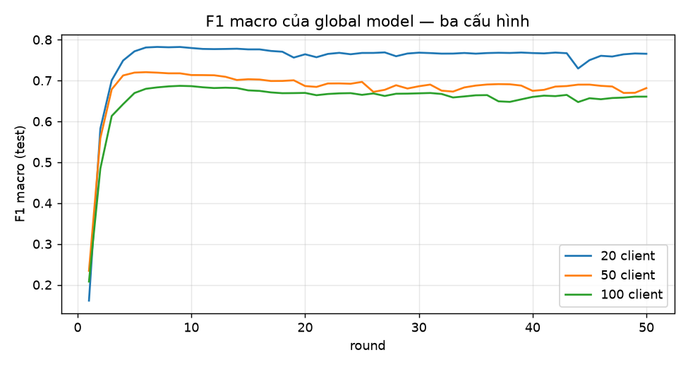
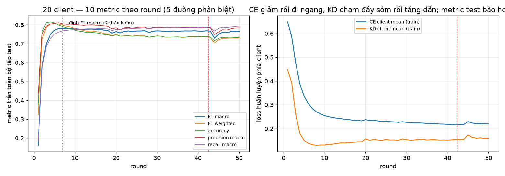
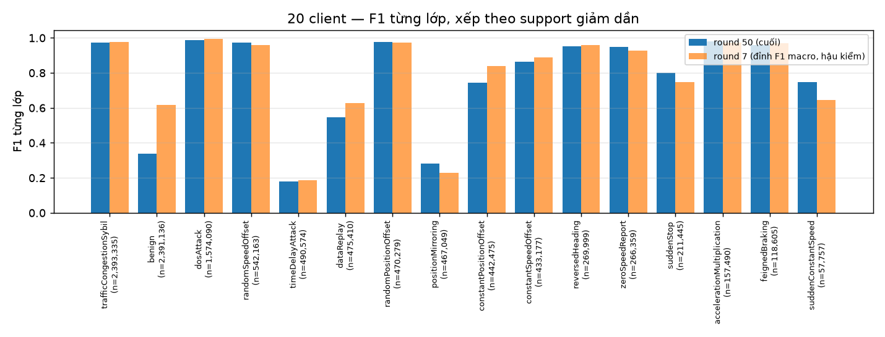
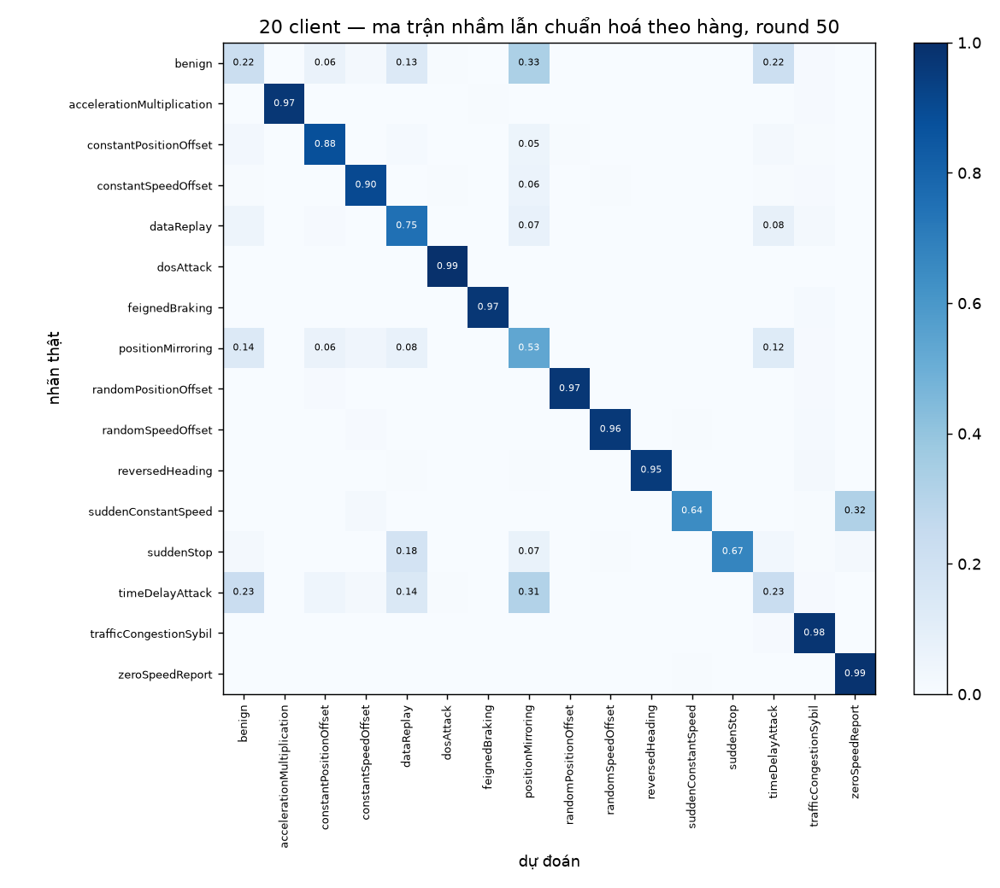
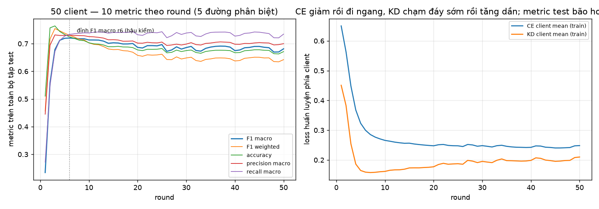
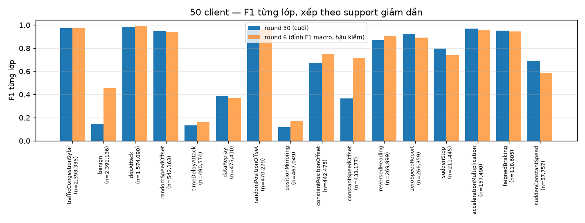
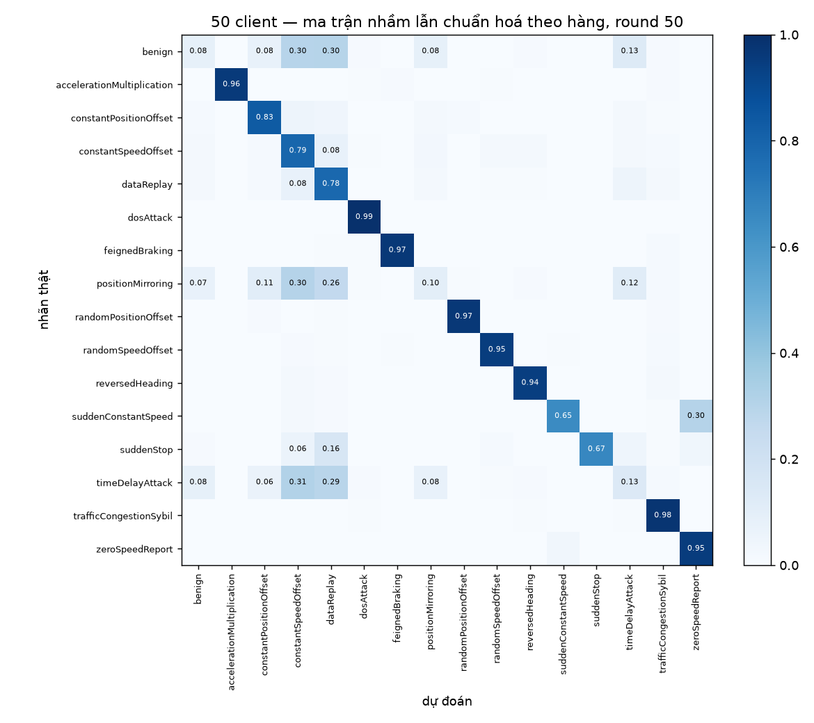
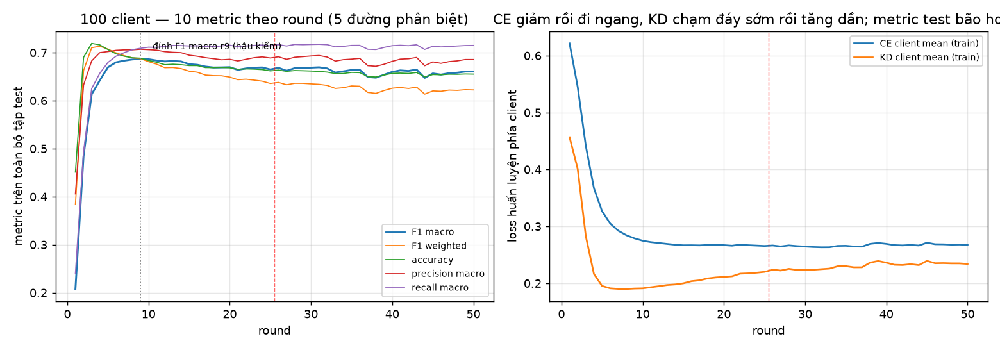
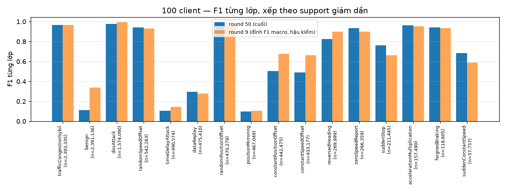
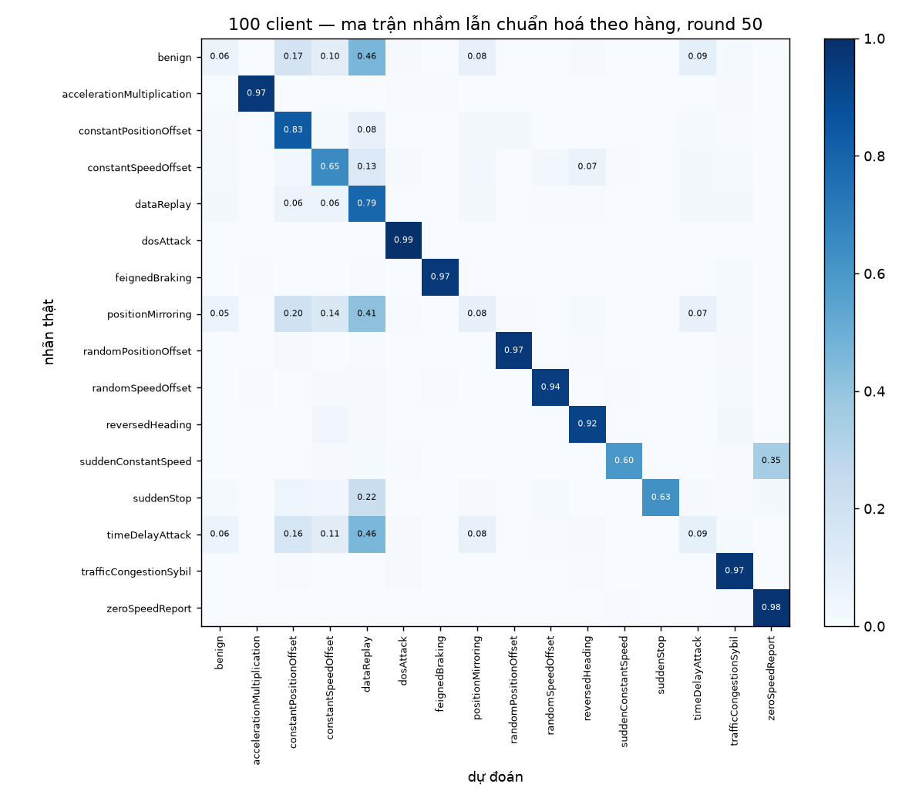

# Báo cáo tái dựng FD-IDS trên VeReMi NextGen với DAGSNet — HOÀN TẤT

Sinh tự động bởi `scripts/make_report.py` lúc 2026-09-11 09:55Z từ artifact đã pull và verify.
Không sửa tay; sửa generator rồi chạy lại. Ngữ cảnh đầy đủ: [`CONTEXT.md`](CONTEXT.md); mọi số đo kỹ thuật: [`TEST_LOG.md`](TEST_LOG.md).

## 0. Tóm tắt

| cấu hình | round | accuracy (round cuối) | F1 macro (round cuối) | F1 weighted (round cuối) | đỉnh F1 macro (hậu kiểm) | Σ `seconds` 50 round (không gồm startup) |
|---|---:|---:|---:|---:|---|---:|
| 20c | 50/50 | 0.7327 | 0.7655 | 0.7297 | 0.7822 @r7 | 7.22 h |
| 50c | 50/50 | 0.6714 | 0.6815 | 0.6423 | 0.7205 @r6 | 7.37 h |
| 100c | 50/50 | 0.6552 | 0.6606 | 0.6223 | 0.6870 @r9 | 10.54 h |

*Hình: F1 macro của global model theo round, các cấu hình đã có. Điều cần thấy: mọi đường bão hoà trước round 10 (đỉnh ở round 6–9) rồi giữ một plateau nhiễu thấp hơn đỉnh; mức plateau (trung bình 10 round cuối): 20c ≈ 0.76 (đỉnh 0.7822 @r7); 50c ≈ 0.68 (đỉnh 0.7205 @r6); 100c ≈ 0.66 (đỉnh 0.6870 @r9) — nhiều client hơn, plateau thấp hơn, đơn điệu.*

**Đọc số thế nào.** Headline là **round cuối** (round 50), đúng lịch 50 round đã chốt. Round đỉnh là quan sát hậu kiểm
trên tập test — không có tập validation, nên không được chọn checkpoint theo nó. Dữ liệu mất cân bằng 41:1 ⇒ đọc
**F1 macro**, không đọc accuracy (§3). Không đặt số của bản này cạnh số của bài báo (§7): khác dữ liệu, số lớp, số
client, bộ metric.

## 1. Đối tượng tái dựng và nguồn gốc

| hạng mục | giá trị |
|---|---|
| Bài báo | Peng, Xiao, Wu — *FD-IDS: A Federated Learning and Knowledge Distillation-Based Intrusion Detection System for Non-IID IoT Environments*, **Sensors 2025, 25, 4309** ([`sensors-25-04309.md`](sensors-25-04309.md)) |
| Phương pháp lấy từ bài báo | FedProx + knowledge distillation **round-wise** (Algorithm 1, Eq. 2–6): L = λ·CE + (1−λ)·T²·KL(teacher‖student) + β·(μ/2)‖w−w_G‖²; Adam lr 0,001, μ = 0,01, λ = 0,5, β = 0,1, T = 3 (Table 3); toàn bộ client mỗi round |
| Dữ liệu | VeReMi NextGen, phân mảnh Dirichlet α = 0,5: `odixe0502/veremi-fl-{20,50,100}client` (train) + `odixe0502/veremi-nextgen2026-centralized` (test), 66 đặc trưng `f_*` đã z-score, 16 lớp ([`knowledge/DATASET.md`](knowledge/DATASET.md)) |
| Bộ phân loại | **DAGSNet**, 395.024 tham số ([`knowledge/ARCHITECTURE.md`](knowledge/ARCHITECTURE.md)) thay cho DNN 5 lớp 22.095 tham số của bài báo |
| Phần cứng | Kaggle 2 × Tesla T4 (sm_75, 14,6 GB), 4 vCPU; image `sha256:37c64f7dd9c5…`; torch 2.10.0+cu128, CUDA 12.8; mỗi worker một GPU, mỗi client train tuần tự trên một GPU, không DDP |
| Kế hoạch | 3 cấu hình × 50 round × 1 epoch local; batch 512/512/256 (20c/50c/100c); seed 42; fp16 AMP; `torch.compile` chứng nhận trên T4 (`compile OK`, `max|Δlogit| ≤ 9,8e-04`) |
| Kernel / phiên | xem bảng phiên ở từng mục; mỗi phiên là một kernel Kaggle riêng, tiếp nối qua checkpoint đã verify (§9) |

### 1.1 Cái gì giữ theo bài báo, cái gì lệch — phải đọc cùng mọi con số

| hạng mục | bài báo | bản này | vì sao |
|---|---|---|---|
| Bộ phân loại | DNN 5 lớp 32-64-128-64-32 | **DAGSNet** 395.024 tham số | chủ dự án chỉ định |
| Dữ liệu | Edge-IIoT / N-BaIoT | **VeReMi NextGen**, 16 lớp, 66 đặc trưng | chủ dự án chỉ định |
| Số client | 9 | **20 / 50 / 100** | chủ dự án chỉ định |
| Non-IID | Dirichlet θ = 1 và 0,1 | **α = 0,5 cố định** | phân mảnh dựng sẵn |
| Round × epoch | 40 × 2 | **50 × 1** | ngân sách quota; lr hằng nên số round không đổi trọng số từng round |
| Batch | 128 | **512 / 512 / 256** | batch 128 ≈ 75 h/cấu hình, vượt quota |
| Tiền xử lý | one-hot + chọn top-k đặc trưng bằng MI | **không** — dùng đủ 66 cột đã z-score | dữ liệu giao ở trạng thái đã xử lý |
| Metric | Accuracy/Precision/Recall/F1 + FPR/FNR nhị phân | **10 metric đa lớp** (§2), không FPR/FNR | chưa chốt quy ước nhị phân hoá 16 lớp |
| Đánh giá client (cột B/W Table 5) | có | **không** — chỉ global model | FD-IDS không cá thể hoá: client bị ghi đè bằng `w_G` mỗi round, nên "model tại các client" chính là global model |
| Adam state | không nói | reset mỗi client, mỗi round | lựa chọn triển khai, công bố |
| BatchNorm dưới FedAvg | DNN của bài báo không có BN | trung bình cả running stats theo n_k/N | hệ quả của việc đổi bộ phân loại (§8) |

## 2. Mười metric — định nghĩa và thứ tự cột

`accuracy`, `precision_macro`, `precision_micro`, `precision_weighted`, `recall_macro`, `recall_micro`, `recall_weighted`,
`f1_macro`, `f1_micro`, `f1_weighted` — tính từ **một** ma trận nhầm lẫn 16×16 trên toàn bộ tập test sau mỗi round
(hai worker đánh giá hai nửa rời nhau, cộng số nguyên). Macro: trung bình đều 16 lớp; micro: gộp TP/FP/FN toàn cục;
weighted: trọng số n_c/N. Vì mỗi dòng có đúng một dự đoán, Σ_c FP_c = Σ_c FN_c ⇒ precision_micro = recall_micro = f1_micro
= accuracy, và recall_weighted = accuracy. Định nghĩa và code: `papers/fd-ids-2025/proj/metrics.py`; dựng lại độc lập từ
`preds/` và `confusion/` bởi `scripts/verify_run.py` (đã pass cho mọi run trong báo cáo).

## 3. Dữ liệu và caveat bắt buộc

Train 43,045,415 dòng / test 10,761,343 dòng; 16 lớp; mất cân bằng **41:1** (`trafficCongestionSybil` 2.393.335 dòng
test so với `suddenConstantSpeed` 57.757). Từ [`knowledge/DATASET.md`](knowledge/DATASET.md) §6, phải đọc cùng mọi bảng ở đây:

1. Split theo **thời gian mô phỏng**, không theo xe; test chỉ có scenario `highway_7`/`urban_7`.
2. `benign` lấy từ luồng không có tấn công ⇒ nhóm đặc trưng `rate` mạnh bất thường.
3. 3.338.358 dòng nhập nhằng đã bị loại từ nguồn.
4. **Rò rỉ Sybil:** 100 % dòng `trafficCongestionSybil` nằm trong flow mà mọi dòng cùng nhãn — lớp lớn nhất dễ bất thường.
5. Mất cân bằng 41:1 ⇒ đọc F1 macro, không đọc accuracy.
6. Client = receiver unit, phân hoạch là mô phỏng non-IID, không phải triển khai thật.
7. **`scaler.json` fit trên toàn bộ 43 M dòng train** — thống kê toàn cục mà client FL thật không có; rò rỉ có trước bản này.
8. Test không chia theo client: điểm đo khả năng tổng quát hoá toàn cục của global model.
9. Đặc trưng lưu fp16 (đã lượng tử hoá), lựa chọn có chủ ý.
10. Một run, một seed. Chưa có replication.

## 4. 20 client — `fdids_20c_v2`

**Kết quả headline = round cuối 50:** accuracy **0.7327**, F1 macro **0.7655**,
F1 weighted **0.7297** (precision macro 0.7837, recall macro 0.7887).
Quan sát hậu kiểm, *không phải* checkpoint được chọn: F1 macro đạt đỉnh **0.7822 ở round 7**,
accuracy đạt đỉnh 0.8161 ở round 4; trung bình F1 macro 10 round cuối 0.7596.

| phiên | kernel / version | thời gian (UTC) | round sản xuất | tổng `seconds` của các round |
|---:|---|---|---|---:|
| 1 | `minhtrit06/fd-ids-veremi-20-clients` v3 | 2026-09-10 17:49Z → 23:58Z | 1–42 (42) | 6.08 h |
| 2 | `minhtriethihi/fd-ids-veremi-20-clients` v1 | 2026-09-11 01:46Z → 02:59Z | 43–50 (8) | 1.13 h |

Nguồn: `papers/fd-ids-2025/runs/fdids_20c_v2/logs/sessions.json` (round nào do phiên nào sinh ra, đã kiểm bytes giống hệt trên phần chồng lấn khi merge), `history.csv`.
Cấu hình hiệu lực (từ `reports/manifest.json`): n_clients=20, batch=512, rounds=50×1 epoch,
lr=0.001, μ=0.01, λ=0.5, β=0.1, T=3.0, clip=1.0, seed=42, dropout=0.1,
world_size=2, compile=True; fingerprint `5f74ba70f2c0af90`, data_id `29f492a531052d2b`, content_id `3aa70a5c51aacd51`;
torch 2.10.0+cu128, CUDA 12.8.

*Hình: trái — năm metric phân biệt được của global model trên toàn bộ tập test theo round (đường chấm xám: round đỉnh F1 macro, hậu kiểm; đường đứt đỏ: ranh giới phiên Kaggle); phải — loss huấn luyện trung bình phía client. Điều cần thấy: CE train giảm rồi đi ngang ở mức thấp (cực tiểu 0.2177 @r41, round cuối 0.2196); số hạng KD chạm cực tiểu sớm (0.1298 @r8) rồi tăng dần tới 0.1585 — teacher (global model round trước) và student cách nhau dần; trong khi đó metric test bão hoà từ round 7 và accuracy/F1 weighted đi xuống.*

### 4.1 Đủ 10 metric của global model, 50 round

Global model là mô hình duy nhất tồn tại qua ranh giới round (Algorithm 1: mỗi client bị ghi đè bằng
`w_G` đầu round), nên đây là bảng của "một mô hình đại diện". Đánh giá trên **toàn bộ 10,761,343 dòng test**
sau mỗi round. Trong phân loại đơn nhãn đa lớp, **accuracy = precision_micro = recall_micro = recall_weighted = f1_micro**
(Σ FP = Σ FN); bốn cột trùng nhau là đúng, không phải lỗi — đã kiểm bằng máy cho từng round. Các metric thật sự
phân biệt mô hình trên dữ liệu mất cân bằng 41:1 là **f1_macro** và **f1_weighted**.

| round | accuracy | precision_macro | precision_micro | precision_weighted | recall_macro | recall_micro | recall_weighted | f1_macro | f1_micro | f1_weighted |
|---:|---:|---:|---:|---:|---:|---:|---:|---:|---:|---:|
| 1 | 0.3775 | 0.4318 | 0.3775 | 0.5559 | 0.1817 | 0.3775 | 0.3775 | 0.1612 | 0.3775 | 0.3232 |
| 2 | 0.7653 | 0.7532 | 0.7653 | 0.7539 | 0.5761 | 0.7653 | 0.7653 | 0.5823 | 0.7653 | 0.7252 |
| 3 | 0.8123 | 0.7933 | 0.8123 | 0.7930 | 0.6863 | 0.8123 | 0.8123 | 0.7007 | 0.8123 | 0.7873 |
| 4 | 0.8161 | 0.8046 | 0.8161 | 0.8068 | 0.7273 | 0.8161 | 0.8161 | 0.7490 | 0.8161 | 0.8032 |
| 5 | 0.8112 | 0.8084 | 0.8112 | 0.8118 | 0.7505 | 0.8112 | 0.8112 | 0.7715 | 0.8112 | 0.8083 |
| 6 | 0.7979 | 0.8117 | 0.7979 | 0.8130 | 0.7620 | 0.7979 | 0.7979 | 0.7809 | 0.7979 | 0.8034 |
| 7 | 0.7906 | 0.8059 | 0.7906 | 0.8097 | 0.7685 | 0.7906 | 0.7906 | 0.7822 | 0.7906 | 0.7975 |
| 8 | 0.7838 | 0.8022 | 0.7838 | 0.8074 | 0.7709 | 0.7838 | 0.7838 | 0.7814 | 0.7838 | 0.7920 |
| 9 | 0.7790 | 0.8031 | 0.7790 | 0.8064 | 0.7737 | 0.7790 | 0.7790 | 0.7822 | 0.7790 | 0.7877 |
| 10 | 0.7715 | 0.8005 | 0.7715 | 0.8046 | 0.7751 | 0.7715 | 0.7715 | 0.7796 | 0.7715 | 0.7801 |
| 11 | 0.7667 | 0.7993 | 0.7667 | 0.8022 | 0.7749 | 0.7667 | 0.7667 | 0.7774 | 0.7667 | 0.7745 |
| 12 | 0.7637 | 0.7968 | 0.7637 | 0.8017 | 0.7778 | 0.7637 | 0.7637 | 0.7769 | 0.7637 | 0.7708 |
| 13 | 0.7586 | 0.7986 | 0.7586 | 0.8023 | 0.7791 | 0.7586 | 0.7586 | 0.7773 | 0.7586 | 0.7662 |
| 14 | 0.7601 | 0.7997 | 0.7601 | 0.8019 | 0.7790 | 0.7601 | 0.7601 | 0.7778 | 0.7601 | 0.7677 |
| 15 | 0.7581 | 0.7976 | 0.7581 | 0.8004 | 0.7790 | 0.7581 | 0.7581 | 0.7762 | 0.7581 | 0.7650 |
| 16 | 0.7549 | 0.7965 | 0.7549 | 0.8000 | 0.7807 | 0.7549 | 0.7549 | 0.7763 | 0.7549 | 0.7615 |
| 17 | 0.7491 | 0.7944 | 0.7491 | 0.7979 | 0.7793 | 0.7491 | 0.7491 | 0.7724 | 0.7491 | 0.7539 |
| 18 | 0.7481 | 0.7920 | 0.7481 | 0.7963 | 0.7788 | 0.7481 | 0.7481 | 0.7705 | 0.7481 | 0.7525 |
| 19 | 0.7409 | 0.7788 | 0.7409 | 0.7884 | 0.7698 | 0.7409 | 0.7409 | 0.7562 | 0.7409 | 0.7425 |
| 20 | 0.7470 | 0.7841 | 0.7470 | 0.7917 | 0.7755 | 0.7470 | 0.7470 | 0.7643 | 0.7470 | 0.7499 |
| 21 | 0.7406 | 0.7741 | 0.7406 | 0.7864 | 0.7742 | 0.7406 | 0.7406 | 0.7571 | 0.7406 | 0.7400 |
| 22 | 0.7413 | 0.7839 | 0.7413 | 0.7930 | 0.7804 | 0.7413 | 0.7413 | 0.7651 | 0.7413 | 0.7420 |
| 23 | 0.7420 | 0.7864 | 0.7420 | 0.7947 | 0.7822 | 0.7420 | 0.7420 | 0.7678 | 0.7420 | 0.7440 |
| 24 | 0.7396 | 0.7819 | 0.7396 | 0.7923 | 0.7806 | 0.7396 | 0.7396 | 0.7643 | 0.7396 | 0.7405 |
| 25 | 0.7416 | 0.7863 | 0.7416 | 0.7949 | 0.7817 | 0.7416 | 0.7416 | 0.7675 | 0.7416 | 0.7437 |
| 26 | 0.7401 | 0.7874 | 0.7401 | 0.7958 | 0.7822 | 0.7401 | 0.7401 | 0.7676 | 0.7401 | 0.7421 |
| 27 | 0.7402 | 0.7881 | 0.7402 | 0.7957 | 0.7837 | 0.7402 | 0.7402 | 0.7689 | 0.7402 | 0.7420 |
| 28 | 0.7352 | 0.7791 | 0.7352 | 0.7912 | 0.7789 | 0.7352 | 0.7352 | 0.7595 | 0.7352 | 0.7341 |
| 29 | 0.7374 | 0.7859 | 0.7374 | 0.7946 | 0.7829 | 0.7374 | 0.7374 | 0.7661 | 0.7374 | 0.7379 |
| 30 | 0.7412 | 0.7858 | 0.7412 | 0.7943 | 0.7844 | 0.7412 | 0.7412 | 0.7682 | 0.7412 | 0.7419 |
| 31 | 0.7396 | 0.7862 | 0.7396 | 0.7945 | 0.7837 | 0.7396 | 0.7396 | 0.7672 | 0.7396 | 0.7401 |
| 32 | 0.7351 | 0.7845 | 0.7351 | 0.7946 | 0.7849 | 0.7351 | 0.7351 | 0.7659 | 0.7351 | 0.7346 |
| 33 | 0.7353 | 0.7856 | 0.7353 | 0.7947 | 0.7849 | 0.7353 | 0.7353 | 0.7660 | 0.7353 | 0.7344 |
| 34 | 0.7357 | 0.7866 | 0.7357 | 0.7967 | 0.7863 | 0.7357 | 0.7357 | 0.7674 | 0.7357 | 0.7351 |
| 35 | 0.7363 | 0.7846 | 0.7363 | 0.7956 | 0.7847 | 0.7363 | 0.7363 | 0.7658 | 0.7363 | 0.7362 |
| 36 | 0.7351 | 0.7852 | 0.7351 | 0.7964 | 0.7878 | 0.7351 | 0.7351 | 0.7673 | 0.7351 | 0.7336 |
| 37 | 0.7352 | 0.7853 | 0.7352 | 0.7960 | 0.7883 | 0.7352 | 0.7352 | 0.7680 | 0.7352 | 0.7343 |
| 38 | 0.7377 | 0.7852 | 0.7377 | 0.7960 | 0.7867 | 0.7377 | 0.7377 | 0.7675 | 0.7377 | 0.7373 |
| 39 | 0.7375 | 0.7854 | 0.7375 | 0.7966 | 0.7879 | 0.7375 | 0.7375 | 0.7685 | 0.7375 | 0.7375 |
| 40 | 0.7368 | 0.7843 | 0.7368 | 0.7960 | 0.7875 | 0.7368 | 0.7368 | 0.7673 | 0.7368 | 0.7363 |
| 41 | 0.7386 | 0.7838 | 0.7386 | 0.7968 | 0.7859 | 0.7386 | 0.7386 | 0.7665 | 0.7386 | 0.7385 |
| 42 | 0.7386 | 0.7868 | 0.7386 | 0.7972 | 0.7872 | 0.7386 | 0.7386 | 0.7684 | 0.7386 | 0.7381 |
| 43 | 0.7355 | 0.7848 | 0.7355 | 0.7965 | 0.7880 | 0.7355 | 0.7355 | 0.7669 | 0.7355 | 0.7333 |
| 44 | 0.7163 | 0.7490 | 0.7163 | 0.7769 | 0.7669 | 0.7163 | 0.7163 | 0.7294 | 0.7163 | 0.7043 |
| 45 | 0.7289 | 0.7628 | 0.7289 | 0.7840 | 0.7812 | 0.7289 | 0.7289 | 0.7499 | 0.7289 | 0.7210 |
| 46 | 0.7336 | 0.7742 | 0.7336 | 0.7911 | 0.7873 | 0.7336 | 0.7336 | 0.7606 | 0.7336 | 0.7286 |
| 47 | 0.7336 | 0.7727 | 0.7336 | 0.7902 | 0.7856 | 0.7336 | 0.7336 | 0.7588 | 0.7336 | 0.7286 |
| 48 | 0.7345 | 0.7791 | 0.7345 | 0.7945 | 0.7887 | 0.7345 | 0.7345 | 0.7641 | 0.7345 | 0.7309 |
| 49 | 0.7331 | 0.7832 | 0.7331 | 0.7973 | 0.7902 | 0.7331 | 0.7331 | 0.7662 | 0.7331 | 0.7298 |
| 50 | 0.7327 | 0.7837 | 0.7327 | 0.7971 | 0.7887 | 0.7327 | 0.7327 | 0.7655 | 0.7327 | 0.7297 |

Nguồn: `papers/fd-ids-2025/runs/fdids_20c_v2/history.csv`, đối chiếu từng giá trị với `metrics/round_NNN.json` và ma trận nhầm lẫn `confusion/round_NNN.npy` (tổng = 10,761,343) trước khi làm tròn 4 chữ số.

### 4.2 Số liệu vận hành theo round

| round | phiên | ce_client_mean | kd_client_mean | grad_norm | skipped/steps | teacher_sec | seconds |
|---:|---:|---:|---:|---:|---:|---:|---:|
| 1 | 1 | 0.6491 | 0.4474 | 0.391 | 5/84083 | 226 | 520.3 |
| 2 | 1 | 0.5862 | 0.3920 | 0.399 | 10/84083 | 230 | 521.9 |
| 3 | 1 | 0.4730 | 0.2565 | 0.455 | 18/84083 | 230 | 521.8 |
| 4 | 1 | 0.3862 | 0.1784 | 0.484 | 24/84083 | 230 | 523.2 |
| 5 | 1 | 0.3374 | 0.1511 | 0.496 | 32/84083 | 230 | 522.8 |
| 6 | 1 | 0.3064 | 0.1383 | 0.488 | 37/84083 | 230 | 523.0 |
| 7 | 1 | 0.2847 | 0.1321 | 0.471 | 40/84083 | 229 | 522.0 |
| 8 | 1 | 0.2706 | 0.1298 | 0.446 | 38/84083 | 230 | 521.9 |
| 9 | 1 | 0.2622 | 0.1310 | 0.427 | 31/84083 | 230 | 521.8 |
| 10 | 1 | 0.2546 | 0.1309 | 0.417 | 32/84083 | 230 | 521.8 |
| 11 | 1 | 0.2499 | 0.1333 | 0.405 | 36/84083 | 230 | 522.0 |
| 12 | 1 | 0.2463 | 0.1345 | 0.394 | 32/84083 | 230 | 524.1 |
| 13 | 1 | 0.2439 | 0.1377 | 0.388 | 33/84083 | 231 | 522.0 |
| 14 | 1 | 0.2420 | 0.1397 | 0.379 | 34/84083 | 229 | 520.5 |
| 15 | 1 | 0.2392 | 0.1394 | 0.371 | 31/84083 | 230 | 521.4 |
| 16 | 1 | 0.2374 | 0.1412 | 0.365 | 33/84083 | 229 | 521.2 |
| 17 | 1 | 0.2353 | 0.1421 | 0.358 | 28/84083 | 229 | 522.1 |
| 18 | 1 | 0.2345 | 0.1446 | 0.356 | 30/84083 | 232 | 521.8 |
| 19 | 1 | 0.2324 | 0.1446 | 0.353 | 25/84083 | 230 | 523.1 |
| 20 | 1 | 0.2379 | 0.1567 | 0.347 | 26/84083 | 232 | 522.0 |
| 21 | 1 | 0.2341 | 0.1511 | 0.337 | 27/84083 | 229 | 520.7 |
| 22 | 1 | 0.2352 | 0.1545 | 0.333 | 24/84083 | 230 | 521.2 |
| 23 | 1 | 0.2324 | 0.1523 | 0.330 | 27/84083 | 229 | 520.9 |
| 24 | 1 | 0.2301 | 0.1507 | 0.325 | 25/84083 | 229 | 521.5 |
| 25 | 1 | 0.2315 | 0.1544 | 0.322 | 23/84083 | 230 | 521.8 |
| 26 | 1 | 0.2290 | 0.1522 | 0.316 | 21/84083 | 229 | 521.2 |
| 27 | 1 | 0.2282 | 0.1525 | 0.319 | 27/84083 | 229 | 520.7 |
| 28 | 1 | 0.2264 | 0.1509 | 0.314 | 24/84083 | 229 | 521.2 |
| 29 | 1 | 0.2290 | 0.1565 | 0.312 | 24/84083 | 229 | 521.0 |
| 30 | 1 | 0.2264 | 0.1535 | 0.307 | 22/84083 | 229 | 521.1 |
| 31 | 1 | 0.2243 | 0.1515 | 0.308 | 24/84083 | 229 | 521.0 |
| 32 | 1 | 0.2239 | 0.1526 | 0.305 | 22/84083 | 229 | 521.0 |
| 33 | 1 | 0.2239 | 0.1544 | 0.303 | 26/84083 | 229 | 520.5 |
| 34 | 1 | 0.2232 | 0.1547 | 0.303 | 25/84083 | 229 | 521.0 |
| 35 | 1 | 0.2214 | 0.1523 | 0.300 | 26/84083 | 229 | 520.4 |
| 36 | 1 | 0.2215 | 0.1534 | 0.298 | 24/84083 | 229 | 522.4 |
| 37 | 1 | 0.2205 | 0.1535 | 0.296 | 25/84083 | 231 | 521.6 |
| 38 | 1 | 0.2193 | 0.1520 | 0.297 | 24/84083 | 230 | 521.6 |
| 39 | 1 | 0.2190 | 0.1525 | 0.293 | 19/84083 | 230 | 521.3 |
| 40 | 1 | 0.2182 | 0.1521 | 0.293 | 19/84083 | 229 | 520.2 |
| 41 | 1 | 0.2177 | 0.1528 | 0.292 | 26/84083 | 229 | 520.0 |
| 42 | 1 | 0.2184 | 0.1545 | 0.291 | 25/84083 | 229 | 520.2 |
| 43 | 2 | 0.2178 | 0.1538 | 0.287 | 24/84083 | 224 | 509.0 |
| 44 | 2 | 0.2183 | 0.1559 | 0.286 | 27/84083 | 226 | 510.1 |
| 45 | 2 | 0.2293 | 0.1731 | 0.287 | 21/84083 | 226 | 510.1 |
| 46 | 2 | 0.2235 | 0.1632 | 0.281 | 25/84083 | 226 | 510.2 |
| 47 | 2 | 0.2206 | 0.1595 | 0.279 | 22/84083 | 226 | 510.2 |
| 48 | 2 | 0.2214 | 0.1613 | 0.280 | 23/84083 | 226 | 510.1 |
| 49 | 2 | 0.2200 | 0.1589 | 0.277 | 22/84083 | 225 | 509.7 |
| 50 | 2 | 0.2196 | 0.1585 | 0.277 | 23/84083 | 226 | 510.1 |

`skipped` = số bước bị GradScaler bỏ qua vì overflow fp16 (cộng dồn qua mọi client trong round); `seconds` gồm train + teacher + eval + ghi artifact + W&B.

### 4.3 Từng lớp ở round cuối 50

*Hình: F1 từng lớp ở round cuối (đậm) và ở round đỉnh 7 (nhạt), xếp theo support giảm dần. Điều cần thấy (ΔF1 = cuối − đỉnh, tính từ artifact): mất nhiều nhất `benign` (-0.282), `constantPositionOffset` (-0.096), `dataReplay` (-0.081); được nhiều nhất `suddenConstantSpeed` (+0.101), `suddenStop` (+0.054), `positionMirroring` (+0.052). `benign` — lớp lớn thứ hai — là nơi mất lớn nhất hoặc nhì: recall `benign` 0.5771 ở round 7 → **0.2216** ở round 50, precision 0.7021: global model ngày càng gán lưu lượng lành tính thành tấn công (tỉ lệ báo động giả tăng), đổi lấy recall ở các lớp hiếm.*

| lớp | support | precision | recall | f1 |
|---|---:|---:|---:|---:|
| `trafficCongestionSybil` | 2,393,335 | 0.9678 | 0.9802 | 0.9739 |
| `benign` | 2,391,136 | 0.7021 | 0.2216 | 0.3368 |
| `dosAttack` | 1,574,090 | 0.9841 | 0.9941 | 0.9891 |
| `randomSpeedOffset` | 542,163 | 0.9833 | 0.9617 | 0.9724 |
| `timeDelayAttack` | 490,574 | 0.1474 | 0.2315 | 0.1801 |
| `dataReplay` | 475,410 | 0.4288 | 0.7529 | 0.5464 |
| `randomPositionOffset` | 470,279 | 0.9846 | 0.9707 | 0.9776 |
| `positionMirroring` | 467,049 | 0.1919 | 0.5340 | 0.2823 |
| `constantPositionOffset` | 442,475 | 0.6439 | 0.8759 | 0.7422 |
| `constantSpeedOffset` | 433,177 | 0.8270 | 0.9017 | 0.8628 |
| `reversedHeading` | 269,999 | 0.9482 | 0.9540 | 0.9511 |
| `zeroSpeedReport` | 266,359 | 0.9138 | 0.9855 | 0.9483 |
| `suddenStop` | 211,445 | 0.9952 | 0.6714 | 0.8019 |
| `accelerationMultiplication` | 157,490 | 0.9894 | 0.9688 | 0.9790 |
| `feignedBraking` | 118,605 | 0.9452 | 0.9703 | 0.9576 |
| `suddenConstantSpeed` | 57,757 | 0.8872 | 0.6447 | 0.7468 |

Lớp khó ở round 50 (F1 < 0,4): `timeDelayAttack` (0.1801), `positionMirroring` (0.2823), `benign` (0.3368). `timeDelayAttack` cũng là lớp yếu nhất của DAGSNet centralized (`knowledge/ARCHITECTURE.md` §8: F1 0,2281, 76 % bị gán thành `benign`); `benign` khó ở đây vì cơ chế báo động giả nói trên.

*Hình: ma trận nhầm lẫn round 50 chuẩn hoá theo hàng (mỗi hàng = một lớp thật, tổng 1). Điều cần thấy: hàng `benign` trải sang các cột tấn công — recall `benign` chỉ 0.2216 trên 2,391,136 dòng; vì `benign` chiếm 22 % tập test, riêng nó kéo accuracy và F1 weighted xuống trong khi F1 macro (mỗi lớp nặng như nhau) gần như giữ nguyên. `trafficCongestionSybil` (F1 0.9739) ổn định nhưng nhớ caveat rò rỉ Sybil (§3).*

## 5. 50 client — `fdids_50c_v2`

**Kết quả headline = round cuối 50:** accuracy **0.6714**, F1 macro **0.6815**,
F1 weighted **0.6423** (precision macro 0.7000, recall macro 0.7345).
Quan sát hậu kiểm, *không phải* checkpoint được chọn: F1 macro đạt đỉnh **0.7205 ở round 6**,
accuracy đạt đỉnh 0.7642 ở round 3; trung bình F1 macro 10 round cuối 0.6822.

| phiên | kernel / version | thời gian (UTC) | round sản xuất | tổng `seconds` của các round |
|---:|---|---|---|---:|
| 1 | `khanhmay0304/fd-ids-veremi-50-clients` v3 | 2026-09-10 17:50Z → 2026-09-11 01:16Z | 1–50 (50) | 7.37 h |

Nguồn: `papers/fd-ids-2025/runs/fdids_50c_v2/logs/sessions.json` (round nào do phiên nào sinh ra, đã kiểm bytes giống hệt trên phần chồng lấn khi merge), `history.csv`.
Cấu hình hiệu lực (từ `reports/manifest.json`): n_clients=50, batch=512, rounds=50×1 epoch,
lr=0.001, μ=0.01, λ=0.5, β=0.1, T=3.0, clip=1.0, seed=42, dropout=0.1,
world_size=2, compile=True; fingerprint `fe7a1e77b5df2b66`, data_id `c9b541a243f82282`, content_id `fe175b442db619fe`;
torch 2.10.0+cu128, CUDA 12.8.

*Hình: trái — năm metric phân biệt được của global model trên toàn bộ tập test theo round (đường chấm xám: round đỉnh F1 macro, hậu kiểm; đường đứt đỏ: ranh giới phiên Kaggle); phải — loss huấn luyện trung bình phía client. Điều cần thấy: CE train giảm rồi đi ngang ở mức thấp (cực tiểu 0.2403 @r45, round cuối 0.2482); số hạng KD chạm cực tiểu sớm (0.1577 @r7) rồi tăng dần tới 0.2099 — teacher (global model round trước) và student cách nhau dần; trong khi đó metric test bão hoà từ round 6 và accuracy/F1 weighted đi xuống.*

### 5.1 Đủ 10 metric của global model, 50 round

Global model là mô hình duy nhất tồn tại qua ranh giới round (Algorithm 1: mỗi client bị ghi đè bằng
`w_G` đầu round), nên đây là bảng của "một mô hình đại diện". Đánh giá trên **toàn bộ 10,761,343 dòng test**
sau mỗi round. Trong phân loại đơn nhãn đa lớp, **accuracy = precision_micro = recall_micro = recall_weighted = f1_micro**
(Σ FP = Σ FN); bốn cột trùng nhau là đúng, không phải lỗi — đã kiểm bằng máy cho từng round. Các metric thật sự
phân biệt mô hình trên dữ liệu mất cân bằng 41:1 là **f1_macro** và **f1_weighted**.

| round | accuracy | precision_macro | precision_micro | precision_weighted | recall_macro | recall_micro | recall_weighted | f1_macro | f1_micro | f1_weighted |
|---:|---:|---:|---:|---:|---:|---:|---:|---:|---:|---:|
| 1 | 0.5102 | 0.4450 | 0.5102 | 0.5644 | 0.2718 | 0.5102 | 0.5102 | 0.2342 | 0.5102 | 0.4564 |
| 2 | 0.7572 | 0.6945 | 0.7572 | 0.7289 | 0.5489 | 0.7572 | 0.7572 | 0.5589 | 0.7572 | 0.7170 |
| 3 | 0.7642 | 0.7317 | 0.7642 | 0.7563 | 0.6712 | 0.7642 | 0.7642 | 0.6785 | 0.7642 | 0.7545 |
| 4 | 0.7439 | 0.7297 | 0.7439 | 0.7604 | 0.7119 | 0.7439 | 0.7439 | 0.7124 | 0.7439 | 0.7463 |
| 5 | 0.7330 | 0.7298 | 0.7330 | 0.7621 | 0.7272 | 0.7330 | 0.7330 | 0.7194 | 0.7330 | 0.7379 |
| 6 | 0.7247 | 0.7301 | 0.7247 | 0.7634 | 0.7335 | 0.7247 | 0.7247 | 0.7205 | 0.7247 | 0.7303 |
| 7 | 0.7190 | 0.7297 | 0.7190 | 0.7634 | 0.7359 | 0.7190 | 0.7190 | 0.7193 | 0.7190 | 0.7238 |
| 8 | 0.7125 | 0.7291 | 0.7125 | 0.7625 | 0.7372 | 0.7125 | 0.7125 | 0.7177 | 0.7125 | 0.7161 |
| 9 | 0.7108 | 0.7287 | 0.7108 | 0.7629 | 0.7390 | 0.7108 | 0.7108 | 0.7176 | 0.7108 | 0.7136 |
| 10 | 0.7031 | 0.7255 | 0.7031 | 0.7603 | 0.7387 | 0.7031 | 0.7031 | 0.7134 | 0.7031 | 0.7028 |
| 11 | 0.6995 | 0.7246 | 0.6995 | 0.7593 | 0.7414 | 0.6995 | 0.6995 | 0.7133 | 0.6995 | 0.6975 |
| 12 | 0.6984 | 0.7228 | 0.6984 | 0.7582 | 0.7424 | 0.6984 | 0.6984 | 0.7129 | 0.6984 | 0.6960 |
| 13 | 0.6952 | 0.7201 | 0.6952 | 0.7565 | 0.7414 | 0.6952 | 0.6952 | 0.7091 | 0.6952 | 0.6895 |
| 14 | 0.6891 | 0.7139 | 0.6891 | 0.7527 | 0.7379 | 0.6891 | 0.6891 | 0.7013 | 0.6891 | 0.6807 |
| 15 | 0.6890 | 0.7144 | 0.6890 | 0.7524 | 0.7405 | 0.6890 | 0.6890 | 0.7032 | 0.6890 | 0.6785 |
| 16 | 0.6904 | 0.7132 | 0.6904 | 0.7504 | 0.7402 | 0.6904 | 0.6904 | 0.7024 | 0.6904 | 0.6790 |
| 17 | 0.6881 | 0.7088 | 0.6881 | 0.7486 | 0.7407 | 0.6881 | 0.6881 | 0.6989 | 0.6881 | 0.6748 |
| 18 | 0.6879 | 0.7089 | 0.6879 | 0.7478 | 0.7410 | 0.6879 | 0.6879 | 0.6990 | 0.6879 | 0.6735 |
| 19 | 0.6858 | 0.7097 | 0.6858 | 0.7479 | 0.7441 | 0.6858 | 0.6858 | 0.7006 | 0.6858 | 0.6691 |
| 20 | 0.6774 | 0.7021 | 0.6774 | 0.7421 | 0.7323 | 0.6774 | 0.6774 | 0.6865 | 0.6774 | 0.6578 |
| 21 | 0.6748 | 0.7017 | 0.6748 | 0.7420 | 0.7299 | 0.6748 | 0.6748 | 0.6844 | 0.6748 | 0.6544 |
| 22 | 0.6798 | 0.7051 | 0.6798 | 0.7445 | 0.7384 | 0.6798 | 0.6798 | 0.6928 | 0.6798 | 0.6598 |
| 23 | 0.6795 | 0.7033 | 0.6795 | 0.7437 | 0.7404 | 0.6795 | 0.6795 | 0.6929 | 0.6795 | 0.6586 |
| 24 | 0.6799 | 0.7027 | 0.6799 | 0.7437 | 0.7394 | 0.6799 | 0.6799 | 0.6921 | 0.6799 | 0.6593 |
| 25 | 0.6826 | 0.7058 | 0.6826 | 0.7447 | 0.7432 | 0.6826 | 0.6826 | 0.6966 | 0.6826 | 0.6619 |
| 26 | 0.6669 | 0.6934 | 0.6669 | 0.7389 | 0.7216 | 0.6669 | 0.6669 | 0.6722 | 0.6669 | 0.6428 |
| 27 | 0.6686 | 0.6953 | 0.6686 | 0.7399 | 0.7286 | 0.6686 | 0.6686 | 0.6773 | 0.6686 | 0.6423 |
| 28 | 0.6768 | 0.6982 | 0.6768 | 0.7413 | 0.7403 | 0.6768 | 0.6768 | 0.6885 | 0.6768 | 0.6522 |
| 29 | 0.6715 | 0.6952 | 0.6715 | 0.7394 | 0.7333 | 0.6715 | 0.6715 | 0.6805 | 0.6715 | 0.6447 |
| 30 | 0.6750 | 0.6985 | 0.6750 | 0.7413 | 0.7384 | 0.6750 | 0.6750 | 0.6860 | 0.6750 | 0.6484 |
| 31 | 0.6771 | 0.7036 | 0.6771 | 0.7433 | 0.7407 | 0.6771 | 0.6771 | 0.6901 | 0.6771 | 0.6510 |
| 32 | 0.6680 | 0.6966 | 0.6680 | 0.7402 | 0.7280 | 0.6680 | 0.6680 | 0.6752 | 0.6680 | 0.6390 |
| 33 | 0.6653 | 0.6952 | 0.6653 | 0.7401 | 0.7260 | 0.6653 | 0.6653 | 0.6730 | 0.6653 | 0.6360 |
| 34 | 0.6719 | 0.7010 | 0.6719 | 0.7423 | 0.7352 | 0.6719 | 0.6719 | 0.6831 | 0.6719 | 0.6431 |
| 35 | 0.6743 | 0.7023 | 0.6743 | 0.7421 | 0.7405 | 0.6743 | 0.6743 | 0.6877 | 0.6743 | 0.6450 |
| 36 | 0.6761 | 0.7050 | 0.6761 | 0.7428 | 0.7416 | 0.6761 | 0.6761 | 0.6903 | 0.6761 | 0.6482 |
| 37 | 0.6763 | 0.7064 | 0.6763 | 0.7432 | 0.7419 | 0.6763 | 0.6763 | 0.6912 | 0.6763 | 0.6485 |
| 38 | 0.6760 | 0.7056 | 0.6760 | 0.7430 | 0.7420 | 0.6760 | 0.6760 | 0.6908 | 0.6760 | 0.6480 |
| 39 | 0.6748 | 0.7047 | 0.6748 | 0.7420 | 0.7398 | 0.6748 | 0.6748 | 0.6877 | 0.6748 | 0.6455 |
| 40 | 0.6673 | 0.6979 | 0.6673 | 0.7394 | 0.7273 | 0.6673 | 0.6673 | 0.6748 | 0.6673 | 0.6375 |
| 41 | 0.6679 | 0.6976 | 0.6679 | 0.7398 | 0.7299 | 0.6679 | 0.6679 | 0.6772 | 0.6679 | 0.6392 |
| 42 | 0.6745 | 0.7009 | 0.6745 | 0.7406 | 0.7373 | 0.6745 | 0.6745 | 0.6852 | 0.6745 | 0.6472 |
| 43 | 0.6758 | 0.7006 | 0.6758 | 0.7406 | 0.7386 | 0.6758 | 0.6758 | 0.6865 | 0.6758 | 0.6490 |
| 44 | 0.6778 | 0.7025 | 0.6778 | 0.7415 | 0.7423 | 0.6778 | 0.6778 | 0.6900 | 0.6778 | 0.6510 |
| 45 | 0.6779 | 0.7040 | 0.6779 | 0.7423 | 0.7415 | 0.6779 | 0.6779 | 0.6900 | 0.6779 | 0.6509 |
| 46 | 0.6762 | 0.7029 | 0.6762 | 0.7417 | 0.7390 | 0.6762 | 0.6762 | 0.6870 | 0.6762 | 0.6484 |
| 47 | 0.6757 | 0.7024 | 0.6757 | 0.7409 | 0.7365 | 0.6757 | 0.6757 | 0.6854 | 0.6757 | 0.6486 |
| 48 | 0.6638 | 0.6954 | 0.6638 | 0.7385 | 0.7214 | 0.6638 | 0.6638 | 0.6697 | 0.6638 | 0.6353 |
| 49 | 0.6630 | 0.6966 | 0.6630 | 0.7388 | 0.7211 | 0.6630 | 0.6630 | 0.6700 | 0.6630 | 0.6344 |
| 50 | 0.6714 | 0.7000 | 0.6714 | 0.7397 | 0.7345 | 0.6714 | 0.6714 | 0.6815 | 0.6714 | 0.6423 |

Nguồn: `papers/fd-ids-2025/runs/fdids_50c_v2/history.csv`, đối chiếu từng giá trị với `metrics/round_NNN.json` và ma trận nhầm lẫn `confusion/round_NNN.npy` (tổng = 10,761,343) trước khi làm tròn 4 chữ số.

### 5.2 Số liệu vận hành theo round

| round | phiên | ce_client_mean | kd_client_mean | grad_norm | skipped/steps | teacher_sec | seconds |
|---:|---:|---:|---:|---:|---:|---:|---:|
| 1 | 1 | 0.6502 | 0.4508 | 0.369 | 0/84098 | 235 | 532.0 |
| 2 | 1 | 0.5629 | 0.3825 | 0.363 | 0/84098 | 237 | 530.9 |
| 3 | 1 | 0.4483 | 0.2540 | 0.358 | 0/84098 | 237 | 531.1 |
| 4 | 1 | 0.3678 | 0.1862 | 0.359 | 0/84098 | 237 | 530.9 |
| 5 | 1 | 0.3232 | 0.1646 | 0.358 | 0/84098 | 236 | 530.2 |
| 6 | 1 | 0.2996 | 0.1591 | 0.353 | 0/84098 | 237 | 530.8 |
| 7 | 1 | 0.2853 | 0.1577 | 0.345 | 0/84098 | 237 | 530.8 |
| 8 | 1 | 0.2766 | 0.1586 | 0.338 | 0/84098 | 237 | 531.2 |
| 9 | 1 | 0.2706 | 0.1604 | 0.331 | 1/84098 | 237 | 530.0 |
| 10 | 1 | 0.2657 | 0.1616 | 0.325 | 0/84098 | 237 | 530.3 |
| 11 | 1 | 0.2630 | 0.1653 | 0.320 | 0/84098 | 237 | 530.3 |
| 12 | 1 | 0.2599 | 0.1667 | 0.316 | 0/84098 | 237 | 530.6 |
| 13 | 1 | 0.2577 | 0.1670 | 0.311 | 0/84098 | 237 | 530.0 |
| 14 | 1 | 0.2560 | 0.1690 | 0.307 | 1/84098 | 237 | 529.3 |
| 15 | 1 | 0.2564 | 0.1732 | 0.304 | 0/84098 | 236 | 529.9 |
| 16 | 1 | 0.2536 | 0.1735 | 0.300 | 0/84098 | 236 | 528.7 |
| 17 | 1 | 0.2518 | 0.1735 | 0.296 | 0/84098 | 237 | 529.0 |
| 18 | 1 | 0.2501 | 0.1746 | 0.294 | 0/84098 | 237 | 529.5 |
| 19 | 1 | 0.2488 | 0.1754 | 0.291 | 2/84098 | 236 | 528.5 |
| 20 | 1 | 0.2476 | 0.1771 | 0.289 | 1/84098 | 237 | 529.1 |
| 21 | 1 | 0.2511 | 0.1848 | 0.287 | 0/84098 | 236 | 529.3 |
| 22 | 1 | 0.2520 | 0.1887 | 0.285 | 0/84098 | 236 | 529.1 |
| 23 | 1 | 0.2489 | 0.1856 | 0.282 | 3/84098 | 236 | 529.6 |
| 24 | 1 | 0.2478 | 0.1867 | 0.280 | 0/84098 | 236 | 531.4 |
| 25 | 1 | 0.2475 | 0.1874 | 0.279 | 0/84098 | 236 | 531.3 |
| 26 | 1 | 0.2451 | 0.1856 | 0.277 | 0/84098 | 236 | 533.2 |
| 27 | 1 | 0.2520 | 0.1986 | 0.277 | 1/84098 | 236 | 531.3 |
| 28 | 1 | 0.2504 | 0.1961 | 0.274 | 1/84098 | 236 | 529.8 |
| 29 | 1 | 0.2461 | 0.1911 | 0.271 | 0/84098 | 236 | 529.4 |
| 30 | 1 | 0.2481 | 0.1952 | 0.271 | 2/84098 | 236 | 529.3 |
| 31 | 1 | 0.2459 | 0.1930 | 0.268 | 1/84098 | 235 | 528.4 |
| 32 | 1 | 0.2436 | 0.1911 | 0.266 | 0/84098 | 235 | 528.7 |
| 33 | 1 | 0.2479 | 0.1990 | 0.266 | 0/84098 | 235 | 527.7 |
| 34 | 1 | 0.2493 | 0.2034 | 0.266 | 0/84098 | 236 | 528.1 |
| 35 | 1 | 0.2459 | 0.1978 | 0.263 | 0/84098 | 236 | 528.1 |
| 36 | 1 | 0.2439 | 0.1974 | 0.262 | 0/84098 | 236 | 529.1 |
| 37 | 1 | 0.2427 | 0.1968 | 0.261 | 1/84098 | 236 | 528.3 |
| 38 | 1 | 0.2424 | 0.1961 | 0.259 | 0/84098 | 236 | 528.7 |
| 39 | 1 | 0.2419 | 0.1966 | 0.258 | 2/84098 | 235 | 528.1 |
| 40 | 1 | 0.2423 | 0.1985 | 0.258 | 0/84098 | 236 | 528.5 |
| 41 | 1 | 0.2472 | 0.2071 | 0.259 | 1/84098 | 236 | 530.7 |
| 42 | 1 | 0.2467 | 0.2054 | 0.257 | 0/84098 | 236 | 528.2 |
| 43 | 1 | 0.2428 | 0.1996 | 0.255 | 0/84098 | 236 | 527.9 |
| 44 | 1 | 0.2420 | 0.1978 | 0.254 | 0/84098 | 237 | 529.0 |
| 45 | 1 | 0.2403 | 0.1954 | 0.252 | 1/84098 | 236 | 529.1 |
| 46 | 1 | 0.2403 | 0.1962 | 0.252 | 0/84098 | 236 | 538.3 |
| 47 | 1 | 0.2410 | 0.1980 | 0.252 | 1/84098 | 235 | 536.7 |
| 48 | 1 | 0.2417 | 0.1985 | 0.251 | 0/84098 | 236 | 536.7 |
| 49 | 1 | 0.2475 | 0.2081 | 0.253 | 1/84098 | 236 | 535.3 |
| 50 | 1 | 0.2482 | 0.2099 | 0.252 | 0/84098 | 235 | 536.5 |

`skipped` = số bước bị GradScaler bỏ qua vì overflow fp16 (cộng dồn qua mọi client trong round); `seconds` gồm train + teacher + eval + ghi artifact + W&B.

### 5.3 Từng lớp ở round cuối 50

*Hình: F1 từng lớp ở round cuối (đậm) và ở round đỉnh 6 (nhạt), xếp theo support giảm dần. Điều cần thấy (ΔF1 = cuối − đỉnh, tính từ artifact): mất nhiều nhất `constantSpeedOffset` (-0.347), `benign` (-0.309), `constantPositionOffset` (-0.077); được nhiều nhất `suddenConstantSpeed` (+0.101), `suddenStop` (+0.055), `zeroSpeedReport` (+0.033). `benign` — lớp lớn thứ hai — là nơi mất lớn nhất hoặc nhì: recall `benign` 0.3549 ở round 6 → **0.0822** ở round 50, precision 0.6544: global model ngày càng gán lưu lượng lành tính thành tấn công (tỉ lệ báo động giả tăng), đổi lấy recall ở các lớp hiếm.*

| lớp | support | precision | recall | f1 |
|---|---:|---:|---:|---:|
| `trafficCongestionSybil` | 2,393,335 | 0.9652 | 0.9799 | 0.9725 |
| `benign` | 2,391,136 | 0.6544 | 0.0822 | 0.1461 |
| `dosAttack` | 1,574,090 | 0.9715 | 0.9949 | 0.9831 |
| `randomSpeedOffset` | 542,163 | 0.9471 | 0.9491 | 0.9481 |
| `timeDelayAttack` | 490,574 | 0.1309 | 0.1333 | 0.1321 |
| `dataReplay` | 475,410 | 0.2571 | 0.7825 | 0.3870 |
| `randomPositionOffset` | 470,279 | 0.9747 | 0.9663 | 0.9705 |
| `positionMirroring` | 467,049 | 0.1488 | 0.1005 | 0.1199 |
| `constantPositionOffset` | 442,475 | 0.5654 | 0.8333 | 0.6737 |
| `constantSpeedOffset` | 433,177 | 0.2397 | 0.7899 | 0.3678 |
| `reversedHeading` | 269,999 | 0.8104 | 0.9433 | 0.8718 |
| `zeroSpeedReport` | 266,359 | 0.8976 | 0.9506 | 0.9233 |
| `suddenStop` | 211,445 | 0.9865 | 0.6672 | 0.7960 |
| `accelerationMultiplication` | 157,490 | 0.9802 | 0.9608 | 0.9704 |
| `feignedBraking` | 118,605 | 0.9331 | 0.9680 | 0.9502 |
| `suddenConstantSpeed` | 57,757 | 0.7379 | 0.6500 | 0.6912 |

Lớp khó ở round 50 (F1 < 0,4): `positionMirroring` (0.1199), `timeDelayAttack` (0.1321), `benign` (0.1461), `constantSpeedOffset` (0.3678), `dataReplay` (0.3870). `timeDelayAttack` cũng là lớp yếu nhất của DAGSNet centralized (`knowledge/ARCHITECTURE.md` §8: F1 0,2281, 76 % bị gán thành `benign`); `benign` khó ở đây vì cơ chế báo động giả nói trên.

*Hình: ma trận nhầm lẫn round 50 chuẩn hoá theo hàng (mỗi hàng = một lớp thật, tổng 1). Điều cần thấy: hàng `benign` trải sang các cột tấn công — recall `benign` chỉ 0.0822 trên 2,391,136 dòng; vì `benign` chiếm 22 % tập test, riêng nó kéo accuracy và F1 weighted xuống trong khi F1 macro (mỗi lớp nặng như nhau) gần như giữ nguyên. `trafficCongestionSybil` (F1 0.9725) ổn định nhưng nhớ caveat rò rỉ Sybil (§3).*

## 6. 100 client — `fdids_100c_v2`

**Kết quả headline = round cuối 50:** accuracy **0.6552**, F1 macro **0.6606**,
F1 weighted **0.6223** (precision macro 0.6856, recall macro 0.7149).
Quan sát hậu kiểm, *không phải* checkpoint được chọn: F1 macro đạt đỉnh **0.6870 ở round 9**,
accuracy đạt đỉnh 0.7192 ở round 3; trung bình F1 macro 10 round cuối 0.6584.

| phiên | kernel / version | thời gian (UTC) | round sản xuất | tổng `seconds` của các round |
|---:|---|---|---|---:|
| 1 | `khanhmay0304/fd-ids-veremi-100-clients` v3 | 2026-09-10 17:50Z → 23:40Z | 1–25 (25) | 5.78 h |
| 2 | `minhtriethihi/fd-ids-veremi-100-clients` v1 | 2026-09-11 01:46Z → 06:37Z | 26–50 (25) | 4.77 h |

Nguồn: `papers/fd-ids-2025/runs/fdids_100c_v2/logs/sessions.json` (round nào do phiên nào sinh ra, đã kiểm bytes giống hệt trên phần chồng lấn khi merge), `history.csv`.
Cấu hình hiệu lực (từ `reports/manifest.json`): n_clients=100, batch=256, rounds=50×1 epoch,
lr=0.001, μ=0.01, λ=0.5, β=0.1, T=3.0, clip=1.0, seed=42, dropout=0.1,
world_size=2, compile=True; fingerprint `43fb1276b4aa83b1`, data_id `4723f6dbf7fa5f2e`, content_id `db2bbb68760a82ee`;
torch 2.10.0+cu128, CUDA 12.8.

*Hình: trái — năm metric phân biệt được của global model trên toàn bộ tập test theo round (đường chấm xám: round đỉnh F1 macro, hậu kiểm; đường đứt đỏ: ranh giới phiên Kaggle); phải — loss huấn luyện trung bình phía client. Điều cần thấy: CE train giảm rồi đi ngang ở mức thấp (cực tiểu 0.2633 @r32, round cuối 0.2676); số hạng KD chạm cực tiểu sớm (0.1901 @r8) rồi tăng dần tới 0.2341 — teacher (global model round trước) và student cách nhau dần; trong khi đó metric test bão hoà từ round 9 và accuracy/F1 weighted đi xuống.*

### 6.1 Đủ 10 metric của global model, 50 round

Global model là mô hình duy nhất tồn tại qua ranh giới round (Algorithm 1: mỗi client bị ghi đè bằng
`w_G` đầu round), nên đây là bảng của "một mô hình đại diện". Đánh giá trên **toàn bộ 10,761,343 dòng test**
sau mỗi round. Trong phân loại đơn nhãn đa lớp, **accuracy = precision_micro = recall_micro = recall_weighted = f1_micro**
(Σ FP = Σ FN); bốn cột trùng nhau là đúng, không phải lỗi — đã kiểm bằng máy cho từng round. Các metric thật sự
phân biệt mô hình trên dữ liệu mất cân bằng 41:1 là **f1_macro** và **f1_weighted**.

| round | accuracy | precision_macro | precision_micro | precision_weighted | recall_macro | recall_micro | recall_weighted | f1_macro | f1_micro | f1_weighted |
|---:|---:|---:|---:|---:|---:|---:|---:|---:|---:|---:|
| 1 | 0.4512 | 0.4059 | 0.4512 | 0.5382 | 0.2407 | 0.4512 | 0.4512 | 0.2078 | 0.4512 | 0.3836 |
| 2 | 0.6901 | 0.6325 | 0.6901 | 0.6764 | 0.4937 | 0.6901 | 0.6901 | 0.4846 | 0.6901 | 0.6628 |
| 3 | 0.7192 | 0.6827 | 0.7192 | 0.7261 | 0.6252 | 0.7192 | 0.7192 | 0.6132 | 0.7192 | 0.7102 |
| 4 | 0.7161 | 0.6999 | 0.7161 | 0.7382 | 0.6569 | 0.7161 | 0.7161 | 0.6421 | 0.7161 | 0.7133 |
| 5 | 0.7064 | 0.7021 | 0.7064 | 0.7430 | 0.6795 | 0.7064 | 0.7064 | 0.6694 | 0.7064 | 0.7074 |
| 6 | 0.6975 | 0.7048 | 0.6975 | 0.7457 | 0.6925 | 0.6975 | 0.6975 | 0.6798 | 0.6975 | 0.6994 |
| 7 | 0.6925 | 0.7056 | 0.6925 | 0.7465 | 0.6999 | 0.6925 | 0.6925 | 0.6832 | 0.6925 | 0.6936 |
| 8 | 0.6892 | 0.7057 | 0.6892 | 0.7464 | 0.7061 | 0.6892 | 0.6892 | 0.6857 | 0.6892 | 0.6891 |
| 9 | 0.6884 | 0.7069 | 0.6884 | 0.7468 | 0.7091 | 0.6884 | 0.6884 | 0.6870 | 0.6884 | 0.6875 |
| 10 | 0.6836 | 0.7061 | 0.6836 | 0.7475 | 0.7113 | 0.6836 | 0.6836 | 0.6863 | 0.6836 | 0.6811 |
| 11 | 0.6799 | 0.7051 | 0.6799 | 0.7469 | 0.7109 | 0.6799 | 0.6799 | 0.6835 | 0.6799 | 0.6759 |
| 12 | 0.6749 | 0.7019 | 0.6749 | 0.7458 | 0.7128 | 0.6749 | 0.6749 | 0.6816 | 0.6749 | 0.6686 |
| 13 | 0.6758 | 0.7006 | 0.6758 | 0.7450 | 0.7149 | 0.6758 | 0.6758 | 0.6825 | 0.6758 | 0.6690 |
| 14 | 0.6749 | 0.6999 | 0.6749 | 0.7438 | 0.7147 | 0.6749 | 0.6749 | 0.6816 | 0.6749 | 0.6668 |
| 15 | 0.6730 | 0.6946 | 0.6730 | 0.7408 | 0.7138 | 0.6730 | 0.6730 | 0.6759 | 0.6730 | 0.6613 |
| 16 | 0.6729 | 0.6925 | 0.6729 | 0.7389 | 0.7141 | 0.6729 | 0.6729 | 0.6746 | 0.6729 | 0.6593 |
| 17 | 0.6689 | 0.6895 | 0.6689 | 0.7371 | 0.7128 | 0.6689 | 0.6689 | 0.6709 | 0.6689 | 0.6533 |
| 18 | 0.6687 | 0.6873 | 0.6687 | 0.7354 | 0.7121 | 0.6687 | 0.6687 | 0.6690 | 0.6687 | 0.6521 |
| 19 | 0.6691 | 0.6850 | 0.6691 | 0.7349 | 0.7140 | 0.6691 | 0.6691 | 0.6692 | 0.6691 | 0.6518 |
| 20 | 0.6685 | 0.6861 | 0.6685 | 0.7350 | 0.7154 | 0.6685 | 0.6685 | 0.6697 | 0.6685 | 0.6490 |
| 21 | 0.6653 | 0.6826 | 0.6653 | 0.7332 | 0.7125 | 0.6653 | 0.6653 | 0.6641 | 0.6653 | 0.6436 |
| 22 | 0.6661 | 0.6861 | 0.6661 | 0.7344 | 0.7138 | 0.6661 | 0.6661 | 0.6671 | 0.6661 | 0.6447 |
| 23 | 0.6656 | 0.6894 | 0.6656 | 0.7359 | 0.7150 | 0.6656 | 0.6656 | 0.6686 | 0.6656 | 0.6427 |
| 24 | 0.6646 | 0.6911 | 0.6646 | 0.7368 | 0.7157 | 0.6646 | 0.6646 | 0.6691 | 0.6646 | 0.6405 |
| 25 | 0.6619 | 0.6888 | 0.6619 | 0.7365 | 0.7139 | 0.6619 | 0.6619 | 0.6649 | 0.6619 | 0.6357 |
| 26 | 0.6637 | 0.6913 | 0.6637 | 0.7376 | 0.7165 | 0.6637 | 0.6637 | 0.6684 | 0.6637 | 0.6379 |
| 27 | 0.6610 | 0.6859 | 0.6610 | 0.7343 | 0.7137 | 0.6610 | 0.6610 | 0.6622 | 0.6610 | 0.6330 |
| 28 | 0.6627 | 0.6904 | 0.6627 | 0.7369 | 0.7170 | 0.6627 | 0.6627 | 0.6677 | 0.6627 | 0.6361 |
| 29 | 0.6622 | 0.6916 | 0.6622 | 0.7373 | 0.7165 | 0.6622 | 0.6622 | 0.6680 | 0.6622 | 0.6360 |
| 30 | 0.6617 | 0.6931 | 0.6617 | 0.7377 | 0.7170 | 0.6617 | 0.6617 | 0.6687 | 0.6617 | 0.6348 |
| 31 | 0.6609 | 0.6940 | 0.6609 | 0.7380 | 0.7173 | 0.6609 | 0.6609 | 0.6695 | 0.6609 | 0.6339 |
| 32 | 0.6595 | 0.6907 | 0.6595 | 0.7358 | 0.7165 | 0.6595 | 0.6595 | 0.6671 | 0.6595 | 0.6317 |
| 33 | 0.6563 | 0.6824 | 0.6563 | 0.7302 | 0.7120 | 0.6563 | 0.6563 | 0.6585 | 0.6563 | 0.6254 |
| 34 | 0.6567 | 0.6853 | 0.6567 | 0.7316 | 0.7131 | 0.6567 | 0.6567 | 0.6611 | 0.6567 | 0.6269 |
| 35 | 0.6589 | 0.6864 | 0.6589 | 0.7329 | 0.7150 | 0.6589 | 0.6589 | 0.6639 | 0.6589 | 0.6306 |
| 36 | 0.6584 | 0.6880 | 0.6584 | 0.7337 | 0.7151 | 0.6584 | 0.6584 | 0.6643 | 0.6584 | 0.6299 |
| 37 | 0.6501 | 0.6728 | 0.6501 | 0.7259 | 0.7070 | 0.6501 | 0.6501 | 0.6491 | 0.6501 | 0.6170 |
| 38 | 0.6492 | 0.6715 | 0.6492 | 0.7249 | 0.7064 | 0.6492 | 0.6492 | 0.6478 | 0.6492 | 0.6150 |
| 39 | 0.6534 | 0.6757 | 0.6534 | 0.7273 | 0.7108 | 0.6534 | 0.6534 | 0.6539 | 0.6534 | 0.6211 |
| 40 | 0.6569 | 0.6819 | 0.6569 | 0.7313 | 0.7145 | 0.6569 | 0.6569 | 0.6599 | 0.6569 | 0.6258 |
| 41 | 0.6574 | 0.6864 | 0.6574 | 0.7332 | 0.7153 | 0.6574 | 0.6574 | 0.6630 | 0.6574 | 0.6274 |
| 42 | 0.6567 | 0.6872 | 0.6567 | 0.7328 | 0.7144 | 0.6567 | 0.6567 | 0.6618 | 0.6567 | 0.6253 |
| 43 | 0.6587 | 0.6900 | 0.6587 | 0.7341 | 0.7164 | 0.6587 | 0.6587 | 0.6648 | 0.6587 | 0.6282 |
| 44 | 0.6495 | 0.6727 | 0.6495 | 0.7244 | 0.7066 | 0.6495 | 0.6495 | 0.6473 | 0.6495 | 0.6135 |
| 45 | 0.6543 | 0.6806 | 0.6543 | 0.7292 | 0.7133 | 0.6543 | 0.6543 | 0.6567 | 0.6543 | 0.6202 |
| 46 | 0.6539 | 0.6776 | 0.6539 | 0.7267 | 0.7119 | 0.6539 | 0.6539 | 0.6542 | 0.6539 | 0.6194 |
| 47 | 0.6550 | 0.6812 | 0.6550 | 0.7274 | 0.7126 | 0.6550 | 0.6550 | 0.6572 | 0.6550 | 0.6220 |
| 48 | 0.6548 | 0.6828 | 0.6548 | 0.7284 | 0.7138 | 0.6548 | 0.6548 | 0.6583 | 0.6548 | 0.6214 |
| 49 | 0.6555 | 0.6856 | 0.6555 | 0.7296 | 0.7147 | 0.6555 | 0.6555 | 0.6605 | 0.6555 | 0.6228 |
| 50 | 0.6552 | 0.6856 | 0.6552 | 0.7287 | 0.7149 | 0.6552 | 0.6552 | 0.6606 | 0.6552 | 0.6223 |

Nguồn: `papers/fd-ids-2025/runs/fdids_100c_v2/history.csv`, đối chiếu từng giá trị với `metrics/round_NNN.json` và ma trận nhầm lẫn `confusion/round_NNN.npy` (tổng = 10,761,343) trước khi làm tròn 4 chữ số.

### 6.2 Số liệu vận hành theo round

| round | phiên | ce_client_mean | kd_client_mean | grad_norm | skipped/steps | teacher_sec | seconds |
|---:|---:|---:|---:|---:|---:|---:|---:|
| 1 | 1 | 0.6216 | 0.4566 | 0.414 | 1/168200 | 231 | 737.9 |
| 2 | 1 | 0.5450 | 0.4011 | 0.398 | 1/168200 | 232 | 743.9 |
| 3 | 1 | 0.4414 | 0.2827 | 0.386 | 1/168200 | 232 | 822.0 |
| 4 | 1 | 0.3670 | 0.2164 | 0.384 | 2/168200 | 232 | 788.5 |
| 5 | 1 | 0.3268 | 0.1954 | 0.381 | 2/168200 | 232 | 851.4 |
| 6 | 1 | 0.3052 | 0.1913 | 0.377 | 2/168200 | 233 | 851.3 |
| 7 | 1 | 0.2924 | 0.1903 | 0.370 | 3/168200 | 232 | 874.3 |
| 8 | 1 | 0.2845 | 0.1901 | 0.364 | 4/168200 | 233 | 981.4 |
| 9 | 1 | 0.2790 | 0.1909 | 0.358 | 4/168200 | 232 | 923.3 |
| 10 | 1 | 0.2749 | 0.1912 | 0.352 | 4/168200 | 232 | 902.6 |
| 11 | 1 | 0.2724 | 0.1931 | 0.347 | 1/168200 | 233 | 890.8 |
| 12 | 1 | 0.2709 | 0.1950 | 0.341 | 3/168200 | 232 | 876.6 |
| 13 | 1 | 0.2693 | 0.1970 | 0.337 | 3/168200 | 232 | 882.4 |
| 14 | 1 | 0.2678 | 0.1980 | 0.332 | 6/168200 | 232 | 871.5 |
| 15 | 1 | 0.2669 | 0.2000 | 0.328 | 4/168200 | 232 | 847.5 |
| 16 | 1 | 0.2670 | 0.2038 | 0.326 | 1/168200 | 232 | 784.3 |
| 17 | 1 | 0.2667 | 0.2053 | 0.322 | 4/168200 | 232 | 782.4 |
| 18 | 1 | 0.2675 | 0.2086 | 0.317 | 4/168200 | 232 | 811.9 |
| 19 | 1 | 0.2676 | 0.2103 | 0.314 | 6/168200 | 232 | 827.4 |
| 20 | 1 | 0.2671 | 0.2113 | 0.311 | 3/168200 | 232 | 819.8 |
| 21 | 1 | 0.2661 | 0.2124 | 0.308 | 4/168200 | 232 | 804.5 |
| 22 | 1 | 0.2681 | 0.2170 | 0.306 | 4/168200 | 232 | 792.8 |
| 23 | 1 | 0.2670 | 0.2176 | 0.303 | 3/168200 | 232 | 793.6 |
| 24 | 1 | 0.2664 | 0.2187 | 0.300 | 5/168200 | 232 | 789.7 |
| 25 | 1 | 0.2657 | 0.2201 | 0.299 | 3/168200 | 232 | 749.5 |
| 26 | 2 | 0.2665 | 0.2240 | 0.298 | 3/168200 | 235 | 676.0 |
| 27 | 2 | 0.2649 | 0.2225 | 0.296 | 6/168200 | 236 | 673.1 |
| 28 | 2 | 0.2667 | 0.2255 | 0.295 | 6/168200 | 236 | 671.4 |
| 29 | 2 | 0.2654 | 0.2235 | 0.292 | 2/168200 | 236 | 678.0 |
| 30 | 2 | 0.2646 | 0.2238 | 0.291 | 1/168200 | 236 | 681.1 |
| 31 | 2 | 0.2638 | 0.2239 | 0.289 | 5/168200 | 236 | 679.8 |
| 32 | 2 | 0.2633 | 0.2249 | 0.288 | 5/168200 | 236 | 679.2 |
| 33 | 2 | 0.2634 | 0.2259 | 0.287 | 3/168200 | 236 | 677.2 |
| 34 | 2 | 0.2658 | 0.2300 | 0.287 | 3/168200 | 236 | 676.2 |
| 35 | 2 | 0.2660 | 0.2302 | 0.285 | 3/168200 | 236 | 675.7 |
| 36 | 2 | 0.2647 | 0.2282 | 0.283 | 3/168200 | 236 | 677.6 |
| 37 | 2 | 0.2645 | 0.2282 | 0.282 | 4/168200 | 236 | 673.9 |
| 38 | 2 | 0.2694 | 0.2364 | 0.283 | 5/168200 | 236 | 679.2 |
| 39 | 2 | 0.2710 | 0.2392 | 0.282 | 2/168200 | 236 | 673.4 |
| 40 | 2 | 0.2694 | 0.2363 | 0.279 | 2/168200 | 236 | 675.1 |
| 41 | 2 | 0.2672 | 0.2326 | 0.278 | 5/168200 | 236 | 672.2 |
| 42 | 2 | 0.2667 | 0.2322 | 0.278 | 5/168200 | 236 | 676.8 |
| 43 | 2 | 0.2675 | 0.2337 | 0.277 | 3/168200 | 236 | 676.8 |
| 44 | 2 | 0.2665 | 0.2320 | 0.277 | 3/168200 | 236 | 694.3 |
| 45 | 2 | 0.2714 | 0.2395 | 0.278 | 6/168200 | 235 | 678.9 |
| 46 | 2 | 0.2687 | 0.2353 | 0.276 | 4/168200 | 236 | 753.5 |
| 47 | 2 | 0.2686 | 0.2355 | 0.276 | 6/168200 | 235 | 740.2 |
| 48 | 2 | 0.2679 | 0.2351 | 0.276 | 1/168200 | 235 | 712.2 |
| 49 | 2 | 0.2682 | 0.2351 | 0.276 | 2/168200 | 235 | 707.0 |
| 50 | 2 | 0.2676 | 0.2341 | 0.275 | 4/168200 | 235 | 699.1 |

`skipped` = số bước bị GradScaler bỏ qua vì overflow fp16 (cộng dồn qua mọi client trong round); `seconds` gồm train + teacher + eval + ghi artifact + W&B.

### 6.3 Từng lớp ở round cuối 50

*Hình: F1 từng lớp ở round cuối (đậm) và ở round đỉnh 9 (nhạt), xếp theo support giảm dần. Điều cần thấy (ΔF1 = cuối − đỉnh, tính từ artifact): mất nhiều nhất `benign` (-0.224), `constantSpeedOffset` (-0.173), `constantPositionOffset` (-0.170); được nhiều nhất `suddenStop` (+0.100), `suddenConstantSpeed` (+0.098), `zeroSpeedReport` (+0.036). `benign` — lớp lớn thứ hai — là nơi mất lớn nhất hoặc nhì: recall `benign` 0.2297 ở round 9 → **0.0614** ở round 50, precision 0.6539: global model ngày càng gán lưu lượng lành tính thành tấn công (tỉ lệ báo động giả tăng), đổi lấy recall ở các lớp hiếm.*

| lớp | support | precision | recall | f1 |
|---|---:|---:|---:|---:|
| `trafficCongestionSybil` | 2,393,335 | 0.9641 | 0.9703 | 0.9672 |
| `benign` | 2,391,136 | 0.6539 | 0.0614 | 0.1123 |
| `dosAttack` | 1,574,090 | 0.9594 | 0.9949 | 0.9768 |
| `randomSpeedOffset` | 542,163 | 0.9429 | 0.9419 | 0.9424 |
| `timeDelayAttack` | 490,574 | 0.1364 | 0.0855 | 0.1051 |
| `dataReplay` | 475,410 | 0.1827 | 0.7906 | 0.2968 |
| `randomPositionOffset` | 470,279 | 0.9705 | 0.9660 | 0.9682 |
| `positionMirroring` | 467,049 | 0.1285 | 0.0812 | 0.0995 |
| `constantPositionOffset` | 442,475 | 0.3629 | 0.8334 | 0.5056 |
| `constantSpeedOffset` | 433,177 | 0.3931 | 0.6504 | 0.4901 |
| `reversedHeading` | 269,999 | 0.7426 | 0.9245 | 0.8236 |
| `zeroSpeedReport` | 266,359 | 0.8923 | 0.9803 | 0.9342 |
| `suddenStop` | 211,445 | 0.9678 | 0.6267 | 0.7608 |
| `accelerationMultiplication` | 157,490 | 0.9550 | 0.9677 | 0.9613 |
| `feignedBraking` | 118,605 | 0.9176 | 0.9664 | 0.9414 |
| `suddenConstantSpeed` | 57,757 | 0.8007 | 0.5977 | 0.6845 |

Lớp khó ở round 50 (F1 < 0,4): `positionMirroring` (0.0995), `timeDelayAttack` (0.1051), `benign` (0.1123), `dataReplay` (0.2968). `timeDelayAttack` cũng là lớp yếu nhất của DAGSNet centralized (`knowledge/ARCHITECTURE.md` §8: F1 0,2281, 76 % bị gán thành `benign`); `benign` khó ở đây vì cơ chế báo động giả nói trên.

*Hình: ma trận nhầm lẫn round 50 chuẩn hoá theo hàng (mỗi hàng = một lớp thật, tổng 1). Điều cần thấy: hàng `benign` trải sang các cột tấn công — recall `benign` chỉ 0.0614 trên 2,391,136 dòng; vì `benign` chiếm 22 % tập test, riêng nó kéo accuracy và F1 weighted xuống trong khi F1 macro (mỗi lớp nặng như nhau) gần như giữ nguyên. `trafficCongestionSybil` (F1 0.9672) ổn định nhưng nhớ caveat rò rỉ Sybil (§3).*

## 7. Kết quả của bài báo — để tham chiếu, KHÔNG so trực tiếp

Bài báo đo trên Edge-IIoT và N-BaIoT với DNN 5 lớp, 9 client, 40 round × 2 epoch, batch 128, chọn đặc trưng bằng MI; F1 của
bài báo là F1 nhị phân/đa lớp theo quy ước riêng, kèm FPR/FNR. Không có hàng nào ở đây so được với các bảng ở §4–§6.

Table 5 (global model, accuracy %): Edge-IIoT θ=1: 85,27 (round 1) → 94,82 (round 40); θ=0,1: 77,12 → 93,86.
N-BaIoT θ=1: 53,21 → 87,70; θ=0,1: 38,58 → 83,81. Table 6/7 (round-wise KD, accuracy/precision/recall/F1 %):
Edge-IIoT θ=1 94,82/96,20/94,82/94,35; θ=0,1 93,86/96,45/93,86/92,70; N-BaIoT θ=1 87,70/82,23/87,70/83,52; θ=0,1
83,81/78,39/83,81/78,24. Table 8: KD tăng accuracy 91,89 → 93,86 và giảm FNR 8,11 → 6,14 ở θ=0,1 (Edge-IIoT).
Điều bài báo chứng minh là *phương pháp* (round-wise KD > periodic/end-of-training; KD giúp nhiều hơn khi non-IID mạnh);
bản này kế thừa phương pháp, không kế thừa con số.

## 8. Bằng chứng ủng hộ và không ủng hộ điều gì

* **Huấn luyện có học thật và hội tụ:** F1 macro tăng từ round 1 (teacher khởi tạo ngẫu nhiên) tới đỉnh trong
  chưa đầy 10 round (20c 0.1612 → 0.7822 @r7; 50c 0.2342 → 0.7205 @r6; 100c 0.2078 → 0.6870 @r9); CE huấn luyện phía client giảm mạnh tới round ~20 rồi đi ngang ở mức thấp, không
  tăng trở lại (20c có một cú nảy một round ở r45 sau cú tụt r44, rồi về nếp). Số hạng KD thì **không** đi ngang: chạm
  cực tiểu ở round 7–8 rồi tăng dần tới round 50 (20c 0.1298 → 0.1585; 50c 0.1577 → 0.2099; 100c 0.1901 → 0.2341) — khoảng cách student↔teacher (global model
  round trước) nới ra theo round, cùng chiều với thoái lui trên tập test ở mục sau.
* **Bão hoà sớm rồi thoái lui trên tập test:** F1 macro đạt đỉnh ở round 6–9 và giữ plateau thấp hơn đỉnh
  3–5 % (tương đối); **accuracy xói mòn 6–9 điểm, F1 weighted 8–11 điểm** từ đỉnh tới round 50,
  recall macro tăng nhẹ còn precision macro giảm.
  Bảng từng lớp chỉ đích danh cơ chế: **recall `benign` sụp** (20c: 0.5771 → 0.2216; 50c: 0.3549 → 0.0822; 100c: 0.2297 → 0.0614) trong khi các lớp hiếm được thêm recall —
  global model ngày càng gán lưu lượng lành tính thành tấn công, tức **báo động giả tăng theo round**; với IDS đây là
  chiều xói mòn "dễ chịu" hơn bỏ sót tấn công, nhưng vẫn là thoái lui thật. `trafficCongestionSybil` ổn định (F1 ≈ 0,97,
  nhớ caveat rò rỉ). Loss train giảm trong khi metric test giảm là **overfitting** theo đúng nghĩa; 50 round nhiều hơn
  mức dữ liệu/bộ phân loại này cần (50c đứng yên từ round ~20).
* **Giả thuyết chưa kiểm — không chép vào kết luận:** DAGSNet có BatchNorm và Eq. (2) trung bình cả running stats
  theo n_k/N; với Dirichlet α = 0,5 các thống kê này phân kỳ giữa client. DNN của bài báo không có BN, nên tương tác
  này đến từ việc thay bộ phân loại, không từ phương pháp. Muốn khẳng định cần thí nghiệm riêng trên checkpoint đã lưu
  (ví dụ tính lại BN stats trên dữ liệu giữ riêng rồi đánh giá lại).
* **Không có ablation** (FedAvg / FedProx không KD / KD-only) và **không có replication** — không kết luận được tác dụng
  riêng của KD hay của proximal term trên dữ liệu này.
* **Continuation không làm lệch bài toán:** 20c hai phiên, 42 round chồng lấn; 100c hai phiên, 25 round chồng lấn — mỗi lần qua hai tài khoản Kaggle; weights và dự đoán của
  mọi round chồng lấn giống hệt từng byte giữa hai pull (`merge_sessions.py` từ chối nếu khác), fingerprint cấu hình
  khớp, W&B nối cùng run. Round 44 của 20c tụt
  0,7669 → 0,7294 rồi hồi về 0,7655; log từng client của round 43–45 không có client bất thường (ce, grad norm, skip,
  non-finite), nên đó là dao động một round của phép gộp, không phải lỗi tiếp nối (`TEST_LOG.md` §3.8).
* **Rò rỉ phải nhớ khi đọc lớp `trafficCongestionSybil`** (caveat 4) và **scaler toàn cục** (caveat 7).

## 9. Tái lập

* Sinh notebook: `python scripts/gen_notebook.py --owner <acct> --clients <K> --run-tag _v2 --max-hours <h>` (tiếp nối:
  thêm `--require-resume --dataset-source <acct>/<checkpoint-dataset>`); kiểm: `python scripts/validate_notebooks.py`;
  push: `kaggle kernels push -p papers/fd-ids-2025/notebook/<K>c`. Kernel `machine_shape` `NvidiaTeslaT4`, 2 GPU, image pin theo
  `knowledge/runtime.json`. Quy trình đầy đủ: `CONTEXT.md` §10.3.
* Artifact mỗi cấu hình: `papers/fd-ids-2025/runs/<run>/` — `weights/round_NNN.pt` (chỉ trọng số, `weights_only=True`,
  dựng lại được với `proj/ckpt.py::load_weights`, `max|Δlogit| = 0`), `metrics/round_NNN.json` (10 metric + 16 dòng
  per-class), `confusion/`, `preds/` (nhãn dự đoán toàn bộ test), `logs/round_NNN.json` (từng client), `history.csv`,
  `reports/manifest.json`, `logs/sessions.json`, `logs/sessions/<n>/` (log kernel + manifest từng phiên). Không commit
  (gitignore `papers/**/runs/`).
* Executed notebook (bằng chứng, có output): `papers/fd-ids-2025/notebook/<K>c/fdids_<K>c_v2.executed.s<n>.ipynb` — chứa
  W&B key, không chia sẻ.
* Kiểm offline: `python scripts/verify_run.py papers/fd-ids-2025/runs/<run> --y-true <run>/reports/y_true.u8.npy --require-rounds 50`.
* Báo cáo này: `python scripts/make_report.py` (đọc artifact, tự đối chiếu CSV ↔ JSON ↔ ma trận nhầm lẫn trước khi ghi).
