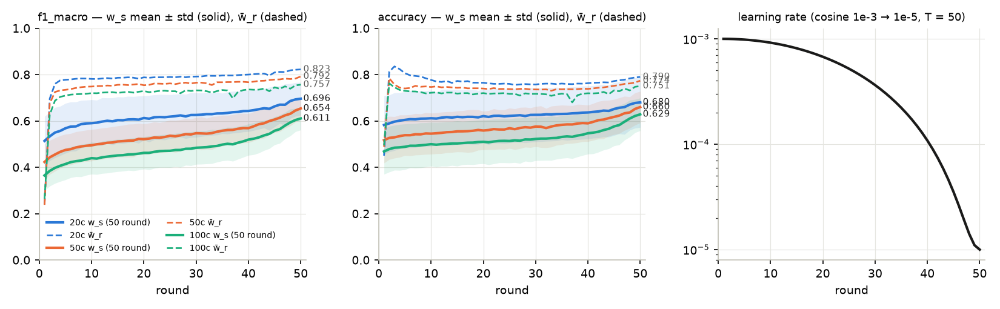
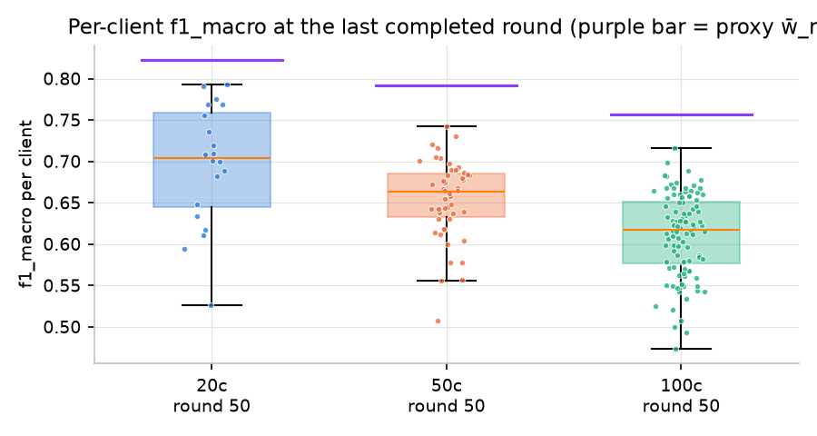
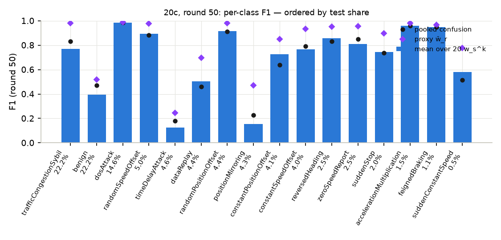
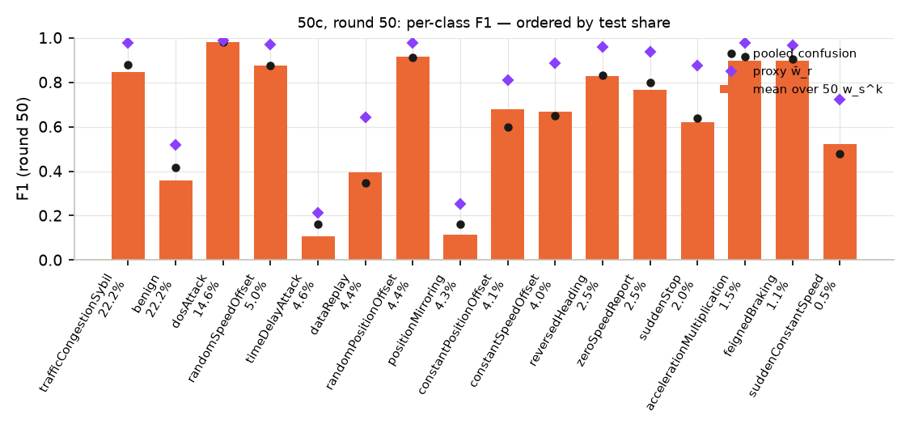
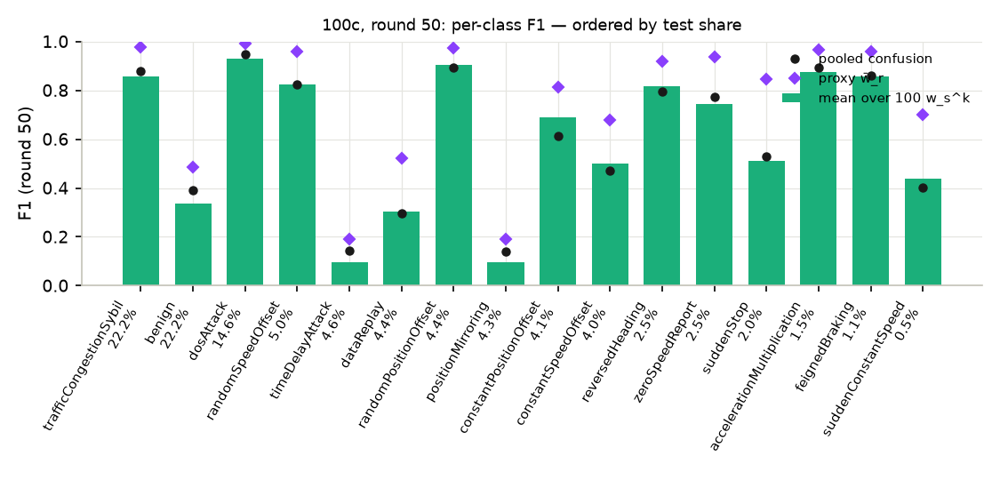
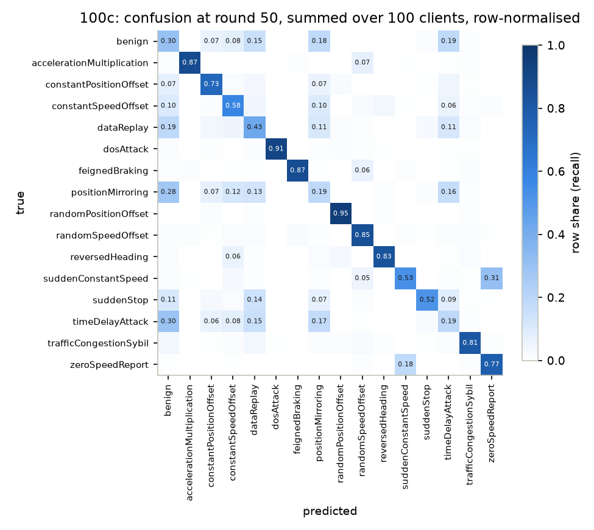
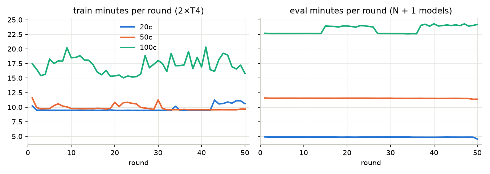
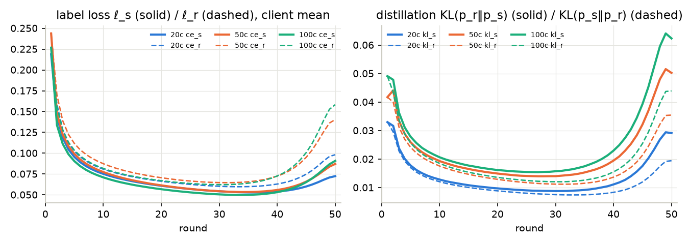

# Báo cáo dựng lại Lightweight-FL NILM (học tương hỗ liên bang) trên VeReMi NextGen / DAGSNet

**Trạng thái: HOÀN TẤT — bản cuối, lập 2026-09-18.** Cả ba kịch bản 20 / 50 / 100 client đã chạy đủ **50/50 round**;
mỗi kịch bản là một run duy nhất ghép từ nhiều phiên Kaggle, cây merge verify offline pass `--require-rounds 50`
(20c, 50c ngày 17-09; 100c ngày 18-09 sau khi phiên s5 hoàn tất r37–r50).

Nguồn số liệu: [`report_data/`](report_data/) (sinh bởi [`scripts/report_data.py`](../../scripts/report_data.py) từ
ba cây run đã ghép phiên và verify local `runs/merged/nilm_{20,50,100}c/`; **không có số nào lấy từ W&B**). Sổ
quyết định: [`rebuild.md`](rebuild.md); phương pháp gốc: [`paper.md`](paper.md); caveat dùng chung:
[`CONTEXT.md`](../../CONTEXT.md) §7.

---

## 1. Tóm tắt

| | 20 client | 50 client | 100 client |
|---|---:|---:|---:|
| round hoàn tất / kế hoạch | **50 / 50** | **50 / 50** | **50 / 50** |
| f1_macro model cá nhân hoá w_s (mean trên client, round cuối) | **0,6963** | **0,6543** | **0,6111** |
| f1_macro proxy toàn cục w̄_r (round cuối) | **0,8228** | **0,7923** | **0,7568** |
| accuracy w_s / w̄_r | 0,6805 / 0,7902 | 0,6602 / 0,7742 | 0,6289 / 0,7510 |
| f1_macro w_s round 1 → cuối (đỉnh hậu kiểm = round cuối) | 0,5143 → 0,6963 | 0,4234 → 0,6543 | 0,3654 → 0,6111 |
| f1_macro w̄_r round 1 → 2 → cuối | 0,2407 → 0,6968 → 0,8228 | 0,2385 → 0,6762 → 0,7923 | 0,2649 → 0,6278 → 0,7568 |
| client yếu nhất / mạnh nhất (f1_macro w_s) | #1 0,526 / #6 0,792 | #15 0,507 / #11 0,742 | #4 0,473 / #16 0,716 |
| round-time trung vị trên 2×T4 | 14,4 phút | 21,3 phút | 40,4 phút |
| tổng giờ round (không kể startup) | 12,2 h | 17,9 h | 33,8 h |

Bốn điều cần đọc cùng bảng trên:

1. **Hai model, hai con số.** Mỗi client giữ model cá nhân hoá w_s^k (không rời client) và model proxy w_r^k
   (upload, được server trung bình thành w̄_r). Ta đo cả hai trên cùng test toàn cục: **w̄_r cao hơn w_s
   0,13–0,15 f1_macro** ở cả ba K. Với test toàn cục (không chia theo client) đây là điều dự đoán được: w̄_r là
   trung bình của K model học trên toàn bộ 43 M dòng, w_s^k chỉ thấy phân bố lệch của một client. Bài báo đo
   ngược lại (test riêng từng hộ) nên **không** suy ra được "proxy tốt hơn model cá nhân hoá" nói chung.
2. **Đường cong đi lên suốt 50 round, không có đỉnh sớm** — khác hẳn pFedES trên cùng dữ liệu (đỉnh ở round 1–5
   rồi trôi xuống). Ở đây w_s được kéo về phía w̄_r qua KL mỗi bước, nên tri thức toàn cục đi vào chính model
   suy luận; w_s tăng +0,18 / +0,23 / +0,25 f1_macro từ round 1 đến round 50 (dao động xuống lớn nhất giữa hai round
   liên tiếp chỉ 0,004) và **tăng nhanh nhất ở 10 round cuối** khi LR cosine đã xuống < 1e-4 (mục 5.6).
3. **Điểm giảm theo số client nhưng khoảng cách thu hẹp dần** (w_s 0,696 → 0,654 → 0,611; w̄_r 0,823 → 0,792 → 0,757):
   cùng 43 M dòng chia nhỏ hơn, mỗi w_s^k ít dữ liệu và lệch hơn. Bước 50c → 100c (−0,043 ở w_s) nhỏ hơn bước
   20c → 50c (−0,042) không đáng kể, và 100c là kịch bản **tăng nhiều nhất** so với round 1 (+0,25) vì xuất phát thấp nhất.
4. **Không so được với Table I–II của bài báo** (mục 6): bài báo là hồi quy NILM (MAE/SAE, REFIT/REDD, model
   tìm bằng MNAS, test riêng hộ); ở đây là phân loại 16 lớp IDS, mọi model DAGSNet, KL thay L2, test toàn cục.

Caveat bắt buộc (mục 3.3 và 7) đi kèm mọi con số: test toàn cục thay vì test riêng client; mất cân bằng 41:1
nên đọc `f1_macro` chứ không đọc `accuracy`; rò rỉ Sybil; scaler fit trên toàn bộ train; một seed; **không có
NAS nên không có claim về bộ nhớ/độ trễ** như bài báo.

## 2. Bài báo và những gì được dựng lại

**Bài báo.** Li Y., Yao R., Qin D., Wang Y. *Lightweight Federated Learning for On-Device Non-Intrusive Load
Monitoring* (IEEE; bản markdown trong repo: [`lightweight_fl_nilm.md`](../../lightweight_fl_nilm.md)). Khung 4 bước
(§III.A): (1) MNAS tìm kiến trúc cá nhân hoá cho từng thiết bị; (2) **chưng cất tương hỗ** giữa model cá nhân hoá
w_s và model proxy w_r cùng kiến trúc trên mọi thiết bị; (3) chỉ upload w_r; (4) server trung bình w_r và phát lại;
cuối cùng fine-tune w_s. Chỉ phần (2)–(4) — §III.C, Eq. (17)–(19), Algorithm 1 — được dựng lại.

**Cơ chế được dựng lại đầy đủ** ([`proj/nilm.py`](proj/nilm.py), trích xuất ở [`paper.md`](paper.md) §3):

```
ℓ_s = ℓ(y, y_s),  ℓ_r = ℓ(y, y_r)                       (18)  label loss
ℓ_d = ℓ(y_s, y_r) / (ℓ_s + ℓ_r)                          (19)  distillation loss, trọng số thích nghi
L_s = ℓ_s + ℓ_d,  L_r = ℓ_r + ℓ_d                       (17)
mỗi round: mọi client cập nhật (w_s, w_r) trên dữ liệu local → upload w_r → w̄_r = (1/K) Σ w_r^k → w_r ← w̄_r
```

Mẫu số (ℓ_s + ℓ_r) làm ℓ_d nhỏ khi cả hai model còn kém ("weakened when the two models achieve poor
performance"), để không chia sẻ tri thức xấu lúc đầu.

**Những gì thay đổi so với bài báo** — quyết định của bản dựng (chủ dự án chốt 2026-09-15), đầy đủ 13 mục và lý do
tại [`rebuild.md`](rebuild.md) §1–2:

| hạng mục | bài báo | bản dựng | lý do ngắn |
|---|---|---|---|
| bài toán / dữ liệu | hồi quy công suất thiết bị (NILM), REFIT (20 hộ) / REDD (6 hộ) | **phân loại 16 lớp tấn công VeReMi NextGen**, 66 đặc trưng dạng bảng | mục tiêu dự án |
| kiến trúc | w_s per-device do MNAS tìm; proxy "3 conv k=5 + 1 dense" | **DAGSNet 395 024 tham số cho mọi model** (w_s, w_r, w̄_r), cùng init seed 42; **bỏ MNAS** | chủ dự án; hệ quả: round 1 w_s ≡ w_r về thống kê (chỉ khác dropout), chưng cất có nghĩa từ round 2 |
| ℓ(y_s, y_r) | L2 (hồi quy) | **KL hai chiều trên softmax** (T = 1): w_s ← KL(p_r‖p_s), w_r ← KL(p_s‖p_r), phía kia detach | dạng chuẩn của mutual distillation cho phân loại |
| mẫu số 1/(ℓ_s + ℓ_r) | không nói gradient có chảy qua không | **stop-gradient**, clamp ≥ 1e-6 | đạo hàm qua mẫu số sinh thành phần đẩy CE *tăng* |
| tổng hợp | trung bình đều 1/K (Algorithm 1) | **trung bình đều 1/K**, BN running stats trung bình như tham số | theo bài báo (client lớn nhất/nhỏ nhất ở 20c chênh 6,8× số dòng) |
| tham gia, round, epoch | mọi hộ mỗi round; số round/epoch không nêu | **mọi client mỗi round; 50 round × 1 epoch local** | ngân sách Kaggle |
| optimizer, LR | không nêu cho pha liên bang | **AdamW wd 1e-4, tạo mới mỗi client mỗi round**; **LR cosine theo round 1e-3 → 1e-5, T = 50**; clip 1,0 từng model; fp16 AMP | lịch thống nhất mọi dự án anh em |
| fine-tune cuối (§III.A bước 4) | có, tham số không nêu | **bỏ** | w_s đã học CE local mỗi round; không có test riêng client để đo lợi ích |
| batch | không nêu | 512 / 512 / 256 (20c / 50c / 100c) | VRAM T4 |
| test | riêng từng hộ, MAE/SAE | **toàn bộ 10 761 343 dòng test toàn cục, mọi w_s^k và w̄_r, mọi round; 10 metric phân loại** | hợp đồng dự án; đo tổng quát hoá toàn cục của model cá nhân hoá |
| một backward | Algorithm 1 tính ∇_{w_s} L_s và ∇_{w_r} L_r riêng | **một backward cho L_s + L_r** | với cross-term đã detach, đúng bằng hai gradient (kiểm bằng autograd, `tests/test_units.py`) |

## 3. Dữ liệu

Số đo thật từ [`knowledge/DATASET.md`](../../knowledge/DATASET.md) (audit 2026-09-07), không chép từ README.

### 3.1 Kích thước và phân mảnh

| | dòng | ghi chú |
|---|---:|---|
| train (mọi kịch bản) | **43 045 415** | đã z-score sẵn; 66 cột `f_*`, nhãn `int8` 0…15 |
| test toàn cục | **10 761 343** | chưa chuẩn hoá, áp `scaler.json` của train đúng một lần; chỉ có scenario `highway_7`, `urban_7` |

| kịch bản | rows/client min / trung vị / max | số lớp/client | client có đủ 16 lớp | bước optimizer / round |
|---:|---|---|---:|---:|
| 20 | 870 217 / 1 817 459 / 5 890 990 | 16 | 20 / 20 | 84 083 |
| 50 | 199 063 / 713 022 / 2 630 929 | 15–16 | 44 / 50 | 84 098 |
| 100 | 98 180 / 383 001 / 1 333 839 | 14–16 | 86 / 100 | 168 200 |

Phân mảnh Dirichlet **α = 0,5 trên nhãn** là non-IID *lệch tỉ lệ*, không phải *thiếu lớp*: hầu như client nào cũng
thấy ≥ 14 lớp vì mỗi client có hàng trăm nghìn dòng. Ba kịch bản là **cùng 43 M dòng chia lại**, không phải ba bộ
dữ liệu.

### 3.2 16 lớp và mất cân bằng (tỉ lệ trên test)

| lớp | tỉ lệ test | lớp | tỉ lệ test |
|---|---:|---|---:|
| trafficCongestionSybil | 22,24 % | positionMirroring | 4,34 % |
| benign | 22,22 % | constantPositionOffset | 4,11 % |
| dosAttack | 14,63 % | constantSpeedOffset | 4,03 % |
| randomSpeedOffset | 5,04 % | reversedHeading | 2,51 % |
| timeDelayAttack | 4,56 % | zeroSpeedReport | 2,48 % |
| dataReplay | 4,42 % | suddenStop | 1,97 % |
| randomPositionOffset | 4,37 % | accelerationMultiplication | 1,46 % |
| | | feignedBraking | 1,10 % |
| | | suddenConstantSpeed | 0,54 % |

Tỉ số lớn nhất/nhỏ nhất **41:1** (cả train lẫn test) ⇒ `accuracy` bị hai lớp lớn chi phối; đọc **`f1_macro`**.

### 3.3 Caveat của dữ liệu (phải đi cùng mọi con số)

1. Split theo **thời gian mô phỏng**, không theo xe; hình học bản đồ dịch chuyển giữa train và test
   (`f_*_x_rel` mean +0,198 sau chuẩn hoá) — lệch phân bố là thật.
2. **Rò rỉ Sybil:** 100 % dòng `trafficCongestionSybil` nằm trong flow mà mọi dòng cùng nhãn.
3. `benign` lấy từ luồng không có tấn công ⇒ nhóm đặc trưng `rate` bất thường mạnh.
4. 3 338 358 dòng nhập nhằng đã bị loại từ nguồn.
5. **`scaler.json` fit trên toàn bộ 43 M dòng train** — thống kê toàn cục mà client FL thật không có.
6. Đặc trưng thường trú trên GPU ở **fp16** (max |x| = 570 < 65 504, an toàn nhưng đã lượng tử hoá).
7. **Test không chia theo client:** mọi client đo trên cùng 10,76 M dòng ⇒ điểm đo tổng quát hoá toàn cục,
   không đo hiệu năng trên phân bố cục bộ như bài báo (test riêng từng hộ).
8. Client = receiver unit mô phỏng, không phải xe/RSU thật.

## 4. Cấu hình hiệu lực và hạ tầng

Đọc từ `reports/manifest.json` của run đã kéo về (không suy từ notebook nguồn). Cả ba kịch bản cùng:
`lr` 1e-3, `lr_schedule` cosine, `lr_min` 1e-5, `rounds` 50, `weight_decay` 1e-4, `local_epochs` 1, `clip` 1,0,
`seed` 42, `eval_batch` 16 384, `max_skips_per_client` 16, `preds_rounds` [50]; `batch` 512 / 512 / 256; fp16 AMP với
một GradScaler chung (skip nguyên tử cho cả w_s và w_r); mọi model 395 024 tham số; torch 2.10.0+cu128, CUDA 12.8;
train **và** eval đều `torch.compile` (backend `compiled` ở mọi round, gate sm_75 pass). Fingerprint cấu hình (21
khoá: 9 kiến trúc + lr, lr_schedule, lr_min, rounds, weight_decay, clip, n_clients, batch, local_epochs, seed,
data_id, run_name): 20c `9e11369e7011a414`, 50c `11390552401b6746`, 100c `dee9721a2e3ce653`;
`data_id` `c9b541a243f82282` chung.

**Phần cứng:** Kaggle 2×Tesla T4 (16 GB, sm_75), 4 vCPU; 2 worker process, mỗi GPU một; w̄_r thường trú trên
worker, w_s^k nạp theo bảng; VRAM train 7,1–7,2 GiB/GPU. Một run bị cắt thành nhiều phiên bởi trần 12 h/phiên và
quota 30 h/tuần/tài khoản; phiên sau resume từ checkpoint trọng số của phiên trước (cùng fingerprint) theo một
trong ba đường: `--kernel-source` cùng tài khoản, dataset **cây đầy đủ** (20c s2) hoặc dataset **handoff bundle**
(chỉ round cuối + chuỗi sha `reports/handoff.json`, 100c s2–s5); rồi được ghép lại thành **một run duy nhất** với
kiểm tra byte-identical trên mọi round chồng và chuỗi `prev_sha` liền mạch
([`merge_sessions.py`](../../.agents/skills/kaggle-training-notebook/scripts/merge_sessions.py)).

| | phiên (round mới mỗi phiên) | tài khoản / kernel | đường resume | bắt đầu (UTC) | giờ session |
|---|---|---|---|---|---:|
| 20c | s1 33, s2 16, s3 1 | `minhtriethihi/nilm-fl-veremi-20-clients`, `minhtrit06/…-20-clients-s2`, `minhtrit06/…-20-clients-s3` | s2: dataset cây đầy đủ `minhtrit06/nilm-20c-ckpt-s1`; s3: kernel-source | 15-09 13:09, 16-09 05:30, 17-09 09:05 | 8,0 + 4,2 + 0,4 = **12,6 h** |
| 50c | s1 29, s2 21 | `minhtran0601/nilm-fl-veremi-50-clients`, `minhtran0601/…-50-clients-s2` | s2: kernel-source | 15-09 13:09, 16-09 04:16 | 10,6 + 7,7 = **18,3 h** |
| 100c | s1 14, s2 12, s3 6, s4 4, s5 14 | `odixe0502/nilm-fl-veremi-100-clients`, `minhtran0601/…-100-clients-s2`, `minhtrit06/…-100-clients-s3`, `khanhmay0304/…-100-clients-s4`, `odixeuit/…-100-clients-s5` | s2: handoff `minhtran0601/nilm-100c-ckpt-s1` (r14); s3: handoff `minhtrit06/nilm-100c-ckpt-s2` (r26); s4: handoff `khanhmay0304/nilm-100c-ckpt-s3` (r32); s5: handoff `odixeuit/nilm-100c-ckpt-s4` (r36) | 15-09 13:09, 16-09 06:15, 17-09 09:15, 17-09 14:25, 17-09 18:16 | 9,6 + 8,1 + 4,1 + 2,8 + 9,9 = **34,5 h** |

Giờ session đọc từ timestamp cuối của log kernel (gồm ~5–9 phút startup: prepack 131 s, compile + gate 90 s). 100c
cần 5 phiên trên 5 tài khoản vì mỗi phiên 12 h chỉ đủ ~16 round và quota tuần của từng tài khoản đã bị hai kịch bản
kia chiếm; mỗi lần hop tài khoản đi qua dataset handoff (144 MB) + probe CPU (`PROBE_OK`) trước khi push kernel GPU.
Run W&B (chỉ giám sát, không phải nguồn số): `21522798-uit/nilm-veremi`, id `nilm_{20,50,100}c`; **các phiên
resume không đẩy được hàng lên W&B** (heartbeat mất ở giây ~393 trên wandb 0.26.1 của Kaggle, kernel vẫn chạy
bình thường; `CONTEXT.md` §3) — theo dõi bằng log Kaggle.

## 5. Kết quả

### 5.1 Đường cong theo round



*Điều cần thấy:* (i) w̄_r **nhảy vọt ở round 2** (0,24 → 0,70 / 0,68 / 0,63) — round 1 w̄_r chỉ là trung bình của K
model cùng init học một epoch rời nhau, từ round 2 mỗi w_r^k xuất phát từ w̄_r; (ii) w_s **đi lên gần như đơn điệu**
(dao động xuống lớn nhất giữa hai round liên tiếp 0,004 / 0,002 / 0,002), không có đỉnh sớm, dải ± std hẹp dần
(20c: 0,106 → 0,071; 50c: 0,077 → 0,047; 100c: 0,065 → 0,050); (iii) khoảng cách w̄_r − w_s thu hẹp theo round
(20c: 0,19 ở r10 → 0,13 ở r50; 50c: 0,25 → 0,14; 100c: 0,28 → 0,15) nhưng chưa khép.

| | 20c | 50c | 100c |
|---|---:|---:|---:|
| f1_macro w_s round 1 / 10 / 20 / 30 / 40 / 50 | 0,514 / 0,591 / 0,613 / 0,626 / 0,644 / **0,696** | 0,423 / 0,496 / 0,522 / 0,548 / 0,569 / **0,654** | 0,365 / 0,440 / 0,463 / 0,485 / 0,520 / **0,611** |
| f1_macro w̄_r round 1 / 2 / 10 / 30 / 50 | 0,241 / 0,697 / 0,782 / 0,792 / **0,823** | 0,239 / 0,676 / 0,749 / 0,766 / **0,792** | 0,265 / 0,628 / 0,720 / 0,732 / **0,757** |
| đỉnh hậu kiểm của w_s | = round 50 | = round 50 | = round 50 |
| accuracy w_s round 1 → 50 | 0,583 → 0,681 | 0,518 → 0,660 | 0,469 → 0,629 |
| accuracy w̄_r round 1 → 50 | 0,451 → 0,790 | 0,489 → 0,774 | 0,495 → 0,751 |

"Đỉnh" là quan sát *sau khi chạy* trên chính tập test, không phải checkpoint được chọn; số công bố là **round
cuối** — ở đây hai điểm trùng nhau ở cả ba K vì đường cong vẫn đang lên. Tốc độ tăng của w_s **không đều**: 20c tăng
+0,076 trong 9 round đầu, +0,053 trong 30 round giữa (r10 → r40), rồi **+0,053 trong 10 round cuối** khi LR đã
< 1e-4; 50c +0,072 / +0,074 / **+0,085**; 100c +0,075 / +0,080 / **+0,091** — càng nhiều client, đoạn cuối càng
dốc. Cơ chế đề xuất ở mục 5.6.

### 5.2 Round 50 — đủ 10 metric

Cột w_s: trung bình không trọng số trên N client, mỗi client trên toàn bộ 10 761 343 dòng test. Cột w̄_r: một model
trên cùng test. Trong bài toán đa lớp đơn nhãn: **accuracy = precision_micro = recall_micro = recall_weighted =
f1_micro** (giữ đủ cột theo hợp đồng).

| metric | 20c w_s | 20c w̄_r | 50c w_s | 50c w̄_r | 100c w_s | 100c w̄_r |
|---|---:|---:|---:|---:|---:|---:|
| accuracy | 0,6805 | 0,7902 | 0,6602 | 0,7742 | 0,6289 | 0,7510 |
| precision_macro | 0,7842 | 0,8364 | 0,7334 | 0,7961 | 0,6921 | 0,7592 |
| precision_micro | 0,6805 | 0,7902 | 0,6602 | 0,7742 | 0,6289 | 0,7510 |
| precision_weighted | 0,7966 | 0,8340 | 0,7626 | 0,8084 | 0,7308 | 0,7793 |
| recall_macro | 0,7311 | 0,8286 | 0,6850 | 0,8011 | 0,6454 | 0,7711 |
| recall_micro | 0,6805 | 0,7902 | 0,6602 | 0,7742 | 0,6289 | 0,7510 |
| recall_weighted | 0,6805 | 0,7902 | 0,6602 | 0,7742 | 0,6289 | 0,7510 |
| **f1_macro** | **0,6963** | **0,8228** | **0,6543** | **0,7923** | **0,6111** | **0,7568** |
| f1_micro | 0,6805 | 0,7902 | 0,6602 | 0,7742 | 0,6289 | 0,7510 |
| f1_weighted | 0,6674 | 0,7990 | 0,6548 | 0,7809 | 0,6257 | 0,7532 |
| f1_macro std / min / max trên client | 0,0709 / 0,5257 / 0,7924 | — | 0,0468 / 0,5073 / 0,7423 | — | 0,0496 / 0,4732 / 0,7159 | — |

Bảng **mọi round × 10 metric** của từng kịch bản ở Phụ lục A–C (nguồn `report_data/history_Kc.csv`).
`precision_weighted` cao hơn `accuracy` 0,10–0,12 ở w_s: khi model *đoán* một lớp thì thường đúng, nhưng bỏ sót
phần lớn `benign` (recall gộp 0,38 / 0,33 / 0,30 — xem 5.4). Ở w̄_r chênh lệch còn 0,03–0,04.

### 5.3 Phân tán giữa client



| | 20c | 50c | 100c |
|---|---:|---:|---:|
| f1_macro w_s tứ phân vị (min / Q1 / trung vị / Q3 / max) | 0,526 / 0,645 / 0,704 / 0,758 / 0,792 | 0,507 / 0,632 / 0,663 / 0,686 / 0,742 | 0,473 / 0,576 / 0,618 / 0,651 / 0,716 |
| số client f1_macro < 0,50 | 0 / 20 | 0 / 50 | 2 / 100 |
| client tốt nhất so với w̄_r | 0,792 < 0,823 | 0,742 < 0,792 | 0,716 < 0,757 |
| tương quan Spearman (số dòng train của client, f1_macro) | 0,60 | 0,34 | 0,12 |

**Không có w_s^k nào vượt w̄_r** ở cả ba K — trên test toàn cục, model cá nhân hoá tốt nhất vẫn thua proxy toàn
cục 0,03–0,05. Kích thước dữ liệu cục bộ giải thích một phần phân tán ở 20c (Spearman 0,60) và gần như không còn
ở 100c (0,12): khi mọi client đều nhỏ, phần còn lại của phân tán do *thành phần lớp* của client. Ở 100c, độ lệch chuẩn
giữa client (0,050) thấp hơn 20c (0,071) dù điểm trung bình thấp hơn — 100 model cá nhân hoá hội tụ *gần nhau hơn*
quanh w̄_r. Danh sách 10 metric của từng client: `report_data/per_client_final_Kc.csv`.

### 5.4 Theo lớp — round 50

F1 từng lớp, **mean trên client** (w_s), trên **confusion gộp** của N client, và của **w̄_r**; sắp theo tỉ lệ test
giảm dần. Nguồn: `report_data/per_class_final_Kc.csv`.

| lớp | tỉ lệ test | f1 w_s mean 20c / 50c / 100c | f1 gộp 20c / 50c / 100c | f1 w̄_r 20c / 50c / 100c |
|---|---:|---|---|---|
| trafficCongestionSybil | 22,24 % | 0,768 / 0,848 / 0,856 | 0,832 / 0,879 / 0,877 | **0,979** / **0,979** / **0,976** |
| benign | 22,22 % | 0,396 / 0,357 / 0,335 | 0,471 / 0,415 / 0,390 | 0,520 / 0,520 / 0,487 |
| dosAttack | 14,63 % | **0,985** / **0,980** / 0,930 | 0,985 / 0,980 / 0,946 | 0,987 / 0,989 / 0,990 |
| randomSpeedOffset | 5,04 % | 0,895 / 0,876 / 0,824 | 0,883 / 0,873 / 0,823 | 0,977 / 0,971 / 0,960 |
| timeDelayAttack | 4,56 % | **0,126** / **0,105** / **0,098** | 0,178 / 0,162 / 0,145 | 0,244 / 0,211 / 0,191 |
| dataReplay | 4,42 % | 0,503 / 0,394 / 0,304 | 0,459 / 0,349 / 0,295 | 0,695 / 0,644 / 0,523 |
| randomPositionOffset | 4,37 % | 0,917 / 0,916 / 0,904 | 0,911 / 0,911 / 0,894 | 0,981 / 0,977 / 0,973 |
| positionMirroring | 4,34 % | **0,156** / **0,114** / **0,098** | 0,226 / 0,161 / 0,141 | 0,472 / 0,253 / 0,192 |
| constantPositionOffset | 4,11 % | 0,725 / 0,677 / 0,690 | 0,640 / 0,600 / 0,612 | 0,851 / 0,810 / 0,813 |
| constantSpeedOffset | 4,03 % | 0,767 / 0,667 / 0,500 | 0,791 / 0,651 / 0,473 | 0,934 / 0,887 / 0,678 |
| reversedHeading | 2,51 % | 0,858 / 0,829 / 0,815 | 0,831 / 0,831 / 0,796 | 0,950 / 0,959 / 0,919 |
| zeroSpeedReport | 2,48 % | 0,810 / 0,765 / 0,743 | 0,849 / 0,800 / 0,773 | 0,955 / 0,936 / 0,936 |
| suddenStop | 1,97 % | 0,743 / 0,621 / 0,510 | 0,737 / 0,639 / 0,528 | 0,896 / 0,877 / 0,845 |
| accelerationMultiplication | 1,46 % | 0,960 / 0,898 / 0,876 | 0,960 / 0,916 / 0,892 | 0,979 / 0,977 / 0,967 |
| feignedBraking | 1,10 % | 0,950 / 0,899 / 0,857 | 0,948 / 0,903 / 0,859 | 0,965 / 0,965 / 0,959 |
| suddenConstantSpeed | 0,54 % | 0,581 / 0,524 / 0,439 | 0,514 / 0,480 / 0,401 | 0,778 / 0,723 / 0,701 |








*Điều cần thấy:*

- **Cụm 4 lớp không tách được nhau: `benign`, `timeDelayAttack`, `positionMirroring`, `dataReplay`** — như mọi
  bản dựng trên bộ dữ liệu này. Ở 50c (confusion gộp w_s), hàng `benign` phân bố 33 % benign / 21 % timeDelay /
  18 % positionMirroring / 13 % dataReplay và hàng `timeDelayAttack` gần như *cùng* phân bố (32 / 22 / 18 / 14 %);
  100c y hệt (30 / 19 / 18 / 15 % và 30 / 19 / 17 / 15 %). w̄_r cũng không tách được cụm này (hàng `benign` của
  w̄_r 50c: 42 / 28 / 18 / 7 %; 100c: 38 / 20 / 18 / 13 %) — tri thức toàn cục nâng `benign` lên 0,49–0,52 và
  `dataReplay` lên 0,52–0,70 nhưng `timeDelayAttack` (0,19–0,24) và `positionMirroring` (0,19–0,47) vẫn gần mức
  đoán. Ba lớp tấn công này chỉ thay đổi *thời điểm/vị trí* của bản tin hợp lệ nên về đặc trưng từng dòng chúng
  gần `benign`; `timeDelayAttack` đã được ghi là lớp khó ngay từ audit dữ liệu.
- **w̄_r hưởng lợi nhiều nhất ở các lớp nhỏ và các lớp "offset":** `constantSpeedOffset` 0,77 → 0,93 (20c),
  `suddenConstantSpeed` 0,58 → 0,78, `suddenStop` 0,74 → 0,90, `trafficCongestionSybil` 0,77 → 0,98; ở 100c
  `suddenStop` 0,51 → 0,85, `suddenConstantSpeed` 0,44 → 0,70. Đây là các lớp mà client nhỏ có quá ít dòng để học
  riêng; trung bình K proxy gom đủ.
- **`dosAttack`** (≥ 0,93 ở mọi K) và **`randomPositionOffset`** (≈ 0,90–0,92) là hai lớp dễ nhất — đặc trưng `rate`
  và nhiễu vị trí lớn tách trực tiếp; `trafficCongestionSybil` với w̄_r đạt 0,98 (recall 0,99) — có rò rỉ Sybil.
- Các lớp nhỏ **mất nhiều nhất khi N tăng** ở w_s: `constantSpeedOffset` 0,77 → 0,67 → 0,50, `suddenConstantSpeed`
  0,58 → 0,52 → 0,44, `suddenStop` 0,74 → 0,62 → 0,51, `dataReplay` 0,50 → 0,39 → 0,30; các lớp dễ gần như không
  đổi (`randomPositionOffset` 0,92 → 0,92 → 0,90). Riêng `trafficCongestionSybil` ở w_s lại *tăng* theo N
  (0,77 → 0,85 → 0,86) — lớp lớn nhất, mọi client đều có đủ.

### 5.5 Chi phí tính toán trên 2×T4



| | 20c | 50c | 100c |
|---|---:|---:|---:|
| train / round (trung vị) | 568 s | 585 s | 1 031 s |
| eval / round (trung vị; N + 1 model × 10,76 M dòng) | 293 s | 693 s | 1 425 s |
| round (trung vị / lớn nhất) | 862 / 968 s | 1 280 / 1 393 s | 2 425 / 2 659 s |
| tổng giờ train / eval / round (50 round) | 8,1 / 4,1 / 12,2 h | 8,3 / 9,6 / 17,9 h | 14,3 / 19,5 / 33,8 h |
| bước optimizer / round; skip AMP tổng (max một round) | 84 083; 1 705 (49) | 84 098; 1 449 (44) | 168 200; 3 268 (123) |
| VRAM train max | 7,12 GiB | 7,22 GiB | 7,19 GiB |

Mỗi bước mutual = 2 forward + 1 backward của hai DAGSNet (13,1 ms @512 compiled trên T4, `rebuild.md` §4). Với
mọi client tham gia, mỗi round train đúng **một epoch trên toàn bộ 43 M dòng** bất kể N, nên train/round gần
như không đổi giữa 20c và 50c; 100c tốn hơn vì batch 256 (gấp đôi số bước, launch-bound) và nghẽn 4 vCPU. Eval
tỉ lệ thuận với N + 1 (mọi w_s^k đổi trọng số mỗi round nên không có cache; cộng w̄_r): ở 50c eval đã vượt train,
ở 100c eval chiếm 59 % round. Skip AMP < 0,08 % số bước, không client nào vượt 3 skip trong một round (ngưỡng
`max_skips_per_client` 16), và **tăng dần theo round** (20c: 27 ở r1 → 46–49 ở r49–50; 100c: 18 → 117–123) cùng
với gnorm_r tăng (mục 5.6). Round-time các phiên của cùng kịch bản bằng nhau (20c 862 / 883 s; 50c 1 284 / 1 267 s;
100c 2 443 / 2 365 / 2 408 / 2 392 / 2 479 s cho s1…s5) — resume qua handoff bundle không đổi chi phí round.

Ngoại suy từ probe (`rebuild.md` §4) khớp số đo: 20c 14,9 phút dự đoán / 14,4 đo; 50c ~22 / 21,3; 100c ~45 / 40,4.
Tổng giờ GPU của cả ba kịch bản ≈ 64 h round + ~65 h session (kể startup/finalize), rải trên 6 tài khoản Kaggle.

### 5.6 Động học học tương hỗ — thành phần loss theo round



Trung bình trên client của các bước áp dụng (`logs/round_NNN.json`, tổng hợp trong `history.csv`):

| | 20c r1 / r2 / r30 / r50 | 50c r1 / r2 / r30 / r50 | 100c r1 / r2 / r30 / r50 |
|---|---|---|---|
| ce_s (CE của w_s) | 0,219 / 0,144 / 0,054 / 0,072 | 0,244 / 0,148 / 0,054 / 0,087 | 0,227 / 0,134 / 0,051 / 0,091 |
| ce_r (CE của w_r) | 0,219 / 0,159 / 0,060 / 0,098 | 0,244 / 0,170 / 0,065 / 0,140 | 0,227 / 0,156 / 0,062 / 0,158 |
| kl_s = KL(p_r‖p_s) | 0,033 / 0,032 / 0,009 / 0,029 | 0,042 / 0,044 / 0,014 / 0,050 | 0,049 / 0,048 / 0,016 / 0,062 |
| kl_r = KL(p_s‖p_r) | 0,033 / 0,030 / 0,008 / 0,019 | 0,042 / 0,040 / 0,011 / 0,035 | 0,049 / 0,043 / 0,012 / 0,044 |
| gnorm_s / gnorm_r | 0,95 / 0,95 → 0,41 / 1,34 | 1,07 / 1,07 → 0,46 / 1,85 | 1,31 / 1,31 → 0,51 / 1,91 |

*Điều cần thấy:*

- **Round 1: ce_s = ce_r và kl_s = kl_r đúng đến 3 chữ số** ở cả ba K — xác nhận deviation #1 (cùng init, cùng dữ
  liệu ⇒ w_s ≡ w_r về thống kê, chỉ khác dropout); chưng cất chỉ có nghĩa từ round 2, khi w_r ← w̄_r và ce_r > ce_s.
- **Mọi thành phần loss train đạt cực tiểu ở r≈27–36 rồi tăng trở lại đến r50** (ce_r 20c 0,060 → 0,098, 50c
  0,065 → 0,140, 100c 0,062 → 0,158; kl_s 100c 0,016 → 0,062; gnorm_r tăng gấp 2–2,6 lần so với cực tiểu) **trong khi f1 test của cả
  w_s lẫn w̄_r tăng nhanh nhất**. Đây là số đo *trong lúc train* trên dữ liệu *cục bộ*: khi LR cosine xuống < 1e-4,
  w_r^k không còn kịp rời xa w̄_r trong một epoch, nên ce_r tiến về CE của **model toàn cục trên phân bố cục bộ**
  (cao hơn model đã thích nghi cục bộ) và KL(p_s‖p_r) — khoảng cách giữa model cá nhân hoá và model gần-toàn-cục —
  tăng theo. Đồng thời w_s bị kéo về phía w̄_r qua kl_s nên ce_s cục bộ tăng nhẹ mà tổng quát hoá toàn cục tốt lên.
  Hiệu ứng **mạnh dần theo N** (ce_r cuối 0,098 / 0,140 / 0,158; kl_s cuối 0,029 / 0,050 / 0,062), khớp với đoạn
  tăng cuối dốc dần theo N ở 5.1. Đây là **diễn giải**, chưa có ablation (không chạy kịch bản LR hằng hay bỏ ℓ_d)
  để tách nguyên nhân; mục 7.
- gnorm_r cuối > gnorm_s (1,34 so 0,41 ở 20c; 1,91 so 0,51 ở 100c): gradient của proxy bị clip 1,0 ở phần lớn bước
  cuối, gradient của w_s thì không — w_r luôn xuất phát xa hơn khỏi cực tiểu cục bộ.

## 6. Kết quả của bài báo (để riêng, không so trực tiếp)

Bài báo báo cáo **MAE (W) và SAE** trên REFIT (5 thiết bị) và REDD (3 thiết bị), test riêng từng hộ; model đề xuất
(MNAS + học tương hỗ liên bang) tốt nhất ở mọi thiết bị (Table I–II): REFIT MAE Fridge 27,99, Washing machine 17,34,
Dishwasher 36,11, Microwave 8,58, Kettle 18,24 (so Local 30,14 / 23,70 / 39,36 / 10,22 / 23,25; Federated không
NAS 29,05 / 21,94 / 36,58 / 9,56 / 20,75); REDD MAE Fridge 31,73, Dishwasher 8,51, Microwave 17,89. Cải thiện
> 15 % cho washing machine/microwave/kettle trên REFIT, ~10 % trên REDD; thêm bộ nhớ ước tính 140 KB và độ trễ
giảm > 2,5× nhờ MNAS (Table V).

Bản dựng này **không tái lập được các con số đó và không nhằm làm vậy**: khác bài toán (hồi quy → phân loại 16 lớp,
MAE/SAE → 10 metric phân loại), khác dữ liệu (chuỗi công suất → bảng 66 đặc trưng, mất cân bằng 41:1, split thời
gian), khác kiến trúc (MNAS per-device → DAGSNet chung, không NAS), khác ℓ_d (L2 → KL), khác cách chia test (riêng hộ →
toàn cục), và bài báo không nêu optimizer/LR/round/epoch/init cho pha liên bang (`paper.md` §4). Vì bỏ NAS, **mọi
claim về bộ nhớ và độ trễ của bài báo nằm ngoài bản dựng**. Điều **có thể** đối chiếu định tính: bài báo thấy
"global knowledge transferred from unified proxy models further enhances the generalization of personalized models";
ở đây w_s đi lên suốt 50 round nhờ KL với proxy (mục 5.1, 5.6) — cùng chiều, nhưng ở đây chưa có baseline "local
không FL" cùng cấu hình để định lượng phần lợi ích (mục 7).

## 7. Bằng chứng ủng hộ và không ủng hộ điều gì

**Ủng hộ:**

- Pipeline học tương hỗ chạy đúng cơ chế đã chốt trên dữ liệu thật ở quy mô 43 M dòng × 50 round × N client, cả ba
  kịch bản đủ 50 round: mọi round `evaluated = N`, backend compiled cả train lẫn eval, `lr` khớp lịch cosine (r1 1e-3,
  r10 9,2e-4, r25 5,2e-4, r50 1e-5), round 1 ce_s = ce_r (deviation #1 đúng như dự đoán), phiên resume cho artifact
  **byte-identical** trên mọi round chồng (20c 33 + 49, 50c 29) và chuỗi sha handoff liền mạch qua 4 lần hop (100c
  r14, r26, r32, r36), verifier offline dựng lại mọi con số từ confusion (mục 8).
- **Học tương hỗ mang tri thức toàn cục vào model suy luận:** w_s tăng gần như đơn điệu và kết thúc cao hơn round 1
  +0,18 / +0,23 / +0,25 f1_macro; so với pFedES cùng dữ liệu, cùng LR, cùng DAGSNet (round cuối 0,486 / 0,365 /
  0,290, đường cong đi xuống), w_s ở đây cao hơn +0,21 / +0,29 / +0,32 — hai phương pháp khác nhau ở chỗ tri thức
  toàn cục có đi vào model suy luận hay không, và khoảng cách **mở rộng theo N**.
- w̄_r là một model toàn cục dùng được: 0,82 / 0,79 / 0,76 f1_macro trên test toàn cục — cao hơn model toàn cục
  FD-IDS đo ở dự án anh em `fd_ids` trên cùng test (round 50: 0,766 / 0,682 / 0,661; đối chiếu định tính vì khác
  optimizer/LR và cách tổng hợp).
- Phương pháp **chịu được phân mảnh**: từ 20 lên 100 client, w_s mất 0,085 và w̄_r mất 0,066 f1_macro, phân tán giữa
  client *giảm* (std 0,071 → 0,050), chỉ 2/100 client dưới 0,50.

**Không ủng hộ / chưa có bằng chứng:**

- **Không thể kết luận phương pháp tốt hơn hay kém hơn baseline** (Local không FL, FedAvg, FedAvg + fine-tune) trên
  bộ dữ liệu này: chưa có baseline cùng cấu hình chạy trong repo này; so sánh với pFedES/FD-IDS ở trên là đối chiếu
  chéo dự án, khác optimizer/cách tổng hợp.
- **Một seed**, một lần chạy mỗi kịch bản; không có khoảng tin cậy. Std báo cáo là phân tán *giữa client*, không
  phải giữa các lần chạy.
- **Không có ablation** cho các chỗ tự chốt: KL thay L2, stop-gradient mẫu số, T = 1, trung bình đều 1/K thay n_k,
  bỏ fine-tune cuối, LR cosine. Diễn giải ở 5.6 về đoạn tăng cuối (LR nhỏ ⇒ w_r ≈ w̄_r) vì thế là giả thuyết.
- **Đường cong chưa bão hoà ở round 50** (10 round cuối vẫn +0,05 / +0,09 / +0,09): T = 50 là ngân sách, không phải
  điểm hội tụ; không biết trần của phương pháp với lịch dài hơn.
- Điểm trên **phân bố cục bộ** của từng client (thứ bài báo đo) **không được đo**; "w̄_r > w_s" ở đây chỉ đúng cho
  test toàn cục.
- **Không có claim lightweight:** không NAS, không đo bộ nhớ/độ trễ trên thiết bị; DAGSNet 395 k tham số ×2 mỗi
  client lúc train.
- Caveat dữ liệu (3.3): rò rỉ Sybil (w̄_r đạt 0,98 ở lớp này) và scaler toàn cục làm điểm tuyệt đối *lạc quan*;
  split thời gian và test chỉ có scenario `_7` làm điểm *bi quan*; không tách được hai hiệu ứng.

## 8. Kiểm soát chất lượng và tái lập

| | 20c | 50c | 100c |
|---|---|---|---|
| thư mục run chuẩn | `runs/merged/nilm_20c/` | `runs/merged/nilm_50c/` | `runs/merged/nilm_100c/` |
| verifier offline `scripts/verify_run.py --require-rounds 50` | **pass** (17-09) | **pass** (17-09) | **pass** (18-09) |
| ghép phiên | 33 + 49 round chồng byte-identical (s2 = dataset cây đầy đủ, s3 = kernel-source) | 29 round chồng byte-identical | 4 handoff (r14, r26, r32, r36): sha(round_r) = chain[r], prev_sha liền 1..50; round chồng của mỗi handoff byte-identical |
| provenance | `logs/sessions.json`, `logs/sessions/{n}/` (log kernel, `handoff.json` nếu có) | như 20c | như 20c |
| số liệu report | `report_data/` sinh 18-09 từ ba cây merge đủ 50 round | | |

Verifier dựng lại mọi con số từ artifact: 10 metric của từng client và của w̄_r từ confusion (tổng mỗi ma trận
= 10 761 343), so với `metrics/round_NNN.json`, `history.csv`, `clients.csv` và `metrics` nhúng trong
`weights/round_NNN.pt`; `preds/round_050.u8.npy` dựng lại đúng confusion; chuỗi `prev_sha` liền từ round 1;
fingerprint 21 khoá khớp manifest; mọi `weights/round_NNN.pt` nạp `weights_only=True`, `load_state_dict(strict=True)`,
395 024 tham số. `report_data.py` kiểm thêm: `history.csv` ≡ JSON từng round (sai số < 1e-9), per-class của w̄_r ≡
tính lại từ `confusion/global_NNN.npy`.

Artifact mỗi round: `weights/round_NNN.pt` (state_dict w̄_r + N state_dict w_s^k, `weights_only=True`, kèm
`prev_sha`), `confusion/round_NNN.npy` (N × 16 × 16) + `confusion/global_NNN.npy`, `metrics/round_NNN.json` (10 metric
mean/std/min/max + `global_*` + per-client + per-class + loss/skip/timing), `logs/round_NNN.json` (lr, 8 giá trị loss,
bước, skip AMP từng client), `resume/round_NNN.pt` (RNG driver), `complete/round_NNN.done` (marker cuối cùng);
`preds/round_050.u8.npy` (N × 10,76 M) + `preds/global_050.u8.npy` chỉ ở round 50; `reports/manifest.json` (cấu hình
hiệu lực, fingerprint, `data_id`/`content_id`, số dòng từng client, torch/CUDA); `reports/handoff.json` khi phiên
resume từ bundle. Trọng số 33 / 81 / 160 MB/round.

Tái lập: `python scripts/gen_notebook.py --owner <acct> --clients {20,50,100} --max-hours 11.0` (phiên tiếp:
`--session N --require-resume --kernel-source <kernel phiên trước>` cùng tài khoản, hoặc
`scripts/stage_ckpt_dataset.py --last-only` → `kaggle datasets create` → `scripts/gen_ckpt_probe.py` (phải in
`PROBE_OK`) → `--dataset-source <owner/slug>` khi đổi tài khoản) → `scripts/validate_notebooks.py` → nhúng key W&B →
validate lại → `kaggle kernels push`; kéo về bằng `scripts/pull_output.sh` (retry) → `merge_sessions.py` →
`scripts/verify_run.py --require-rounds 50` → `scripts/report_data.py`. Dataset Kaggle
`odixe0502/veremi-fl-{20,50,100}client` + `odixe0502/veremi-nextgen2026-centralized` (public); `machine_shape`
NvidiaTeslaT4, `docker_image` pin theo digest. Mã nguồn duy nhất của notebook: [`proj/`](proj/) (8 module); test
local: `rebuild.md` §5.

---

## Phụ lục — mọi round × 10 metric

Mean không trọng số trên N client (w_s^k), mỗi client trên toàn bộ 10 761 343 dòng test; cột `proxy` = w̄_r trên
cùng test; `skip` = bước AMP bị GradScaler bỏ, tổng trên client. accuracy = precision_micro = recall_micro =
recall_weighted = f1_micro. Nguồn: `report_data/history_Kc.csv` (đủ cột, kể cả std/min/max của 10 metric và
8 thành phần loss).

<!-- APPENDIX:BEGIN (sinh tự động từ report_data/rounds_Kc.md — không sửa tay) -->

### A. 20 client — 50/50 round (chính thức)

| round | lr | accuracy | precision_macro | precision_micro | precision_weighted | recall_macro | recall_micro | recall_weighted | f1_macro | f1_micro | f1_weighted | f1_macro std | min | max | proxy f1_macro | proxy acc | skip | train s | eval s |
|---:|---:|---:|---:|---:|---:|---:|---:|---:|---:|---:|---:|---:|---:|---:|---:|---:|---:|---:|---:|
| 1 | 1.00e-03 | 0.5831 | 0.6527 | 0.5831 | 0.6907 | 0.5683 | 0.5831 | 0.5831 | 0.5143 | 0.5831 | 0.5582 | 0.1059 | 0.2972 | 0.6968 | 0.2407 | 0.4507 | 27 | 613 | 295 |
| 2 | 9.99e-04 | 0.5899 | 0.6693 | 0.5899 | 0.7012 | 0.5862 | 0.5899 | 0.5899 | 0.5340 | 0.5899 | 0.5666 | 0.1052 | 0.2921 | 0.7078 | 0.6968 | 0.8126 | 30 | 570 | 293 |
| 3 | 9.96e-04 | 0.5974 | 0.6819 | 0.5974 | 0.7083 | 0.6018 | 0.5974 | 0.5974 | 0.5503 | 0.5974 | 0.5751 | 0.1083 | 0.3236 | 0.7389 | 0.7603 | 0.8357 | 33 | 569 | 293 |
| 4 | 9.91e-04 | 0.6019 | 0.6930 | 0.6019 | 0.7118 | 0.6094 | 0.6019 | 0.6019 | 0.5576 | 0.6019 | 0.5795 | 0.1064 | 0.3329 | 0.7380 | 0.7755 | 0.8238 | 32 | 569 | 293 |
| 5 | 9.84e-04 | 0.6050 | 0.6990 | 0.6050 | 0.7152 | 0.6189 | 0.6050 | 0.6050 | 0.5688 | 0.6050 | 0.5842 | 0.1077 | 0.3185 | 0.7436 | 0.7781 | 0.8065 | 34 | 568 | 293 |
| 6 | 9.75e-04 | 0.6081 | 0.7007 | 0.6081 | 0.7186 | 0.6263 | 0.6081 | 0.6081 | 0.5761 | 0.6081 | 0.5872 | 0.1064 | 0.3237 | 0.7465 | 0.7795 | 0.7972 | 33 | 569 | 293 |
| 7 | 9.64e-04 | 0.6075 | 0.7050 | 0.6075 | 0.7204 | 0.6282 | 0.6075 | 0.6075 | 0.5768 | 0.6075 | 0.5872 | 0.1059 | 0.3377 | 0.7495 | 0.7823 | 0.7946 | 31 | 568 | 293 |
| 8 | 9.51e-04 | 0.6103 | 0.7036 | 0.6103 | 0.7192 | 0.6362 | 0.6103 | 0.6103 | 0.5867 | 0.6103 | 0.5906 | 0.1028 | 0.3404 | 0.7507 | 0.7835 | 0.7922 | 26 | 568 | 293 |
| 9 | 9.36e-04 | 0.6107 | 0.7060 | 0.6107 | 0.7197 | 0.6388 | 0.6107 | 0.6107 | 0.5896 | 0.6107 | 0.5912 | 0.1007 | 0.3727 | 0.7538 | 0.7834 | 0.7844 | 28 | 568 | 293 |
| 10 | 9.20e-04 | 0.6120 | 0.7070 | 0.6120 | 0.7207 | 0.6405 | 0.6120 | 0.6120 | 0.5908 | 0.6120 | 0.5919 | 0.1013 | 0.3580 | 0.7560 | 0.7817 | 0.7772 | 30 | 568 | 293 |
| 11 | 9.02e-04 | 0.6106 | 0.7073 | 0.6106 | 0.7215 | 0.6430 | 0.6106 | 0.6106 | 0.5929 | 0.6106 | 0.5927 | 0.0973 | 0.3800 | 0.7436 | 0.7813 | 0.7708 | 29 | 568 | 293 |
| 12 | 8.82e-04 | 0.6146 | 0.7113 | 0.6146 | 0.7247 | 0.6470 | 0.6146 | 0.6146 | 0.5976 | 0.6146 | 0.5951 | 0.1029 | 0.3709 | 0.7585 | 0.7835 | 0.7687 | 30 | 569 | 293 |
| 13 | 8.61e-04 | 0.6170 | 0.7129 | 0.6170 | 0.7250 | 0.6504 | 0.6170 | 0.6170 | 0.6012 | 0.6170 | 0.5973 | 0.0987 | 0.3990 | 0.7622 | 0.7853 | 0.7725 | 27 | 568 | 293 |
| 14 | 8.38e-04 | 0.6150 | 0.7090 | 0.6150 | 0.7231 | 0.6491 | 0.6150 | 0.6150 | 0.5989 | 0.6150 | 0.5950 | 0.1012 | 0.4015 | 0.7531 | 0.7833 | 0.7647 | 30 | 568 | 293 |
| 15 | 8.14e-04 | 0.6182 | 0.7144 | 0.6182 | 0.7251 | 0.6533 | 0.6182 | 0.6182 | 0.6040 | 0.6182 | 0.5987 | 0.1003 | 0.3726 | 0.7624 | 0.7868 | 0.7731 | 25 | 568 | 294 |
| 16 | 7.88e-04 | 0.6165 | 0.7154 | 0.6165 | 0.7263 | 0.6524 | 0.6165 | 0.6165 | 0.6035 | 0.6165 | 0.5971 | 0.1000 | 0.3877 | 0.7633 | 0.7870 | 0.7701 | 29 | 568 | 293 |
| 17 | 7.62e-04 | 0.6182 | 0.7143 | 0.6182 | 0.7266 | 0.6564 | 0.6182 | 0.6182 | 0.6068 | 0.6182 | 0.5995 | 0.1000 | 0.3897 | 0.7654 | 0.7886 | 0.7723 | 33 | 568 | 293 |
| 18 | 7.34e-04 | 0.6180 | 0.7192 | 0.6180 | 0.7291 | 0.6578 | 0.6180 | 0.6180 | 0.6076 | 0.6180 | 0.5983 | 0.0981 | 0.4077 | 0.7645 | 0.7870 | 0.7657 | 29 | 568 | 292 |
| 19 | 7.05e-04 | 0.6158 | 0.7129 | 0.6158 | 0.7253 | 0.6567 | 0.6158 | 0.6158 | 0.6060 | 0.6158 | 0.5967 | 0.1018 | 0.4124 | 0.7640 | 0.7827 | 0.7654 | 30 | 572 | 292 |
| 20 | 6.76e-04 | 0.6214 | 0.7193 | 0.6214 | 0.7290 | 0.6622 | 0.6214 | 0.6214 | 0.6132 | 0.6214 | 0.6024 | 0.0957 | 0.4280 | 0.7669 | 0.7886 | 0.7652 | 31 | 567 | 293 |
| 21 | 6.46e-04 | 0.6177 | 0.7180 | 0.6177 | 0.7289 | 0.6594 | 0.6177 | 0.6177 | 0.6100 | 0.6177 | 0.5993 | 0.1006 | 0.4241 | 0.7644 | 0.7867 | 0.7627 | 29 | 567 | 292 |
| 22 | 6.15e-04 | 0.6225 | 0.7199 | 0.6225 | 0.7300 | 0.6660 | 0.6225 | 0.6225 | 0.6164 | 0.6225 | 0.6034 | 0.0968 | 0.4225 | 0.7665 | 0.7888 | 0.7605 | 34 | 567 | 292 |
| 23 | 5.84e-04 | 0.6229 | 0.7201 | 0.6229 | 0.7305 | 0.6661 | 0.6229 | 0.6229 | 0.6173 | 0.6229 | 0.6041 | 0.0975 | 0.4121 | 0.7639 | 0.7888 | 0.7604 | 30 | 568 | 293 |
| 24 | 5.53e-04 | 0.6204 | 0.7206 | 0.6204 | 0.7301 | 0.6652 | 0.6204 | 0.6204 | 0.6165 | 0.6204 | 0.6018 | 0.0979 | 0.4160 | 0.7671 | 0.7889 | 0.7615 | 30 | 567 | 293 |
| 25 | 5.21e-04 | 0.6222 | 0.7214 | 0.6222 | 0.7313 | 0.6695 | 0.6222 | 0.6222 | 0.6190 | 0.6222 | 0.6031 | 0.0948 | 0.4142 | 0.7602 | 0.7899 | 0.7603 | 29 | 568 | 293 |
| 26 | 4.89e-04 | 0.6235 | 0.7215 | 0.6235 | 0.7309 | 0.6704 | 0.6235 | 0.6235 | 0.6211 | 0.6235 | 0.6045 | 0.0944 | 0.4334 | 0.7674 | 0.7887 | 0.7559 | 29 | 567 | 293 |
| 27 | 4.57e-04 | 0.6251 | 0.7233 | 0.6251 | 0.7318 | 0.6727 | 0.6251 | 0.6251 | 0.6244 | 0.6251 | 0.6067 | 0.0932 | 0.4336 | 0.7667 | 0.7914 | 0.7580 | 29 | 568 | 293 |
| 28 | 4.26e-04 | 0.6215 | 0.7182 | 0.6215 | 0.7302 | 0.6706 | 0.6215 | 0.6215 | 0.6200 | 0.6215 | 0.6029 | 0.0955 | 0.4280 | 0.7690 | 0.7888 | 0.7596 | 30 | 568 | 293 |
| 29 | 3.95e-04 | 0.6265 | 0.7274 | 0.6265 | 0.7342 | 0.6751 | 0.6265 | 0.6265 | 0.6261 | 0.6265 | 0.6075 | 0.0965 | 0.4171 | 0.7706 | 0.7913 | 0.7583 | 32 | 567 | 293 |
| 30 | 3.64e-04 | 0.6268 | 0.7312 | 0.6268 | 0.7367 | 0.6752 | 0.6268 | 0.6268 | 0.6263 | 0.6268 | 0.6080 | 0.0962 | 0.4077 | 0.7684 | 0.7920 | 0.7578 | 32 | 568 | 293 |
| 31 | 3.34e-04 | 0.6269 | 0.7322 | 0.6269 | 0.7461 | 0.6757 | 0.6269 | 0.6269 | 0.6274 | 0.6269 | 0.6087 | 0.0941 | 0.4391 | 0.7683 | 0.7925 | 0.7603 | 35 | 568 | 293 |
| 32 | 3.05e-04 | 0.6291 | 0.7348 | 0.6291 | 0.7481 | 0.6791 | 0.6291 | 0.6291 | 0.6299 | 0.6291 | 0.6103 | 0.0932 | 0.4452 | 0.7674 | 0.7955 | 0.7614 | 34 | 567 | 293 |
| 33 | 2.76e-04 | 0.6287 | 0.7352 | 0.6287 | 0.7484 | 0.6790 | 0.6287 | 0.6287 | 0.6297 | 0.6287 | 0.6096 | 0.0910 | 0.4485 | 0.7710 | 0.7950 | 0.7614 | 36 | 567 | 293 |
| 34 | 2.48e-04 | 0.6302 | 0.7380 | 0.6302 | 0.7500 | 0.6819 | 0.6302 | 0.6302 | 0.6328 | 0.6302 | 0.6115 | 0.0928 | 0.4468 | 0.7722 | 0.7948 | 0.7595 | 33 | 609 | 294 |
| 35 | 2.22e-04 | 0.6306 | 0.7368 | 0.6306 | 0.7497 | 0.6826 | 0.6306 | 0.6306 | 0.6330 | 0.6306 | 0.6121 | 0.0872 | 0.4566 | 0.7681 | 0.7964 | 0.7617 | 34 | 567 | 292 |
| 36 | 1.96e-04 | 0.6310 | 0.7387 | 0.6310 | 0.7506 | 0.6842 | 0.6310 | 0.6310 | 0.6350 | 0.6310 | 0.6124 | 0.0906 | 0.4536 | 0.7680 | 0.7965 | 0.7599 | 33 | 567 | 291 |
| 37 | 1.72e-04 | 0.6332 | 0.7404 | 0.6332 | 0.7516 | 0.6863 | 0.6332 | 0.6332 | 0.6381 | 0.6332 | 0.6151 | 0.0903 | 0.4576 | 0.7758 | 0.7965 | 0.7591 | 34 | 566 | 292 |
| 38 | 1.49e-04 | 0.6342 | 0.7437 | 0.6342 | 0.7633 | 0.6882 | 0.6342 | 0.6342 | 0.6394 | 0.6342 | 0.6158 | 0.0899 | 0.4646 | 0.7750 | 0.7982 | 0.7616 | 40 | 567 | 291 |
| 39 | 1.28e-04 | 0.6362 | 0.7462 | 0.6362 | 0.7648 | 0.6904 | 0.6362 | 0.6362 | 0.6430 | 0.6362 | 0.6180 | 0.0899 | 0.4677 | 0.7773 | 0.7996 | 0.7612 | 40 | 567 | 291 |
| 40 | 1.08e-04 | 0.6371 | 0.7468 | 0.6371 | 0.7657 | 0.6916 | 0.6371 | 0.6371 | 0.6435 | 0.6371 | 0.6186 | 0.0890 | 0.4726 | 0.7788 | 0.8006 | 0.7633 | 39 | 566 | 291 |
| 41 | 9.01e-05 | 0.6394 | 0.7481 | 0.6394 | 0.7668 | 0.6943 | 0.6394 | 0.6394 | 0.6469 | 0.6394 | 0.6211 | 0.0872 | 0.4783 | 0.7756 | 0.8023 | 0.7650 | 42 | 566 | 292 |
| 42 | 7.37e-05 | 0.6414 | 0.7515 | 0.6414 | 0.7686 | 0.6971 | 0.6414 | 0.6414 | 0.6511 | 0.6414 | 0.6237 | 0.0861 | 0.4841 | 0.7790 | 0.8037 | 0.7657 | 43 | 569 | 292 |
| 43 | 5.90e-05 | 0.6450 | 0.7552 | 0.6450 | 0.7767 | 0.7007 | 0.6450 | 0.6450 | 0.6552 | 0.6450 | 0.6273 | 0.0850 | 0.4838 | 0.7775 | 0.8050 | 0.7672 | 42 | 674 | 293 |
| 44 | 4.62e-05 | 0.6436 | 0.7537 | 0.6436 | 0.7744 | 0.6999 | 0.6436 | 0.6436 | 0.6528 | 0.6436 | 0.6264 | 0.0931 | 0.4782 | 0.7802 | 0.7966 | 0.7664 | 46 | 634 | 292 |
| 45 | 3.52e-05 | 0.6519 | 0.7603 | 0.6519 | 0.7803 | 0.7068 | 0.6519 | 0.6519 | 0.6633 | 0.6519 | 0.6347 | 0.0878 | 0.4736 | 0.7834 | 0.8097 | 0.7726 | 44 | 638 | 292 |
| 46 | 2.62e-05 | 0.6572 | 0.7629 | 0.6572 | 0.7815 | 0.7128 | 0.6572 | 0.6572 | 0.6707 | 0.6572 | 0.6408 | 0.0806 | 0.4976 | 0.7843 | 0.8121 | 0.7758 | 43 | 654 | 292 |
| 47 | 1.91e-05 | 0.6602 | 0.7647 | 0.6602 | 0.7836 | 0.7118 | 0.6602 | 0.6602 | 0.6702 | 0.6602 | 0.6431 | 0.0897 | 0.4965 | 0.7869 | 0.8115 | 0.7785 | 46 | 642 | 292 |
| 48 | 1.41e-05 | 0.6712 | 0.7804 | 0.6712 | 0.7940 | 0.7239 | 0.6712 | 0.6712 | 0.6865 | 0.6712 | 0.6569 | 0.0747 | 0.5155 | 0.7887 | 0.8187 | 0.7841 | 45 | 667 | 292 |
| 49 | 1.10e-05 | 0.6778 | 0.7842 | 0.6778 | 0.7967 | 0.7294 | 0.6778 | 0.6778 | 0.6933 | 0.6778 | 0.6643 | 0.0725 | 0.5197 | 0.7902 | 0.8213 | 0.7879 | 49 | 666 | 292 |
| 50 | 1.00e-05 | 0.6805 | 0.7842 | 0.6805 | 0.7966 | 0.7311 | 0.6805 | 0.6805 | 0.6963 | 0.6805 | 0.6674 | 0.0709 | 0.5257 | 0.7924 | 0.8228 | 0.7902 | 46 | 636 | 273 |

### B. 50 client — 50/50 round (chính thức)

| round | lr | accuracy | precision_macro | precision_micro | precision_weighted | recall_macro | recall_micro | recall_weighted | f1_macro | f1_micro | f1_weighted | f1_macro std | min | max | proxy f1_macro | proxy acc | skip | train s | eval s |
|---:|---:|---:|---:|---:|---:|---:|---:|---:|---:|---:|---:|---:|---:|---:|---:|---:|---:|---:|---:|
| 1 | 1.00e-03 | 0.5175 | 0.5544 | 0.5175 | 0.6467 | 0.4827 | 0.5175 | 0.5175 | 0.4234 | 0.5175 | 0.5034 | 0.0773 | 0.2570 | 0.6287 | 0.2385 | 0.4890 | 6 | 696 | 695 |
| 2 | 9.99e-04 | 0.5274 | 0.5775 | 0.5274 | 0.6579 | 0.5026 | 0.5274 | 0.5274 | 0.4434 | 0.5274 | 0.5131 | 0.0734 | 0.3024 | 0.6407 | 0.6762 | 0.7846 | 12 | 597 | 693 |
| 3 | 9.96e-04 | 0.5297 | 0.5899 | 0.5297 | 0.6656 | 0.5149 | 0.5297 | 0.5297 | 0.4556 | 0.5297 | 0.5170 | 0.0720 | 0.3054 | 0.6324 | 0.7255 | 0.7573 | 22 | 583 | 693 |
| 4 | 9.91e-04 | 0.5350 | 0.5992 | 0.5350 | 0.6697 | 0.5254 | 0.5350 | 0.5350 | 0.4672 | 0.5350 | 0.5220 | 0.0699 | 0.2988 | 0.6584 | 0.7321 | 0.7441 | 33 | 585 | 693 |
| 5 | 9.84e-04 | 0.5389 | 0.6059 | 0.5389 | 0.6758 | 0.5337 | 0.5389 | 0.5389 | 0.4752 | 0.5389 | 0.5264 | 0.0683 | 0.3116 | 0.6478 | 0.7347 | 0.7406 | 36 | 586 | 694 |
| 6 | 9.75e-04 | 0.5388 | 0.6101 | 0.5388 | 0.6729 | 0.5369 | 0.5388 | 0.5388 | 0.4787 | 0.5388 | 0.5263 | 0.0677 | 0.3067 | 0.6548 | 0.7378 | 0.7426 | 29 | 617 | 693 |
| 7 | 9.64e-04 | 0.5430 | 0.6143 | 0.5430 | 0.6759 | 0.5448 | 0.5430 | 0.5430 | 0.4860 | 0.5430 | 0.5298 | 0.0680 | 0.3141 | 0.6403 | 0.7428 | 0.7519 | 29 | 635 | 694 |
| 8 | 9.51e-04 | 0.5426 | 0.6166 | 0.5426 | 0.6768 | 0.5479 | 0.5426 | 0.5426 | 0.4903 | 0.5426 | 0.5305 | 0.0672 | 0.3131 | 0.6618 | 0.7460 | 0.7479 | 26 | 612 | 694 |
| 9 | 9.36e-04 | 0.5465 | 0.6214 | 0.5465 | 0.6790 | 0.5520 | 0.5465 | 0.5465 | 0.4933 | 0.5465 | 0.5335 | 0.0678 | 0.3233 | 0.6538 | 0.7482 | 0.7494 | 24 | 604 | 693 |
| 10 | 9.20e-04 | 0.5456 | 0.6215 | 0.5456 | 0.6788 | 0.5533 | 0.5456 | 0.5456 | 0.4955 | 0.5456 | 0.5330 | 0.0681 | 0.3215 | 0.6468 | 0.7488 | 0.7468 | 33 | 587 | 693 |
| 11 | 9.02e-04 | 0.5473 | 0.6271 | 0.5473 | 0.6852 | 0.5568 | 0.5473 | 0.5473 | 0.4997 | 0.5473 | 0.5352 | 0.0666 | 0.3292 | 0.6447 | 0.7508 | 0.7494 | 27 | 586 | 693 |
| 12 | 8.82e-04 | 0.5491 | 0.6277 | 0.5491 | 0.6860 | 0.5602 | 0.5491 | 0.5491 | 0.5022 | 0.5491 | 0.5370 | 0.0678 | 0.3284 | 0.6597 | 0.7513 | 0.7454 | 30 | 585 | 693 |
| 13 | 8.61e-04 | 0.5519 | 0.6300 | 0.5519 | 0.6826 | 0.5640 | 0.5519 | 0.5519 | 0.5062 | 0.5519 | 0.5397 | 0.0660 | 0.3127 | 0.6707 | 0.7532 | 0.7469 | 29 | 584 | 693 |
| 14 | 8.38e-04 | 0.5527 | 0.6321 | 0.5527 | 0.6878 | 0.5651 | 0.5527 | 0.5527 | 0.5076 | 0.5527 | 0.5401 | 0.0682 | 0.3294 | 0.6686 | 0.7523 | 0.7452 | 28 | 586 | 693 |
| 15 | 8.14e-04 | 0.5555 | 0.6372 | 0.5555 | 0.6864 | 0.5693 | 0.5555 | 0.5555 | 0.5119 | 0.5555 | 0.5425 | 0.0672 | 0.3270 | 0.6652 | 0.7563 | 0.7434 | 23 | 584 | 693 |
| 16 | 7.88e-04 | 0.5556 | 0.6369 | 0.5556 | 0.6865 | 0.5706 | 0.5556 | 0.5556 | 0.5134 | 0.5556 | 0.5435 | 0.0685 | 0.3191 | 0.6630 | 0.7569 | 0.7444 | 24 | 589 | 693 |
| 17 | 7.62e-04 | 0.5563 | 0.6368 | 0.5563 | 0.6860 | 0.5719 | 0.5563 | 0.5563 | 0.5154 | 0.5563 | 0.5442 | 0.0710 | 0.2805 | 0.6549 | 0.7551 | 0.7411 | 24 | 587 | 693 |
| 18 | 7.34e-04 | 0.5580 | 0.6360 | 0.5580 | 0.6895 | 0.5746 | 0.5580 | 0.5580 | 0.5161 | 0.5580 | 0.5447 | 0.0710 | 0.2982 | 0.6783 | 0.7577 | 0.7414 | 20 | 582 | 693 |
| 19 | 7.05e-04 | 0.5615 | 0.6389 | 0.5615 | 0.6846 | 0.5791 | 0.5615 | 0.5615 | 0.5229 | 0.5615 | 0.5493 | 0.0674 | 0.3264 | 0.6777 | 0.7598 | 0.7413 | 23 | 588 | 693 |
| 20 | 6.76e-04 | 0.5590 | 0.6392 | 0.5590 | 0.6859 | 0.5795 | 0.5590 | 0.5590 | 0.5218 | 0.5590 | 0.5467 | 0.0663 | 0.3371 | 0.6638 | 0.7544 | 0.7402 | 22 | 651 | 693 |
| 21 | 6.46e-04 | 0.5612 | 0.6402 | 0.5612 | 0.6891 | 0.5822 | 0.5612 | 0.5612 | 0.5242 | 0.5612 | 0.5481 | 0.0672 | 0.3330 | 0.6907 | 0.7561 | 0.7382 | 22 | 607 | 693 |
| 22 | 6.15e-04 | 0.5652 | 0.6451 | 0.5652 | 0.6916 | 0.5860 | 0.5652 | 0.5652 | 0.5291 | 0.5652 | 0.5523 | 0.0675 | 0.3425 | 0.6934 | 0.7619 | 0.7420 | 27 | 647 | 693 |
| 23 | 5.84e-04 | 0.5635 | 0.6430 | 0.5635 | 0.6909 | 0.5858 | 0.5635 | 0.5635 | 0.5281 | 0.5635 | 0.5513 | 0.0654 | 0.3364 | 0.6852 | 0.7612 | 0.7385 | 27 | 650 | 694 |
| 24 | 5.53e-04 | 0.5633 | 0.6475 | 0.5633 | 0.6936 | 0.5880 | 0.5633 | 0.5633 | 0.5312 | 0.5633 | 0.5509 | 0.0670 | 0.3358 | 0.6903 | 0.7603 | 0.7386 | 27 | 640 | 694 |
| 25 | 5.21e-04 | 0.5691 | 0.6481 | 0.5691 | 0.6940 | 0.5936 | 0.5691 | 0.5691 | 0.5367 | 0.5691 | 0.5568 | 0.0676 | 0.3416 | 0.6899 | 0.7624 | 0.7379 | 27 | 634 | 693 |
| 26 | 4.89e-04 | 0.5648 | 0.6492 | 0.5648 | 0.6981 | 0.5911 | 0.5648 | 0.5648 | 0.5342 | 0.5648 | 0.5533 | 0.0695 | 0.3196 | 0.6561 | 0.7594 | 0.7370 | 27 | 597 | 693 |
| 27 | 4.57e-04 | 0.5701 | 0.6536 | 0.5701 | 0.6945 | 0.5955 | 0.5701 | 0.5701 | 0.5383 | 0.5701 | 0.5573 | 0.0677 | 0.3356 | 0.6948 | 0.7633 | 0.7389 | 28 | 592 | 692 |
| 28 | 4.26e-04 | 0.5736 | 0.6553 | 0.5736 | 0.7018 | 0.5994 | 0.5736 | 0.5736 | 0.5436 | 0.5736 | 0.5610 | 0.0671 | 0.3419 | 0.6966 | 0.7657 | 0.7391 | 29 | 586 | 693 |
| 29 | 3.95e-04 | 0.5714 | 0.6566 | 0.5714 | 0.7019 | 0.5988 | 0.5714 | 0.5714 | 0.5423 | 0.5714 | 0.5585 | 0.0665 | 0.3418 | 0.6944 | 0.7621 | 0.7366 | 24 | 577 | 693 |
| 30 | 3.64e-04 | 0.5764 | 0.6586 | 0.5764 | 0.7039 | 0.6035 | 0.5764 | 0.5764 | 0.5475 | 0.5764 | 0.5637 | 0.0677 | 0.3432 | 0.7042 | 0.7655 | 0.7363 | 33 | 675 | 693 |
| 31 | 3.34e-04 | 0.5756 | 0.6615 | 0.5756 | 0.7050 | 0.6033 | 0.5756 | 0.5756 | 0.5467 | 0.5756 | 0.5629 | 0.0717 | 0.3360 | 0.7017 | 0.7657 | 0.7359 | 34 | 586 | 691 |
| 32 | 3.05e-04 | 0.5697 | 0.6641 | 0.5697 | 0.7014 | 0.6012 | 0.5697 | 0.5697 | 0.5456 | 0.5697 | 0.5585 | 0.0665 | 0.3404 | 0.6673 | 0.7630 | 0.7366 | 31 | 575 | 692 |
| 33 | 2.76e-04 | 0.5763 | 0.6672 | 0.5763 | 0.7107 | 0.6037 | 0.5763 | 0.5763 | 0.5481 | 0.5763 | 0.5636 | 0.0711 | 0.3470 | 0.6868 | 0.7553 | 0.7307 | 23 | 575 | 692 |
| 34 | 2.48e-04 | 0.5812 | 0.6710 | 0.5812 | 0.7067 | 0.6103 | 0.5812 | 0.5812 | 0.5540 | 0.5812 | 0.5689 | 0.0671 | 0.3515 | 0.7045 | 0.7673 | 0.7375 | 28 | 575 | 691 |
| 35 | 2.22e-04 | 0.5836 | 0.6747 | 0.5836 | 0.7103 | 0.6130 | 0.5836 | 0.5836 | 0.5581 | 0.5836 | 0.5715 | 0.0665 | 0.3524 | 0.7079 | 0.7673 | 0.7371 | 29 | 575 | 691 |
| 36 | 1.96e-04 | 0.5854 | 0.6754 | 0.5854 | 0.7109 | 0.6161 | 0.5854 | 0.5854 | 0.5612 | 0.5854 | 0.5733 | 0.0634 | 0.3547 | 0.6838 | 0.7680 | 0.7375 | 32 | 578 | 691 |
| 37 | 1.72e-04 | 0.5852 | 0.6785 | 0.5852 | 0.7189 | 0.6164 | 0.5852 | 0.5852 | 0.5619 | 0.5852 | 0.5736 | 0.0654 | 0.3559 | 0.7157 | 0.7682 | 0.7371 | 31 | 575 | 692 |
| 38 | 1.49e-04 | 0.5894 | 0.6807 | 0.5894 | 0.7210 | 0.6202 | 0.5894 | 0.5894 | 0.5666 | 0.5894 | 0.5779 | 0.0658 | 0.3585 | 0.7155 | 0.7692 | 0.7377 | 31 | 575 | 691 |
| 39 | 1.28e-04 | 0.5912 | 0.6826 | 0.5912 | 0.7248 | 0.6233 | 0.5912 | 0.5912 | 0.5696 | 0.5912 | 0.5795 | 0.0636 | 0.3601 | 0.6843 | 0.7693 | 0.7395 | 31 | 574 | 691 |
| 40 | 1.08e-04 | 0.5901 | 0.6822 | 0.5901 | 0.7221 | 0.6226 | 0.5901 | 0.5901 | 0.5693 | 0.5901 | 0.5792 | 0.0626 | 0.3650 | 0.6894 | 0.7674 | 0.7388 | 33 | 574 | 691 |
| 41 | 9.01e-05 | 0.5965 | 0.6883 | 0.5965 | 0.7329 | 0.6285 | 0.5965 | 0.5965 | 0.5773 | 0.5965 | 0.5858 | 0.0626 | 0.3701 | 0.7177 | 0.7699 | 0.7408 | 33 | 575 | 690 |
| 42 | 7.37e-05 | 0.6038 | 0.6951 | 0.6038 | 0.7353 | 0.6357 | 0.6038 | 0.6038 | 0.5864 | 0.6038 | 0.5931 | 0.0631 | 0.3764 | 0.7245 | 0.7732 | 0.7435 | 34 | 574 | 691 |
| 43 | 5.90e-05 | 0.6064 | 0.6978 | 0.6064 | 0.7369 | 0.6383 | 0.6064 | 0.6064 | 0.5905 | 0.6064 | 0.5960 | 0.0642 | 0.3833 | 0.7271 | 0.7738 | 0.7453 | 32 | 574 | 690 |
| 44 | 4.62e-05 | 0.6127 | 0.7026 | 0.6127 | 0.7405 | 0.6451 | 0.6127 | 0.6127 | 0.6000 | 0.6127 | 0.6037 | 0.0586 | 0.3968 | 0.7081 | 0.7770 | 0.7489 | 40 | 574 | 691 |
| 45 | 3.52e-05 | 0.6179 | 0.7052 | 0.6179 | 0.7429 | 0.6505 | 0.6179 | 0.6179 | 0.6065 | 0.6179 | 0.6093 | 0.0560 | 0.4069 | 0.7114 | 0.7790 | 0.7521 | 37 | 575 | 691 |
| 46 | 2.62e-05 | 0.6236 | 0.7110 | 0.6236 | 0.7471 | 0.6553 | 0.6236 | 0.6236 | 0.6144 | 0.6236 | 0.6157 | 0.0597 | 0.4294 | 0.7277 | 0.7797 | 0.7554 | 38 | 574 | 691 |
| 47 | 1.91e-05 | 0.6335 | 0.7165 | 0.6335 | 0.7506 | 0.6637 | 0.6335 | 0.6335 | 0.6245 | 0.6335 | 0.6260 | 0.0556 | 0.4461 | 0.7363 | 0.7831 | 0.7603 | 41 | 574 | 690 |
| 48 | 1.41e-05 | 0.6370 | 0.7204 | 0.6370 | 0.7538 | 0.6682 | 0.6370 | 0.6370 | 0.6313 | 0.6370 | 0.6314 | 0.0523 | 0.4717 | 0.7284 | 0.7813 | 0.7622 | 37 | 574 | 690 |
| 49 | 1.10e-05 | 0.6522 | 0.7294 | 0.6522 | 0.7595 | 0.6775 | 0.6522 | 0.6522 | 0.6457 | 0.6522 | 0.6466 | 0.0500 | 0.4950 | 0.7408 | 0.7834 | 0.7661 | 44 | 580 | 682 |
| 50 | 1.00e-05 | 0.6602 | 0.7334 | 0.6602 | 0.7626 | 0.6850 | 0.6602 | 0.6602 | 0.6543 | 0.6602 | 0.6548 | 0.0468 | 0.5073 | 0.7423 | 0.7923 | 0.7742 | 39 | 580 | 683 |

### C. 100 client — 50/50 round (chính thức)

| round | lr | accuracy | precision_macro | precision_micro | precision_weighted | recall_macro | recall_micro | recall_weighted | f1_macro | f1_micro | f1_weighted | f1_macro std | min | max | proxy f1_macro | proxy acc | skip | train s | eval s |
|---:|---:|---:|---:|---:|---:|---:|---:|---:|---:|---:|---:|---:|---:|---:|---:|---:|---:|---:|---:|
| 1 | 1.00e-03 | 0.4687 | 0.4876 | 0.4687 | 0.6145 | 0.4294 | 0.4687 | 0.4687 | 0.3654 | 0.4687 | 0.4542 | 0.0651 | 0.1652 | 0.4835 | 0.2649 | 0.4950 | 18 | 1047 | 1362 |
| 2 | 9.99e-04 | 0.4789 | 0.5102 | 0.4789 | 0.6284 | 0.4505 | 0.4789 | 0.4789 | 0.3850 | 0.4789 | 0.4653 | 0.0657 | 0.1935 | 0.4965 | 0.6278 | 0.7625 | 34 | 992 | 1360 |
| 3 | 9.96e-04 | 0.4851 | 0.5289 | 0.4851 | 0.6369 | 0.4634 | 0.4851 | 0.4851 | 0.3979 | 0.4851 | 0.4710 | 0.0665 | 0.2013 | 0.5207 | 0.6880 | 0.7455 | 50 | 925 | 1359 |
| 4 | 9.91e-04 | 0.4864 | 0.5417 | 0.4864 | 0.6412 | 0.4720 | 0.4864 | 0.4864 | 0.4071 | 0.4864 | 0.4729 | 0.0675 | 0.2114 | 0.5189 | 0.7043 | 0.7342 | 70 | 939 | 1360 |
| 5 | 9.84e-04 | 0.4889 | 0.5485 | 0.4889 | 0.6431 | 0.4792 | 0.4889 | 0.4889 | 0.4145 | 0.4889 | 0.4763 | 0.0679 | 0.2208 | 0.5346 | 0.7098 | 0.7301 | 70 | 1096 | 1360 |
| 6 | 9.75e-04 | 0.4934 | 0.5544 | 0.4934 | 0.6467 | 0.4872 | 0.4934 | 0.4934 | 0.4226 | 0.4934 | 0.4808 | 0.0668 | 0.2338 | 0.5331 | 0.7139 | 0.7280 | 67 | 1050 | 1360 |
| 7 | 9.64e-04 | 0.4933 | 0.5607 | 0.4933 | 0.6478 | 0.4917 | 0.4933 | 0.4933 | 0.4269 | 0.4933 | 0.4803 | 0.0666 | 0.2347 | 0.5448 | 0.7157 | 0.7275 | 61 | 1077 | 1360 |
| 8 | 9.51e-04 | 0.4953 | 0.5645 | 0.4953 | 0.6505 | 0.4949 | 0.4953 | 0.4953 | 0.4297 | 0.4953 | 0.4826 | 0.0700 | 0.2331 | 0.5548 | 0.7167 | 0.7247 | 67 | 1074 | 1360 |
| 9 | 9.36e-04 | 0.4974 | 0.5710 | 0.4974 | 0.6529 | 0.4990 | 0.4974 | 0.4974 | 0.4345 | 0.4974 | 0.4849 | 0.0680 | 0.2392 | 0.5603 | 0.7177 | 0.7192 | 55 | 1212 | 1360 |
| 10 | 9.20e-04 | 0.5002 | 0.5740 | 0.5002 | 0.6534 | 0.5040 | 0.5002 | 0.5002 | 0.4400 | 0.5002 | 0.4878 | 0.0689 | 0.2346 | 0.5764 | 0.7204 | 0.7220 | 62 | 1109 | 1360 |
| 11 | 9.02e-04 | 0.4978 | 0.5746 | 0.4978 | 0.6533 | 0.5024 | 0.4978 | 0.4978 | 0.4381 | 0.4978 | 0.4854 | 0.0685 | 0.2453 | 0.5665 | 0.7199 | 0.7235 | 58 | 1113 | 1360 |
| 12 | 8.82e-04 | 0.5004 | 0.5774 | 0.5004 | 0.6548 | 0.5079 | 0.5004 | 0.5004 | 0.4435 | 0.5004 | 0.4880 | 0.0696 | 0.2492 | 0.5821 | 0.7227 | 0.7192 | 52 | 1130 | 1360 |
| 13 | 8.61e-04 | 0.5013 | 0.5788 | 0.5013 | 0.6567 | 0.5101 | 0.5013 | 0.5013 | 0.4464 | 0.5013 | 0.4891 | 0.0706 | 0.2520 | 0.5833 | 0.7238 | 0.7227 | 53 | 1087 | 1360 |
| 14 | 8.38e-04 | 0.5033 | 0.5838 | 0.5033 | 0.6580 | 0.5132 | 0.5033 | 0.5033 | 0.4492 | 0.5033 | 0.4915 | 0.0699 | 0.2481 | 0.6064 | 0.7246 | 0.7227 | 52 | 1083 | 1360 |
| 15 | 8.14e-04 | 0.5033 | 0.5806 | 0.5033 | 0.6565 | 0.5151 | 0.5033 | 0.5033 | 0.4517 | 0.5033 | 0.4911 | 0.0698 | 0.2506 | 0.5808 | 0.7215 | 0.7183 | 48 | 1039 | 1436 |
| 16 | 7.88e-04 | 0.5050 | 0.5868 | 0.5050 | 0.6590 | 0.5163 | 0.5050 | 0.5050 | 0.4527 | 0.5050 | 0.4926 | 0.0685 | 0.2665 | 0.5788 | 0.7240 | 0.7203 | 46 | 960 | 1434 |
| 17 | 7.62e-04 | 0.5066 | 0.5883 | 0.5066 | 0.6589 | 0.5192 | 0.5066 | 0.5066 | 0.4560 | 0.5066 | 0.4950 | 0.0689 | 0.2583 | 0.5917 | 0.7259 | 0.7204 | 53 | 934 | 1432 |
| 18 | 7.34e-04 | 0.5070 | 0.5868 | 0.5070 | 0.6618 | 0.5205 | 0.5070 | 0.5070 | 0.4566 | 0.5070 | 0.4944 | 0.0711 | 0.2584 | 0.5785 | 0.7226 | 0.7148 | 50 | 979 | 1426 |
| 19 | 7.05e-04 | 0.5094 | 0.5924 | 0.5094 | 0.6624 | 0.5226 | 0.5094 | 0.5094 | 0.4593 | 0.5094 | 0.4970 | 0.0707 | 0.2591 | 0.5909 | 0.7264 | 0.7183 | 46 | 918 | 1437 |
| 20 | 6.76e-04 | 0.5103 | 0.5947 | 0.5103 | 0.6635 | 0.5259 | 0.5103 | 0.5103 | 0.4627 | 0.5103 | 0.4981 | 0.0695 | 0.2717 | 0.6083 | 0.7293 | 0.7205 | 45 | 923 | 1437 |
| 21 | 6.46e-04 | 0.5084 | 0.5958 | 0.5084 | 0.6619 | 0.5267 | 0.5084 | 0.5084 | 0.4628 | 0.5084 | 0.4965 | 0.0733 | 0.1881 | 0.5876 | 0.7246 | 0.7171 | 47 | 931 | 1432 |
| 22 | 6.15e-04 | 0.5118 | 0.5939 | 0.5118 | 0.6634 | 0.5301 | 0.5118 | 0.5118 | 0.4672 | 0.5118 | 0.4995 | 0.0711 | 0.2797 | 0.6181 | 0.7268 | 0.7190 | 44 | 903 | 1425 |
| 23 | 5.84e-04 | 0.5142 | 0.5996 | 0.5142 | 0.6658 | 0.5335 | 0.5142 | 0.5142 | 0.4702 | 0.5142 | 0.5021 | 0.0702 | 0.2745 | 0.6233 | 0.7302 | 0.7193 | 42 | 921 | 1440 |
| 24 | 5.53e-04 | 0.5147 | 0.6004 | 0.5147 | 0.6686 | 0.5346 | 0.5147 | 0.5147 | 0.4713 | 0.5147 | 0.5024 | 0.0712 | 0.2398 | 0.6238 | 0.7309 | 0.7204 | 51 | 912 | 1438 |
| 25 | 5.21e-04 | 0.5140 | 0.6017 | 0.5140 | 0.6690 | 0.5348 | 0.5140 | 0.5140 | 0.4716 | 0.5140 | 0.5016 | 0.0719 | 0.2660 | 0.6275 | 0.7287 | 0.7171 | 47 | 915 | 1432 |
| 26 | 4.89e-04 | 0.5169 | 0.6019 | 0.5169 | 0.6672 | 0.5384 | 0.5169 | 0.5169 | 0.4750 | 0.5169 | 0.5042 | 0.0718 | 0.2873 | 0.6166 | 0.7286 | 0.7173 | 57 | 943 | 1426 |
| 27 | 4.57e-04 | 0.5152 | 0.6023 | 0.5152 | 0.6673 | 0.5379 | 0.5152 | 0.5152 | 0.4752 | 0.5152 | 0.5034 | 0.0746 | 0.2060 | 0.6167 | 0.7200 | 0.7102 | 46 | 1132 | 1361 |
| 28 | 4.26e-04 | 0.5207 | 0.6066 | 0.5207 | 0.6704 | 0.5432 | 0.5207 | 0.5207 | 0.4803 | 0.5207 | 0.5086 | 0.0710 | 0.2855 | 0.6233 | 0.7327 | 0.7195 | 49 | 1006 | 1359 |
| 29 | 3.95e-04 | 0.5202 | 0.6075 | 0.5202 | 0.6697 | 0.5433 | 0.5202 | 0.5202 | 0.4807 | 0.5202 | 0.5079 | 0.0732 | 0.2262 | 0.6290 | 0.7297 | 0.7171 | 61 | 1043 | 1359 |
| 30 | 3.64e-04 | 0.5228 | 0.6149 | 0.5228 | 0.6761 | 0.5479 | 0.5228 | 0.5228 | 0.4847 | 0.5228 | 0.5105 | 0.0712 | 0.2852 | 0.6286 | 0.7324 | 0.7173 | 53 | 1082 | 1359 |
| 31 | 3.34e-04 | 0.5242 | 0.6161 | 0.5242 | 0.6765 | 0.5485 | 0.5242 | 0.5242 | 0.4859 | 0.5242 | 0.5118 | 0.0720 | 0.2928 | 0.6311 | 0.7321 | 0.7169 | 65 | 1050 | 1359 |
| 32 | 3.05e-04 | 0.5242 | 0.6169 | 0.5242 | 0.6776 | 0.5498 | 0.5242 | 0.5242 | 0.4873 | 0.5242 | 0.5123 | 0.0719 | 0.2716 | 0.6336 | 0.7287 | 0.7153 | 59 | 967 | 1359 |
| 33 | 2.76e-04 | 0.5262 | 0.6201 | 0.5262 | 0.6791 | 0.5524 | 0.5262 | 0.5262 | 0.4906 | 0.5262 | 0.5144 | 0.0739 | 0.1989 | 0.6399 | 0.7227 | 0.7087 | 55 | 1154 | 1358 |
| 34 | 2.48e-04 | 0.5272 | 0.6212 | 0.5272 | 0.6796 | 0.5550 | 0.5272 | 0.5272 | 0.4926 | 0.5272 | 0.5156 | 0.0695 | 0.2911 | 0.6448 | 0.7293 | 0.7147 | 63 | 1027 | 1356 |
| 35 | 2.22e-04 | 0.5315 | 0.6256 | 0.5315 | 0.6826 | 0.5586 | 0.5315 | 0.5315 | 0.4984 | 0.5315 | 0.5201 | 0.0701 | 0.2963 | 0.6243 | 0.7338 | 0.7182 | 66 | 1028 | 1358 |
| 36 | 1.96e-04 | 0.5338 | 0.6293 | 0.5338 | 0.6860 | 0.5621 | 0.5338 | 0.5338 | 0.5019 | 0.5338 | 0.5227 | 0.0712 | 0.2949 | 0.6420 | 0.7320 | 0.7160 | 71 | 1037 | 1357 |
| 37 | 1.72e-04 | 0.5319 | 0.6305 | 0.5319 | 0.6860 | 0.5600 | 0.5319 | 0.5319 | 0.4996 | 0.5319 | 0.5205 | 0.0728 | 0.3108 | 0.6315 | 0.6982 | 0.6806 | 71 | 1174 | 1444 |
| 38 | 1.49e-04 | 0.5374 | 0.6341 | 0.5374 | 0.6885 | 0.5657 | 0.5374 | 0.5374 | 0.5066 | 0.5374 | 0.5266 | 0.0709 | 0.2962 | 0.6514 | 0.7257 | 0.7113 | 78 | 998 | 1455 |
| 39 | 1.28e-04 | 0.5412 | 0.6383 | 0.5412 | 0.6916 | 0.5707 | 0.5412 | 0.5412 | 0.5123 | 0.5412 | 0.5312 | 0.0684 | 0.3169 | 0.6584 | 0.7335 | 0.7180 | 75 | 1114 | 1434 |
| 40 | 1.08e-04 | 0.5474 | 0.6433 | 0.5474 | 0.6963 | 0.5772 | 0.5474 | 0.5474 | 0.5200 | 0.5474 | 0.5374 | 0.0676 | 0.3188 | 0.6493 | 0.7362 | 0.7198 | 83 | 1015 | 1459 |
| 41 | 9.01e-05 | 0.5499 | 0.6451 | 0.5499 | 0.6975 | 0.5801 | 0.5499 | 0.5499 | 0.5238 | 0.5499 | 0.5401 | 0.0688 | 0.3146 | 0.6704 | 0.7350 | 0.7192 | 83 | 1219 | 1437 |
| 42 | 7.37e-05 | 0.5539 | 0.6480 | 0.5539 | 0.6995 | 0.5849 | 0.5539 | 0.5539 | 0.5297 | 0.5539 | 0.5451 | 0.0673 | 0.3310 | 0.6757 | 0.7355 | 0.7206 | 93 | 987 | 1441 |
| 43 | 5.90e-05 | 0.5610 | 0.6542 | 0.5610 | 0.7030 | 0.5915 | 0.5610 | 0.5610 | 0.5381 | 0.5610 | 0.5530 | 0.0649 | 0.3325 | 0.6726 | 0.7403 | 0.7256 | 84 | 970 | 1447 |
| 44 | 4.62e-05 | 0.5667 | 0.6579 | 0.5667 | 0.7091 | 0.5961 | 0.5667 | 0.5667 | 0.5447 | 0.5667 | 0.5593 | 0.0634 | 0.3593 | 0.6867 | 0.7286 | 0.7161 | 99 | 1091 | 1441 |
| 45 | 3.52e-05 | 0.5768 | 0.6660 | 0.5768 | 0.7132 | 0.6063 | 0.5768 | 0.5768 | 0.5581 | 0.5768 | 0.5704 | 0.0604 | 0.3942 | 0.6869 | 0.7456 | 0.7324 | 103 | 1156 | 1448 |
| 46 | 2.62e-05 | 0.5828 | 0.6701 | 0.5828 | 0.7143 | 0.6107 | 0.5828 | 0.5828 | 0.5652 | 0.5828 | 0.5771 | 0.0611 | 0.4146 | 0.6904 | 0.7391 | 0.7285 | 100 | 1139 | 1440 |
| 47 | 1.91e-05 | 0.5972 | 0.6772 | 0.5972 | 0.7207 | 0.6226 | 0.5972 | 0.5972 | 0.5804 | 0.5972 | 0.5927 | 0.0571 | 0.4067 | 0.7047 | 0.7498 | 0.7401 | 112 | 1018 | 1458 |
| 48 | 1.41e-05 | 0.6109 | 0.6837 | 0.6109 | 0.7246 | 0.6326 | 0.6109 | 0.6109 | 0.5941 | 0.6109 | 0.6067 | 0.0579 | 0.3608 | 0.7000 | 0.7396 | 0.7322 | 114 | 994 | 1436 |
| 49 | 1.10e-05 | 0.6219 | 0.6891 | 0.6219 | 0.7289 | 0.6404 | 0.6219 | 0.6219 | 0.6046 | 0.6219 | 0.6181 | 0.0501 | 0.4633 | 0.7146 | 0.7538 | 0.7476 | 117 | 1034 | 1442 |
| 50 | 1.00e-05 | 0.6289 | 0.6921 | 0.6289 | 0.7308 | 0.6454 | 0.6289 | 0.6289 | 0.6111 | 0.6289 | 0.6257 | 0.0496 | 0.4732 | 0.7159 | 0.7568 | 0.7510 | 123 | 948 | 1452 |
<!-- APPENDIX:END -->
