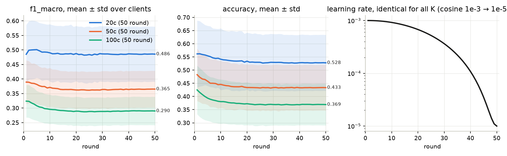
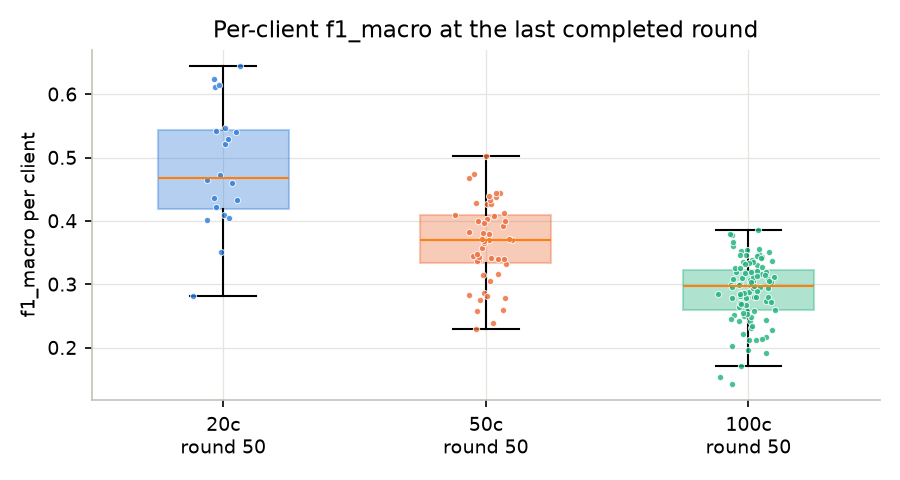
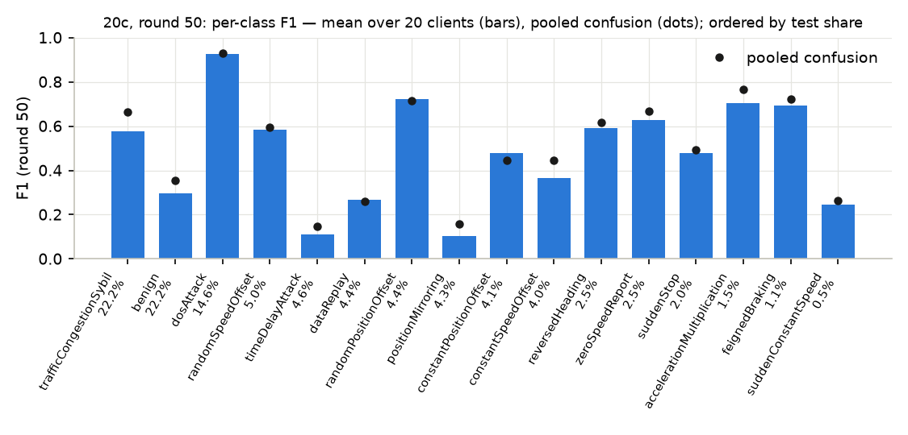
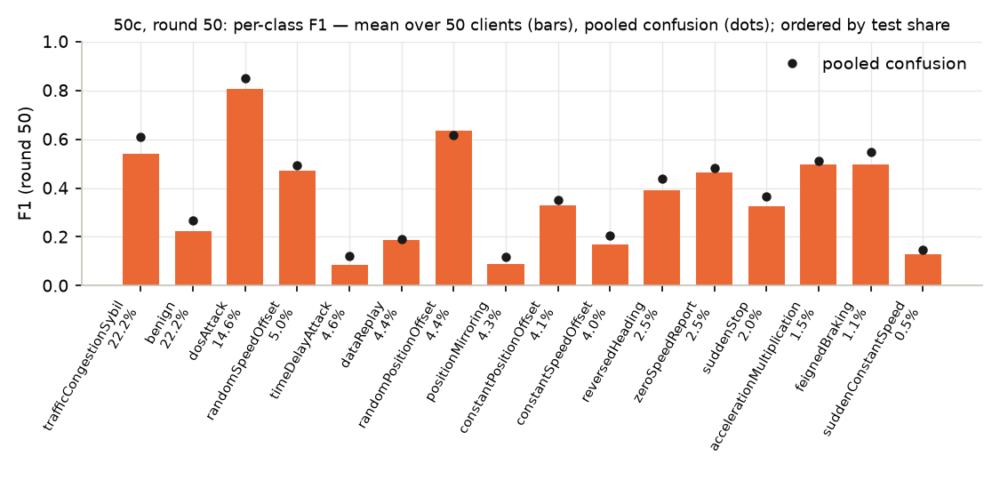
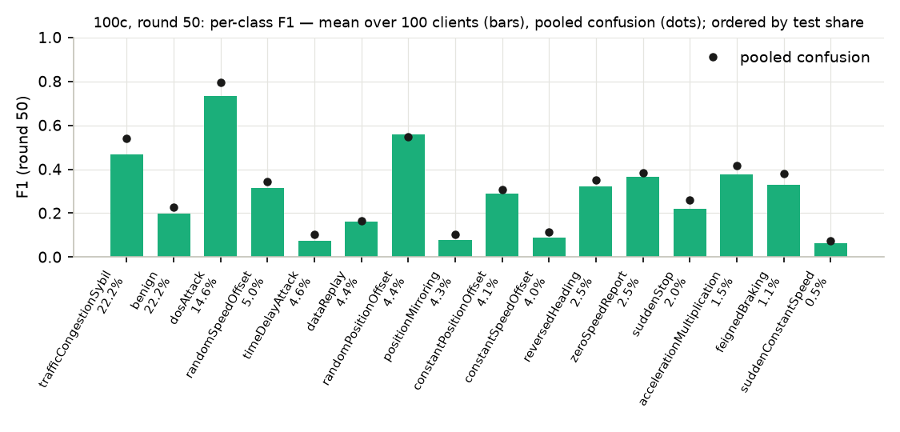
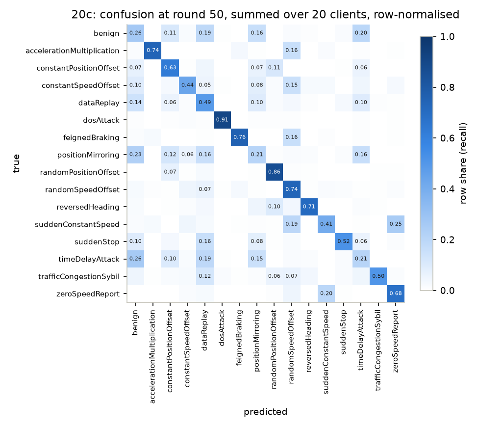
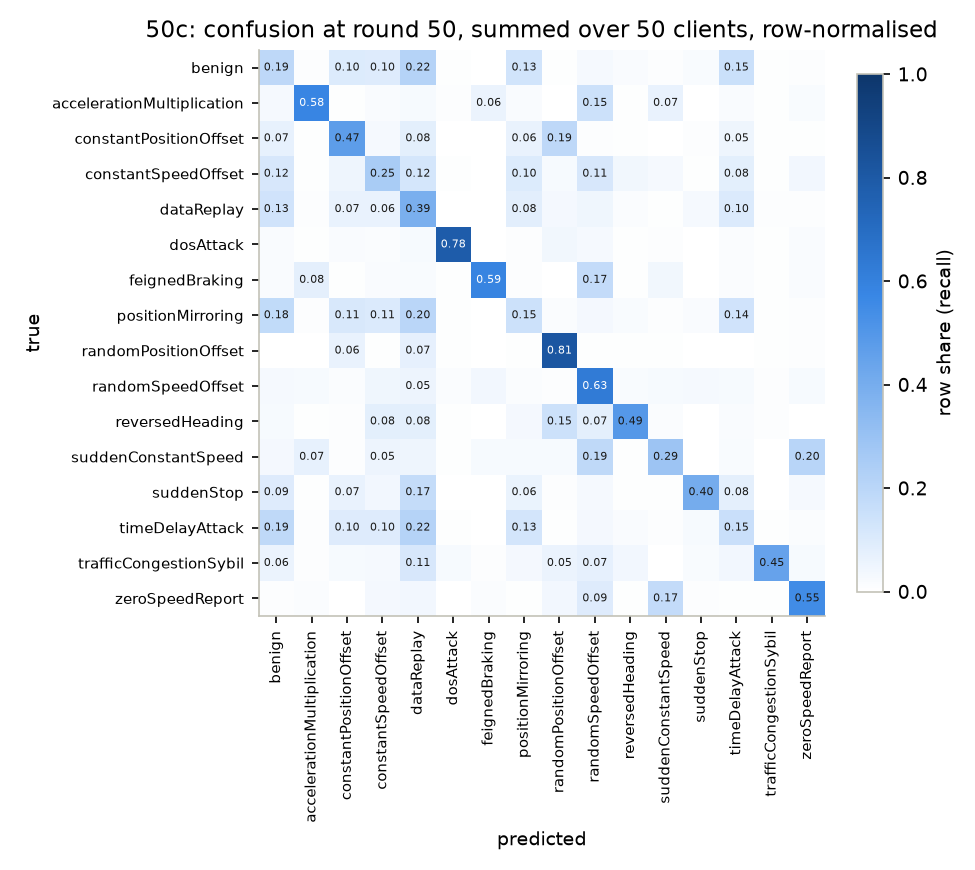
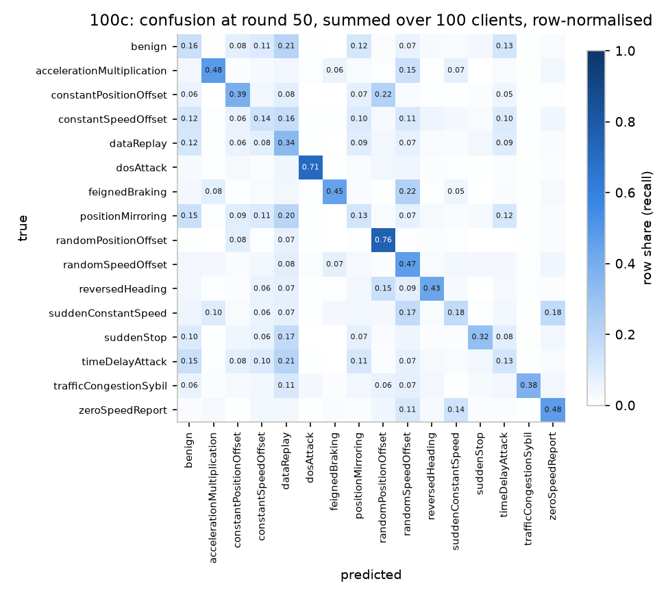
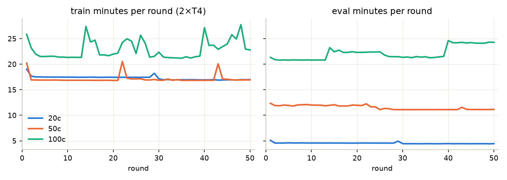

# Báo cáo dựng lại pFedES trên VeReMi NextGen / DAGSNet

**Trạng thái: HOÀN TẤT.** Cả ba kịch bản 20 / 50 / 100 client đã chạy đủ **50/50 round**; mọi con số dưới đây là
số chính thức, đọc từ ba thư mục run đã ghép và verify (`runs/merged/pfedes_{20,50,100}c_cos/`).
Ngày lập: 2026-09-15, hoàn tất 2026-09-16. Nguồn số liệu: [`report_data/`](report_data/) (sinh bởi
[`scripts/report_data.py`](../../scripts/report_data.py) từ artifact đã kéo về và verify local; không có số nào
lấy từ W&B). Sổ quyết định: [`rebuild.md`](rebuild.md); phương pháp gốc: [`paper.md`](paper.md).

---

## 1. Tóm tắt

| | 20 client | 50 client | 100 client |
|---|---:|---:|---:|
| round hoàn tất / kế hoạch | **50 / 50** | **50 / 50** | **50 / 50** |
| f1_macro round cuối (mean trên client) | **0,4856** | **0,3652** | **0,2900** |
| accuracy round cuối | 0,5276 | 0,4335 | 0,3692 |
| f1_macro round 1 → đỉnh hậu kiểm → cuối | 0,4851 → 0,5010 (r5) → 0,4856 | 0,3893 → 0,3893 (r1) → 0,3652 | 0,3238 → 0,3238 (r1) → 0,2900 |
| client yếu nhất / mạnh nhất (f1_macro) | #12 0,282 / #6 0,645 | #15 0,230 / #11 0,502 | #14 0,142 / #57 0,385 |
| round-time trung vị trên 2×T4 | 22,0 phút | 28,6 phút | 44,2 phút |
| tổng giờ round (không kể startup) | 18,2 h | 23,9 h | 37,6 h |

Ba điều cần đọc cùng bảng trên:

1. **Điểm số giảm mạnh theo số client** (0,486 → 0,365 → 0,290). Mỗi kịch bản chia lại *cùng* 43 triệu dòng
   train, nên client càng nhiều thì mỗi F_k càng ít dữ liệu (trung vị 1,82 M → 713 k → 383 k dòng) và càng lệch
   phân bố; F_k chỉ được giám sát bằng nhãn cục bộ, còn tri thức toàn cục trong G chỉ đi vào nhánh x̂ lúc train
   và **không được dùng lúc suy luận** (đúng quy tắc của bài báo).
2. **Đường cong không đi lên.** Round 1 (một epoch cục bộ) đã là mức cao nhất hoặc gần nhất; sau đó điểm trên
   test toàn cục giảm chậm rồi phẳng từ khoảng round 15 (20c, 50c) / round 25 (100c) khi LR cosine hạ thấp.
   Đây là hiện tượng đã dự đoán trước khi chạy (CONTEXT.md §12.4), không phải lỗi pipeline.
3. **Số này không so được với Table 1–2 của bài báo** (mục 6): khác dữ liệu, khác số lớp, khác cách chia test,
   và tham gia C = 100 % thay vì 100 %/20 %/10 %.

Caveat bắt buộc (mục 3.3 và 7) đi kèm mọi con số: test toàn cục thay vì test riêng client; mất cân bằng 41:1 nên
đọc `f1_macro` chứ không đọc `accuracy`; rò rỉ Sybil; scaler fit trên toàn bộ train; một seed.

## 2. Bài báo và những gì được dựng lại

**Bài báo.** Yi L., Yu H., Ren C., Wang G., Liu X., Li X. *pFedES: Generalized Proxy Feature Extractor Sharing
for Model Heterogeneous Personalized Federated Learning.* Bản markdown trong repo ([`00121-YiL.md`](../../00121-YiL.md))
**không có phụ lục**: Algorithm 1, Table 3–4 (kiến trúc CNN-1…5), giá trị μ và E_fe đã chọn đều thiếu.

**Cơ chế được dựng lại đầy đủ** (Eq. (4)–(11), [`proj/pfedes.py`](proj/pfedes.py)):

- Server chỉ giữ và tổng hợp **proxy feature extractor G(θ)** nhỏ; classifier F_k(ω_k) của từng client không
  bao giờ rời client.
- Mỗi round, client k: **bước ①** đóng băng G, train F_k với ℓ_ω = μ·CE(F_k(G(x)), y) + (1−μ)·CE(F_k(x), y);
  **bước ②** đóng băng F_k, train G với CE(F_k(G(x)), y); gửi θ_k lên server; server lấy trung bình theo n_k.
- Suy luận chỉ dùng **F_k(x)** (bài báo: "only each client's personalized heterogeneous local model … is used
  for inference").

**Những gì thay đổi so với bài báo** — quyết định của bản dựng, chi tiết và lý do tại [`rebuild.md`](rebuild.md) §1–2:

| hạng mục | bài báo | bản dựng | lý do ngắn |
|---|---|---|---|
| dữ liệu / bài toán | MNIST, CIFAR-10/100, ảnh | **VeReMi NextGen**, 66 đặc trưng dạng bảng, **16 lớp** IDS | mục tiêu dự án |
| F_k | CNN-1…5 | **DAGSNet** 395 024 tham số, cùng một init (seed 42) cho mọi client | kiến trúc chuẩn của dự án |
| G | 2 lớp conv `padding=same` | **DAGSNet với head ra 66** (407 874 tham số) để x̂ cùng chiều x | chủ dự án chọn |
| tham gia C | 100 % / 20 % / 10 % (N = 10 / 50 / 100) | **100 % cho cả 20 / 50 / 100 client** | mean/std trên mọi client chỉ có nghĩa khi mọi F_k đều được train |
| optimizer, LR | SGD 0,01 hằng | **AdamW** wd 1e-4, tạo mới mỗi client mỗi round; **LR cosine theo round 1e-3 → 1e-5, T = 50** | LR scan local: LR hằng làm F_k overfit cục bộ rồi trôi xuống trên test toàn cục, cosine chặn đà trôi (CONTEXT.md §12.4) |
| μ, E, E_fe | μ ∈ (0; 0,5], giá trị không có | **μ = 0,5; E = E_fe = 1** | bài báo không cho giá trị |
| T, batch | 100–500 round, B ∈ {64…512} | **50 round**, batch 512 / 512 / 256 | ngân sách Kaggle |
| test | riêng từng client (8:2) | **toàn bộ 10 761 343 dòng test toàn cục, mọi client, mọi round** | đo tổng quát hoá toàn cục của mô hình cá thể hoá |
| metric | accuracy trung bình client | **10 metric** (accuracy, precision/recall/f1 × macro/micro/weighted), mean/std/min/max trên N client | hợp đồng dự án |
| bước ① | hai forward F_k(x̂), F_k(x) | **một forward trên batch ghép [x̂; x]** (BN của F_k thấy cả hai nửa) | CUDA-graph không cho gọi module compiled hai lần trước backward |
| Eq. (11) | chuẩn hoá theo n toàn cục | chuẩn hoá theo tập **được chọn** (= mọi client khi C = 100 %) | theo chữ thì θ bị co khi C < 100 % |

Hai điểm phụ đã kiểm bằng thí nghiệm local (CONTEXT.md §12.2): dùng F_k(G(x)) lúc test cho accuracy cao hơn
(+0,06) nhưng **không dùng** vì lệch quy tắc suy luận của bài báo; tính lại BN trên x-only làm điểm *tệ hơn*, nên
batch ghép ở bước ① là tự nhất quán.

> **Lưu ý về bản trước.** Trước cấu hình này có một bản chạy **LR hằng 1e-3** đã bị **thay thế hoàn toàn** và
> không đóng góp con số nào cho báo cáo này; mọi kết quả dưới đây đều từ cấu hình C = 100 % + LR cosine. Lý do
> thay thế: xem [`rebuild.md`](rebuild.md) (lưu ý đầu file).

## 3. Dữ liệu

Số đo thật từ [`knowledge/DATASET.md`](../../knowledge/DATASET.md) (audit 2026-09-07), không chép từ README.

### 3.1 Kích thước và phân mảnh

| | dòng | ghi chú |
|---|---:|---|
| train (mọi kịch bản) | **43 045 415** | đã z-score sẵn; 66 cột `f_*`, nhãn `int8` 0…15 |
| test toàn cục | **10 761 343** | chưa chuẩn hoá, áp `scaler.json` của train đúng một lần; chỉ có scenario `highway_7`, `urban_7` |

| kịch bản | rows/client min / trung vị / max | số lớp/client | client có đủ 16 lớp |
|---:|---|---|---:|
| 20 | 870 217 / 1 817 459 / 5 890 990 | 16 | 20 / 20 |
| 50 | 199 063 / 713 022 / 2 630 929 | 15–16 | 44 / 50 |
| 100 | 98 180 / 383 001 / 1 333 839 | 14–16 | 86 / 100 |

Phân mảnh Dirichlet **α = 0,5 trên nhãn** là non-IID *lệch tỉ lệ*, không phải *thiếu lớp*: hầu như client nào cũng
thấy ≥ 14 lớp vì mỗi client có hàng trăm nghìn dòng. Khác hẳn benchmark ảnh nhỏ của bài báo (2/10 lớp mỗi client).

### 3.2 16 lớp và mất cân bằng (tỉ lệ trên test)

| lớp | tỉ lệ test | lớp | tỉ lệ test |
|---|---:|---|---:|
| trafficCongestionSybil | 22,24 % | positionMirroring | 4,34 % |
| benign | 22,22 % | constantPositionOffset | 4,11 % |
| dosAttack | 14,63 % | constantSpeedOffset | 4,03 % |
| randomSpeedOffset | 5,04 % | reversedHeading | 2,51 % |
| timeDelayAttack | 4,56 % | zeroSpeedReport | 2,48 % |
| dataReplay | 4,42 % | suddenStop | 1,97 % |
| randomPositionOffset | 4,37 % | accelerationMultiplication | 1,46 % |
| | | feignedBraking | 1,10 % |
| | | suddenConstantSpeed | 0,54 % |

Tỉ số lớn nhất/nhỏ nhất **41:1** (cả train lẫn test) ⇒ `accuracy` bị hai lớp lớn chi phối; đọc **`f1_macro`**.

### 3.3 Caveat của dữ liệu (phải đi cùng mọi con số)

1. Split theo **thời gian mô phỏng**, không theo xe; hình học bản đồ dịch chuyển giữa train và test
   (`f_*_x_rel` mean +0,198 sau chuẩn hoá) — lệch phân bố là thật.
2. **Rò rỉ Sybil:** 100 % dòng `trafficCongestionSybil` nằm trong flow mà mọi dòng cùng nhãn.
3. `benign` lấy từ luồng không có tấn công ⇒ nhóm đặc trưng `rate` bất thường mạnh.
4. 3 338 358 dòng nhập nhằng đã bị loại từ nguồn.
5. **`scaler.json` fit trên toàn bộ 43 M dòng train** — thống kê toàn cục mà client FL thật không có.
6. Đặc trưng thường trú trên GPU ở **fp16** (max |x| = 570 < 65 504, an toàn nhưng đã lượng tử hoá).
7. **Test không chia theo client:** mọi client đo trên cùng 10,76 M dòng ⇒ điểm đo tổng quát hoá toàn cục,
   không đo hiệu năng trên phân bố cục bộ như bài báo.
8. Client = receiver unit mô phỏng, không phải xe/RSU thật.

## 4. Cấu hình hiệu lực và hạ tầng

Đọc từ `reports/manifest.json` của run đã kéo về (không suy từ notebook nguồn). Cả ba kịch bản cùng:
`lr` 1e-3, `lr_schedule` cosine, `lr_min` 1e-5, `rounds` 50, `weight_decay` 1e-4, `mu` 0,5, `local_epochs` 1,
`proxy_epochs` 1, `participation` 1,0, `clip` 1,0, `seed` 42, `eval_batch` 16 384; `batch` 512 / 512 / 256;
fp16 AMP với GradScaler riêng cho ω và θ; F_k 395 024 và G 407 874 tham số; torch 2.10.0+cu128, CUDA 12.8;
train **và** eval đều `torch.compile` (backend `compiled` ở mọi round). Fingerprint cấu hình (24 khoá):
20c `3b90a02e92ab425d`, 50c `42af8af8cc4d38af`, 100c `f7c3d21a510cf7dc`.

**Phần cứng:** Kaggle 2×Tesla T4 (16 GB, sm_75), 4 vCPU; 2 worker process, mỗi GPU một; VRAM 7,0–7,4 GiB/GPU.
Một run bị cắt thành nhiều phiên bởi trần 12 h/phiên và quota 30 h/tuần/tài khoản; phiên sau resume từ
checkpoint trọng số của phiên trước (cùng fingerprint), rồi được ghép lại thành **một run duy nhất** với kiểm tra
byte-identical trên mọi round chồng ([`merge_sessions.py`](../../.agents/skills/kaggle-training-notebook/scripts/merge_sessions.py)).

| | phiên (round mới mỗi phiên) | tài khoản / kernel | thời gian | quota GPU ≈ |
|---|---|---|---|---:|
| 20c | 2 (28 + 22) | `minhtriethihi/pfedes-veremi-20-clients-cos[-s2]` | 13-09 13:20Z → 14-09 ~09:30Z | 20,4 h |
| 50c | 3 (21 + 21 + 8) | `khanhmay0304/pfedes-veremi-50-clients-cos[-s2,-s3]` | 13-09 13:20Z → 14-09 ~21:20Z | 25,4 h |
| 100c | 4 (13 + 12 + 14 + 11) | `odixe0502/…-100-clients-cos[-s2]`, `minhtrit06/…-100-clients-cos-s3[-s4]` | 13-09 13:20Z → 15-09 20:15Z | 38,9 h (`odixe0502` 18,9 + `minhtrit06` 20,0) |

Run W&B (giám sát, không phải nguồn số): `21522798-uit/pfedes-veremi`, id `pfedes_{20,50,100}c_cos`.

## 5. Kết quả

### 5.1 Đường cong theo round

*Điều cần thấy:* cả ba đường **không đi lên** sau round 1; dải ± std (độ phân tán giữa client) rộng hơn nhiều so với
biến động theo round.

| | 20c | 50c | 100c |
|---|---:|---:|---:|
| f1_macro round 1 | 0,4851 | 0,3893 | 0,3238 |
| f1_macro đỉnh hậu kiểm (round) | 0,5010 (r5) | 0,3893 (r1) | 0,3238 (r1) |
| f1_macro round cuối | **0,4856** (r50) | **0,3652** (r50) | **0,2900** (r50) |
| giảm so đỉnh | −3,1 % | −6,2 % | −10,5 % |
| phẳng từ round ≈ | 15 (0,484–0,487) | 15 (0,362–0,365) | 25 (0,287–0,291) |
| accuracy round 1 → cuối | 0,5615 → 0,5276 | 0,4826 → 0,4335 | 0,4248 → 0,3692 |

"Đỉnh" là quan sát *sau khi chạy* trên chính tập test, không phải checkpoint được chọn; số công bố là **round cuối**.
Cơ chế của hình dạng này (đo ở CONTEXT.md §12): sau một epoch cục bộ F_k đã đạt trần trên test toàn cục; các
epoch tiếp theo (C = 100 % ⇒ 50 epoch/client) cá thể hoá tiếp trên phân bố cục bộ, loss train rơi về ~0,002
trong khi điểm test toàn cục giảm; LR cosine **chặn đà trôi** (LR scan local, CONTEXT.md §12.4) nhưng
**không kéo lại đỉnh**.

### 5.2 Round cuối — đủ 10 metric

Trung bình không trọng số trên N client; mỗi client trên toàn bộ 10 761 343 dòng test. Trong bài toán đa lớp đơn
nhãn: **accuracy = precision_micro = recall_micro = recall_weighted = f1_micro** (giữ đủ cột theo hợp đồng).

| metric | 20c (r50) | 50c (r50) | 100c (r50) |
|---|---:|---:|---:|
| accuracy | 0,5276 | 0,4335 | 0,3692 |
| precision_macro | 0,5921 | 0,4882 | 0,3987 |
| precision_micro | 0,5276 | 0,4335 | 0,3692 |
| precision_weighted | 0,6805 | 0,6172 | 0,5576 |
| recall_macro | 0,5656 | 0,4481 | 0,3709 |
| recall_micro | 0,5276 | 0,4335 | 0,3692 |
| recall_weighted | 0,5276 | 0,4335 | 0,3692 |
| **f1_macro** | **0,4856** | **0,3652** | **0,2900** |
| f1_micro | 0,5276 | 0,4335 | 0,3692 |
| f1_weighted | 0,5054 | 0,4171 | 0,3556 |
| f1_macro std / min / max trên client | 0,0947 / 0,2817 / 0,6450 | 0,0633 / 0,2298 / 0,5022 | 0,0489 / 0,1424 / 0,3855 |

Bảng **mọi round × 10 metric** của từng kịch bản ở Phụ lục A–C (nguồn `report_data/history_Kc.csv`).
`precision_weighted` cao hơn `accuracy` 0,15–0,19 ở cả ba K: khi mô hình *đoán* một lớp lớn thì thường đúng,
nhưng nó bỏ sót phần lớn `benign` (recall gộp 0,26 / 0,19 / 0,16) — xem 5.4.

### 5.3 Phân tán giữa client

| | 20c | 50c | 100c |
|---|---:|---:|---:|
| f1_macro tứ phân vị (min / Q1 / trung vị / Q3 / max) | 0,282 / 0,419 / 0,468 / 0,543 / 0,645 | 0,230 / 0,334 / 0,370 / 0,409 / 0,502 | 0,142 / 0,259 / 0,297 / 0,323 / 0,385 |
| số client f1_macro < 0,30 | 1 / 20 | 9 / 50 | 54 / 100 |
| tương quan Spearman (số dòng train của client, f1_macro) | 0,69 | 0,53 | 0,44 |

Kích thước dữ liệu cục bộ giải thích một phần lớn phân tán (client nhiều dữ liệu hơn thì tổng quát hoá tốt hơn),
và yếu dần khi N tăng — ở 100c mọi client đều nhỏ nên phần còn lại do *thành phần lớp* của client quyết định
(probe 20c: mọi lớp có f1 < 0,05 của một client đều là lớp client đó có < 1,2 % dữ liệu; CONTEXT.md §12.2).
Danh sách 10 metric của từng client: `report_data/per_client_final_Kc.csv`.

### 5.4 Theo lớp — round cuối

F1 từng lớp, **mean trên client** (trái) và trên **confusion gộp** của N client (phải); sắp theo tỉ lệ test giảm dần.

| lớp | tỉ lệ test | f1 mean 20c / 50c / 100c | f1 gộp 20c / 50c / 100c |
|---|---:|---|---|
| trafficCongestionSybil | 22,24 % | 0,578 / 0,540 / 0,467 | 0,666 / 0,609 / 0,540 |
| benign | 22,22 % | 0,296 / 0,225 / 0,197 | 0,353 / 0,267 / 0,226 |
| dosAttack | 14,63 % | **0,925** / **0,806** / **0,734** | 0,931 / 0,849 / 0,794 |
| randomSpeedOffset | 5,04 % | 0,585 / 0,473 / 0,315 | 0,595 / 0,493 / 0,345 |
| timeDelayAttack | 4,56 % | **0,112** / **0,085** / **0,074** | 0,149 / 0,120 / 0,105 |
| dataReplay | 4,42 % | 0,266 / 0,188 / 0,161 | 0,262 / 0,192 / 0,167 |
| randomPositionOffset | 4,37 % | 0,723 / 0,635 / 0,559 | 0,715 / 0,618 / 0,549 |
| positionMirroring | 4,34 % | **0,104** / **0,090** / **0,079** | 0,159 / 0,119 / 0,102 |
| constantPositionOffset | 4,11 % | 0,477 / 0,331 / 0,289 | 0,446 / 0,352 / 0,308 |
| constantSpeedOffset | 4,03 % | 0,364 / 0,171 / 0,089 | 0,447 / 0,204 / 0,114 |
| reversedHeading | 2,51 % | 0,590 / 0,391 / 0,322 | 0,618 / 0,439 / 0,353 |
| zeroSpeedReport | 2,48 % | 0,627 / 0,465 / 0,365 | 0,669 / 0,482 / 0,385 |
| suddenStop | 1,97 % | 0,480 / 0,325 / 0,220 | 0,495 / 0,365 / 0,259 |
| accelerationMultiplication | 1,46 % | 0,705 / 0,497 / 0,376 | 0,765 / 0,512 / 0,416 |
| feignedBraking | 1,10 % | 0,694 / 0,496 / 0,330 | 0,724 / 0,546 / 0,379 |
| suddenConstantSpeed | 0,54 % | 0,244 / 0,127 / 0,062 | 0,263 / 0,147 / 0,073 |

*Điều cần thấy trong confusion:*

- **Một cụm 4 lớp không tách được nhau: `benign`, `timeDelayAttack`, `positionMirroring`, `dataReplay`.** Ở 20c,
  hàng `benign` phân bố 26 % benign / 20 % timeDelay / 19 % dataReplay / 16 % positionMirroring; hàng
  `timeDelayAttack` gần như *cùng* phân bố (26 / 21 / 19 / 15 %). Ở 50c và 100c, `dataReplay` trở thành dự đoán
  lớn nhất cho cả ba lớp kia (≈ 21 %). Cả ba lớp tấn công này chỉ thay đổi *thời điểm/vị trí* của bản tin hợp lệ,
  nên về đặc trưng từng dòng chúng gần `benign`; `timeDelayAttack` đã được ghi là lớp khó ngay từ audit dữ liệu.
- **`dosAttack`** (0,93 / 0,81 / 0,73) và **`randomPositionOffset`** (0,72 / 0,64 / 0,56) là hai lớp dễ nhất —
  đặc trưng `rate` và nhiễu vị trí lớn tách trực tiếp.
- **`trafficCongestionSybil`** (22 % test) chỉ đạt f1 0,58 / 0,54 / 0,47 dù có rò rỉ Sybil; recall gộp 0,51 / 0,45 / 0,38.
  Đây là lớp kéo `accuracy` xuống nhiều nhất về tuyệt đối.
- Các lớp nhỏ (< 2,5 % test) **mất nhiều nhất khi N tăng**: `constantSpeedOffset` 0,36 → 0,17 → 0,09,
  `suddenConstantSpeed` 0,24 → 0,13 → 0,06, `feignedBraking` 0,69 → 0,50 → 0,33 — client nhỏ có quá ít dòng
  của lớp nhỏ để học riêng, và G không mang thông tin đó vào F_k(x).

Nguồn: `report_data/per_class_final_Kc.csv` (support, P/R/F1 mean và gộp, std/min/max trên client) và
`report_data/confusion_final_Kc.csv` (16×16 gộp).

### 5.5 Chi phí tính toán trên 2×T4

| | 20c | 50c | 100c |
|---|---:|---:|---:|
| train / round (trung vị) | 1046 s | 1013 s | 1318 s |
| eval / round (trung vị; N client × 10,76 M dòng) | 273 s | 687 s | 1290 s |
| round (trung vị / lớn nhất) | 1320 / 1448 s | 1716 / 1968 s | 2649 / 3114 s |
| tổng giờ train / eval / round | 14,4 / 3,8 / 18,2 h | 14,3 / 9,6 / 23,9 h | 19,1 / 18,5 / 37,6 h |
| bước optimizer / round (Σ ceil(n_k / batch)) | 84 083 | 84 098 | 168 200 |

Ở C = 100 %, mỗi round train đúng **một epoch trên toàn bộ 43 M dòng** bất kể N, nên train/round gần như không
đổi giữa 20c và 50c; 100c tốn hơn vì batch 256 (gấp đôi số bước, DAGSNet launch-bound) và nghẽn 4 vCPU. Eval tỉ
lệ thuận với N vì mọi client đều đổi trọng số mỗi round nên không có cache; ở 100c eval đã bằng train.
Round lớn nhất của 20c/50c là round có compile (round 1 hoặc round đầu mỗi phiên). Ở 100c, phiên 4 chạy chậm hơn
phiên 3 ≈ 12 % (round steady 2907 s so 2586 s, eval 1452 s so 1285 s trên cùng cấu hình — khác node T4), nên round
lớn nhất là round 48 của phiên 4 (3114 s) chứ không phải round compile (round 40: 3109 s).

## 6. Kết quả của bài báo (để riêng, không so trực tiếp)

Bài báo báo cáo **accuracy trung bình trên test riêng từng client** (chia 8:2 cùng phân bố với train), 3 lần chạy,
homogeneous (Table 1) và heterogeneous (Table 2); pFedES đạt (Table 1): MNIST 99,95 / 99,93 / 100,00,
CIFAR-10 96,68 / 95,74 / 92,89, CIFAR-100 74,42 / 63,55 / 55,15 (%) cho N = 10 (C 100 %) / 50 (C 20 %) / 100
(C 10 %); cao hơn baseline tốt nhất tới 1,29 % và tiết kiệm 99,6 % truyền tin, 82,9 % tính toán so với FedGH.

Bản dựng này **không tái lập được các con số đó và không nhằm làm vậy**: khác dữ liệu (bảng IDS 16 lớp, mất cân
bằng 41:1, split thời gian), khác cách chia test (toàn cục thay vì riêng client — chính là sự khác biệt làm đường
cong đi xuống: bài báo đo trên phân bố mà F_k đang cá thể hoá vào, còn ở đây cá thể hoá làm điểm toàn cục giảm),
khác N và C, khác optimizer/LR, và bài báo không cung cấp μ, E_fe, Algorithm 1. Điều **có thể** đối chiếu về mặt
định tính: xu hướng bài báo (điểm giảm khi N tăng, C giảm: CIFAR-100 74 → 64 → 55) cũng thấy ở đây (0,49 →
0,37 → 0,29) dù ở đây C luôn 100 %.

## 7. Bằng chứng ủng hộ và không ủng hộ điều gì

**Ủng hộ:**

- Pipeline pFedES chạy đúng cơ chế đã chốt trên dữ liệu thật ở quy mô 43 M dòng × 50 round × N client: mọi round
  `evaluated = N`, `cache_mismatch = 0`, backend compiled cả train lẫn eval, `lr` từng client khớp lịch cosine,
  phiên resume cho artifact **byte-identical** trên 28 (20c), 21 + 42 (50c) và 13 + 25 + 39 (100c) round chồng, verifier offline dựng lại
  mọi con số từ confusion (mục 8).
- Kết quả cuối **phẳng và tái lập được về mặt cơ chế**: với LR cosine đường cong phẳng từ round 15–25 và chỉ
  giảm −3 % / −6 % / −10 % so với đỉnh.
- Trần của F_k(x) trên test toàn cục là trần của "một epoch cục bộ": per-client DAGSNet không FL (`tinyproto`,
  cùng test) cho 0,51 / 0,40 / 0,33 phẳng suốt 50 round, pFedES round 1 = 0,49 / 0,39 / 0,32.

**Không ủng hộ / chưa có bằng chứng:**

- **Không thể kết luận pFedES tốt hơn hay kém hơn baseline** trên bộ dữ liệu này: chưa có FedAvg/Standalone/FedGH
  cùng cấu hình chạy trong repo này (`fd_ids`, `tinyproto` là dự án khác, cấu hình LR cũ).
- **Một seed**, một lần chạy mỗi kịch bản; không có khoảng tin cậy. Std báo cáo là phân tán *giữa client*, không phải
  giữa các lần chạy.
- **Không có ablation** μ, E_fe, kiến trúc G; μ = 0,5 và G = DAGSNet-66 là lựa chọn, chưa quét.
- Điểm trên **phân bố cục bộ** của từng client (thứ bài báo đo) **không được đo** — thí nghiệm local tái trọng số
  confusion theo prior cục bộ cho f1 0,535 / acc 0,754 ở probe 20c (so 0,481 / 0,556 toàn cục) nhưng chủ dự án
  quyết định không thêm metric này.
- Đường cong đi xuống là **overfit cục bộ theo epoch** đo được, không phải lỗi; nhưng chưa thử LR đỉnh thấp hơn
  (1e-4, 3e-4) — dự đoán từ LR scan là đường cong sẽ phẳng gần đỉnh hơn.
- Caveat dữ liệu (3.3): rò rỉ Sybil và scaler toàn cục làm điểm tuyệt đối *lạc quan*; split thời gian và test chỉ
  có scenario `_7` làm điểm *bi quan*; không tách được hai hiệu ứng.

## 8. Kiểm soát chất lượng và tái lập

| | 20c | 50c | 100c |
|---|---|---|---|
| thư mục run chuẩn | `runs/merged/pfedes_20c_cos/` | `runs/merged/pfedes_50c_cos/` | `runs/merged/pfedes_100c_cos/` |
| verifier offline `scripts/verify_run.py --require-rounds` | 50 pass | 50 pass | 50 pass |
| cache re-check (client không đổi trọng số phải cho confusion y hệt) | 0 lệch | 0 lệch | 0 lệch |
| ghép phiên | 28 round chồng byte-identical | 21 + 42 round chồng byte-identical | 13 + 25 + 39 round chồng byte-identical |
| provenance | `logs/sessions.json`, `logs/sessions/{n}/` (log kernel, manifest, `executed.ipynb`) | như 20c | như 20c (4 phiên) |

Artifact mỗi round: `weights/round_NNN.pt` (state_dict G + N state_dict F_k, `weights_only=True`),
`confusion/round_NNN.npy` (N × 16 × 16, mỗi ma trận tổng đúng 10 761 343), `metrics/round_NNN.json` (10 metric
mean/std/min/max + per-client + per-class), `logs/round_NNN.json` (lr, loss, bước, skip AMP từng client),
`complete/round_NNN.done` (marker cuối cùng); `preds/round_050.u8.npy` (N × 10,76 M) chỉ ở round 50;
`reports/manifest.json` (cấu hình hiệu lực, fingerprint, số dòng từng client). Trọng số: 33 / 81 / 160 MB/round.

Tái lập: `python scripts/gen_notebook.py --owner <acct> --clients {20,50,100} --run-tag _cos --max-hours 11.0`
(phiên tiếp: `--session N --require-resume --kernel-source <kernel phiên trước>`) → `validate_notebooks.py` →
`kaggle kernels push`; dataset Kaggle `odixe0502/veremi-fl-{20,50,100}client` + `odixe0502/veremi-nextgen2026-centralized`
(public); `machine_shape` NvidiaTeslaT4, `docker_image` pin theo digest. Mã nguồn duy nhất của notebook:
[`proj/`](proj/) (8 module); notebook đã thực thi của từng phiên nằm trong `logs/sessions/<n>/executed.ipynb`.

---

## Phụ lục — mọi round × 10 metric

Mean trên N client; `std / min / max` là của f1_macro; `train s` / `eval s` là giây của round đó. Nguồn:
`report_data/history_Kc.csv` (dẫn xuất từ `metrics/round_NNN.json`; đã đối chiếu JSON ↔ CSV).
accuracy = precision_micro = recall_micro = recall_weighted = f1_micro.

### A. 20 client — 50/50 round (chính thức)

| round | lr | accuracy | precision_macro | precision_micro | precision_weighted | recall_macro | recall_micro | recall_weighted | f1_macro | f1_micro | f1_weighted | f1_macro std | min | max | train s | eval s |
|---:|---:|---:|---:|---:|---:|---:|---:|---:|---:|---:|---:|---:|---:|---:|---:|---:|
| 1 | 1.00e-03 | 0.5615 | 0.6030 | 0.5615 | 0.6708 | 0.5431 | 0.5615 | 0.5615 | 0.4851 | 0.5615 | 0.5382 | 0.1013 | 0.2845 | 0.6682 | 1142 | 306 |
| 2 | 9.99e-04 | 0.5618 | 0.6158 | 0.5618 | 0.6911 | 0.5585 | 0.5618 | 0.5618 | 0.4990 | 0.5618 | 0.5395 | 0.1002 | 0.2885 | 0.6739 | 1060 | 273 |
| 3 | 9.96e-04 | 0.5591 | 0.6153 | 0.5591 | 0.6952 | 0.5662 | 0.5591 | 0.5591 | 0.5000 | 0.5591 | 0.5378 | 0.1012 | 0.2879 | 0.6705 | 1051 | 274 |
| 4 | 9.91e-04 | 0.5573 | 0.6134 | 0.5573 | 0.6933 | 0.5678 | 0.5573 | 0.5573 | 0.5005 | 0.5573 | 0.5346 | 0.1001 | 0.2871 | 0.6564 | 1051 | 274 |
| 5 | 9.84e-04 | 0.5541 | 0.6134 | 0.5541 | 0.6925 | 0.5663 | 0.5541 | 0.5541 | 0.5010 | 0.5541 | 0.5333 | 0.0971 | 0.2895 | 0.6460 | 1049 | 276 |
| 6 | 9.75e-04 | 0.5511 | 0.6115 | 0.5511 | 0.6897 | 0.5644 | 0.5511 | 0.5511 | 0.4970 | 0.5511 | 0.5294 | 0.0962 | 0.2844 | 0.6607 | 1049 | 275 |
| 7 | 9.64e-04 | 0.5464 | 0.6038 | 0.5464 | 0.6849 | 0.5629 | 0.5464 | 0.5464 | 0.4925 | 0.5464 | 0.5239 | 0.0987 | 0.2748 | 0.6523 | 1048 | 275 |
| 8 | 9.51e-04 | 0.5442 | 0.6002 | 0.5442 | 0.6845 | 0.5644 | 0.5442 | 0.5442 | 0.4928 | 0.5442 | 0.5221 | 0.0965 | 0.2893 | 0.6466 | 1049 | 276 |
| 9 | 9.36e-04 | 0.5449 | 0.6005 | 0.5449 | 0.6821 | 0.5632 | 0.5449 | 0.5449 | 0.4921 | 0.5449 | 0.5226 | 0.0953 | 0.2893 | 0.6491 | 1048 | 275 |
| 10 | 9.20e-04 | 0.5413 | 0.5962 | 0.5413 | 0.6794 | 0.5637 | 0.5413 | 0.5413 | 0.4900 | 0.5413 | 0.5189 | 0.0985 | 0.2850 | 0.6421 | 1048 | 274 |
| 11 | 9.02e-04 | 0.5391 | 0.5989 | 0.5391 | 0.6819 | 0.5591 | 0.5391 | 0.5391 | 0.4868 | 0.5391 | 0.5165 | 0.0988 | 0.2693 | 0.6440 | 1048 | 275 |
| 12 | 8.82e-04 | 0.5382 | 0.5948 | 0.5382 | 0.6826 | 0.5616 | 0.5382 | 0.5382 | 0.4871 | 0.5382 | 0.5161 | 0.0965 | 0.2904 | 0.6332 | 1047 | 274 |
| 13 | 8.61e-04 | 0.5366 | 0.5977 | 0.5366 | 0.6825 | 0.5620 | 0.5366 | 0.5366 | 0.4883 | 0.5366 | 0.5148 | 0.0946 | 0.2859 | 0.6424 | 1047 | 274 |
| 14 | 8.38e-04 | 0.5354 | 0.5944 | 0.5354 | 0.6818 | 0.5610 | 0.5354 | 0.5354 | 0.4856 | 0.5354 | 0.5132 | 0.0976 | 0.2761 | 0.6429 | 1047 | 275 |
| 15 | 8.14e-04 | 0.5344 | 0.5943 | 0.5344 | 0.6793 | 0.5605 | 0.5344 | 0.5344 | 0.4855 | 0.5344 | 0.5127 | 0.0963 | 0.2890 | 0.6422 | 1048 | 274 |
| 16 | 7.88e-04 | 0.5341 | 0.5944 | 0.5341 | 0.6817 | 0.5609 | 0.5341 | 0.5341 | 0.4866 | 0.5341 | 0.5136 | 0.0976 | 0.2745 | 0.6351 | 1047 | 274 |
| 17 | 7.62e-04 | 0.5344 | 0.5933 | 0.5344 | 0.6774 | 0.5623 | 0.5344 | 0.5344 | 0.4863 | 0.5344 | 0.5127 | 0.0980 | 0.2830 | 0.6493 | 1046 | 274 |
| 18 | 7.34e-04 | 0.5352 | 0.5933 | 0.5352 | 0.6781 | 0.5633 | 0.5352 | 0.5352 | 0.4873 | 0.5352 | 0.5135 | 0.1002 | 0.2812 | 0.6500 | 1046 | 273 |
| 19 | 7.05e-04 | 0.5303 | 0.5896 | 0.5303 | 0.6797 | 0.5617 | 0.5303 | 0.5303 | 0.4847 | 0.5303 | 0.5078 | 0.0952 | 0.2757 | 0.6474 | 1047 | 273 |
| 20 | 6.76e-04 | 0.5338 | 0.5919 | 0.5338 | 0.6800 | 0.5641 | 0.5338 | 0.5338 | 0.4875 | 0.5338 | 0.5125 | 0.0951 | 0.2769 | 0.6299 | 1046 | 274 |
| 21 | 6.46e-04 | 0.5300 | 0.5907 | 0.5300 | 0.6810 | 0.5616 | 0.5300 | 0.5300 | 0.4842 | 0.5300 | 0.5081 | 0.0962 | 0.2863 | 0.6378 | 1046 | 274 |
| 22 | 6.15e-04 | 0.5305 | 0.5906 | 0.5305 | 0.6783 | 0.5618 | 0.5305 | 0.5305 | 0.4851 | 0.5305 | 0.5092 | 0.0957 | 0.2822 | 0.6460 | 1046 | 275 |
| 23 | 5.84e-04 | 0.5297 | 0.5893 | 0.5297 | 0.6770 | 0.5610 | 0.5297 | 0.5297 | 0.4821 | 0.5297 | 0.5077 | 0.0960 | 0.2774 | 0.6481 | 1046 | 274 |
| 24 | 5.53e-04 | 0.5297 | 0.5900 | 0.5297 | 0.6775 | 0.5612 | 0.5297 | 0.5297 | 0.4825 | 0.5297 | 0.5076 | 0.0980 | 0.2730 | 0.6365 | 1046 | 274 |
| 25 | 5.21e-04 | 0.5296 | 0.5904 | 0.5296 | 0.6767 | 0.5624 | 0.5296 | 0.5296 | 0.4841 | 0.5296 | 0.5070 | 0.0966 | 0.2849 | 0.6402 | 1046 | 273 |
| 26 | 4.89e-04 | 0.5267 | 0.5895 | 0.5267 | 0.6789 | 0.5618 | 0.5267 | 0.5267 | 0.4820 | 0.5267 | 0.5043 | 0.0957 | 0.2771 | 0.6396 | 1045 | 274 |
| 27 | 4.57e-04 | 0.5276 | 0.5927 | 0.5276 | 0.6814 | 0.5631 | 0.5276 | 0.5276 | 0.4856 | 0.5276 | 0.5060 | 0.0942 | 0.2904 | 0.6417 | 1046 | 273 |
| 28 | 4.26e-04 | 0.5280 | 0.5901 | 0.5280 | 0.6804 | 0.5624 | 0.5280 | 0.5280 | 0.4837 | 0.5280 | 0.5061 | 0.0963 | 0.2796 | 0.6406 | 1047 | 273 |
| 29 | 3.95e-04 | 0.5296 | 0.5926 | 0.5296 | 0.6820 | 0.5645 | 0.5296 | 0.5296 | 0.4872 | 0.5296 | 0.5084 | 0.0952 | 0.2811 | 0.6372 | 1093 | 296 |
| 30 | 3.64e-04 | 0.5294 | 0.5908 | 0.5294 | 0.6789 | 0.5648 | 0.5294 | 0.5294 | 0.4863 | 0.5294 | 0.5079 | 0.0954 | 0.2810 | 0.6414 | 1028 | 267 |
| 31 | 3.34e-04 | 0.5292 | 0.5904 | 0.5292 | 0.6799 | 0.5652 | 0.5292 | 0.5292 | 0.4861 | 0.5292 | 0.5070 | 0.0959 | 0.2808 | 0.6483 | 1018 | 266 |
| 32 | 3.05e-04 | 0.5294 | 0.5903 | 0.5294 | 0.6787 | 0.5646 | 0.5294 | 0.5294 | 0.4862 | 0.5294 | 0.5073 | 0.0951 | 0.2862 | 0.6480 | 1020 | 267 |
| 33 | 2.76e-04 | 0.5292 | 0.5914 | 0.5292 | 0.6809 | 0.5643 | 0.5292 | 0.5292 | 0.4853 | 0.5292 | 0.5075 | 0.0958 | 0.2756 | 0.6367 | 1015 | 266 |
| 34 | 2.48e-04 | 0.5277 | 0.5893 | 0.5277 | 0.6785 | 0.5644 | 0.5277 | 0.5277 | 0.4847 | 0.5277 | 0.5057 | 0.0946 | 0.2798 | 0.6417 | 1017 | 266 |
| 35 | 2.22e-04 | 0.5275 | 0.5897 | 0.5275 | 0.6779 | 0.5644 | 0.5275 | 0.5275 | 0.4845 | 0.5275 | 0.5051 | 0.0941 | 0.2784 | 0.6388 | 1018 | 267 |
| 36 | 1.96e-04 | 0.5270 | 0.5913 | 0.5270 | 0.6801 | 0.5639 | 0.5270 | 0.5270 | 0.4841 | 0.5270 | 0.5047 | 0.0952 | 0.2855 | 0.6428 | 1017 | 266 |
| 37 | 1.72e-04 | 0.5279 | 0.5921 | 0.5279 | 0.6799 | 0.5650 | 0.5279 | 0.5279 | 0.4856 | 0.5279 | 0.5056 | 0.0951 | 0.2816 | 0.6456 | 1018 | 266 |
| 38 | 1.49e-04 | 0.5266 | 0.5913 | 0.5266 | 0.6788 | 0.5645 | 0.5266 | 0.5266 | 0.4849 | 0.5266 | 0.5048 | 0.0945 | 0.2817 | 0.6431 | 1018 | 266 |
| 39 | 1.28e-04 | 0.5269 | 0.5906 | 0.5269 | 0.6790 | 0.5647 | 0.5269 | 0.5269 | 0.4849 | 0.5269 | 0.5049 | 0.0949 | 0.2805 | 0.6436 | 1016 | 267 |
| 40 | 1.08e-04 | 0.5280 | 0.5936 | 0.5280 | 0.6810 | 0.5660 | 0.5280 | 0.5280 | 0.4865 | 0.5280 | 0.5060 | 0.0947 | 0.2795 | 0.6464 | 1016 | 267 |
| 41 | 9.01e-05 | 0.5283 | 0.5929 | 0.5283 | 0.6815 | 0.5658 | 0.5283 | 0.5283 | 0.4861 | 0.5283 | 0.5061 | 0.0946 | 0.2797 | 0.6436 | 1016 | 266 |
| 42 | 7.37e-05 | 0.5277 | 0.5924 | 0.5277 | 0.6809 | 0.5657 | 0.5277 | 0.5277 | 0.4857 | 0.5277 | 0.5057 | 0.0950 | 0.2806 | 0.6487 | 1019 | 267 |
| 43 | 5.90e-05 | 0.5279 | 0.5919 | 0.5279 | 0.6802 | 0.5659 | 0.5279 | 0.5279 | 0.4857 | 0.5279 | 0.5056 | 0.0951 | 0.2820 | 0.6432 | 1013 | 267 |
| 44 | 4.62e-05 | 0.5272 | 0.5905 | 0.5272 | 0.6788 | 0.5650 | 0.5272 | 0.5272 | 0.4849 | 0.5272 | 0.5052 | 0.0945 | 0.2824 | 0.6436 | 1014 | 266 |
| 45 | 3.52e-05 | 0.5272 | 0.5912 | 0.5272 | 0.6798 | 0.5655 | 0.5272 | 0.5272 | 0.4849 | 0.5272 | 0.5047 | 0.0953 | 0.2788 | 0.6454 | 1017 | 266 |
| 46 | 2.62e-05 | 0.5281 | 0.5919 | 0.5281 | 0.6797 | 0.5662 | 0.5281 | 0.5281 | 0.4861 | 0.5281 | 0.5059 | 0.0946 | 0.2811 | 0.6436 | 1017 | 267 |
| 47 | 1.91e-05 | 0.5277 | 0.5919 | 0.5277 | 0.6805 | 0.5659 | 0.5277 | 0.5277 | 0.4855 | 0.5277 | 0.5053 | 0.0955 | 0.2780 | 0.6464 | 1014 | 266 |
| 48 | 1.41e-05 | 0.5277 | 0.5922 | 0.5277 | 0.6813 | 0.5660 | 0.5277 | 0.5277 | 0.4857 | 0.5277 | 0.5055 | 0.0951 | 0.2814 | 0.6455 | 1018 | 267 |
| 49 | 1.10e-05 | 0.5281 | 0.5927 | 0.5281 | 0.6813 | 0.5659 | 0.5281 | 0.5281 | 0.4860 | 0.5281 | 0.5058 | 0.0948 | 0.2821 | 0.6465 | 1018 | 265 |
| 50 | 1.00e-05 | 0.5276 | 0.5921 | 0.5276 | 0.6805 | 0.5656 | 0.5276 | 0.5276 | 0.4856 | 0.5276 | 0.5054 | 0.0947 | 0.2817 | 0.6450 | 1018 | 267 |

### B. 50 client — 50/50 round (chính thức)

| round | lr | accuracy | precision_macro | precision_micro | precision_weighted | recall_macro | recall_micro | recall_weighted | f1_macro | f1_micro | f1_weighted | f1_macro std | min | max | train s | eval s |
|---:|---:|---:|---:|---:|---:|---:|---:|---:|---:|---:|---:|---:|---:|---:|---:|---:|
| 1 | 1.00e-03 | 0.4826 | 0.5042 | 0.4826 | 0.6162 | 0.4518 | 0.4826 | 0.4826 | 0.3893 | 0.4826 | 0.4686 | 0.0752 | 0.2031 | 0.5658 | 1213 | 740 |
| 2 | 9.99e-04 | 0.4728 | 0.5099 | 0.4728 | 0.6307 | 0.4554 | 0.4728 | 0.4728 | 0.3889 | 0.4728 | 0.4604 | 0.0729 | 0.2277 | 0.5634 | 1015 | 714 |
| 3 | 9.96e-04 | 0.4663 | 0.5090 | 0.4663 | 0.6313 | 0.4554 | 0.4663 | 0.4663 | 0.3855 | 0.4663 | 0.4529 | 0.0678 | 0.2535 | 0.5601 | 1015 | 712 |
| 4 | 9.91e-04 | 0.4642 | 0.5048 | 0.4642 | 0.6289 | 0.4566 | 0.4642 | 0.4642 | 0.3846 | 0.4642 | 0.4501 | 0.0691 | 0.2463 | 0.5352 | 1013 | 720 |
| 5 | 9.84e-04 | 0.4578 | 0.5015 | 0.4578 | 0.6274 | 0.4546 | 0.4578 | 0.4578 | 0.3814 | 0.4578 | 0.4442 | 0.0677 | 0.2401 | 0.5458 | 1014 | 715 |
| 6 | 9.75e-04 | 0.4503 | 0.4956 | 0.4503 | 0.6229 | 0.4525 | 0.4503 | 0.4503 | 0.3768 | 0.4503 | 0.4365 | 0.0660 | 0.2462 | 0.5241 | 1013 | 709 |
| 7 | 9.64e-04 | 0.4501 | 0.4931 | 0.4501 | 0.6210 | 0.4509 | 0.4501 | 0.4501 | 0.3742 | 0.4501 | 0.4355 | 0.0645 | 0.2293 | 0.5232 | 1014 | 722 |
| 8 | 9.51e-04 | 0.4492 | 0.4901 | 0.4492 | 0.6203 | 0.4514 | 0.4492 | 0.4492 | 0.3742 | 0.4492 | 0.4334 | 0.0659 | 0.2283 | 0.5132 | 1013 | 724 |
| 9 | 9.36e-04 | 0.4448 | 0.4877 | 0.4448 | 0.6165 | 0.4468 | 0.4448 | 0.4448 | 0.3692 | 0.4448 | 0.4291 | 0.0669 | 0.2377 | 0.5251 | 1012 | 726 |
| 10 | 9.20e-04 | 0.4457 | 0.4857 | 0.4457 | 0.6159 | 0.4479 | 0.4457 | 0.4457 | 0.3712 | 0.4457 | 0.4313 | 0.0669 | 0.2391 | 0.5053 | 1011 | 721 |
| 11 | 9.02e-04 | 0.4432 | 0.4853 | 0.4432 | 0.6158 | 0.4471 | 0.4432 | 0.4432 | 0.3685 | 0.4432 | 0.4273 | 0.0645 | 0.2311 | 0.5147 | 1011 | 719 |
| 12 | 8.82e-04 | 0.4412 | 0.4825 | 0.4412 | 0.6164 | 0.4474 | 0.4412 | 0.4412 | 0.3677 | 0.4412 | 0.4259 | 0.0652 | 0.2376 | 0.5117 | 1012 | 719 |
| 13 | 8.61e-04 | 0.4403 | 0.4812 | 0.4403 | 0.6124 | 0.4467 | 0.4403 | 0.4403 | 0.3668 | 0.4403 | 0.4243 | 0.0643 | 0.2334 | 0.5053 | 1011 | 711 |
| 14 | 8.38e-04 | 0.4379 | 0.4775 | 0.4379 | 0.6107 | 0.4456 | 0.4379 | 0.4379 | 0.3642 | 0.4379 | 0.4220 | 0.0637 | 0.2175 | 0.5057 | 1012 | 717 |
| 15 | 8.14e-04 | 0.4369 | 0.4796 | 0.4369 | 0.6125 | 0.4450 | 0.4369 | 0.4369 | 0.3636 | 0.4369 | 0.4209 | 0.0640 | 0.2268 | 0.5046 | 1011 | 724 |
| 16 | 7.88e-04 | 0.4368 | 0.4801 | 0.4368 | 0.6140 | 0.4453 | 0.4368 | 0.4368 | 0.3639 | 0.4368 | 0.4206 | 0.0639 | 0.2347 | 0.5082 | 1011 | 709 |
| 17 | 7.62e-04 | 0.4368 | 0.4800 | 0.4368 | 0.6144 | 0.4454 | 0.4368 | 0.4368 | 0.3637 | 0.4368 | 0.4210 | 0.0618 | 0.2310 | 0.4961 | 1011 | 709 |
| 18 | 7.34e-04 | 0.4382 | 0.4802 | 0.4382 | 0.6135 | 0.4448 | 0.4382 | 0.4382 | 0.3641 | 0.4382 | 0.4224 | 0.0628 | 0.2290 | 0.4995 | 1011 | 710 |
| 19 | 7.05e-04 | 0.4353 | 0.4775 | 0.4353 | 0.6114 | 0.4448 | 0.4353 | 0.4353 | 0.3631 | 0.4353 | 0.4193 | 0.0630 | 0.2263 | 0.4950 | 1011 | 720 |
| 20 | 6.76e-04 | 0.4339 | 0.4792 | 0.4339 | 0.6127 | 0.4438 | 0.4339 | 0.4339 | 0.3622 | 0.4339 | 0.4180 | 0.0643 | 0.2238 | 0.5039 | 1010 | 718 |
| 21 | 6.46e-04 | 0.4339 | 0.4796 | 0.4339 | 0.6127 | 0.4444 | 0.4339 | 0.4339 | 0.3621 | 0.4339 | 0.4179 | 0.0630 | 0.2264 | 0.4925 | 1009 | 714 |
| 22 | 6.15e-04 | 0.4338 | 0.4805 | 0.4338 | 0.6137 | 0.4438 | 0.4338 | 0.4338 | 0.3629 | 0.4338 | 0.4178 | 0.0640 | 0.2315 | 0.5059 | 1232 | 734 |
| 23 | 5.84e-04 | 0.4335 | 0.4783 | 0.4335 | 0.6120 | 0.4445 | 0.4335 | 0.4335 | 0.3627 | 0.4335 | 0.4174 | 0.0635 | 0.2374 | 0.5075 | 1036 | 700 |
| 24 | 5.53e-04 | 0.4331 | 0.4801 | 0.4331 | 0.6140 | 0.4438 | 0.4331 | 0.4331 | 0.3617 | 0.4331 | 0.4168 | 0.0629 | 0.2369 | 0.5094 | 1026 | 699 |
| 25 | 5.21e-04 | 0.4323 | 0.4802 | 0.4323 | 0.6140 | 0.4438 | 0.4323 | 0.4323 | 0.3614 | 0.4323 | 0.4167 | 0.0643 | 0.2328 | 0.5014 | 1028 | 667 |
| 26 | 4.89e-04 | 0.4340 | 0.4818 | 0.4340 | 0.6135 | 0.4434 | 0.4340 | 0.4340 | 0.3624 | 0.4340 | 0.4181 | 0.0629 | 0.2287 | 0.4996 | 1029 | 681 |
| 27 | 4.57e-04 | 0.4333 | 0.4803 | 0.4333 | 0.6127 | 0.4450 | 0.4333 | 0.4333 | 0.3621 | 0.4333 | 0.4169 | 0.0634 | 0.2358 | 0.5063 | 1015 | 678 |
| 28 | 4.26e-04 | 0.4336 | 0.4825 | 0.4336 | 0.6145 | 0.4447 | 0.4336 | 0.4336 | 0.3623 | 0.4336 | 0.4175 | 0.0630 | 0.2322 | 0.4932 | 1015 | 667 |
| 29 | 3.95e-04 | 0.4320 | 0.4826 | 0.4320 | 0.6154 | 0.4450 | 0.4320 | 0.4320 | 0.3620 | 0.4320 | 0.4155 | 0.0637 | 0.2229 | 0.5023 | 1020 | 667 |
| 30 | 3.64e-04 | 0.4338 | 0.4835 | 0.4338 | 0.6151 | 0.4460 | 0.4338 | 0.4338 | 0.3639 | 0.4338 | 0.4176 | 0.0637 | 0.2259 | 0.4865 | 1011 | 667 |
| 31 | 3.34e-04 | 0.4342 | 0.4841 | 0.4342 | 0.6144 | 0.4461 | 0.4342 | 0.4342 | 0.3639 | 0.4342 | 0.4180 | 0.0637 | 0.2286 | 0.5059 | 1011 | 667 |
| 32 | 3.05e-04 | 0.4323 | 0.4833 | 0.4323 | 0.6144 | 0.4450 | 0.4323 | 0.4323 | 0.3623 | 0.4323 | 0.4155 | 0.0650 | 0.2226 | 0.5130 | 1026 | 667 |
| 33 | 2.76e-04 | 0.4333 | 0.4825 | 0.4333 | 0.6129 | 0.4464 | 0.4333 | 0.4333 | 0.3628 | 0.4333 | 0.4169 | 0.0633 | 0.2287 | 0.5092 | 1011 | 667 |
| 34 | 2.48e-04 | 0.4324 | 0.4843 | 0.4324 | 0.6146 | 0.4459 | 0.4324 | 0.4324 | 0.3637 | 0.4324 | 0.4163 | 0.0636 | 0.2296 | 0.4948 | 1019 | 667 |
| 35 | 2.22e-04 | 0.4336 | 0.4857 | 0.4336 | 0.6160 | 0.4469 | 0.4336 | 0.4336 | 0.3641 | 0.4336 | 0.4169 | 0.0624 | 0.2281 | 0.5031 | 1010 | 667 |
| 36 | 1.96e-04 | 0.4336 | 0.4851 | 0.4336 | 0.6152 | 0.4463 | 0.4336 | 0.4336 | 0.3641 | 0.4336 | 0.4172 | 0.0638 | 0.2230 | 0.4957 | 1010 | 667 |
| 37 | 1.72e-04 | 0.4343 | 0.4848 | 0.4343 | 0.6154 | 0.4475 | 0.4343 | 0.4343 | 0.3649 | 0.4343 | 0.4179 | 0.0639 | 0.2244 | 0.4948 | 1011 | 667 |
| 38 | 1.49e-04 | 0.4326 | 0.4848 | 0.4326 | 0.6160 | 0.4467 | 0.4326 | 0.4326 | 0.3633 | 0.4326 | 0.4164 | 0.0628 | 0.2290 | 0.4976 | 1011 | 667 |
| 39 | 1.28e-04 | 0.4343 | 0.4864 | 0.4343 | 0.6160 | 0.4480 | 0.4343 | 0.4343 | 0.3650 | 0.4343 | 0.4181 | 0.0633 | 0.2311 | 0.5120 | 1011 | 667 |
| 40 | 1.08e-04 | 0.4330 | 0.4865 | 0.4330 | 0.6163 | 0.4466 | 0.4330 | 0.4330 | 0.3638 | 0.4330 | 0.4167 | 0.0634 | 0.2305 | 0.5039 | 1011 | 667 |
| 41 | 9.01e-05 | 0.4328 | 0.4868 | 0.4328 | 0.6169 | 0.4475 | 0.4328 | 0.4328 | 0.3649 | 0.4328 | 0.4167 | 0.0631 | 0.2337 | 0.5074 | 1011 | 667 |
| 42 | 7.37e-05 | 0.4334 | 0.4865 | 0.4334 | 0.6165 | 0.4478 | 0.4334 | 0.4334 | 0.3643 | 0.4334 | 0.4170 | 0.0639 | 0.2297 | 0.5078 | 1011 | 667 |
| 43 | 5.90e-05 | 0.4334 | 0.4877 | 0.4334 | 0.6168 | 0.4474 | 0.4334 | 0.4334 | 0.3648 | 0.4334 | 0.4173 | 0.0630 | 0.2280 | 0.5010 | 1204 | 694 |
| 44 | 4.62e-05 | 0.4337 | 0.4872 | 0.4337 | 0.6167 | 0.4482 | 0.4337 | 0.4337 | 0.3652 | 0.4337 | 0.4174 | 0.0632 | 0.2283 | 0.5060 | 1024 | 670 |
| 45 | 3.52e-05 | 0.4330 | 0.4872 | 0.4330 | 0.6167 | 0.4479 | 0.4330 | 0.4330 | 0.3647 | 0.4330 | 0.4167 | 0.0632 | 0.2290 | 0.5023 | 1024 | 668 |
| 46 | 2.62e-05 | 0.4332 | 0.4870 | 0.4332 | 0.6162 | 0.4477 | 0.4332 | 0.4332 | 0.3645 | 0.4332 | 0.4168 | 0.0632 | 0.2293 | 0.5014 | 1015 | 668 |
| 47 | 1.91e-05 | 0.4335 | 0.4881 | 0.4335 | 0.6168 | 0.4479 | 0.4335 | 0.4335 | 0.3651 | 0.4335 | 0.4171 | 0.0630 | 0.2301 | 0.4994 | 1015 | 668 |
| 48 | 1.41e-05 | 0.4337 | 0.4882 | 0.4337 | 0.6172 | 0.4481 | 0.4337 | 0.4337 | 0.3651 | 0.4337 | 0.4173 | 0.0632 | 0.2299 | 0.5053 | 1015 | 667 |
| 49 | 1.10e-05 | 0.4338 | 0.4879 | 0.4338 | 0.6170 | 0.4482 | 0.4338 | 0.4338 | 0.3653 | 0.4338 | 0.4174 | 0.0632 | 0.2301 | 0.5009 | 1015 | 667 |
| 50 | 1.00e-05 | 0.4335 | 0.4882 | 0.4335 | 0.6172 | 0.4481 | 0.4335 | 0.4335 | 0.3652 | 0.4335 | 0.4171 | 0.0633 | 0.2298 | 0.5022 | 1016 | 669 |

### C. 100 client — 50/50 round (chính thức)

| round | lr | accuracy | precision_macro | precision_micro | precision_weighted | recall_macro | recall_micro | recall_weighted | f1_macro | f1_micro | f1_weighted | f1_macro std | min | max | train s | eval s |
|---:|---:|---:|---:|---:|---:|---:|---:|---:|---:|---:|---:|---:|---:|---:|---:|---:|
| 1 | 1.00e-03 | 0.4248 | 0.4337 | 0.4248 | 0.5818 | 0.3924 | 0.4248 | 0.4248 | 0.3238 | 0.4248 | 0.4110 | 0.0560 | 0.1536 | 0.4397 | 1550 | 1280 |
| 2 | 9.99e-04 | 0.4153 | 0.4351 | 0.4153 | 0.5817 | 0.3936 | 0.4153 | 0.4153 | 0.3232 | 0.4153 | 0.4033 | 0.0562 | 0.1571 | 0.4255 | 1391 | 1253 |
| 3 | 9.96e-04 | 0.4072 | 0.4271 | 0.4072 | 0.5779 | 0.3913 | 0.4072 | 0.4072 | 0.3177 | 0.4072 | 0.3938 | 0.0554 | 0.1556 | 0.4300 | 1317 | 1248 |
| 4 | 9.91e-04 | 0.3998 | 0.4221 | 0.3998 | 0.5741 | 0.3894 | 0.3998 | 0.3998 | 0.3136 | 0.3998 | 0.3880 | 0.0545 | 0.1684 | 0.4085 | 1290 | 1250 |
| 5 | 9.84e-04 | 0.3937 | 0.4147 | 0.3937 | 0.5704 | 0.3854 | 0.3937 | 0.3937 | 0.3079 | 0.3937 | 0.3804 | 0.0512 | 0.1490 | 0.4091 | 1290 | 1247 |
| 6 | 9.75e-04 | 0.3894 | 0.4095 | 0.3894 | 0.5665 | 0.3822 | 0.3894 | 0.3894 | 0.3039 | 0.3894 | 0.3766 | 0.0513 | 0.1516 | 0.4018 | 1293 | 1251 |
| 7 | 9.64e-04 | 0.3865 | 0.4075 | 0.3865 | 0.5650 | 0.3795 | 0.3865 | 0.3865 | 0.3022 | 0.3865 | 0.3740 | 0.0516 | 0.1505 | 0.4062 | 1293 | 1249 |
| 8 | 9.51e-04 | 0.3843 | 0.3994 | 0.3843 | 0.5588 | 0.3780 | 0.3843 | 0.3843 | 0.2982 | 0.3843 | 0.3701 | 0.0506 | 0.1527 | 0.3905 | 1284 | 1248 |
| 9 | 9.36e-04 | 0.3818 | 0.3978 | 0.3818 | 0.5589 | 0.3761 | 0.3818 | 0.3818 | 0.2971 | 0.3818 | 0.3684 | 0.0500 | 0.1467 | 0.3922 | 1283 | 1250 |
| 10 | 9.20e-04 | 0.3804 | 0.3955 | 0.3804 | 0.5580 | 0.3750 | 0.3804 | 0.3804 | 0.2956 | 0.3804 | 0.3672 | 0.0506 | 0.1539 | 0.3889 | 1280 | 1248 |
| 11 | 9.02e-04 | 0.3805 | 0.3942 | 0.3805 | 0.5561 | 0.3745 | 0.3805 | 0.3805 | 0.2948 | 0.3805 | 0.3669 | 0.0489 | 0.1603 | 0.3871 | 1281 | 1249 |
| 12 | 8.82e-04 | 0.3790 | 0.3955 | 0.3790 | 0.5579 | 0.3733 | 0.3790 | 0.3790 | 0.2945 | 0.3790 | 0.3664 | 0.0500 | 0.1422 | 0.3944 | 1280 | 1249 |
| 13 | 8.61e-04 | 0.3767 | 0.3953 | 0.3767 | 0.5570 | 0.3717 | 0.3767 | 0.3767 | 0.2928 | 0.3767 | 0.3634 | 0.0501 | 0.1438 | 0.3898 | 1280 | 1248 |
| 14 | 8.38e-04 | 0.3756 | 0.3920 | 0.3756 | 0.5546 | 0.3713 | 0.3756 | 0.3756 | 0.2917 | 0.3756 | 0.3631 | 0.0494 | 0.1372 | 0.3787 | 1643 | 1394 |
| 15 | 8.14e-04 | 0.3754 | 0.3914 | 0.3754 | 0.5565 | 0.3709 | 0.3754 | 0.3754 | 0.2914 | 0.3754 | 0.3627 | 0.0489 | 0.1392 | 0.3805 | 1461 | 1346 |
| 16 | 7.88e-04 | 0.3737 | 0.3924 | 0.3737 | 0.5544 | 0.3699 | 0.3737 | 0.3737 | 0.2906 | 0.3737 | 0.3602 | 0.0485 | 0.1416 | 0.3831 | 1482 | 1365 |
| 17 | 7.62e-04 | 0.3737 | 0.3931 | 0.3737 | 0.5543 | 0.3690 | 0.3737 | 0.3737 | 0.2897 | 0.3737 | 0.3600 | 0.0493 | 0.1432 | 0.3866 | 1309 | 1338 |
| 18 | 7.34e-04 | 0.3726 | 0.3927 | 0.3726 | 0.5542 | 0.3686 | 0.3726 | 0.3726 | 0.2895 | 0.3726 | 0.3599 | 0.0479 | 0.1435 | 0.3887 | 1309 | 1339 |
| 19 | 7.05e-04 | 0.3717 | 0.3904 | 0.3717 | 0.5548 | 0.3684 | 0.3717 | 0.3717 | 0.2882 | 0.3717 | 0.3588 | 0.0495 | 0.1459 | 0.3749 | 1300 | 1346 |
| 20 | 6.76e-04 | 0.3725 | 0.3906 | 0.3725 | 0.5532 | 0.3690 | 0.3725 | 0.3725 | 0.2894 | 0.3725 | 0.3587 | 0.0496 | 0.1379 | 0.3878 | 1319 | 1338 |
| 21 | 6.46e-04 | 0.3712 | 0.3915 | 0.3712 | 0.5538 | 0.3682 | 0.3712 | 0.3712 | 0.2891 | 0.3712 | 0.3581 | 0.0494 | 0.1546 | 0.3842 | 1330 | 1339 |
| 22 | 6.15e-04 | 0.3703 | 0.3919 | 0.3703 | 0.5547 | 0.3677 | 0.3703 | 0.3703 | 0.2878 | 0.3703 | 0.3576 | 0.0494 | 0.1419 | 0.3873 | 1456 | 1341 |
| 23 | 5.84e-04 | 0.3688 | 0.3898 | 0.3688 | 0.5537 | 0.3680 | 0.3688 | 0.3688 | 0.2872 | 0.3688 | 0.3559 | 0.0479 | 0.1436 | 0.3799 | 1498 | 1343 |
| 24 | 5.53e-04 | 0.3696 | 0.3936 | 0.3696 | 0.5550 | 0.3671 | 0.3696 | 0.3696 | 0.2873 | 0.3696 | 0.3561 | 0.0491 | 0.1436 | 0.3876 | 1471 | 1343 |
| 25 | 5.21e-04 | 0.3701 | 0.3917 | 0.3701 | 0.5540 | 0.3688 | 0.3701 | 0.3701 | 0.2883 | 0.3701 | 0.3568 | 0.0484 | 0.1364 | 0.3854 | 1327 | 1346 |
| 26 | 4.89e-04 | 0.3693 | 0.3914 | 0.3693 | 0.5532 | 0.3685 | 0.3693 | 0.3693 | 0.2883 | 0.3693 | 0.3565 | 0.0489 | 0.1436 | 0.3966 | 1540 | 1308 |
| 27 | 4.57e-04 | 0.3682 | 0.3931 | 0.3682 | 0.5545 | 0.3678 | 0.3682 | 0.3682 | 0.2874 | 0.3682 | 0.3553 | 0.0493 | 0.1422 | 0.3785 | 1446 | 1290 |
| 28 | 4.26e-04 | 0.3697 | 0.3928 | 0.3697 | 0.5552 | 0.3683 | 0.3697 | 0.3697 | 0.2881 | 0.3697 | 0.3566 | 0.0490 | 0.1431 | 0.3877 | 1282 | 1288 |
| 29 | 3.95e-04 | 0.3701 | 0.3919 | 0.3701 | 0.5537 | 0.3686 | 0.3701 | 0.3701 | 0.2884 | 0.3701 | 0.3569 | 0.0484 | 0.1464 | 0.3837 | 1292 | 1288 |
| 30 | 3.64e-04 | 0.3694 | 0.3922 | 0.3694 | 0.5546 | 0.3695 | 0.3694 | 0.3694 | 0.2884 | 0.3694 | 0.3559 | 0.0482 | 0.1447 | 0.3891 | 1342 | 1280 |
| 31 | 3.34e-04 | 0.3692 | 0.3936 | 0.3692 | 0.5555 | 0.3688 | 0.3692 | 0.3692 | 0.2883 | 0.3692 | 0.3560 | 0.0475 | 0.1423 | 0.3858 | 1283 | 1285 |
| 32 | 3.05e-04 | 0.3697 | 0.3939 | 0.3697 | 0.5556 | 0.3691 | 0.3697 | 0.3697 | 0.2887 | 0.3697 | 0.3564 | 0.0494 | 0.1405 | 0.3846 | 1278 | 1277 |
| 33 | 2.76e-04 | 0.3682 | 0.3941 | 0.3682 | 0.5552 | 0.3691 | 0.3682 | 0.3682 | 0.2880 | 0.3682 | 0.3548 | 0.0485 | 0.1353 | 0.3846 | 1275 | 1289 |
| 34 | 2.48e-04 | 0.3689 | 0.3955 | 0.3689 | 0.5551 | 0.3688 | 0.3689 | 0.3689 | 0.2892 | 0.3689 | 0.3560 | 0.0479 | 0.1476 | 0.3845 | 1273 | 1283 |
| 35 | 2.22e-04 | 0.3699 | 0.3944 | 0.3699 | 0.5556 | 0.3698 | 0.3699 | 0.3699 | 0.2892 | 0.3699 | 0.3561 | 0.0480 | 0.1432 | 0.3848 | 1270 | 1287 |
| 36 | 1.96e-04 | 0.3688 | 0.3965 | 0.3688 | 0.5565 | 0.3700 | 0.3688 | 0.3688 | 0.2896 | 0.3688 | 0.3557 | 0.0480 | 0.1416 | 0.3790 | 1287 | 1275 |
| 37 | 1.72e-04 | 0.3683 | 0.3953 | 0.3683 | 0.5555 | 0.3692 | 0.3683 | 0.3683 | 0.2889 | 0.3683 | 0.3555 | 0.0488 | 0.1399 | 0.3852 | 1272 | 1279 |
| 38 | 1.49e-04 | 0.3685 | 0.3965 | 0.3685 | 0.5561 | 0.3697 | 0.3685 | 0.3685 | 0.2895 | 0.3685 | 0.3553 | 0.0489 | 0.1443 | 0.3819 | 1288 | 1286 |
| 39 | 1.28e-04 | 0.3692 | 0.3968 | 0.3692 | 0.5563 | 0.3705 | 0.3692 | 0.3692 | 0.2900 | 0.3692 | 0.3560 | 0.0489 | 0.1400 | 0.3891 | 1294 | 1291 |
| 40 | 1.08e-04 | 0.3687 | 0.3967 | 0.3687 | 0.5561 | 0.3705 | 0.3687 | 0.3687 | 0.2897 | 0.3687 | 0.3556 | 0.0481 | 0.1408 | 0.3761 | 1629 | 1478 |
| 41 | 9.01e-05 | 0.3701 | 0.3982 | 0.3701 | 0.5573 | 0.3711 | 0.3701 | 0.3701 | 0.2905 | 0.3701 | 0.3567 | 0.0485 | 0.1437 | 0.3839 | 1421 | 1452 |
| 42 | 7.37e-05 | 0.3699 | 0.3979 | 0.3699 | 0.5570 | 0.3713 | 0.3699 | 0.3699 | 0.2907 | 0.3699 | 0.3566 | 0.0491 | 0.1444 | 0.3829 | 1423 | 1452 |
| 43 | 5.90e-05 | 0.3700 | 0.3985 | 0.3700 | 0.5571 | 0.3709 | 0.3700 | 0.3700 | 0.2904 | 0.3700 | 0.3563 | 0.0490 | 0.1404 | 0.3867 | 1375 | 1456 |
| 44 | 4.62e-05 | 0.3699 | 0.3984 | 0.3699 | 0.5573 | 0.3715 | 0.3699 | 0.3699 | 0.2906 | 0.3699 | 0.3563 | 0.0490 | 0.1432 | 0.3900 | 1407 | 1449 |
| 45 | 3.52e-05 | 0.3690 | 0.3983 | 0.3690 | 0.5572 | 0.3710 | 0.3690 | 0.3690 | 0.2902 | 0.3690 | 0.3557 | 0.0486 | 0.1416 | 0.3854 | 1437 | 1454 |
| 46 | 2.62e-05 | 0.3695 | 0.3979 | 0.3695 | 0.5571 | 0.3711 | 0.3695 | 0.3695 | 0.2900 | 0.3695 | 0.3559 | 0.0486 | 0.1443 | 0.3867 | 1545 | 1447 |
| 47 | 1.91e-05 | 0.3698 | 0.3988 | 0.3698 | 0.5573 | 0.3711 | 0.3698 | 0.3698 | 0.2902 | 0.3698 | 0.3560 | 0.0488 | 0.1441 | 0.3846 | 1496 | 1447 |
| 48 | 1.41e-05 | 0.3696 | 0.3989 | 0.3696 | 0.5573 | 0.3708 | 0.3696 | 0.3696 | 0.2902 | 0.3696 | 0.3559 | 0.0485 | 0.1423 | 0.3846 | 1664 | 1447 |
| 49 | 1.10e-05 | 0.3696 | 0.3993 | 0.3696 | 0.5580 | 0.3710 | 0.3696 | 0.3696 | 0.2904 | 0.3696 | 0.3562 | 0.0489 | 0.1406 | 0.3886 | 1377 | 1460 |
| 50 | 1.00e-05 | 0.3692 | 0.3987 | 0.3692 | 0.5576 | 0.3709 | 0.3692 | 0.3692 | 0.2900 | 0.3692 | 0.3556 | 0.0489 | 0.1424 | 0.3855 | 1368 | 1456 |
